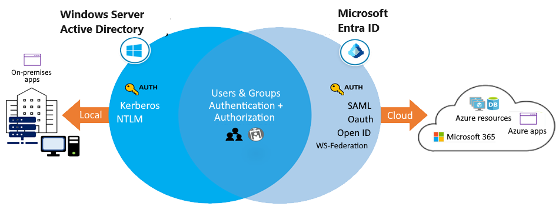
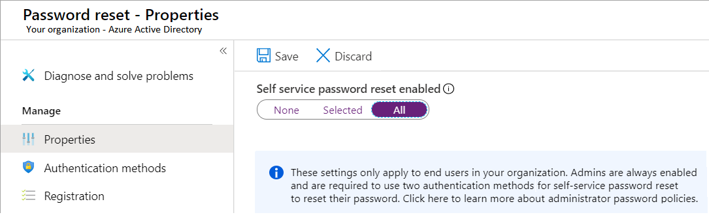

# Microsoft Entra ID

Azure Active Directory is now Microsoft Entra ID

Learning objectives
- **Define MS Entra concepts, including identities, accounts, and tenants.**    
- Describe MS Entra features to support different configurations.  
- **Understand differences between Microsoft MS ID and Active Directory Domain Services (AD DS)**.  
- Choose between supported editions of Microsoft MS ID.  
Different editions of MS Entra ID has its own features.  
- Understand MS Entra JOIN & self-service password reset.  

## Catch UP
- MS Entra ID  
is a **cloud-based directory and identity management service** that supports USERS access to various **resources and applications**.  
- With MS Entra ID,   
you can provide your users with **seamless access to internal and external resources** (e.g. `tenants`, `identities`, `accounts`, and `Azure subscriptions`.).  
- Microsoft Entra ID provides benefits such as enhanced security, consistent user experience, reduced costs, and improved productivity.
- Microsoft Entra ID provides a cloud based alternative to Active Directory Domain Services (AD DS).  
In the following example, Windows Server AD is using `Kerberos` and `NTLM authentication` to on-premises applications.

- Microsoft Entra ID comes in four editions, each offering different features and capabilities.
- Self-service password reset gives users the ability to bypass the helpdesk and reset their own passwords.
- If you're a MS 365, Azure, or Dynamics CRM Online customer, you might already be using MS Entra ID. You can start using your TENANT(object of MS ID) to manage access to thousands of other cloud apps that integrate with MS Entra ID.

## Entra ID Features 

1. SSO access :  
**Secure SSO to web apps on the cloud and to on-premises apps**   
e.g. Users can **sign in with the same set of credentials** to access all their apps.
2. Ubiquitous device support :  
**Offer a common experience across the difference platform or OS devices**  
e.g. Users can launch apps from a personalized web-based access panel, mobile app, MS 365, or custom company portals by using their existing work credentials.  
3. Secure remote access :  
**Secure access can include `multifactor authentication` (MFA), `conditional access policies`, and `group-based access management`**  
Users can access on-premises web apps from everywhere, including from the same portal.  
4. Cloud extensibility 
MS Entra ID can extend to the cloud to help you manage a consistent set of users, groups, passwords, and devices across environments.  
5. Sensitive data protection
Admins can monitor for suspicious sign-in activity and potential vulnerabilities in a consolidated view of users and resources in the directory.  
6. Self-service support	
MS Entra ID lets you delegate selected administrator tasks to company employees.  
**Providing self-service app access and password management through verification steps can reduce helpdesk calls and enhance security.**

## Consideration to use MS Entra ID

`[Provide ACROSS PLATFORM]` Enabling SSO
- Allow your users to connect to the cloud or use on-premises apps.   
- MS Entra SSO supports MS 365 and thousands of SaaS apps, such as Salesforce, Workday, DocuSign, ServiceNow, and Box.  

`[Provides GUI]` UX and device support.  
Build a consistent user experience that works for all devices and directory access points.  
**You can design custom company portals and personalized web-based access for your employees that lets them connect with their existing work credentials.**

Benefits of `secure remote access`.  
- Protect your on-premises web apps by implementing **secure remote access with MFA and access policies**.

`[Management]` Consider advantages of `cloud extensibility`. 
- Connect Active Directory and other on-premises directories in the cloud to MS Entra ID.  
Make it easier for your admins to manage the same users, groups, passwords, and devices across all supported environments.  

Advanced protection for sensitive data.  
- Enhance the security of your sensitive data and apps by **using the built-in protection features of MS Entra ID.**   
- e.g. Your admins can utilize advanced security reports, notifications, remediation recommendations, and risk-based policies.

`Reduced Costs, Self-service options`.   
- Take advantage of the MS Entra self-service features to help reduce costs for your organization. 
- **Delegate certain tasks like resetting passwords, or creating and managing groups to your nonadmin users.**

## Key component of MS Entra ID  

Identity
- An **identity is an object** that can be authenticated.  
The identity can be a user with a username and password.

Account
- An account is an identity that has (VALID) data associated with it.

MS Entra Account (AZ AD)
- SSO
- MFA
- Conditional Access & Identity Protection
- Privileged identity management (ROLEs)
- End-user self-service and Unified admin center

AZ Tenant Directory
- An Azure tenant is a single dedicated and trusted instance of MS Entra ID.  
- Each tenant (also called a Directory) represents a single organization.       
- **When your organization signs up for a MS cloud service subscription, a new tenant is automatically created.**  

AZ Subscriptions
- An Azure subscription is used to pay for Azure cloud services.  
Each subscription is joined to a single tenant.   

## AD DS

Active Directory Domain Services (AD DS) is the **traditional deployment of Windows Server-based Active Directory on a physical or virtual server.**   

Active Directory Domain Services (AD DS) also includes 
- Active Directory Certificate Services (AD CS), 
- Active Directory Lightweight Directory Services (AD LDS), 
- Active Directory Federation Services (AD FS), 
- Active Directory Rights Management Services (AD RMS).

Although you can deploy and manage AD DS in Azure Virtual Machines,still recommend you use MS Entra ID, **unless your configuration targets IaaS workloads that depend specifically on AD DS.**

## AD DS vs Entra ID

MS Entra ID is similar to AD DS, but there are significant differences.  

1. Flat structure
MS Entra users and groups are created in a flat structure. 
**There are no organizational units (OUs) or group policy objects (GPOs).**  

2. Identity solution
**AD DS is primarily a directory service, while MS Entra ID is a full identity solution.**   
**MS Entra ID is designed for internet-based applications that use HTTP and HTTPS communications.**  
The features and capabilities of MS Entra ID support target strong identity management.

3. Communication protocols
**Because MS Entra ID is based on `HTTP/HTTPS` (implementation such as `SAML`, `WS-Federation`, and `OpenID Connect` for authentication and `OAuth` for authorization), it doesn't use `Kerberos` authentication.** 

4. Federation services 
MS Entra ID includes federation services, and many third-party services (e.g. Facebook).

5. Managed service: 
- **MS Entra ID is a `managed service`. You manage ONLY `users`, `groups`, and `policies`.** 
- If you deploy **AD DS with virtual machines by using Azure, you manage many other tasks**, including deployment, configuration, virtual machines, patching, and other backend processes.

## Entra Editions

MS Entra ID comes in 4 editions: 
1. FREE  
The Free edition is included with an Azure subscription.  
2. MS 365 Apps  
3. Premium P1  
4. Premium P2  

The Premium editions are available through a MS Enterprise Agreement, the Open Volume License Program, and the Cloud Solution Providers program.  

**Azure and MS 365 subscribers can also buy MS Entra ID P1 and P2 online.**

https://learn.microsoft.com/en-us/training/modules/configure-azure-active-directory/5-select-editions  .

## Microsoft Entra `JOIN` (DEVICES) Implementation

The Features of `JOIN` :arrow_down:

`JOIN DEVICE` 通常指的是將裝置加入到某個網路或系統中，例如將電腦加入到工作或學校的網路1，或者將新的 Windows 11 裝置在開箱初次設定 (Out of Box Experience, OOBE) 時加入到 Microsoft Entra ID2。

**Single-Sign-On (SSO)**	
- Joined devices offer SSO (好處包括減少不同的用戶名和密碼組合帶來的密碼疲勞，減少重新輸入相同身份的時間) access to your Azure-managed SaaS (Software as a Service) apps (e.g. outlook, MS365) and services.  
- Your users won't need extra authentication prompts when they access work resources.   
- **The SSO functionality is available even when users aren't connected to the DOMAIN NETWORK**.   

**Enterprise state roaming** (Starting in WIN 10)	
- Enterprise state roaming reduces the time to configure a new device.  
your users can securely **synchronize their user settings and app settings data to joined devices.**  

**Windows Hello**	
- Provide your users with secure and convenient access to work resources from joined devices.

**Restriction of access**	
- Restrict user access to apps from only joined devices that meet your compliance policies.

**Seamless access** to on-premises resources	
- Joined devices have seamless access to on-premises resources, when the device has line of sight to the on-premises domain controller.

### Implementation

Connect your device to Microsoft Entra ID in one of two ways:

Register your device to Microsoft Entra ID so you can manage the device identity. Microsoft Entra device registration provides the device with an identity that's used to authenticate the device when a user signs into Microsoft Entra ID. You can use the identity to enable or disable the device.

Join your device, which is an extension of registering a device. Joining provides the benefits of registering, and also changes the local state of the device. Changing the local state enables your users to sign into a device by using an organizational work or school account instead of a personal account.

Consider combining registration with other solutions. Combine registration with a mobile device management (MDM) solution like Microsoft Intune, to provide other device attributes in Microsoft Entra ID. You can create conditional access rules that enforce access from devices to meet organization standards for security and compliance.

Consider other implementation scenarios. Although AD Join is intended for organizations that have an on-premises Windows Server Active Directory infrastructure, it can be used for other scenarios like branch offices.

## Microsoft Entra self-service password reset Implementation

The Microsoft Entra `self-service password reset (SSPR)` feature lets you give users the ability to bypass helpdesk and reset their own passwords.  

### Things You Should Know

1. SSPR requires a MS Entra Account with `Global Administrator Privileges`.  
2. SSPR uses a group to limit the users who have SSPR privileges.  
3. the User account who allow to use SSPR must have a valid license.  

### Considerations

Consider who can reset their passwords
- In the Azure portal, there are three options for the SSPR feature: `None`, `Selected`, and `All`. The Selected option is useful for creating specific groups who have SSPR enabled.  

  

Consider your authentication methods
- Require At Least One Authentication method to reset password
- Other methods that are provided by SSPR plan including email notification, text message, or a security code sent to the user's mobile. also offer the users a set of security questions. 
  
Consider the Security Question
- you can security require  questions to be registered for the users in your Microsoft Entra tenant, and configure how many correctly answered security questions are required for a successful password reset

Consider combining methods for stronger security.
For example combining security questions(less safe) with other authentication methods to make consolidate security

[Summary and resources](https://learn.microsoft.com/en-us/training/modules/configure-azure-active-directory/9-summary-resources)