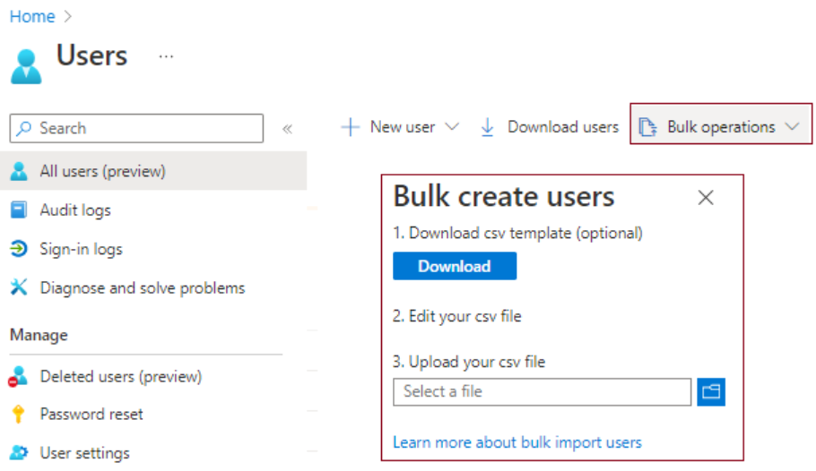
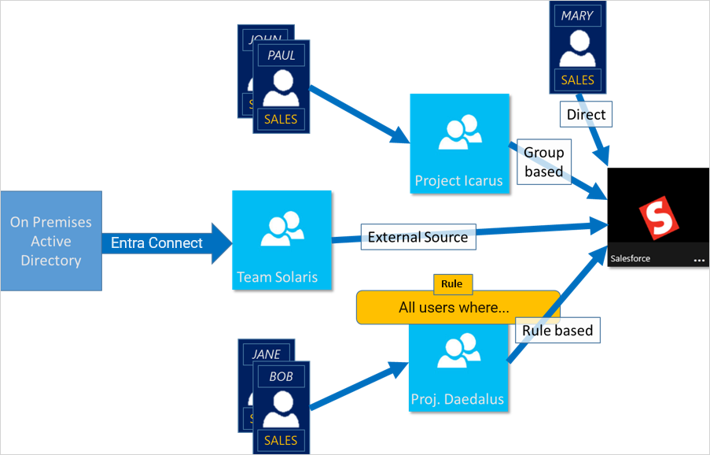
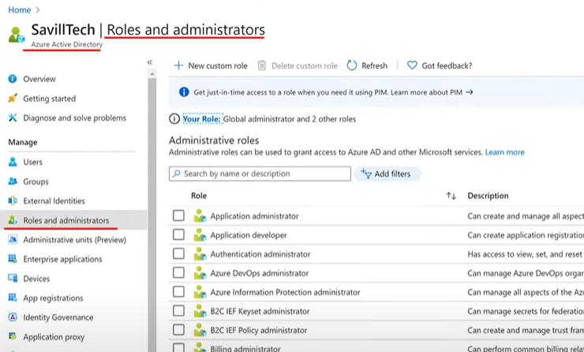
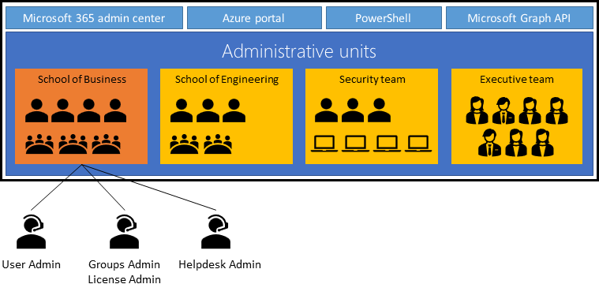

# User And Group Account 

1. learn that every user who wants access to Azure resources needs an Azure user account. 
`Microsoft Entra ID` supports access to your organization's resources by assigning access rights to users and groups. 
2. discover how user and group accounts are created in Microsoft Entra ID. 
3. explore how to configure and manage user and group accounts, including bulk configuration. 
4. reviewed how your organization can support group account organization, and manage accounts across multiple directories.

:memo: Catch Up  

`Microsoft Entra ID` supports three types of user accounts:  
- cloud identities :   
they have profile information such as job title and office location. 
(can be customized for your organization's needs.)
- Directory-synchronized identities
- guest user identities.  

Using Bulk Operation for creating user and group accounts. The process uses a template file managed through the portal.

There are two types of group accounts: 
- `Security` & `Microsoft 365`

Administrative units help you `control administrator access to resources`

## User Accounts

**Every user who wants access to Azure resources needs an Azure user account.**

:memo: Microsoft Entra ID supports `3` types of user accounts.   

These types indicate where the user is defined `in the cloud or on-premises`, and whether the user is **internal** or **external** to your Microsoft Entra organization.**  

Cloud identity  
- A user account with a cloud identity is defined only in Microsoft Entra ID such as administrator accounts and users who are managed as part of your organization **or in an external Microsoft Entra instance**  
- When a cloud identity is removed from the primary directory, the user account is deleted.  

Directory-synchronized identity  
- User accounts that have a directory-synchronized identity are defined in an on-premises Active Directory  
- **A synchronization activity occurs via Microsoft Entra Connect to bring these user accounts in to Azure.**   
- The source for these accounts is Windows Server Active Directory  

Guest user  
- Guest user accounts are defined outside Azure. e.g. user accounts from other cloud providers.  


### Consideration to use Account

Consider where users are defined. 
Determine where your users are defined. 
1. Are all your users defined **within** your Microsoft Entra organization, or are some users defined in external Microsoft Entra instances? 
2. Do you have users who are **external** to your organization? 

Consider support for external contributors. 
- Allow external contributors to access Azure resources in your organization by supporting the Guest user account type. 
- **When the external contributor no longer requires access, you can remove the user account and their access privileges**.

Consider a combination of user accounts. 
- Implement the user account types that enable your organization to satisfy their business requirements.  
Support directory-synchronized identity user accounts for users defined in Windows Server Active Directory.   
Support cloud identities for users defined in your internal Microsoft Entra structure or for user defined in an external Microsoft Entra instance.  

## Creation of Cloud Identity Account

**A new user account must have a `display name` and an associated `user account name`.**  
- e.g. `display name is Aran Sawyer-Miller` and the associated `user account name could be asawmill@contoso.com`.

profile configuration : 
- The profile can have other settings like a user's job title, and their contact email address.
- `Information` and `settings` that describe a user are stored in the user account profile.

Global administrator & Non-Global Administrator  
- A user with `Global administrator` or `User administrator privileges` can preset profile data in user accounts, such as the main phone number for the company.  
- **Non-admin users** can set some of their own profile data, but they **can't change their `display name` or `account name`**.

### Considerations

Consider user profile data.
- User profile data, including the user's picture, job, and contact information is optional. 
**You can also supply certain profile settings for each user based on your organization's requirements.**

Consider `restore options` for deleted accounts. 
- e.g. Restore operations for a deleted account are available up to 30 days after an account is removed.  

Consider gathered account data.   
- Collect sign-in and audit log information for user accounts. Microsoft Entra ID lets you gather this data to help you analyze and improve your infrastructure.  

## Bulk account operations creation

In MS Entra ID

- Only `Global administrators` or `User administrators` have privileges to `create` and `delete` user accounts in the Azure portal.  

To complete bulk create or delete operations, **the admin fills out a comma-separated values (CSV) template of the data for the user accounts.**  

Bulk operation templates can be downloaded from the Microsoft Entra admin center.  

Bulk lists of user accounts can be downloaded.  

### Considerations 

Consider `naming conventions`.   
- Establish or implement a naming convention for your user accounts. Apply conventions to user account names, display names, and user aliases for consistency across the organization. Conventions for names and aliases can simplify the bulk create process by reducing areas of uniqueness in the CSV file. A convention for user names could begin with the user's last name followed by a period, and end with the user's first name, as in Sawyer-Miller.Aran@contoso.com.

Consider using `initial passwords`.  
Implement a convention for the initial password of a newly created user. Design a system to notify new users about their passwords in a secure way.   
You might generate a random password and email it to the new user or their manager.  

Consider `strategies for minimizing errors`.   
View and address any errors, by downloading the results file on the Bulk operation results page in the Azure portal. The results file contains the reason for each error. An error might be a user account that's already been created or an account that's duplicated. Generally, it's easier to upload and troubleshoot smaller groups of user accounts.  

## Group Accounts

Microsoft Entra ID allows your organization to define `2` different types of group accounts

1. `Security groups` are used to manage member and computer access to **shared resources** for a group of users. 
You can create a security group for a specific security policy and apply the same permissions to all members of a group. 

2. `Microsoft 365 groups` provide **collaboration opportunities**. 
Group members have access to a shared mailbox, calendar, files, SharePoint site, and more.


### What they do

Consider which groups are needed to support your organization, and what access rights should be applied to group members.  

Security groups
- Use security groups to set permissions for all group members at the same time, rather than adding permissions to each member individually.
- **It can be implemented only by a Microsoft Entra administrator**.

Microsoft 365 groups
- Add Microsoft 365 groups to enable group access for guest users **outside** your Microsoft Entra organization.
- `Normal users` and `Microsoft Entra admins` can both use Microsoft 365 groups.


### Membership types for Device & User

`Assigned`
- Allow you add specific users as members of a group, where each user can have unique permissions.

`Dynamic(AUTOMATICALLY)` For User 
- Let you Use `dynamic membership rules` to automatically add and remove group members.
- When member attributes change, Azure reviews the dynamic group rules for the DIRECTORY. 
```java 
If(memberAttributesMeetTheRuleRequirement(thisMember)){
  Group.add(thisMember)
}

If(checkIfAttributesStillMeetTheRuleRequirement(thisMember)){
  Group.remove(thisMember)
}
```

`Dynamic(AUTOMATICALLY)` Device In Security Group
- Apply `dynamic group rules` to add/remove devices in security groups. 
- When device attributes change, Azure reviews the dynamic group rules for the directory. 
```java
/**
 * If the device attributes meet the rule requirements,
 * the device is added to the security group. 
 */
if(meetDeviceAttributeRules(thisDevice)){
  thisSecurityGroup(thisDevice)
}else{
  /**
   * If the device attributes no longer 
   * meet the rule requirements, 
   * the device is removed.
   */
  thisSecurityGroup.remove(thisDevice)
}
```

:mag: Can & Cant
1. You can create a dynamic group for either `devices` or `users`, but not for both. 
2. Device membership rules can only reference device attributions. 
3. You can't create a device group based on the device owners' attributes. 

## Access Right

Using groups lets the resource owner or Microsoft Entra directory owner assign a set of access permissions to all the members of the group  

The resource or directory owner can also give management rights to someone such as a department manager or a help desk administrator, letting that person add and remove members.



## `[管理單位]` administrative units, AUs

**管理單元的主要功能是`限制角色中(ROLE)的權限`，以適應您定義的組織的任何部分。**  

當你在 Azure 中設計用於管理身分識別和治理的策略時，規劃 Microsoft Entra 基礎結構的全方位管理非常重要。  
使用 administrative units 來限制管理範圍可能很有用。   
**對於擁有許多獨立部門的組織而言，角色和責任的劃分特別有用。**  


> Azure Resource Groups are defined Azure   
> Roles And Administrators are defined in Azure AD  


For example : 
考慮大型大學的管理工作，而大型大學是由數個不同的學院所組成，例如商學院、工學院和醫學院。大學內有行政辦公室、學術大樓、社交大樓和學生宿舍。  
**基於安全性考慮，每個商務辦公室都有自己的內部網路，可用於伺服器、印表機和傳真機等資源**。  
- 每棟學術大樓都會連線到大學網路，因此講師和學生都可以存取他們的帳戶。  
- 此網路也可供宿舍和社交大樓中的學生和學監使用。   
- 在大學內，來賓使用者需要透過大學網路存取網際網路。  
- 該大學有一組 IT 管理員，一起合作控制資源存取、管理使用者，以及設定學校的原則。**視責任範圍而定**，有些管理員的權限擁有比其他管理員更高的權限。需要有中央授權單位來規劃、管理及監督完整的結構。   

在上案例中，可以指派 AUs，以便輕鬆地管理組織。 如下圖  

- Create a ROLE that has administrative permissions for only Microsoft Entra users in the Engineering department AU.  
- Create an administrative unit for the Engineering department.  
- Populate the AU with only the Engineering department students, staff, and resources.  
- Add the Engineering department IT team to the ROLE, along with its scope.  

### Considerations

Consider `management tools`. 
- Review your options for managing AUs. You can use the Azure portal, PowerShell cmdlets and scripts, or Microsoft Graph.

Consider `role requirements in the Azure portal.` 
- Plan your strategy for administrative units according to role privileges. 
- In the Azure portal, only the Global Administrator or Privileged Role Administrator users can manage AUs.

Consider `SCOPE of administrative units`. 
- Recognize that the scope of an administrative unit applies only to management permissions. 
- **Members and admins of an administrative unit can exercise their default user permissions to browse other users, groups, or resources outside of their administrative unit.**


## In Actions  

https://learn.microsoft.com/zh-tw/training/modules/configure-user-group-accounts/7-simulation-user-groups  