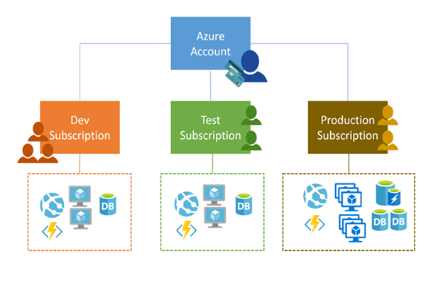
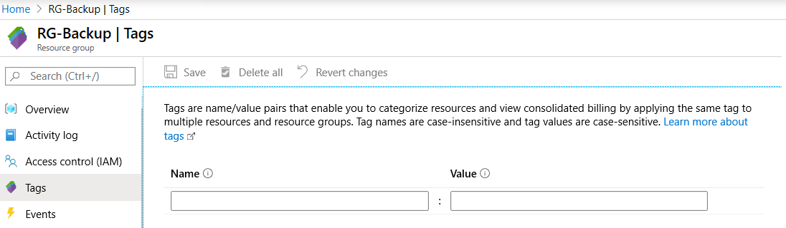

# Azure Subscriptions

(MS Entra ID tenant )

Azure Administrators commonly obtain and manage Azure subscriptions.  

`Azure subscriptions` help you effectively `identify` and `manage costs` for your organization, so you can provide services and resources for specific scenarios.  

In this module, you will  
1. `Regions & Services`  
learn about supported Azure regions, and how to locate Azure services. 
2. `Subscription Features`  
Review the features and use cases for Azure subscriptions, and how to obtain subscriptions. 
3. `Billings for Subscription Types`   
Explore features and billing for different types of Azure subscriptions, and how to apply resource tagging.   
4. `Microsoft Cost Management`   
discover how Microsoft Cost Management can be used for cost analysis and learn how to identify ways you can reduce your billing costs.

Catch Up  
- **Azure regions provide flexibility, data residency, compliance, and resiliency options.**  
- **Azure subscriptions are essential for managing access to Azure resources and billing.**  
- Azure offers various subscription options such as `Free`, `Pay-As-You-Go`, `Enterprise Agreement`, and `Student`.
- Azure offers cost-saving options such as reservations, Azure Hybrid Benefits and Azure credits.  
- Resource tagging allows for organizing and analyzing resources in Azure.  
- Microsoft Cost Management helps monitor and control Azure spending.  
- The Pricing Calculator provides billing estimates for different usage cases.  

## Region & Region Pair  

Regional pairs help to support always-on availability of Azure resources used by your infrastructure.  
1. Physical isolation  
2. Platform-provided replication  	
3. Region recovery order 
4. Sequential updates 
5. Data residency  

### You Should Know

- Azure is generally available in more than `60` regions in `140` countries.    
- Azure has more global regions than any other cloud provider.    
- Regions provide you with the flexibility and scale needed to bring applications closer to your users.  
**Regions preserve data residency and offer comprehensive compliance and resiliency options for customers.**  

### Consideration

Consider Resources with Region deployment.  
- Plan the regions where you want to deploy your resources.  

Consider Service support by region. 
- Research region and service availability.  
- **Some services or Azure VMs features are available only in certain regions, such as specific Virtual Machines sizes or storage types.**  

Consider **Services that don't require regions.** 
- **Identify services that don't need region support.** Some global Azure services that don't require you to select a region.    
These services include `Microsoft Entra ID`, `Microsoft Azure Traffic Manager`, and `Azure DNS`.  

Consider exceptions to region pairing. 
- Check the Azure website for current region availability and exceptions.  
If you plan to support the Brazil South region, note this region is paired with a region outside its geography. The Singapore region also has an exception to standard regional pairing.  

Consider benefits of data residency. 
- Take advantage of the benefits of data residency offered by regional pairs. 
- This feature can help you meet requirements for tax and law enforcement jurisdiction purposes.  
 
Azure global infrastructure website Helps you find supported regions for your business geography.    
You can search by `country/region` name or by Microsoft `product` to list `supported region pairs` and `exceptions`.  

## Azure Subscriptions

**An Azure subscription is a logical unit of Azure services** that's linked to an Azure account. 

An Azure account is an **identity** in Microsoft Entra ID or a **directory** that's trusted by Microsoft Entra ID.  

Subscriptions help you 
- **ORGANIZE** access to Azure cloud service resources
- **CONTROL** how resource usage is reported, billed, and paid.

### You Should Know

Every Azure cloud SERVICE belongs to a subscription.  

Each subscription can have a different billing and payment configuration.

Relationship btw subscripts and account is one-to-many and many-to-one
- **Multiple subscriptions can be linked to the same Azure account.**
- **More than one Azure account can be linked to the same subscription.**

Billing for Azure services is done on a per-subscription basis.

If your Azure account is the only account associated with a subscription, you're responsible for the billing requirements.

**Programmatic operations for a cloud service might require a subscription ID.**

### Considerations

Consider how many subscriptions your organization needs to support the business scenarios.

Consider the types of Azure accounts required.
- Determine the types of Azure accounts your users will link with Azure subscriptions such as `MS Entra account` or a `directory` or `Microsoft Account` that's trusted by `MS Entra ID`.

Consider multiple subscriptions for different purposes. 
- Set up different subscriptions and payment options according to your company's departments, projects, regional offices, and so on. Each subscription pertains to resources, access privileges, limits, and billing for a specific project.

Consider a dedicated shared services subscription
- Plan for how users can share resources allocated in a single subscription. 
- **Use a shared services subscription to ensure all common network resources are billed together and isolated from other workloads. Examples of shared services subscriptions include `Azure ExpressRoute` and `Virtual WAN`.**

Consider access to resources with `MS Entra ID`.
- Every Azure subscription can be associated with a `MS Entra ID`
- Users and services authenticate with `MS Entra ID` before they access resources.

### Azure Subscription Procurement Options

You can obtain an Azure subscription as part of an `Enterprise agreement`, or through a `Microsoft reseller` or `Microsoft partner`. 

Users can also open a `personal free account` for a trial subscription.

### Azure Subscription Choices

The most common subscriptions are `Free`, `Pay-As-You-Go`, `Enterprise Agreement`, and `Student`.   
For your organization, you can choose a combination of procurement options and subscription choices to meet your business scenarios.   

#### Considerations

Consider trying Azure for free. 
- An Azure free subscription includes a monetary credit to spend on any service for the first `30` days. 
- You get free access to the most popular Azure products for 12 months, and access to more than 25 products that are always free. 

To set up a free subscription, you need a phone number, a credit card, and a Micosoft account.
- The credit card information is used for identity verification only. 
- You aren't charged for any services until you upgrade to a paid subscription.

Consider paying monthly for used services. 
- `A Pay-As-You-Go (PAYG)` subscription charges you monthly for the services you used in that billing period. 
- This subscription type is appropriate for a wide range of users, from individuals to small businesses, and many large organizations as well.

Consider using an Azure Enterprise Agreement. 
- An Enterprise Agreement provides flexibility to buy cloud services and software licenses under one agreement. 
- The agreement comes with discounts for new licenses and Software Assurance. 
- **This type of subscription targets enterprise-scale organizations.**

Consider supporting Azure for students. 
- An Azure for Students subscription includes a monetary credit that can be used within the first 12 months.  
Students can select free services without providing a credit card during the sign-up process.  
You must verify your student status through your organizational email address.  

## MS Cost Management (Monitor)

Microsoft Cost Management shows organizational cost and usage patterns with advanced analytics.   
**You can use the product (MS Cost Management) to monitor and control Azure spending, and optimize your Azure resource usage to manage billing access to costs.**  

With Azure products and services, you pay only for what you use.  
- e.g. As you create and use Azure resources, you're charged for the resources.  

Costs are based on negotiated prices and factor in reservation and Azure Hybrid Benefit discounts.  
- Predictive analytics are also available.  

**Reports in Microsoft Cost Management show the usage-based costs consumed by Azure services and third-party Marketplace offerings.**  
- **Collectively, the reports show your internal and external costs for usage and Azure Marketplace charges.**  
- The reports help you understand your spending and resource use, and can help find spending anomalies.   
- **Charges, such as reservation purchases, support, and taxes might not be visible in reports.**  
- Automated billing data export and scheduled reports are also available.

**The product uses `Azure management groups`, `budgets`, and `recommendations`** to show clearly how your expenses are organized and how you might reduce costs.  

You can use the Azure portal or various APIs for export automation to integrate cost data with external systems and processes.   

### Considerations

Consider `cost analysis`.   
- Take advantage of Microsoft Cost Management cost analysis features to explore and analyze your organizational costs.   
- You can view aggregated costs by organization to understand where costs are accrued, and to identify spending trends. Monitor accumulated costs over time to estimate monthly, quarterly, or even yearly cost trends against a budget.  

Consider `budget options`.  
- Use Microsoft Cost Management features to establish and maintain budgets. 
- The product helps you plan for and meet financial accountability in your organization. 
- Budgets help prevent cost thresholds or limits from being surpassed. 
- You can utilize analysis data to inform others about their spending to proactively manage costs.
- The budget features help you see how company spending progresses over time.

Consider `recommendations`.  
- **Review the Microsoft Cost Management recommendations to learn how you can optimize and improve efficiency by identifying idle and underutilized resources.**  
- Recommendations can reveal less expensive resource options.  
When you act on the recommendations, you change the way you use your resources to save money.  
- Using recommendations is an easy process:  
  - View cost optimization recommendations to see potential usage inefficiencies.
  - Act on a recommendation to modify your Azure resource use and implement a more cost-effective option.
  - Verify the new action to make sure the change has the desired effect.

Consider `exporting` cost management data.  
- Microsoft Cost Management helps you work with your billing information. 
- If you use external systems to access or review cost management data, you can easily export the data from Azure.
- **Set a daily scheduled export in comma-separated-value (CSV) format and store the data files in Azure storage. Access your exported data from your external system.**

## Tags in Resource Group

**Tags are useful for sorting, searching, managing, and doing analysis on your resources.**  
You can apply tags to your Azure resources to logically organize them by categories.   

e.g. You could have the tag name `Server` and the value `Production` or `Development`, and then apply the tag value pair to your Engineering computer resources.

### You Should Know

Each resource tag consists of a name and a value. 

The tag name remains CONSTANT for all resources that have the tag applied.

The tag value can be selected from a defined set of values, or unique for a specific resource instance.

**A resource or resource group can have a maximum of `50` tag name/value pairs.**

**Tags applied to a resource group aren't inherited by the resources in the resource group.**

### Considerations 

Consider `SEARCHING` on tag data for resources. 
- Search for resources in your subscription by querying on the tag name and value.

Consider `FINDING` related resources by tag. 
- Retrieve related resources from other resource groups by searching on the tag name or value.

Consider `grouping billing data`. 
- Group resources like VMs by cost center and production environment.   
When you download the resource usage comma-separated values (CSV) file for your services, the tags appear in the Tags column.

Consider creating tags with `PowerShell` or the `Azure CLI`. 
- Create many resource tags programmatically by using Azure PowerShell or the Azure CLI.

## Cost Savings Options

As you prepare your implementation plan for Azure subscriptions, services, and resources, consider the following cost saving advantages.

Reservations (包年服務)
- They can significantly reduce resource costs up to `72% on pay-as-you-go prices`. 
For example You can pay **for one year or three years** of virtual machine, SQL Database compute capacity, Azure Cosmos DB throughput, or other Azure resources. 

Azure Hybrid Benefits
- It helps maximize the value of existing on-premises Windows Server or SQL Server license investments when migrating to Azure.  

Azure Credits (AZ for Students, AZ Free Trial and VS Subscriber)
- Use the monthly credit benefit to develop, test, and experiment with new solutions on Azure. 
- With your monthly Azure credit, Azure is your personal sandbox for development and testing.

Azure regions	
- Compare pricing across regions. Pricing can vary from one region to another.  

`Budgets` in Microsoft Cost Management
- Apply the budgeting features in Microsoft Cost Management to help plan and drive organizational accountability.   
Use budgets to compare and track spending as you analyze costs.  

Pricing Calculator	
- The Pricing Calculator provides estimates in all areas of Azure, including compute, networking, storage, web, and databases.