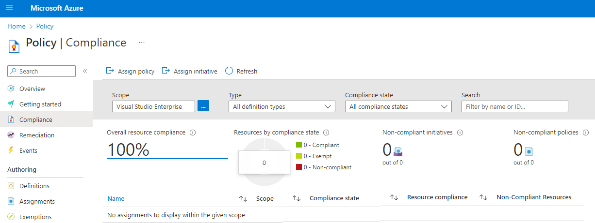

# Management Groups & Azure Policy Service  
You will
1. learn about Azure Policy and how it allows you to control and audit your resources. 
2. explore how to implement Azure policy definitions and initiatives for your corporate departments. 
3. learn how to create management groups, scope policies, and manage spending budgets. 
4. review how Azure policies can be scoped to meet compliance regulations.

Catch Up
- Azure Policy is a service that enables you to enforce rules and ensure compliance with corporate standards and service level agreements.
- **Management groups provide a way to efficiently manage access, policies, and compliance across multiple subscriptions**, allowing for unified policy and access management.
- Creating policy definitions and initiative definitions allows you to define conventions for resources and control the scope of policies, ensuring resource compliance.
- The Compliance feature in Azure Policy helps you determine the state of your resources and evaluate whether they're compliant or not.

---

Policy Assignment 
- The scope of a policy can effect. 
Assigned to a user, a resource group or management group.

Policy Parameters
- Values you can pass into your Policy definition to make policies are more flexible for re-use.

Initiative Definitions
- An initiative definition is a collection of policy definitions. A group of policies to enforce PCI-DSS compliance

## Management Groups

**Management Groups are used to manage `access`, `policies`, and `compliance` across multiple Azure subscriptions.**  

They provide a governance scope above subscriptions.  

**You can build a flexible structure of management groups and subscriptions to organize your resources into a hierarchy for unified policy and access management.** 

However, a management group cannot include an Azure resource.  
It can only include other management groups or subscriptions.  

For example 
  
1. By default, all new subscriptions are placed under the top-level management group, or root group.
2. All subscriptions within a management group **automatically inherit the conditions applied to that management group**.
3. **A management group tree can support up to six levels of depth.**  
4. **Azure RBAC authorization for management group operations isn't enabled by default.**  

### Considerations

Consider how to use management groups in Azure Policy to manage your subscriptions:

Consider `custom hierarchies and groups` with management groups
- Align your Azure subscriptions by using custom hierarchies and grouping that meet your company's organizational structure and business scenarios.  
e.g. You can use management groups to target policies and spending budgets across subscriptions.

Consider `policy inheritance`. 
- Control the hierarchical inheritance of `access` and `privileges` in policy definitions. 
- All subscriptions within a management group inherit the conditions applied to the management group.  
You can apply policies to a management group to limit the regions available for creating virtual machines (VMs).  
The policy can be applied to all management groups, subscriptions, and resources under the initial management group, to ensure VMs are created only in the specified regions.

Consider `compliance rules`. 
- Organize your subscriptions into management groups to help meet compliance rules for individual departments and teams.

Consider `cost reporting`. 
- Use management groups to do cost reporting by department or for specific business scenarios or report on budget details across subscriptions.  

### Creation 

A management group has 
1. a directory unique identifier (ID) 
   1. is used to submit commands on the management group
   2. **can't be changed after being created (the Azure system must identify the management group).**
2. a display name 
   1. is **optional**
   2. can be **changed at any time**

## Azure Policy

**Azure Policy is a service** in Azure that enables you to create, assign, and manage POLICIES via JSON file.  

**POLICIES help you define and implement your governance strategy/rule (`enforcement` + `compliance`, `scaling`, and `remediation`) by using POLICIES to control and audit your resources** that run an environment that requires different forms of governance.  

### You Should Know

Enforce `rules and compliance`
- Support `real-time policy evaluation and enforcement, and periodic or on-demand` compliance evaluation.

Apply policies `at scale`
- Define an exclusion scope for multiple policies and aggregate policy states with policy initiative.

Perform Resource `remediation`	
- **Conduct real-time remediation**, and remediation on your existing resources.

`Governance`
- Implement governance tasks for your environment
  1. deploying to and operating in the environment
  2. Manage multiple subscriptions
  3. Manage regulatory compliance, cost control, security, and design consistency
  4. Standardize and enforce how cloud resources are configured

### Considerations

Consider deployable resources. 
- Specify the resource types that your organization can deploy by using Azure Policy. 
You can specify the set of virtual machine SKUs that your organization can deploy.

Consider `location restrictions`. 
- Restrict the locations your users can specify when deploying resources.  
You can choose the geographic locations or regions that are available to your organization.  

Consider `rules enforcement`. 
- Enforce compliance rules and configuration options to help manage your resources and user options. 
**You can enforce a required tag on resources and define the allowed values.**

Consider `inventory audits`. 
- Use Azure Policy with Azure Backup service on your VMs and run inventory audit.

## Policy Definition

[Create policy definitions](https://learn.microsoft.com/en-us/training/modules/configure-azure-policy/5-create-policy-definitions)   

Definition uses the specific JSON format required by Azure.  

A policy definition describes the compliance conditions for a resource, and the actions to complete when the conditions are met.  
E.g. **You can create a policy definition to prevent VMs in your organization from being deployed, if they're exposed to a public IP address.**  

Policy definitions can also be imported into Azure Policy from GitHub

Custom Policy

Built-In Policy
  

### Some Built-In Policies 

Allowed virtual machine size SKUs:   
- Specify a set of VM size SKUs that your organization can deploy.  
- This policy is located under the `Compute` category.   

Allowed locations:   
- Restrict the locations users can specify when deploying resources.   
- Use this policy to enforce your geo-compliance requirements.   
- This policy is located under the `General` category.  

Configure Azure Device Update for IoT Hub accounts to disable public network access:   
- Disable public network access for your Device Update for IoT Hub resources.   
- This policy is located under the `Internet of Things` category.  

### Initiative Definition  

[Create an initiative definition](https://learn.microsoft.com/en-us/training/modules/configure-azure-policy/6-create-initiative-definitions)  

**An initiative definition is a set of policy definitions.**  

You can use an initiative definition to ensure resources are compliant with security regulations or tract resource compliance state to meet a larger goal  
  

There are two type Initiative Definition  
1. custom definitions  
Policy definitions can also be imported into Azure Policy from GitHub.  
2. built-in definitions in Azure Policy  

One or more policy definitions are grouped into an **`initiative definition`, to control the scope of your policies** and evaluate the compliance of your resources.  
  
  

### Scope the initiative definition

The scope determines what resources or grouping of resources are affected by the conditions of the policies.

Choose the affected resource group

### Creations  
  
The following is the basic steps to create and work with policy definitions in Azure Policy.  
1. Create policy definitions and group them initiative definition.   
2. Scope the initiative definition.  
Azure Policy lets you control how your initiative definitions are applied to resources in your organization.  
**You can limit the scope of an initiative definition to specific management groups, subscriptions, or resource groups.**  
3. Determine compliance to evaluate the state of compliance for all your resources.  
   - `Individual resources`, `resource groups`, and `subscriptions` within a scope can be exempted from having the policy rules affect it.  
   - `Exclusions` are handled individually for each assignment.  

  
- Use the `Compliance` feature to look for non-compliant initiatives, policies, and resources.  
- Your policy conditions are evaluated against your existing scoped resources.  
- The `compliance state` result is either compliant or non-compliant.  

## In Actions

https://learn.microsoft.com/en-us/training/modules/configure-azure-policy/9-simulation-policy

## BluePrints

## Moving Resource

## Lock in Resource Group 

Lock Type
- Delete (also moving resource is forbidden)
- Modify

- Resource in this Group can not be modified