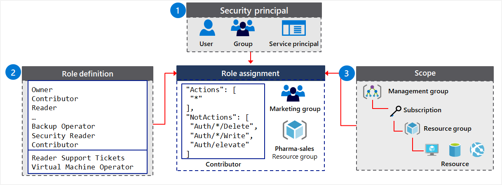
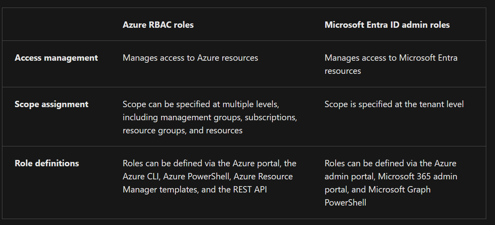
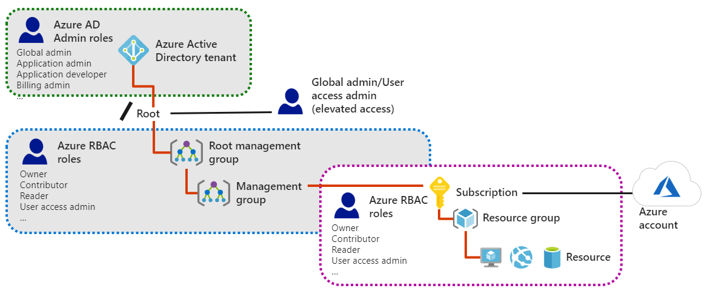
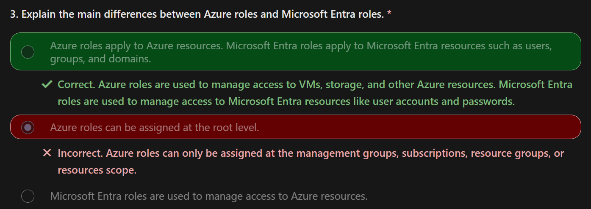
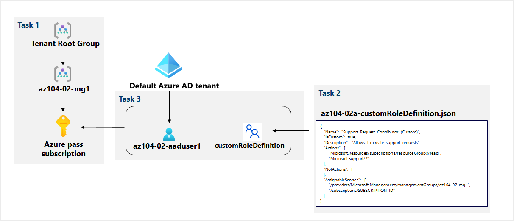

# RBAC


## What you Learn 

- Identify features and use cases for role-based access control.
- List and create role definitions.
- Create role assignments.
- Identify differences between Azure RBAC and Microsoft Entra roles.
- Manage access to subscriptions with RBAC.
- Review built-in Azure RBAC roles.


## Catch Up
Azure RBAC is a system that enables granular access management of Azure resources.  
It allows you to segregate duties within a team and grant users specific access based on their job requirements.

Role definitions in Azure RBAC define sets of permissions that list the allowed operations.  
You can use built-in role definitions or create custom role definitions to meet the specific requirements of your organization.

Role assignments attach role definitions to security principals at a particular scope.  
This assignment determines the level of access granted to the requestor.  
Access can be revoked by removing a role assignment.

Azure RBAC roles can be assigned at different scopes, including management groups, subscriptions, resource groups, and resources.  
The scope limits the permissions available to the assigned requestor.  

**Azure RBAC roles and Entra ID administrator roles can be used together to manage access to both Azure resources and Entra ID resources.**


## What you can do with RBAC

1. **Allow an application to access all resources in a resource group.**   
2. Allow one user to manage VMs in a subscription, and allow another user to manage virtual networks.  
3. Allow a database administrator (DBA) group to manage SQL databases in a subscription.  
4. **Allow a user to manage all resources in a resource group**, such as VMs, websites, and subnets.  


## Components

```json
Assignment = Scope[Security principal(role definition)]
```

`Security principal` (IDENTITY)
- An object that represents something that requests access to resources.	
- E.G. User, group, service principal, managed identity

`Role definition` (OPERATION PERMISSION)
- A set of permissions that lists the allowed operations. 
- Azure RBAC comes with built-in role definitions, but you can also create your own custom role definitions.	
- E.G. Some built-in role definitions: `Reader`, `Contributor`, `Owner`, `User Access Administrator`

`Scope`	
- The boundary for the **requested level of access**, or "how much" access is granted.	
- E.G. Management group, subscription, resource group, resource

`Assignment`	
- **An assignment attaches a role definition to a security principal at a particular scope.** 
- E.G. Users can grant the access described in a role definition by creating (attaching) an assignment for the role.	
  1. Assign the `User Access Administrator` role to an admin `group` `scoped` to a management group
  2. Assign the `Contributor` role to a `user` `scoped` to a subscription 


For example : 

1. Three security principals are supported: `user`, `group`, `service principal.`
2. Six built-in roles are implemented, and two custom roles are defined: 
   - Reader Support Tickets and Virtual Machine Operator.
3. The built-in `Contributor` role has two sets of permissions: `Actions` and `NotActions`.
4. The `Contributor` role is assigned at different scopes to the `Marketing group` and` Pharma-sales resource group`:
   1. Users in the `Marketing group` are granted access to create or manage any Azure resource in the `Pharma-sales` resource group.
   2. Marketing users aren't granted access to resources outside the `Pharma-sales resource group`, unless they have another role assignment that grants them access to the resource group.


### Considerations

Consideration how you can implement roles and scope assignments within your organization.

Consider your requestors. Plan your strategy to accommodate for all types of access to your resources. Security principals are created for anything that requests access to your resources. Determine who are the requestors in your organization. Requestors can be internal or external users, groups of users, applications and services, resources, and so on.

Consider your roles. Examine the types of job responsibilities and work scenarios in your organization. Roles are commonly built around the requirements to fulfill job tasks or complete work goals. Certain users like administrators, corporate controllers, and engineers can require a level of access beyond what most users need. Some roles can be defined to provide the same access for all members of a team or department for specific resources or applications.

Consider scope of permissions. Think about how you can ensure security by controlling the scope of permissions for role assignments. Outline the types of permissions and levels of scope that you need to support. You can apply different scope levels for a single role to support requestors in different scenarios.

Consider built-in or custom definitions. Review the built-in role definitions in Azure RBAC. Built-in roles can be used as-is, or adjusted to meet the specific requirements for your organization. You can also create custom role definitions from scratch.


## Role Definition

A role definition consists of sets of permissions that are defined in a JSON file.  

**Each permission set has a name**. 
For example  :  
- `Actions` permissions identify what `ACTIONS` are allowed.
- `NotActions` permissions specify what `ACTIONS` aren't allowed.
- `DataActions` permissions indicate how `DATA` can be changed or used.
- `AssignableScopes` permissions list the `SCOPE` where a role definition can be assigned.

### `Actions/NotActions` permissions

The `Actions` permissions can provide the breadth of access and the `NotActions` permissions can narrow the access.

The `Actions`/`NotActions` permissions configuration in built-in roles 

`Owner`
- Allow All Actions
```json
"Actions": [
    "*"
]
```

`Contributor` 
- Allow all actions, except write or delete role assignment
```json
"Actions": [
    "*"
],
"NotActions": [
    "Microsoft.Authorization/*/Delete",
    "Microsoft.Authorization/*/Write",
    "Microsoft.Authorization/elevateAccess/Action"
]
```

`Reader` a
- Allow All Read Actions
```json 
"Actions": [
    "/*/read"
]
```

### Role Scopes

After you define the role permissions, you use the AssignableScopes permissions to specify how the role can be assigned.

For example : 
1. Scope a role as available for assignment in two subscriptions : `"/subscriptions/c276fc76-9cd4-44c9-99a7-4fd71546436e", "/subscriptions/e91d47c4-76f3-4271-a796-21b4ecfe3624"`
2. Scope a role as available for assignment only in the Network resource group : `"/subscriptions/c276fc76-9cd4-44c9-99a7-4fd71546436e/resourceGroups/Network"`
3. Scope a role as available for assignment for all requestors: `"/"`

---

Role definition for built-in role `Contributor` in `JSON` file.  
```json
"Actions": [
    "*"
],
"NotActions" : [
    "Authorization/*/Delete",
    "Authorization/*/Write",
    "Authorization/*/elevateAccess/Action"
],
"DataActions" : [],
"NotDataActions" : [],
"AssignableScope : [
    "/"
]
```
1. The `Actions` permissions show the role has all action privilege
2. The `NotActions` permissions deny three actions
3. The `NotDataActions` permissions no specific actions are listed. Therefore, all actions can affect the data.
4. The `AssignableScope` permissions the role can be assigned for all scopes that affect data 


### You Should Know

Azure RBAC provides built-in roles and permissions sets and custom roles and permissions created by you.

**The Owner built-in role has the highest level of access privilege in Azure.**

**The system subtracts `NotActions` permissions from `Actions` permissions to determine the effective permissions for a role.**

**The AssignableScopes permissions for a role can be management groups, subscriptions, resource groups, or resources.**


### Considerations

Consider `using built-in roles`.  
Review the list of built-in role definitions in Azure RBAC.  
There are over 100 predefined role definitions to choose from, such as Owner, Backup Operator, Website Contributor, and SQL Security Manager.  
**Built-in roles are defined for several categories of services, tasks, and users, including General, Networking, Storage, Databases, and more.**  

Consider `creating custom definitions`.   
Define your own custom roles to meet specific business scenarios for your organization.   
**You can modify the permissions for a built-in role to meet the specific requirements for your organization.**   
You can also create custom role definitions from scratch.

Consider `limiting access scope`.  
Assign your roles with the minimum level of scope required to perform the job duties.   
Some users like administrators require full access to corporate resources to maintain the infrastructure.   
Other users in the organization can require write access to personal or team resource, and read-only access to shared company resources.  

Consider `controlling changes to data`.  
Identify data or resources that should only be modified in specific scenarios and apply tight access control.   
Limit users to the least of amount of access they need to get their work done.   
A well-planned access management strategy helps to maintain your infrastructure and prevent security issues.  

Consider `applying deny assignments`.  
Determine if you need to implement the deny assignment feature.  
Similar to a role assignment, a deny assignment attaches a set of deny actions to a user, group, or service principal at a particular scope for the purpose of denying access.  
Deny assignments block users from performing specific Azure resource actions even if a role assignment grants them access.  

## Role Assignment

A role assignment is the process of scoping a role definition to limit permissions for a requestor, such as a user, group, service principal, or managed identity.

**The purpose of a role assignment is to control access.**

The scope limits which permissions defined for a role are available for the assigned requestor.

Access is revoked by removing a role assignment.

A resource inherits role assignments from its parent resource.

**The effective permissions for a requestor are a combination of the permissions for the requestor's assigned roles, and the permissions for the roles assigned to the requested resources.**


## Azure Roles & MS Entra roles

Three types of roles are available for access management in Azure:
- Classic subscription administrator roles  
  -  access to resources was managed with just three administrator roles (Account Administrator, Service Administrator, and Co-Administrator. Access) and controlled by assigning admin roles to subscriptions  
- Azure RBAC roles  
  - Azure RBAC is a newer authorization system that provides fine-grained access management to Azure resources. 
  - **RBAC includes many built-in roles that can be assigned at different scopes.** 
  - The Azure RBAC model also lets you create your own custom roles.
- Microsoft Entra administrator roles  
  - **Microsoft Entra ID provides built-in administrator roles** to manage Microsoft Entra resources like users, groups, and domains.


### Comparison


Access management	
Manages access to Azure resources	
Manages access to Microsoft Entra resources


Scope assignment	
Scope can be specified at multiple levels, including management groups, subscriptions, resource groups, and resources	 
Scope is specified at the tenant level  
  
Role definitions	
Roles can be defined via the Azure portal, the Azure CLI, Azure PowerShell, Azure Resource Manager templates, and the REST API	
Roles can be defined via the Azure admin portal, Microsoft 365 admin portal, and Microsoft Graph PowerShell




Built-in role definitions in Azure RBAC are defined for several categories of services, tasks, and users. 
> You can assign built-in roles at different scopes to support various scenarios, and **build custom roles from the base definitions**.

Microsoft Entra ID offers administrator roles that you can implement for your organization, such as Global admin, Application admin, and Application developer.



Microsoft Entra admin roles are used to manage resources in Microsoft Entra ID, such as users, groups, and domains. 
**These roles are defined for the Microsoft Entra tenant at the `root level` of the configuration.**

Azure RBAC roles provide more granular **access management for Azure resource**s. 
These roles are defined for a requestor or resource and **can be applied at `multiple levels`**: ~~the root~~, management groups, subscriptions, resource groups, or resources.



### four built-in Azure RBAC role definitions that are considered fundamental

Owner	
- The Owner role has full access to all resources, including the right to delegate access to others. 
- The `Service Administrator` and `Co-Administrators` roles are assigned the Owner role at the subscription scope.

Contributor	
- **The Contributor role can create and manage all types of Azure resources.** 
- This role can't grant access to others (resources).

Reader	
- The Reader role can view existing Azure resources.

User Access Administrator	
- The User Access Administrator role can manage user access to Azure resources.

## IN Actions 

https://learn.microsoft.com/en-us/training/modules/configure-role-based-access-control/8-simulation-role-based



## 