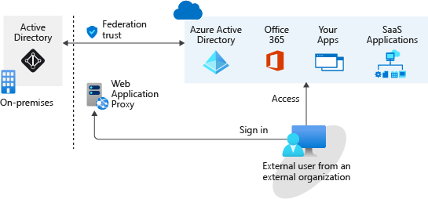

# Microsoft Entra B2B

Provide Us easily 

With Microsoft Entra business to business (B2B), you can add people from other companies to your `Microsoft Entra tenan`t as guest users.

If your organization has multiple `Microsoft Entra tenant`s, you may also want to use Microsoft Entra B2B to give a user in tenant A access to resources in tenant B
You can grant guest user access with the appropriate restrictions in place, then remove access when the work is done.

> What is Microsoft Entra tenant 
> Each Microsoft Entra tenant is distinct and separate from other Microsoft Entra tenants and has its own representation of identities and app registrations.

### Invitation 

Invite guest users to the Microsoft Entra organization, group, or application. (and their account/guests is added to Microsoft Entra ID as a guest account.)

The guest can get the invitation through
1. Email
2. direct link

> **By default, `users` and `administrators` in Microsoft Entra ID can invite guest users, but the `Global Administrator` can limit or disable this ability.**

### Benefits

With Microsoft Entra B2B, you don't
- have to manage your external users' identities  
- take on the responsibility of managing and authenticating the credentials and identities of partners.  
- need an AD administrator to create and manage external user accounts. Any authorized user can invite other users. 
When collaboration is no longer needed, you can easily remove these external users.  

### Federation & Authentication

A federation is where you have a trust established with the followings for shared access to a set of resources.
1. another organization
2. or a collection of domains    

You might be using an on-premises identity provider and authorization service like `Active Directory Federation Services (AD FS)` that has an established trust with Microsoft Entra ID.    
To get access to resources, all users have to provide their credentials and successfully authenticate against the AD FS server.  

If you have someone trying to authenticate outside the internal network, you need to set up a web application proxy
   
An on-premises federation with Microsoft Entra ID might be good if your organization wants all authentication to Azure resources to happen in the local environment.   

### Why use Microsoft Entra B2B instead of federation?

**With a B2B collaboration, Authentication is done directly through Azure** to access to AZ resources and services with the appropriate permissions.

No need for 
1. a federation and trust to be established
2. authentication doesn't depend on an on-premises server