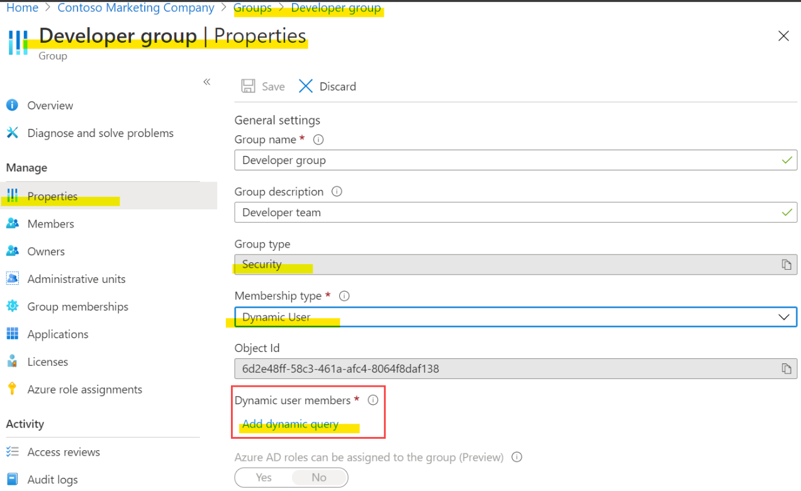

# Create Azure users and groups in Microsoft Entra ID

Learning Objectives :   
- Add users to Microsoft Entra ID.    
- Manage app and resource access by using Microsoft Entra groups.  
- Give guest users access in Microsoft Entra business to business (B2B).  

## What are user accounts in `Microsoft Entra ID`?

**Microsoft Entra ID uses `permissions` to help you control the access rights a `user` or `group` is granted and is done through `role`.**  
For example, a user assigned to the User Administrator role can create and delete user accounts.   

In Microsoft Entra ID, all user accounts are granted a set of default permissions.  
- **Type** of user (e.g. Administrators, guest)  
  - `Administrator`s have the highest level of access.  
  - `Guest`s have the most restricted level of access.  
- Their **role assignments**  
- Their **ownership of individual objects**  

> **Microsoft Entra ID has many roles with different permissions.**  
> When a user is assigned a specific role, they INHERIT permissions from that role.  

## User Type

### Administrator roles  

Administrator roles in Microsoft Entra ID allow users elevated access to control who is allowed to do what.  

You can assign administrator roles that allow a user to  
1. create 
2. edit users  
3. assign `administrative roles to others`  
4. reset user passwords, manage user licenses  
5. and more  

**If your user account has the `User Administrator` or `Global Administrator` role, you can create a new user in `Microsoft Entra ID` by using the Azure portal, the Azure CLI, or PowerShell.**   
- In PowerShell, run the `cmdlet New-MgUser`.  
- In the Azure CLI, use `az ad user`.  

### Member Users

Anyone who isn't a guest user or isn't assigned an administrator role falls into this type which **has a set of default permissions like being able to manage their profile information.**

### Guest Users

By default, Microsoft Entra member users can invite guest users. **Someone with the User Administrator role can disable this default**.

To collaborate with your organization, these partners often need to have a certain level of access to specific resources.  
For this sort of situation, it's a good idea to use guest user accounts.  

## Create/Delete User Account & Bulk Creations

[IN Actions](https://learn.microsoft.com/en-us/training/modules/create-users-and-groups-in-azure-active-directory/3-exercise-add-delete-users-azure-ad)

> When you delete a user, the account remains in a suspended state for 30 days

AZ CLI (`cmdlet`)
```bash 
az ad user create

az ad user delete
```

AZ PowerShell
```bash
New-MgUser

Remove-MgUser
```

## Bulk Creations

```bash 
# Bulk Creation #

# Descriptions 
# You create the comma-separated values (CSV) file with the list of all the users you want to add. 
# An invitation is sent to each user in that CSV file.

$invitations = import-csv c:\bulkinvite\invitations.csv

$messageInfo = [Microsoft.Graph.PowerShell.Models.MicrosoftGraphInvitation]@{ `
   CustomizedMessageBody = "Hello. You are invited to the Contoso organization." }

foreach ($email in $invitations)
   {New-MgInvitation `
      -InviteRedirectUrl https://myapps.microsoft.com ` 
      -InvitedUserDisplayName $email.Name `
      -InvitedUserEmailAddress $email.InvitedUserEmailAddress `
      -InvitedUserMessageInfo $messageInfo `
      -SendInvitationMessage 
   }
```

## App And Resource Access Management in MS Entra Groups

Microsoft Entra ID helps you 
1. manage your `cloud-based` apps, `on-premises` apps, and `resources by using (resource group)`/your organization's groups.
2. provide `access rights` to a single `user` or to an entire `group` of users. 

MS Entra Groups
- create group and members using the MS Entra Admin Center (`Identity > Groups > All groups. Select New group. Select a Group type.`)
- apply a set of access permissions to each user of thar group
  - **manage users that all need the same access**
  - **permissionS to resources, such as potentially restricted apps and services**
  - access permissions range from full access to the ability to create or remove resources

For Resources access Management, Your resources can be
- (`INTERNAL`) part of the Microsoft Entra organization, like permissions to manage objects through roles.   
- `EXTERNAL to the organization`, like software as a service (SaaS) apps, Azure services, SharePoint sites, and on-premises resources.   

Role Types
1. Microsoft Entra roles:  
Use Microsoft Entra roles to manage `Microsoft Entra ID-related resources` like `users`, `groups`, `billing`, `licensing`, `application registration`, and more.
2. Role-based access control (RBAC) for Azure resources:  
**Use RBAC roles to manage access to Azure resources like virtual machines, SQL databases, or storage.** 
For example, you could assign an RBAC role to a USER to manage and delete SQL databases in a specific **resource group** or **subscription**.

Access rights assignment :   
1. **Direct** assignment:   
Assign a USER the required access rights by **directly assigning a role that has those access rights.**  
2. **Group** assignment:   
Assign a group the required access rights, and members of the group will inherit those rights.  
3. **Rule-based** (條件式) assignment:   
Use rules to determine a group membership based on user or device properties.  
   - e.g. for a user account or device's group membership to be valid, the user or device must meet the rules. 
   If the rules aren't met, the user account or device's group membership is no longer valid. 
   **The rules can be simple. You can select pre-written rules or write your own advanced rules.**  

## Assign users to Microsoft Entra groups

https://learn.microsoft.com/en-us/training/modules/create-users-and-groups-in-azure-active-directory/5-exercise-assign-users-azure-ad-groups




