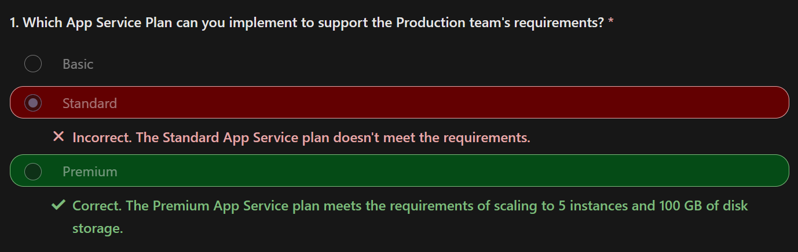

# AZ App Service Plans

An App Service plan defines a set of compute resources for a web application to run.  

One or more applications can be configured to run on the same computing resources (or in the same App Service plan).  

When you create an App Service plan in a region, a set of compute resources is created for the plan in the specified region.  

Any applications that you place into the plan run on the compute resources defined by the plan.

Each App Service plan defines `3` settings :
1. Region:  
The region for the App Service plan, such as `West US`, `Central India`, `North Europe`, and so on.
2. Number of VM instances  
3. Size of VM instances:  
The size of the virtual machine instances in the plan, including `Small`, `Medium`, or `Large`.   
You can continue to add new applications to an existing plan as long as the plan has enough resources to handle the increasing load.

The Azure App Service plan is the SCALE unit of App Service applications  
- **If your plan is configured to run five virtual machine instances**, then all applications in the plan run on all five instances. 
- **If your plan is configured for autoscaling**, then all applications in the plan are scaled out together based on the autoscale settings.

## Azure App Service plan pricing tiers

`Free` or `Shared` tier:
- Applications run by receiving CPU minutes on a shared virtual machine instance.
- Applications can't scale out.

`Basic`, `Standard`, `Premium`, or `Isolated` tier:
- Applications run on all virtual machine instances configured in the App Service plan.
- Multiple applications in the same plan share the same virtual machine instances.
- If you have multiple deployment slots for an application, all deployment slots run on the same virtual machine instances.
- If you enable diagnostic logs, perform backups, or run WebJobs, these tasks use CPU cycles and memory on the same virtual machine instances.

[Determine Azure App Service plan pricing](https://learn.microsoft.com/en-us/training/modules/configure-app-service-plans/3-determine-plan-pricing)

## Consideration 

Consider `cost savings`. 
- **you can potentially save money by placing multiple applications into the same App Service plan (allocating).**

Consider `multiple applications in one plan`. 
- Create a single plan to support multiple applications, to make it easier to configure and maintain shared virtual machine instances.   

Consider `plan capacity`. 
- Before you add a new application to an existing plan, determine the resource requirements for the new application and identify the remaining capacity of your plan.

> Overloading an App Service plan can potentially cause downtime for new and existing applications.

Consider application `isolation`. 
- Isolate your application into a new App Service plan when:
  - The application is resource-intensive.
You want to scale the application independently from the other applications in the existing plan.
The application needs resource in a different geographical region.

## Scale up & scale out Azure App Service

[Scale up & scale out Azure App Service](https://learn.microsoft.com/en-us/training/modules/configure-app-service-plans/4-scale-up-scale-out)

Your App Service plan can be scaled up and down **at any time by changing the pricing tier of the plan.**

The `scale up` method increases `the amount of CPU, memory, and disk space`.     
Scaling up gives you extra features like dedicated VMs, custom domains and certificates, staging slots, autoscaling, and more. 
- You scale up by changing the pricing tier of the Azure App Service plan where your application is placed.

The `scale-out` method increases the number of VM instances that run your application.  
- **You can scale out to as many as 30 instances**, depending on your App Service plan pricing tier. 
**Take advantage of App Service Environments in the Isolated tier to further increase your scale-out count to 100 instances**.  
The scale instance count can be configured `manually` or `automatically` (autoscale).

> Autoscale is based on `predefined rules` and `schedules`.

### Considerations

Consider manually adjusting plan tiers. 
- Start your plan at a lower pricing tier and `scale up` as needed to acquire more App Service features. `Scale down` when features are no longer needed, and control your overall costs.

Consider a scenario where you start testing your web app by using the Azure App Service Free tier, where you pay nothing to use the service.   
- After a while, you decide to add a custom DNS name to your web app, so you scale your plan up to the Shared tier.   
Next, you discover you need to create an SSL binding, so you scale your plan up to the Basic tier.  
- Later, you determine a need for staging environments, so you scale up to the Standard tier. When you need more cores, memory, or storage, you can scale up to a bigger virtual machine size in the same tier.  
- The same scaling process works in reverse. If you decide you no longer need capabilities or features of a higher tier, scale your plan down to a lower tier and save money.

Consider `autoscale` to support users and reduce costs.  
- Keep serving your users when your application is experiencing high throughput.  
    Implement `autoscale` to control how many features and support are offered at a given time `based on your preference settings and rule conditions`.  

Consider `no redeployment`.  
- When you change your scale settings, you don't need to change your code or redeploy your applications. Changing your plan scale settings takes only seconds to apply. Your changes affect all applications in your App Service plan.

Consider `scaling for other Azure services`. 
- If your App Service application depends on other Azure services, such as Azure SQL Database or Azure Storage, you can scale these resources separately. **These resources aren't managed by your App Service plan.**

## autoscale configuration

You can add resources to support increases in load and save money by removing idle resources by the autoscale process.  
 
When rule conditions are met, one or more autoscale actions are triggered.  

Autoscale settings are grouped into profiles.  
Autoscale rules include a trigger and a scale action (in or out). 

### Trigger

The trigger can be metric-based or time-based.

Metric-based rules measure application load and add or remove virtual machines based on the load, such as `"do this action when CPU usage is above 50%."`  
Example metrics include `CPU time, Average response time, and Requests`.  

Time-based rules (or, schedule-based) allow you to scale when you see time patterns in your load and want to scale before a possible load increase or decrease occurs.  
An example is `"trigger a webhook every 8:00 AM on Saturday in a given time zone."`

### Notification

The autoscale engine uses notification settings.
it can notify one or more email addresses or make calls to one or more webhooks.

### Consideration

Minimum instance count. 
- Set a minimum instance count to make sure your application is always running even when there's no load.

Maximum instance count. 
- Set a maximum instance count to limit your total possible hourly cost.

Adequate `scale margin`. 
- Make sure your `maximum` and `minimum` instance count values are different, and set an adequate margin between the two values. 
You can automatically scale between the `minimum` and `maximum` by using rules you create.

Scale rule combinations. 4
- **Always use a scale-out and scale-in rule combination that performs an increase and decrease.**  
If you don't set a scale-out rule, your application might fail, or performance might degrade under increased loads.  
If you don't set a scale-in rule, you can experience unnecessary and extensive costs when the load decreases.

Metric statistics. 
- Carefully choose the appropriate statistic for your diagnostic metrics, including `Average`, `Minimum`, `Maximum`, and `Total`.

Default instance count. 
- Always select a safe default instance count. **The default instance count is important because autoscale scales your service to the count you specify when metrics aren't available.**

Notifications. 
- Always configure autoscale notifications.  
It's important to maintain awareness of how your application is performing as the load changes.