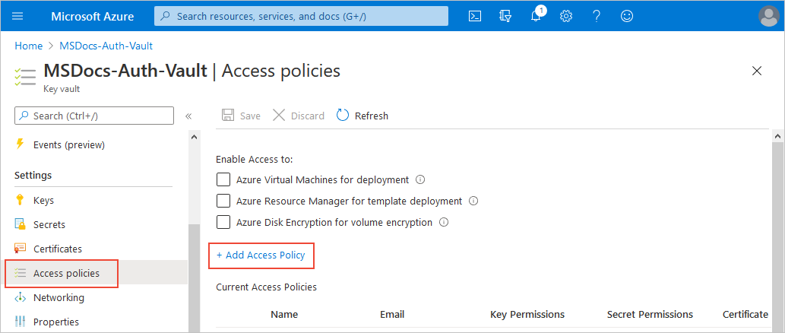
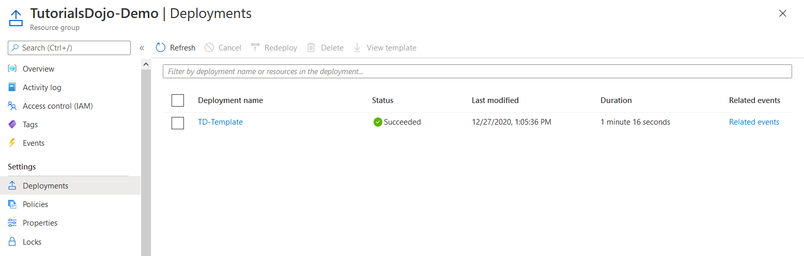

# AZ App Service Plans

An App Service plan defines a set of compute resources for a web application to run.      
One or more applications can be configured to run on the same computing resources (or in the same App Service plan).  
When you create an App Service plan in a region, a set of compute resources is created for the plan in the specified region.  

Any applications that you place into the plan run on the compute resources defined by the plan.

Each App Service plan defines `3` settings :
1. `Region`  
The region for the App Service plan, such as `West US`, `Central India`, `North Europe`, and so on.
2. `Number of VM instances` 
3. `Size of VM instances`
The size of the virtual machine instances in the plan, including `Small`, `Medium`, or `Large`.   
You can continue to add new applications to an existing plan as long as the plan has enough resources to handle the increasing load.

The Azure App Service plan is the SCALE unit of App Service applications    
- **If your plan is configured to run five virtual machine instances**, then all applications in the plan run on all five instances. 
- **If your plan is configured for autoscaling**, then all applications in the plan are scaled out together based on the autoscale settings.

## Azure App Service plan pricing tiers

`Free` or `Shared` tier:
- Applications run by receiving CPU minutes on a shared virtual machine instance.
- Applications can't scale out.

`Basic`, `Standard`, `Premium`, or `Isolated` tier:
- Applications run on all virtual machine instances configured in the App Service plan.
- Multiple applications in the same plan share the same virtual machine instances.
- If you have multiple deployment slots for an application, all deployment slots run on the same virtual machine instances.
- If you enable diagnostic logs, perform backups, or run WebJobs, these tasks use CPU cycles and memory on the same virtual machine instances.

[Determine Azure App Service plan pricing](https://learn.microsoft.com/en-us/training/modules/configure-app-service-plans/3-determine-plan-pricing)   

## Why using App Service Plans

Consider `cost savings`. 
- **you can potentially save money by placing multiple applications into the same App Service plan (allocating).**

Consider `multiple applications in one plan`. 
- Create a single plan to support multiple applications, to make it easier to configure and maintain shared virtual machine instances.   

Consider `plan capacity`. 
- Before you add a new application to an existing plan, determine the resource requirements for the new application and identify the remaining capacity of your plan.

> Overloading an App Service plan can potentially cause downtime for new and existing applications.

Consider application `isolation`. 
- Isolate your application into a new App Service plan when:
  - The application is resource-intensive.
You want to scale the application independently from the other applications in the existing plan.
The application needs resource in a different geographical region.

## Scale up & scale out Azure App Service

[Scale up & scale out Azure App Service](https://learn.microsoft.com/en-us/training/modules/configure-app-service-plans/4-scale-up-scale-out)

Your App Service plan can be scaled up and down **at any time by changing the pricing tier of the plan.**

The `scale up` method increases `the amount of CPU, memory, and disk space`.     
Scaling up gives you extra features like dedicated VMs, custom domains and certificates, staging slots, autoscaling, and more. 
- You scale up by changing the pricing tier of the Azure App Service plan where your application is placed.

The `scale-out` method increases the number of VM instances that run your application.  
- **You can scale out to as many as 30 instances**, depending on your App Service plan pricing tier. 
**Take advantage of App Service Environments in the Isolated tier to further increase your scale-out count to 100 instances**.  
The scale instance count can be configured `manually` or `automatically` (autoscale).

> Autoscale is based on `predefined rules` and `schedules`.

### Considerations

Consider manually adjusting plan tiers. 
- Start your plan at a lower pricing tier and `scale up` as needed to acquire more App Service features. `Scale down` when features are no longer needed, and control your overall costs.

Consider a scenario where you start testing your web app by using the Azure App Service Free tier, where you pay nothing to use the service.   
- After a while, you decide to add a custom DNS name to your web app, so you scale your plan up to the Shared tier.   
Next, you discover you need to create an SSL binding, so you scale your plan up to the Basic tier.  
- Later, you determine a need for staging environments, so you scale up to the Standard tier. When you need more cores, memory, or storage, you can scale up to a bigger virtual machine size in the same tier.  
- The same scaling process works in reverse. If you decide you no longer need capabilities or features of a higher tier, scale your plan down to a lower tier and save money.

Consider `autoscale` to support users and reduce costs.  
- Keep serving your users when your application is experiencing high throughput.  
    Implement `autoscale` to control how many features and support are offered at a given time `based on your preference settings and rule conditions`.  

Consider `no redeployment`.  
- When you change your scale settings, you don't need to change your code or redeploy your applications. Changing your plan scale settings takes only seconds to apply. Your changes affect all applications in your App Service plan.

Consider `scaling for other Azure services`. 
- If your App Service application depends on other Azure services, such as Azure SQL Database or Azure Storage, you can scale these resources separately. **These resources aren't managed by your App Service plan.**

## autoscale configuration

You can add resources to support increases in load and save money by removing idle resources by the autoscale process.  
 
When rule conditions are met, one or more autoscale actions are triggered.  

Autoscale settings are grouped into profiles.  
Autoscale rules include a trigger and a scale action (in or out). 

### Trigger

The trigger can be metric-based or time-based.

Metric-based rules measure application load and add or remove virtual machines based on the load, such as `"do this action when CPU usage is above 50%."`  
Example metrics include `CPU time, Average response time, and Requests`.  

Time-based rules (or, schedule-based) allow you to scale when you see time patterns in your load and want to scale before a possible load increase or decrease occurs.  
An example is `"trigger a webhook every 8:00 AM on Saturday in a given time zone."`

### Notification

The autoscale engine uses notification settings.
it can notify one or more email addresses or make calls to one or more webhooks.

### Consideration

Minimum instance count. 
- Set a minimum instance count to make sure your application is always running even when there's no load.

Maximum instance count. 
- Set a maximum instance count to limit your total possible hourly cost.

Adequate `scale margin`. 
- Make sure your `maximum` and `minimum` instance count values are different, and set an adequate margin between the two values. 
You can automatically scale between the `minimum` and `maximum` by using rules you create.

Scale rule combinations. 4
- **Always use a scale-out and scale-in rule combination that performs an increase and decrease.**  
If you don't set a scale-out rule, your application might fail, or performance might degrade under increased loads.  
If you don't set a scale-in rule, you can experience unnecessary and extensive costs when the load decreases.

Metric statistics. 
- Carefully choose the appropriate statistic for your diagnostic metrics, including `Average`, `Minimum`, `Maximum`, and `Total`.

Default instance count. 
- Always select a safe default instance count. **The default instance count is important because autoscale scales your service to the count you specify when metrics aren't available.**

Notifications. 
- Always configure autoscale notifications.  
It's important to maintain awareness of how your application is performing as the load changes.  

## AD & role assignment

Azure Active Directory (Azure AD) is Microsoft’s cloud-based identity and access management service, which helps your employees sign in and access resources in external (Microsoft 365, the Azure portal, and thousands of other SaaS applications) and internal resources(apps on your corporate network and intranet, along with any cloud apps developed by your own organization).  

Here are the two common built-in roles in Azure Active Directory:

– Application Administrator: Users in this role can create and manage all aspects of enterprise applications, application registrations, and application proxy settings. This role also grants the ability to consent to delegated permissions, and application permissions excluding Microsoft Graph. Users assigned to this role are not added as owners when creating new application registrations or enterprise applications.

– Cloud Application Administrator: Users in this role have the same permissions as the Application Administrator role, excluding the ability to manage application proxy. Users assigned to this role are not added as owners when creating new application registrations or enterprise applications.

If you want to grant a user permission to manage Azure AD resources, you must assign them to a role that provides the permissions they need. Based on the given scenario, the new user account needs the role of Application Administrator. To grant a role to the new user account, you must select the user profile and click on add assignments in the assigned roles option. Add the Application Administrator role, and the user can now create and manage all aspects of app registrations and enterprise apps.

The option that says: 
Select the user profile and add the user to the admin group is incorrect because adding the user to the admin group doesn’t mean that the Application Administrator’s role is automatically assigned to the user account.

The option that says: Select the user profile and assign it to an administrative unit is incorrect because this option only restricts permissions in a role to any portion of your organization that you define. Take note that the requirement in the scenario is to assign an Application Administrator role to the new user account and not to restrict its permissions in your account.

The option that says: Select the user profile and enable the My Staff feature is incorrect because the My Staff feature simply enables you to delegate to a figure of authority, such as a store manager or a team lead, the permissions to ensure that their staff members are able to access to their Azure AD accounts.

## ARM and Security

You need to use an existing Azure Resource Manager (ARM) template to provision ten Azure virtual machines.  
You should retrieve the password using the ARM template. The password must not be stored in plain text.  

Azure Key Vault is a cloud service for securely storing and accessing secrets. 

A `secret` is anything that you want to tightly control access to, such as API keys, passwords, certificates, or cryptographic keys. Key Vault service supports two types of containers: 
vaults and managed HSM pools. 
Vaults support storing software and HSM-backed keys, secrets, and certificates. 

Managed HSM pools only support HSM-backed keys.

In this scenario, **you can use the ARM template to retrieve the password in Azure Key Vault.**  

Instead of putting a secure value (like a password) directly in your template or parameter file, you can retrieve the value from an Azure Key Vault during deployment.  
You retrieve the value by referencing the key vault and secret in your parameter file.  
The value is never exposed because you only reference its key vault ID.

The option that says: 
Create a storage account and configure data protection is incorrect because you can’t store a secret in a storage account. 
You must use a key vault to store and use several types of secret/key data. Also, data protection in the storage account is primarily used for the recovery and tracking of blobs.

The option that says: 
Configure label protection is incorrect. 
This option is a feature of Azure Information Protection. Label protection is used for protecting sensitive documents and emails by using the Rights Management service. 
You can’t use label protection to store secret values in Azure Key Vault.

The option that says: 
Configure Azure AD Password Protection is incorrect because this option only detects and blocks known weak passwords in your organization. 

Take note that the requirement in the scenario is to store the password as a secret that is not in plaintext. Therefore, you must use the Azure Key Vault.

## Entra ID & license 

There are several license plans available for the Microsoft Entra ID service, including:
– Microsoft Entra ID Free
– Microsoft Entra ID P1
– Microsoft Entra ID P2

**To ensure that the users in your tenant have access to Premium P1 license features, you must manually add the license to each user or add the license to a group.** 

Remember that only the users with active licenses can access and use the licensed Microsoft Entra ID services. Also, licenses are applied per tenant, and you can’t transfer them to other tenants.  

The option that says: Select the user in your tenant and assign a new role in the Directory role blade of each user is incorrect because this approach only assigns a new role to your user. 

The option that says: Select the user in your tenant and assign it to an administrative unit is incorrect because this option only restricts permissions in a role to any portion of your organization that you define. 

The option that says: Select the user in your tenant and add the user to an Microsoft Entra ID group is incorrect because this approach would only work if the license is already added to the group. 

## VM scaling .

Q:
You plan to migrate your business-critical application to Azure virtual machines.

You need to make sure that at least two VMs are available during planned Azure maintenance.

A:
Updates rarely affect the hosted VMs. 
When updates do have an effect, Azure chooses the least impactful method for updates:
– If the update doesn’t require a reboot, the VM is paused while the host is updated, or the VM is live-migrated to an already updated host.
– **If maintenance requires a reboot, you’re notified of the planned maintenance**.  
Azure also provides a time window in which you can start the maintenance yourself, at a time that works for you. The self-maintenance window is typically 35 days unless the maintenance is urgent. Azure is investing in technologies to reduce the number of cases in which planned platform maintenance requires the VMs to be rebooted.

The main objective of the question is to test your understanding of update and fault domains. Since it’s a requirement in the scenario that at least two virtual machines must be available during planned maintenance, you should add three update domains in the Availability Set. Take note that each virtual machine in your availability set is assigned to an update domain and a fault domain.

During scheduled maintenance, only one update domain is updated at any given time. Update domains aren’t necessarily updated sequentially. A rebooted update domain is given 30 minutes to recover before maintenance is initiated on a different update domain. For fault domains, you can set a minimum number of fault domains in your Availability Set because the main requirement in the scenario is to prepare for planned maintenance.

Hence, the correct answer is: Create an Availability Set that has three update domains and two fault domains.

The option that says: Create an Availability Set that has three update domains and one fault domain is incorrect because if you set 3 update domains and 1 fault domain in an Availability Set, you will receive an error message: “The update domain count must be 1 when fault domain count is 1.” To resolve this error, you must have 2 fault domains instead of 1 fault domain.

The option that says: Create an Availability Set that has two update domains and three fault domains is incorrect because you need to have three update domains instead of two update domains.

The option that says: Create an Availability Set that has one update domain and three fault domains is incorrect because three fault domains are not needed in this scenario. Fault domains are mainly used for unplanned maintenance. Three update domains must be provisioned to adequately satisfy the requirements.

## AKS

Your company has an Azure Kubernetes Service (AKS) cluster and a Windows 10 workstation with Azure CLI installed.  
You plan to use the **kubectl client** on Windows 10.  

Ans :
To connect to the Kubernetes cluster from your local computer, you need to use `kubectl`. 
But before you can use `kubectl`, you should first run the command `az aks install-cli` in the command-line interface. The kubectl allows you to deploy applications, inspect and manage cluster resources, and view logs.

The option that says: 
`az aks nodepool` is incorrect 
because this command only allows you to manage node pools in a Kubernetes cluster. 
It is stated in the scenario that you need to use the kubectl client. 
Therefore, you should first run the az aks install-cli command.

The option that says: 
`az aks create` is incorrect because this will just create a new managed Kubernetes cluster. 

The option that says: 
`az aks browse` is incorrect because it will simply show the dashboard of the Kubernetes cluster in your web browser. Instead of running the command `az aks browse`, you should run az aks install-cli to download and install the Kubernetes command-line tool.

## Resource Group with Policy

You need to get the exact date and time when the resources in resource group `TD-RG` was deployed.
Solution: In the resource group settings, select Policies.

A resource group is a container that holds related resources for an Azure solution. The resource group can include all the resources for the solution, or only those resources that you want to manage as a group. You decide how you want to allocate resources to resource groups based on what makes the most sense for your organization. 

Generally, add resources that share the same lifecycle to the same resource group so you can easily deploy, update, and delete them as a group.

**ANS**  
The policy in the resource group is mainly used for implementing governance for resource consistency, regulatory compliance, security, cost, and management. Azure Policy does not contain the date and time when the resources were deployed.

The properties in the resource group contain the name, location, location ID, resource ID, subscription, and subscription ID. This setting does not contain the date and time when the resources were deployed.

To verify the date and time the resources were deployed, you can select the resource group and click the deployment settings. You will see a summary of the deployment: the deployment name, status, last modified, duration, and related events. If you select a particular template, you can check the inputs, outputs, and the template used during deployment.