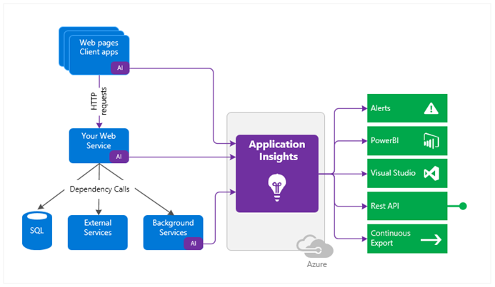

# AZ App Service

Learning objectives
- Identify features and usage cases for Azure App Service.
- Create an app with Azure App Service.
- Configure deployment settings, specifically deployment slots.
- Secure your Azure App Service app.
- Configure custom domain names.
- Back up and restore your Azure App Service app.
- Configure Azure Application Insights.

A Predefine Container that provide .Net/NetCore , Java, Node.JS, PHP, and Python  
> `Runtime` refers to programming language & libraries and framework you are using 

## Benefit

There are many advantages to using App Service to develop and deploy your web, mobile, and API apps.   

Multiple languages and frameworks	
- App Service has first-class support for `ASP.NET, Java, Ruby, Node.js, PHP, and Python`. You can also run PowerShell and other scripts or executables as background services.  

DevOps optimization	
- App Service supports continuous integration and deployment with `Azure DevOps, GitHub, BitBucket, Docker Hub, and Azure Container Registry.`  
You can promote updates through test and staging environments.  
Manage your apps in App Service by using Azure PowerShell or the cross-platform command-line interface (CLI).  

Global scale with high availability	 
- App Service helps you scale up or out manually or automatically.  
You can host your apps anywhere within the Microsoft global datacenter infrastructure, and the App Service SLA offers high availability.

Connections to SaaS platforms and on-premises data	
- App Service lets you choose from more than 50 connectors for enterprise systems (such as SAP), SaaS services (such as Salesforce), and internet services (such as Facebook). You can access on-premises data by using Hybrid Connections and Azure Virtual Networks.

Security and compliance	
- App Service is ISO, SOC, and PCI compliant. You can authenticate users with Microsoft Entra ID or with social logins via Google, Facebook, Twitter, or Microsoft. Create IP address restrictions and manage service identities.

Application templates	
- Choose from an extensive list of application templates in the Azure Marketplace, such as WordPress, Joomla, and Drupal.  

Visual Studio integration	
- App Service offers dedicated tools in Visual Studio to help streamline the work of creating, deploying, and debugging.  

API and mobile features	
- App Service provides turn-key CORS support for RESTful API scenarios. You can simplify your mobile app scenarios by enabling authentication, offline data sync, push notifications, and more.  

Serverless code	
- App Service lets you run a code snippet or script on-demand without having to explicitly provision or manage infrastructure. You pay only for the compute time your code actually uses.


## Creation

[Create App-Service](https://learn.microsoft.com/en-us/training/modules/configure-azure-app-services/3-create-app-service)  
[Exercise - Create a web app in the Azure portal](https://learn.microsoft.com/en-us/training/modules/host-a-web-app-with-azure-app-service/3-exercise-create-a-web-app-in-the-azure-portal?pivots=java)

`Azure Portal | Web App`


Under basic tab, some fields configuration should be aware :arrow_down:

#### Name  

**The name becomes part of the app's URL, so it must be unique among all Azure App Service web apps.**
The name identifies and locates your app in Azure.   
An example name is `webappces1.azurewebsites.net`.  
You can map a custom domain name, if you prefer to use that option instead.

#### Publish (update code or image)

You can deploy your application to App Service as code or as a ready-to-run Docker image. 

Selecting Docker image will activate the wizard's Docker tab, where you'll provide information about the Docker registry from which App Service will retrieve your image.

#### Runtime stack (language or docker image):   

If you choose to deploy your application as code, App Service needs to know what runtime your application uses (examples include Node.js, Python, Java, and .NET)

If you deploy your application as a Docker image, you won't need to choose a runtime stack, because your image will include it.

For Linux apps and custom container apps, you can set an optional start-up command or file. 
Various versions of each product are available for Linux and Windows.

#### Operating system:   

The operating system for your app runtime stack can be Linux or Windows.

If your application is packaged as a Docker image, choose the operating system on which your image is designed to run.

Selecting `Windows` activates the `Monitoring` tab, where you can enable Application Insights. 
- Enabling this feature configures your app to automatically send detailed performance telemetry to the Application Insights monitoring service without requiring any changes to your code. 

**You can use Application Insights from Linux-hosted apps as well, but this turnkey, no-code option is only available on Windows.**

#### Region:  

The region location that you choose for your app affects the App Service plans that are available.

#### App Service plan 

Your app needs to be associated with an Azure App Service plan to establish available resources, features, and capacity. 

You can choose from pricing tiers that are available for the region location you selected.

App Service plan is a set of virtual server resources that run App Service apps. 

A plan's size (sometimes referred to as its `sku` or `pricing tier`) determines the performance characteristics of the virtual servers that run the apps assigned to the plan, as well as the App Service features to which those apps have access. 

**Every App Service web app you create must be assigned to a single App Service plan that runs it.**

**A single App Service plan can host multiple App Service web apps.**  
In most cases, the number of apps you can run on a single plan is limited by the apps' performance characteristics and the plan's resource limitations.

**App Service plans App Service's unit of billing.**  

The size of each App Service plan in your subscription, in addition to the bandwidth resources the apps deployed to those plans use, determines the price you pay. The number of web apps deployed to your App Service plans has no effect on your bill.

You can use any of the available Azure management tools to create an App Service plan.

**When you create a web app via the Azure portal, the wizard will help you to create a new plan at the same time if you don't already have one.**

### Post-Creation Configuration 


`Always On` :  
You can keep your app loaded even when there's no traffic. This setting is required for continuous WebJobs or **for WebJobs that are triggered by using a CRON expression.**

`ARR affinity` :  
In a multi-instance deployment, you can **ensure your app client is routed to the same instance for the life of the session.**
  
`Connection strings` :  
**Connection strings for your app are encrypted at rest and transmitted over an encrypted channel.**


## Continuous Integration 

The Azure portal provides out-of-the-box continuous integration and **deployment with `Azure DevOps, GitHub, Bitbucket, FTP, or a local Git repository` on your development machine.**

App Service auto-synchronizes your code and any future changes to the code into your web app.


### Deployment Options

When you create your web app with App Service, you can choose automated or manual deployment to deploy your code to App Service.  

#### `Automated deployment` (continuous integration)   

A process used to push out new features and bug fixes in a fast and repetitive pattern with minimal impact on end users with these :arrow_down:

Azure DevOps:
- You can push your code to Azure DevOps, build your code in the cloud, run the tests, generate a release from the code, and finally push your code to an Azure Web App.

GitHub: 
- Azure supports automated deployment directly from GitHub. When you connect your GitHub repository to Azure for automated deployment, any changes you push to your production branch on GitHub will be automatically deployed for you.

Bitbucket: 
- Due to its similarities to GitHub, you can configure an automated deployment with Bitbucket.

OneDrive: 
- OneDrive is Microsoft's cloud-based storage. You must have a Microsoft account linked to a OneDrive account to deploy to Azure.

Dropbox: 
- Azure supports deployment from Dropbox, which is a popular cloud-based storage system similar to OneDrive.

#### `Manual deployment`  

Enable you to manually push your code to Azure with theses :arrow_down:

Git: 
- App Service web apps feature a Git URL that you can add as a remote repository. Pushing to the remote repository will deploy your app.

az webapp up: 
- `webapp up is a feature of the az command-line interface that packages your app and deploys it.` Unlike other deployment methods, 
az webapp up can create a new App Service web app for you if you haven't already created one.

ZIP deploy: 
- You can use az webapp deployment source config-zip to send a ZIP of your application files to App Service. You can also access ZIP deploy via basic HTTP utilities such as curl.

WAR deploy: 
- **WAR deploy is an App Service deployment mechanism designed for deploying Java web applications** using WAR packages. 
You can access WAR deploy using the `Kudu HTTP API` located at `http://<your-app-name>.scm.azurewebsites.`net/api/wardeploy. 
If that fails, try: `https://<your-app-name>.scm.azurewebsites.net/api/wardeploy.`

```bash 
cd ~/<your_JAVA_project_name>/target
curl -v -X POST -u <username>:<password> \
https://<your-app-name>.scm.azurewebsites.net/api/wardeploy \
--data-binary @helloworld.war
```

Visual Studio:   
- Visual Studio features an App Service deployment wizard that walks you through the deployment process.

FTP/S:   
- FTP or FTPS is a traditional way of pushing your code to many hosting environments, including App Service.

## Deployment Slot

Deployment slots help you manage different app stages (in separate environments). For example, `development`, `test`, `stage`, and `production`.

**Each slot is a fully independent instance of your application**, and it enables you to perform tasks like `testing`, `staging`, and `deploying` updates without affecting the production environment. (Deployment slots are live apps that have their own hostnames)

**App content and configuration elements can be swapped between two deployment slots, including the production slot.**

When you create an Azure App Service, it comes with a default deployment slot called the `production` slot.  
This is the live, publicly accessible instance of your application.  

> **Think Of slots As A way to quickly clone your production environment for other use**


### App Service pricing tiers

- Deployment slots are available in the Standard, Premium, and Isolated App Service pricing tiers.  
- The Standard, Premium, and Isolated tiers offer different numbers of deployment slots.  

### Considerations

Consider `validation`. 
- You can validate changes to your app in a staging deployment slot before swapping the app changes with the content in the production slot.

Consider `reductions in downtime`. 
- Deploying an app to a slot first and swapping it into production ensures that all instances of the slot are warmed up before being swapped into production. This option eliminates downtime when you deploy your app. The traffic redirection is seamless, and no requests are dropped because of swap operations. The entire workflow can be automated by configuring Auto swap when pre-swap validation isn't needed.

Consider `restoring to last known good site`. 
- After a swap, the slot with the previously staged app now has the previous production app.  
**If the changes swapped into the production slot aren't as you expected, you can perform the same swap immediately to return to your "last known good site."**

Consider `Auto swap`. 
- Auto swap streamlines Azure DevOps scenarios where you want to deploy your app continuously with zero cold starts and zero downtime for app customers.  
When Auto swap is enabled from a slot into production, **every time you push your code changes to that slot, App Service automatically swaps the app into production after it's warmed up in the source slot.**  
**Auto swap isn't currently supported for Web Apps on Linux.**


### Tips for creating deployment

- New deployment slots can be `empty` or `cloned`.
- Deployment slot settings fall into three categories:
  1. Slot-specific app settings and connection strings (if applicable)
  2. Continuous deployment settings (when enabled)  
  3. Azure App Service authentication settings (when enabled)
- When you clone a configuration from another deployment slot, the cloned configuration is editable.    
Some configuration elements follow the content across the swap.  
Other slot-specific configuration elements stay in the source slot after the swap.  


### Swapped setting VS slot-specific settings


slot-specific settings : settings that remain in the source slot  
swapped settings : settings that are swapped between deployment slots  


## Secure App Service 

You configure authentication and authorization security in App Service by selecting features In the Azure portal.

Azure App Service provides built-in authentication and authorization support.

Secure authentication and authorization require deep understanding of security, including `federation, encryption, JSON web tokens (JWT) management, grant types`, and so on.

### You Should Know

The authentication and authorization **security module in Azure App Service runs in the same environment as your application code**, yet separately.  

**The security module is configured by using app settings**. No SDKs, specific languages, or changes to your application code are required.  

When you enable the security module, every incoming HTTP request passes through the module before it's handled by your application code.   

The security module handles several tasks for your app:
1. Authenticate users with the specified `(authentication)provider`
2. Validate, store, and refresh `tokens`
3. Manage the authenticated `session`
4. Inject identity information into `request headers`

### Considerations
 
Allow `Anonymous requests` (no action)     
- **Defer authorization of unauthenticated traffic to your application code.** 
  - For authenticated requests, **App Service also passes along authentication information in the HTTP headers.** With this feature, you can **present multiple sign-in providers to your users.**

Allow `only authenticated requests`   
- Redirect all anonymous requests to `/.auth/login/<provider>` for the provider you choose. The feature is equivalent to Log in with `<provider>`. 
If the anonymous request comes from a native mobile app, the returned response is an `HTTP 401 Unauthorized` message. 
**With this feature, you don't need to write any authentication code in your app.**
- <font color="red">Restricting access to all calls might not be desirable if your app requires a public home page, as is the case for many single-page apps.</font>

`Logging and tracing`  
- **View authentication and authorization traces directly in your log files.** For example an authentication error that you didn't expect, failed request tracing.. 
- In the trace logs, look for references to a module named `EasyAuthModule_32/64`.

## Custom Domain

When you create a web app, Azure assigns the app to a subdomain of `azurewebsites.net`.  
Suppose your web app is named contoso. Azure creates a URL for your web app as `contoso.azurewebsites.net`.

Azure assigns the app
1. to a subdomain of `azurewebsites.net` which means each URL for web app as `<you-webname>.azurewebsites.net`
2. a virtual ip

### Creation

3. Reserve your domain name.
   - Buy one directly in the AZ portal (get away with `azurewebsites.net` )
4. Create DNS records to map the domain to your Azure web app.
   - Map domain names to IP addresses. 
5. Enable the custom domain
   - Use the Azure portal to validate your custom domain and add it to your web app.

### Types of DNS Domain :star:

For web apps, you create either an `A` (Address) record or a `CNAME` (Canonical Name) record.
- An `A` record maps a domain name to an IP address.
- A `CNAME` record maps a domain name to another domain name. 

DNS uses the second name to look up the address.   
Users still see the first domain name in their browser.  

> As an example, you could map `contoso.com` to your `webapp.azurewebsites.net` URL. If the IP address changes, a CNAME entry is still valid, whereas an `A` record must be updated.

Some domain registrars don't allow `CNAME` records for the root domain or for wildcard domains. In such cases, you must use an `A` record.

## Backup & Restore

### You Should Know

1. To use the Backup and Restore feature, you need the Standard or Premium tier App Service plan
2. You need an Azure storage account and container in the same subscription as the app 
3. Azure App Service can back up these to the AZ storage account & container
   - App configuration settings
   - File content
   - Any database connected to your app (SQL Database, Azure Database for MySQL, Azure Database for PostgreSQL, MySQL in-app)
4. In your storage account, each backup consists of a Zip file and XML file:
    - The `Zip` file contains the back-up data for your app or site.
    - The `XML` file contains a manifest of the Zip file contents.
5. Backups has two options
   1. manually 
   2. on a schedule
6. Backup types 
   1. Full backups (by default)
   2. Partial backups 
7. Backup can hold up to `10` GB of app & DB content
8. Backups for your app or site are visible on the Containers page of your storage account and app (or site) in the Azure portal.

### Considerations

Consider `full backups`. 
- Do a full backup to easily **save all configuration settings**, all file content, and all database content connected with your app or site.

When you `restore a full backup`
- all content on the site is replaced with whatever is in the backup. 
**If a file is on the site, but not in the backup, the `file is deleted`.**

Consider partial backups. 
- so you can choose exactly which files to back up.

When you `restore a partial backup`
- **any content located in an excluded folder or file is `left as-is.`**

Consider `browsing back-up files`. 
- **Unzip and browse the Zip and XML files associated with your backup to access your backups.**  
This option lets you view the content **without actually performing an app or site restor**e.

Consider `firewall on back-up destination.` 
- **If your storage account is enabled with a firewall, you can't use the storage account as the destination for your backups**.

## Azure Application Insights

Azure Application Insights is a feature of Azure Monitor.  



Application Insights is designed to help you continuously improve the performance and usability of your apps. 

### You Should Know 

Application Insights works on various platforms including `.NET, Node.js and Java EE.`

The feature can be used for configurations that are `hosted` **on-premises**, in a **hybrid environment**, or in **any public cloud**.

Application Insights integrates with your Azure DevOps process, and has connection points to many development tools.

**You can monitor and analyze data from mobile apps by integrating with Visual Studio App Center**.


### Considerations

Consider `Request rates, response times, and failure rates`. 
- Find out which pages are most popular, at what times of day, and where your users are. See which pages perform best. If your response times and failure rates go high when there are more requests, then perhaps you have a resourcing problem.

Consider `Dependency rates, response times, and failure rates`. 
- Use Application Insights to discover if external services are degrading your app performance.

Consider `Exceptions`. 
- Analyze the aggregated statistics, or pick specific instances and drill into the stack trace and related requests. Both server and browser exceptions are reported.

Consider `Page views and load performance`. 
- Collect the number of page views reported by your users' browsers and analyze the load performance.

Consider `User and session counts`. 
- Application Insights can help you keep track of the number of users and sessions connected to your app.

Consider `Performance counters`. 
- Add Application Insights performance counters from your Windows or Linux server machines. Monitor performance output for the `CPU`, `memory`, `network` usage, and so on.

Consider `Host diagnostics`.
-  Integrate diagnostics from Docker or Azure into your app Application Insights.

Consider `Diagnostic trace logs`. 
- Implement trace logs from your app to help correlate **trace events with requests and diagnose issues**.

Consider `Custom events and metrics`. 
- Write your own custom events and metric tracking algorithms as client or server code. **Track business events such as number of items sold, or number of games won.**


## In Actions

scenario
- Migrating on-premises web apps to Azure App Service

You need to
1. Host web sites 
2. Deployment slots Implementation


- Task 1: Create an Azure web app.
- Task 2: Create a staging deployment slot.
- Task 3: Configure Web App deployment settings.
- Task 4: Deploy code to the staging deployment slot.
- Task 5: Swap the staging slots.


## Summary

[Summary and resources](https://learn.microsoft.com/en-us/training/modules/configure-azure-app-services/13-summary-resources)