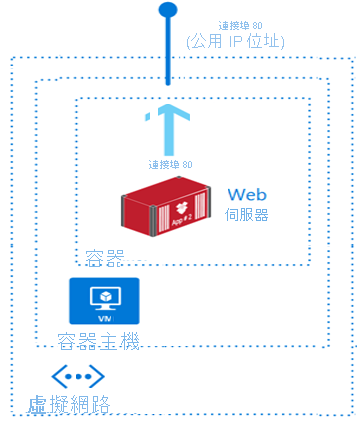
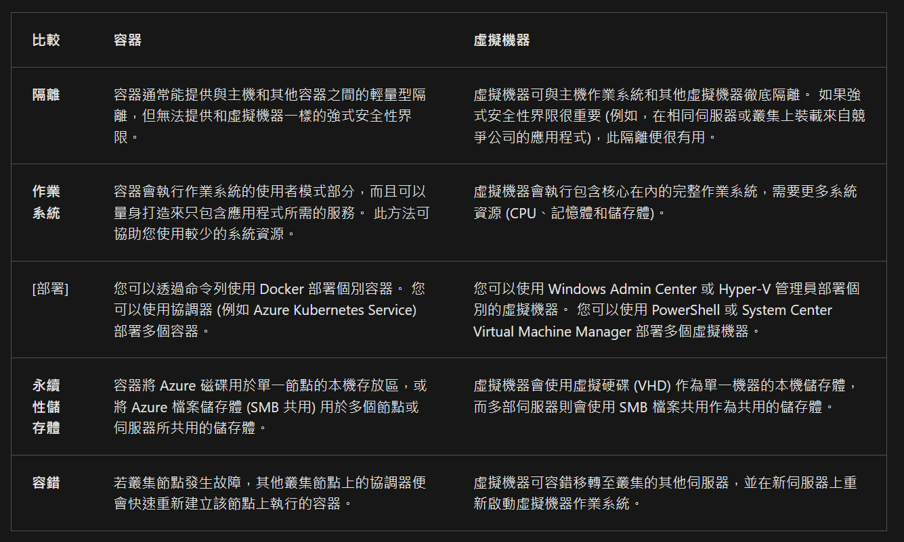
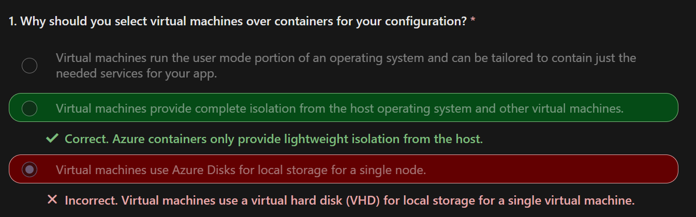
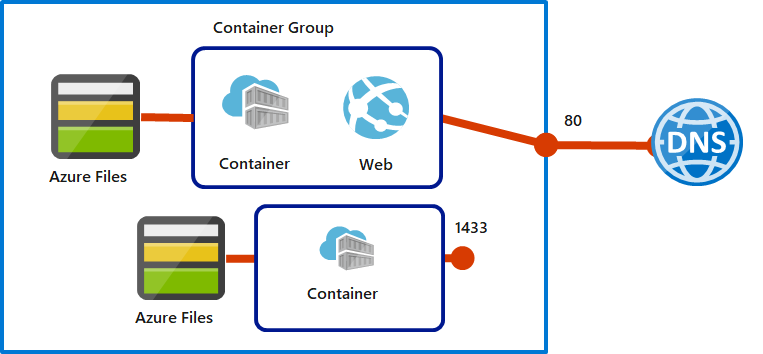

# AZ Container Instances

Learning objectives
- Identify when to use containers versus virtual machines.
- Identify the features and usage cases of Azure Container Instances.
- Implement Azure container groups.

- The `container` is running on a `virtual machine` in a `virtual network` built with `AZ Container Instances`

## VMs VS Containers

Containers and virtual machines are both forms of virtualization. 
But with some properties 
1. Offer `fast startup times`
2. Easy management

## You Should Know 

1. Fast startup times. Containers can start in seconds without the need to provision and manage virtual machines.  
Public IP connectivity and DNS names. Containers can be directly exposed to the internet with an IP address and FQDN (fully qualified domain name).  

2. Custom sizes. Container nodes can be scaled dynamically to match actual resource demands for an application.

**Persistent storage. Containers support direct mounting of Azure Files file shares.**  

Linux and Windows containers. Container Instances can schedule both Windows and Linux containers. Specify the operating system type when you create your container groups.  

Coscheduled groups. Container Instances supports scheduling of multi-container groups that share host machine resources.  

Virtual network deployment. Container Instances can be deployed into an Azure virtual network.

## Considerations 

flexibility and speed
- 獲得開發和共用容器化應用程式程式碼時的彈性和速度。  

testing
- 選擇組態容器，允許簡化應用程式的測試。(e.g. Docker Compose)  

app deployment
- 實作容器，簡化和加速部署您的應用程式。  

workload density 
- 使用容器來支援更高的工作負載密度，並改善資源使用率。  

## Container Group (multi-container group)

The top-level resource in Azure Container Instances is the container group.   
They get scheduled on the same host machine.  
Share a lifecycle, resources, local network, storage volumes.  

> Multi-container groups are useful when you want to divide a single functional task into a few container images.  
> The images can be delivered by different teams and have separate resource requirements.  

An example of a multi-container group with two containers. :arrow_down:

- The container group **is scheduled on a single host machine, and is assigned a DNS name label and exposes a single public IP address with one exposed port**.
- One container in the group listens on port 80. The other container listens on port 1433.
- The group includes two Azure Files file shares as volume mounts. **Each container in the group mounts one of the file shares locally.**

### You Should Know

A container group is similar to a pod in Kubernetes. 
- A pod typically has a 1:1 mapping with a container, but **a pod can contain multiple containers**. 
- **The containers in a multi-container pod can share related resources**.

Azure Container Instances allocates resources to a multi-container group by adding together the resource requests of all containers in the group. 
- Resources can include items such as CPUs, memory, and GPUs.
  - For example Consider a container group that has two containers that each require CPU resources. Each container requests one CPU. Azure Container Instances allocates two CPUs for the container group.

There are two common ways to deploy a multi-container group: 
1. Azure Resource Manager (ARM) templates 
   - An ARM template is recommended for deploying other Azure service resources when you deploy your container instances, such as an Azure Files file share.
2. `YAML` files.
   - Due to the concise nature of the `YAML` format, a YAML file is recommended when your deployment includes only container instances.

Container groups can share an external-facing IP address, one or more ports on the IP address, and a DNS label with an FQDN.
- External client access : You must expose the port on the IP address and from the container to enable external clients to reach a container in your group.
- Port mapping : **Port mapping isn't supported because containers in a group share a port namespace**.
- Deleted groups : When a container group is deleted, its IP address and FQDN are released.

### Considerations  

Consider web app `updates`.   
- Support updates to your web apps by implementing a multi-container group.   
- One container in the group serves the web app and another container pulls the latest content from source control.  

Consider `log data collection`.   
- Use a multi-container group to capture logging and metrics data about your app. Your application container outputs logs and metrics. A logging container collects the output data and writes the data to long-term storage.  

Consider app `monitoring`.  
- Enable monitoring for your app with a multi-container group. A monitoring container periodically makes a request to your application container to ensure your app is running and responding correctly. The monitoring container raises an alert if it identifies possible issues with your app.  
 
Consider `front-end and back-end support`.  
- Create a multi-container group to hold your front-end container and back-end container. The front-end container can serve a web app. The back-end container can run a service to retrieve data.  

## Docker Platform

Docker is a platform that enables developers to host applications within a container.  
- **A `container` in Docker is essentially a `standalone package` that contains everything needed to execute a piece of software.**  

Docker Hub provides a large global repository of container images.  

Docker Hosts are machines that run Docker and allow you to run your apps as containers.  

### You Should Know

The Docker platform is available on both Linux and Windows and can be hosted on Azure.  

A Docker container package includes 
1. the application executable code, 
2. the runtime environment such as `.NET Core`,` system tools`, 
3. and settings.  

A Dockerfile is a `text` file with instructions on how to build a Docker image. 
- The Dockerfile is like a batch script. The base image is listed first. The rest of the file includes the build actions.

**The key feature of Docker is the guarantee that containerized software always runs the same locally on Windows or Linux, or in the cloud on Azure.**  

### Terminology

Develop your code locally within a Docker container, share your code with `Quality Assurance resources` for testing, and deploy your code to production in the Azure cloud.  
After your code is deployed, your app can easily be scaled by using Azure Container Instances.

Container: 
- An instance of a Docker image. A container represents the execution of a single application, process, or service. 
- It consists of the contents of a Docker image, an execution environment, and a standard set of instructions. 
- When scaling a service, you create multiple instances of a container from the same image. 
- A batch job can create multiple containers from the same image, and pass different parameters to each instance.

Container image: A package with all the dependencies and information required to create a container. The dependencies include frameworks and the deployment and execution configuration that a container runtime uses. Usually, an image derives from multiple base images that are layers stacked on top of each other to form the container's file system.
Build: The process of creating a container image based on the information and context provided by the Dockerfile. The build also includes any other necessary files. You build images by using the Docker docker build command.  
Pull: The process of downloading a Docker container image from a container registry.  
Push: The process of uploading a Docker container image to a container registry.  

## In Actions
 

### Scenario 
Your organization needs a new platform for its virtualized workloads. As the Azure Administrator you need to:
- Evaluate Azure Container Instances.
- Identify and test your app container by using Docker images.

### Objectives
Task 1: Deploy an Azure Container Instances using a Docker image and its DNS host name.  
Task 2: Review the functionality of Azure Container Instances.  

## Summary 

[Summary and resources](https://learn.microsoft.com/en-us/training/modules/configure-azure-container-instances/8-summary-resources)

Containers provide lightweight isolation and use fewer system resources compared to virtual machines.

Containers can be deployed individually using Docker or with an orchestrator like Azure Container Apps.

Containers use Azure Disks or Azure Files for storage.

A container group is a collection of containers that get scheduled on the same host machine.

Containers can be rapidly recreated on another cluster node if a node fails.