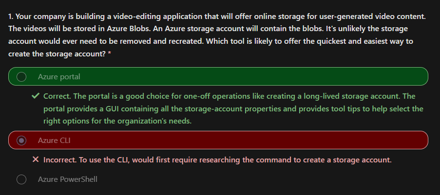
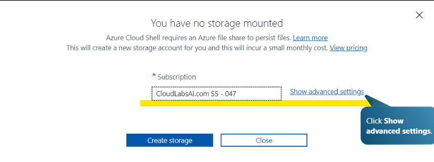
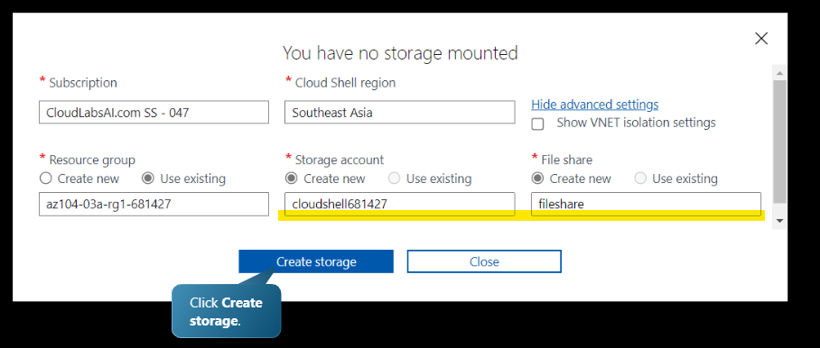
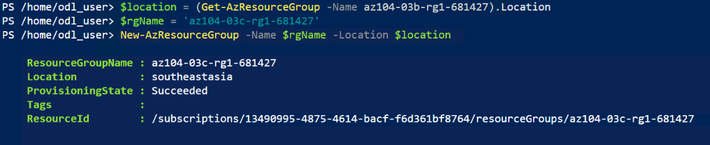
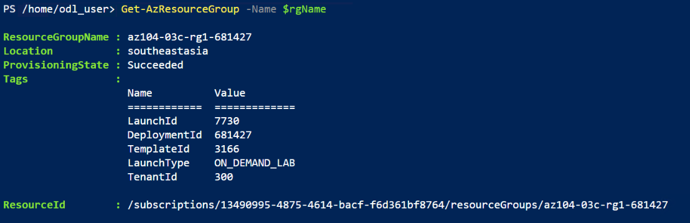
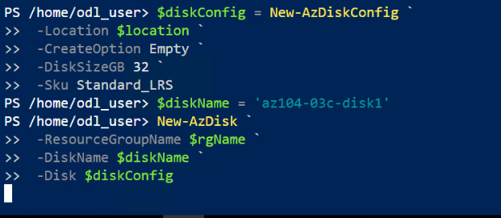
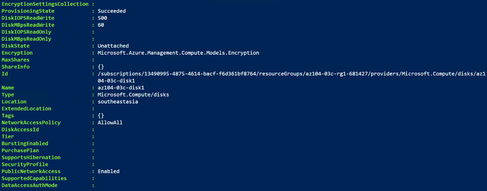
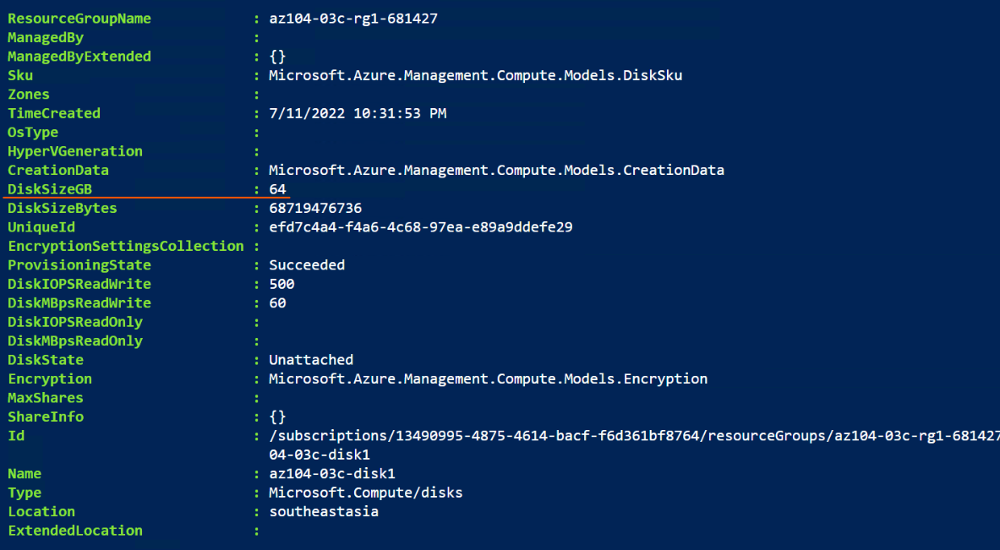
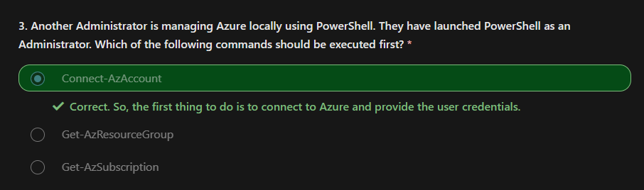


# GUI in Azure Platform

## Azure Portal  

The Azure portal lets you build, manage, and monitor everything from simple web apps to complex cloud applications in a single, unified console.  

Search resources, services, and docs.  
Manage resources.  
Create customized dashboards and favorites.  
Access the Cloud Shell.  
Receive notifications.  
Links to the Azure documentation.  

  
1. The Global search area. 
Use this search bar to find a specific resource, a service, etc.  
2. The Global control area. 
The options are Cloud Shell, Directory + Subscription, Notifications, Portal Settings, Help and Support, and Feedback.  
3. Details of your account and the other options are View information about your account, sign out, or sign in with a different account.  
4. The left side highlighted portion is the Resource menu, and one-click access to all the services and options.  



## Azure Cloud Shell 

Azure Cloud Shell is an interactive, browser-accessible shell for managing Azure resources  

  

Is temporary and requires a new or existing Azure Files share to be mounted.   
Offers an integrated graphical text editor based on the open-source Monaco Editor.  
Authenticates automatically for instant access to your resources.  
Runs on a temporary host provided on a per-session, per-user basis.  
**Times out after 20 minutes without interactive activity.**  
Requires a resource group, storage account, and Azure File share.     
Uses the same Azure file share for both Bash and PowerShell.  
Is assigned to one machine per user account.  
**Persists `$HOME` using a `5-GB` image held in your file share.**  
Permissions are set as a regular Linux user in Bash.  

## Powershell

`Az` is the formal name for the Azure PowerShell module containing cmdlets to work with Azure features.  
It contains hundreds of cmdlets that let you control nearly every aspect of every Azure resource. 
You can work with the following features, and more:  
```bash 
Resource groups
Storage
VMs
Microsoft Entra ID
Containers
Machine learning
```

Create resources groups.  
Create managed disks.   
Change the configuration of managed disks.  

### In Action

[Interactive lab simulation (Azure PowerShell)](https://learn.microsoft.com/en-us/training/modules/configure-azure-resources-tools/5-simulation-powershell)

### 1. Start a PowerShell session in the Azure Cloud Shell  
  
  

### 2. Create a resource group and managed disk by using PowerShell   

Create a resource group.  

Create a managed disk in the resource group.  



### 3. Configure the managed disk by using Azure PowerShell.  
Increase the size of the managed disk.   
```powershell 
New-AzDiskUpdateConfig `
    -DiskSize 64 | `
Update-AzDisk 
    -ResourceGroupName $rgName `
    -DiskName $diskName
```  


Change the disk performance SKU.  
```powershell
(Get-AzDisk -ResourceGroupName $rgName -Name $diskName).Sku
Name         Tier
----         ---
Standard_LRS Standard

New-AzDiskUpdateConfig `
    -Sku Premium_LRS | `
Update-AzDisk 
    -ResourceGroupName $rgName `
    -DiskName $diskName

(Get-AzDisk -ResourceGroupName $rgName -Name $diskName).Sku
Name         Tier
----         ---
Premium_LRS  Premium
```



## Azure CLI

Azure CLI is a command-line program to connect to Azure and execute administrative commands on Azure resources.

You can work with resource groups, storage, VMs, Microsoft Entra ID, containers, machine learning, and so on.

Azure CLI provides cross-platform command-line tools for managing Azure resources. You can install the CLI locally on computers running the Linux, macOS, or Windows operating systems. You can also use Azure CLI from a browser through Azure Cloud Shell.

In both cases, Azure CLI can be used interactively or through scripts:


**Commands in the CLI are structured in groups and subgroups.**  
Each group represents a service provided by Azure, and the subgroups divide commands for these services into logical groupings. 

For example, the storage group contains subgroups including `account`, `blob`, `share`, and `queue`.
```powershell 
az find <command>

az <command> --help
az storage blob --help
```

### In Action 

https://learn.microsoft.com/en-us/training/modules/configure-azure-resources-tools/7-simulation-command-line

#### Start a Bash session in the Azure Cloud Shell.
#### Create a resource group and a managed disk by using the Azure CLI.
Create a resource group.
Create a managed disk in the resource group.
#### Configure the managed disk by using the Azure CLI.
Increase the size of the managed disk.
Change the disk performance SKU.

## Summary 

Azure Administrators have many tools when it comes to managing resources. These tools include the Azure portal, Azure Cloud Shell, Azure PowerShell, and Azure CLI.

You should now be able to:
- Manage resources with the Azure portal.
- Manage resources with Azure Cloud Shell.
- Manage resources with Azure PowerShell.
- Manage resources with Azure CLI.

---
[An introduction to Microsoft Azure Portal](https://azurelessons.com/azure-portal/)