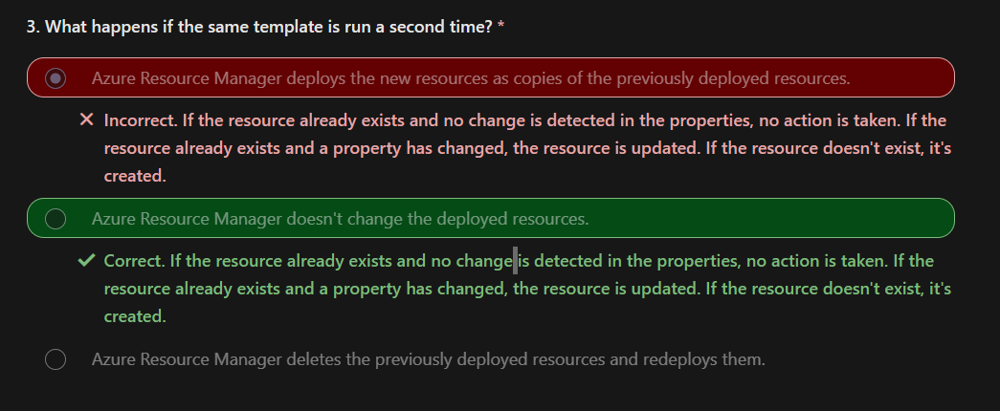

# AZ Resource Manaager Template

**An Azure Resource Manager/ ARM template precisely defines all the Resource Manager resources in a deployment.**  

Using Resource Manager templates will make your deployments faster and more repeatable.  
For example, you no longer have to create a VM in the portal, wait for it to finish, and then create the next VM.  
Resource Manager template takes care of the entire deployment for you.  

> Apply ARM templates for deployment and that template can work for different environments such as testing, staging, and production.  

## Scenario
1. Your company needs to ensure virtual machine deployments are consistent across the organization.
2. You use Azure Resource Manager templates to deploy resources including virtual machines.

## Skill Meaured
Automate deployment of virtual machines (VMs) by using Azure Resource Manager templates
- Modify an Azure Resource Manager template.
- Deploy from a template.
- Save a deployment as an Azure Resource Manager template.

## Benefit 

1. Templates improve consistency :   
Resource Manager templates provide a common language for you and others to describe your deployments.
2. Templates help express complex deployments :   
Templates enable you to deploy multiple resources in the correct order
3. Templates reduce manual, error-prone tasks.
4. Templates are code : Version Control like `git`
5. Templates promote reuse : Template parameters enable you to create multiple versions of your infrastructure, such as staging and production, while still using the exact same template.
6. Templates are linkable : You can link Resource Manager templates together to make the templates themselves modular
7. Templates simplify orchestration :  
You only need to deploy the template to deploy all of your resources. Normally this would take multiple operations.



## Structure of Template

Azure Resource Manager templates are written in JSON. 

Value can be 
- A string
- A number
- A Boolean expression
- A list of values
- An object (which is a collection of other key-value pairs)

```json 
{
    "$schema": "http://schema.management.azure.com/schemas/2019-04-01/deploymentTemplate.json#",
    "contentVersion": "1.0.0.0",
    "parameters": {
        "(Optional) Values that are provided when deployment is executed to customize resource deployment."
    },
    "variables": {},
    "functions": [
        "(Optional) User-defined functions that are available within the template."
    ],
    "resources": [
    ],
    "outputs": {
        "(Optional) Values that are returned after deployment."
    }
}
```
- key `resources`, `$schema` and `contentVersion` are required
- `$schema` : Location of the JSON schema file
- `contentVersion` : This value can be used to make sure that the right template is being used.
- `resources` : Resource types that are deployed or updated in a resource group.

### key `parameters`

> You're limited to 256 parameters in a template. You can reduce the number of parameters by using objects that contain multiple properties.

Properties of parameters
```json
"parameters": {
    "<parameter-name>" : {
        "type" : "<type-of-parameter-value>",
        "defaultValue": "<default-value-of-parameter>",
        "allowedValues": [ "<array-of-allowed-values>" ],
        "minValue": <minimum-value-for-int>,
        "maxValue": <maximum-value-for-int>,
        "minLength": <minimum-length-for-string-or-array>,
        "maxLength": <maximum-length-for-string-or-array-parameters>,
        "metadata": {
        "description": "<description-of-the parameter>"
        }
    }
}
```

For example :
```json
"parameters": {
  "adminUsername": {
    "type": "string",
    "metadata": {
      "description": "Username for the Virtual Machine."
    }
  },
  "adminPassword": {
    "type": "securestring",
    "metadata": {
      "description": "Password for the Virtual Machine."
    }
  }
}
```


## AZ Quickstart Template

[Azure Quickstart](https://azure.microsoft.com/resources/templates/) Templates are Azure Resource Manager templates provided by the Azure community.

= The `README.md` file provides an overview of what the template does.
= The `azuredeploy.json` file defines the resources that will be deployed.
= The `azuredeploy.parameters.json` file provides the values the template needs.


## Template In Action

