    
:arrow_left: [AZ-104 Category]()  
# AZ Resource Manager, ARM

[TOC]

Why we need it?  
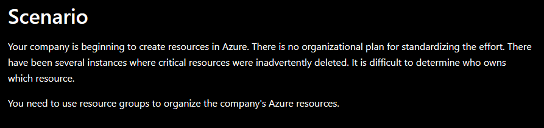  

Azure Resource Manager is **a deployment and management service** for Azure that allows users who have az account to manage resources as a group for the solution in a single, coordinated operation (e.g Azure Portal, Powershell, Cli) with security, auditing, and tagging features

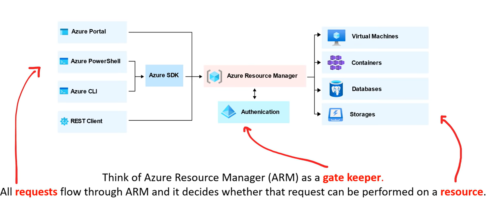  
- The image shows how all the tools interact with the same Azure Resource Manager API.  
The API passes requests to the Azure Resource Manager service, which authenticates and authorizes the requests.  
Azure Resource Manager then routes the requests to the appropriate resource providers.

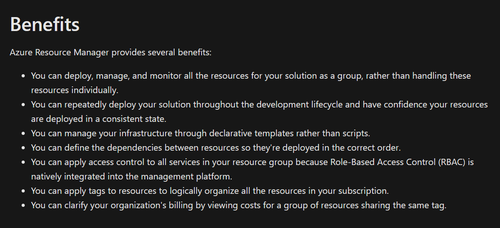

## Suggestion ARM with the solutions 
1. Define and deploy your infrastructure through the `declarative` syntax in [ARM template](/az-104/AZ%20Resource%20Manager%20Template.md) 
, rather than through imperative commands.
2. Define all deployment and configuration steps in the template.  
**You should have no manual steps for setting up your solution.**
3. Run `imperative` commands to manage your resources, such as to start or stop an app or machine.
4. Arrange resources with the same lifecycle in a resource group.  
Use `tags` for all other organizing of resources.

## AZ Subscription
  
> A subscription is a logical **container** used to provision and manage Azure resources.  

It holds the details of all your resources like virtual machines (VMs), databases, and more.  

When you create an Azure subscription, you are essentially creating an agreement with Microsoft to use Azure services and resources.  

For example, create an Azure resource like a VM, you must identify the subscription it belongs to.  
As you use the VM, the usage of the VM is **aggregated** and **billed** monthly.  

## Az Account

An Azure Account have multiple subscriptions. 
Allow you to 
- Resource Tags
- Access Controls
- Resource Group

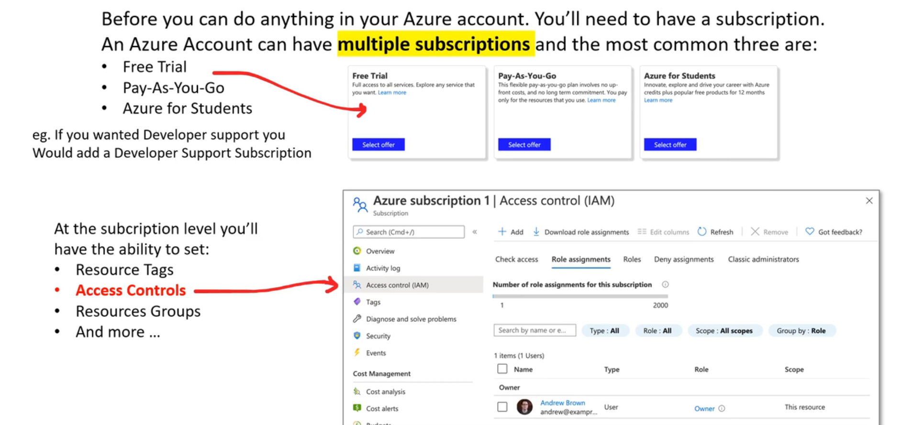

## Resource Group 


A Resource Group in Azure is a logical container for creating your Azure resources. That holds all your Azure Resources.  

**A resource is the instances of service that you create or an asset like Azure Virtual Machines, Azure storage, etc, that are created in Azure for multiple purposes.**

The resource group can include all the resources for the solution (make administering easy), or only those resources that you want to manage as a group.

### Structure of Groups

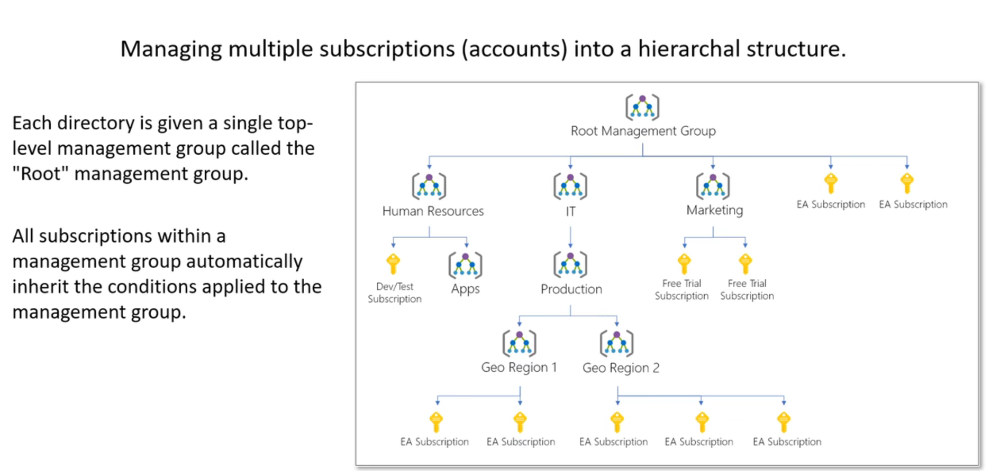
- Can not be nested 

### Resource Group, Resoruces and Resource Provider

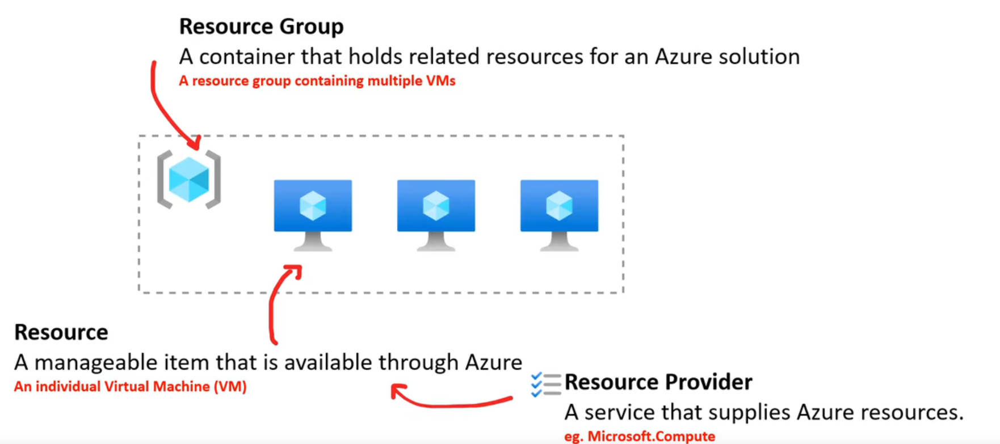

### Reousrce Group 

Resources can be deployed to any new or existing resource group.  
Deployment of resources to a resource group becomes a job where you can track the template execution. 

If deployment fails, the output of the job can describe why the deployment failed.  

**Whether the deployment is a single resource to a group or a template to a group, you can use the information to fix any errors and redeploy.**  
Deployments are incremental; if a resource group contains two web apps and you decide to deploy a third, the existing web apps will not be removed.  

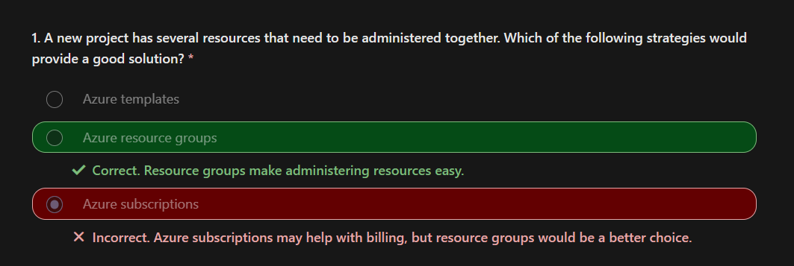

#### Rules for Resource Group

1. **Resources can only exist in one resource group.**  
2. Resource Groups cannot be renamed.  
3. Resource Groups can have resources of many different types (services).  
4. Resource Groups can have resources from many different regions.  

### Resource Group Creation In Action

Create Resource Group
`Resource Group | Add`   
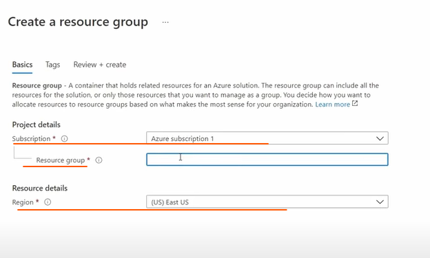  

There are some important factors to consider when defining your resource group:  

1. All the resources in your group should share the same lifecycle. You deploy, update, and delete them together.  
If one resource, such as a database server, needs to exist on a different deployment cycle it should be in another resource group.

2. Each resource can only exist in one resource group.  
You can add or remove a resource to a resource group at any time.
You can move a resource from one resource group to another group. Limitations do apply to moving resources.
3. A resource group can contain resources that reside in different regions.  
4. A resource group can be used to scope access control for administrative actions.  
5. A resource can interact with resources in other resource groups. This interaction is common when the two resources are related but don't share the same lifecycle (for example, web apps connecting to a database).
6. When creating a resource group, you need to provide a location for that resource group. You may be wondering, "Why does a resource group need a location? And, if the resources can have different locations than the resource group, why does the resource group location matter at all?" The resource group stores metadata about the resources. Therefore, when you specify a location for the resource group, you're specifying where that metadata is stored. For compliance reasons, you may need to ensure that your data is stored in a particular region.

### Reorganize Azure Resources

Sometimes you may need to move resources to either a new subscription or a new resource group in the same subscription.  

**When moving resources, both the source group and the target group are locked during the operation.**   
`Write` and `delete` operations are blocked on the resource groups until the move completes.  

This lock means you can't add, update, or deletec resources in the resource groups. Locks don't mean the resources aren't available. (you still can access like `read` resource)  

`Resource Group#<group_name> | Overview`  
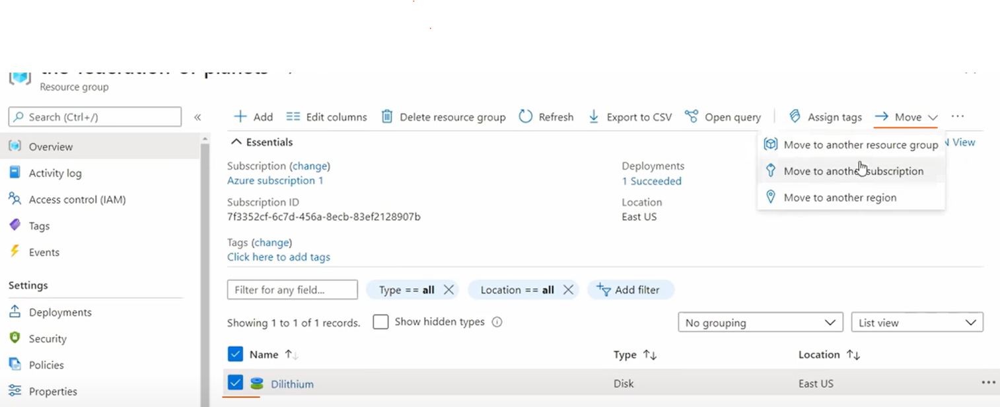  

### Delete Resource Group

Powershell
```powershell
Remove-AzResourceGroup --Name "<Resource_Group_Name>"
```

### Determine Resource Limits

`Subscription | Settings | Usage + quotas`
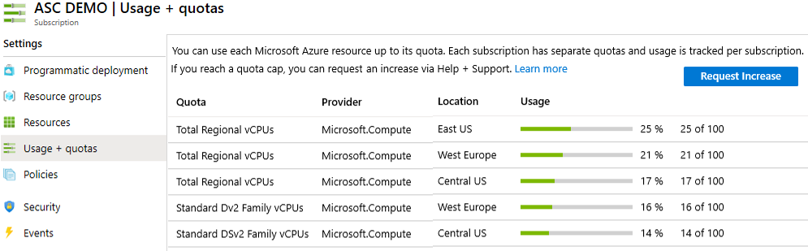
- When you need to increase a default limit, there is a Request Increase link.
- All resources have a maximum limit listed in Azure limits.
- If you are at the maximum limit, the limit can't be increased.


### Resource Provider

To use Azure Resource, a Reosurce Provider needs to be registered (Many Resource Provider are registered by default)

`Subscription | Settings | Resource Provicders`
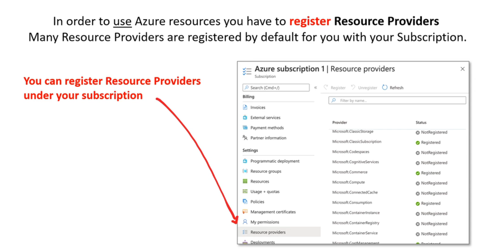  

### Resource Tags

- In form of a key-value pair 
- can be assigned to azure resource to organize the access contorl 

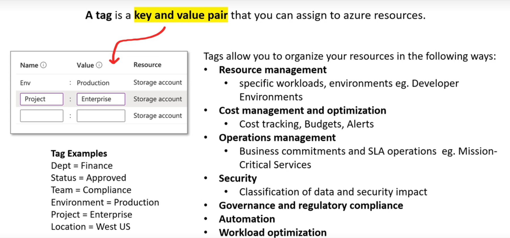

### Lock

An over-zealous or careless administrator can accidentally erase months of work with a few steps. Resource Manager locks allow organizations to put a structure in place that prevents the accidental deletion of resources in Azure.  

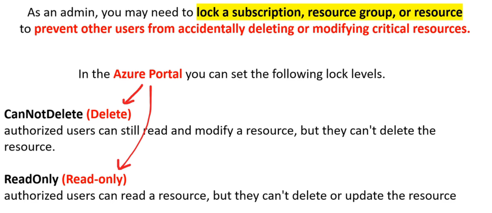

**You can associate the lock with a subscription, resource group, or resource.
Locks are inherited by child resources.**  

#### Lock In Action

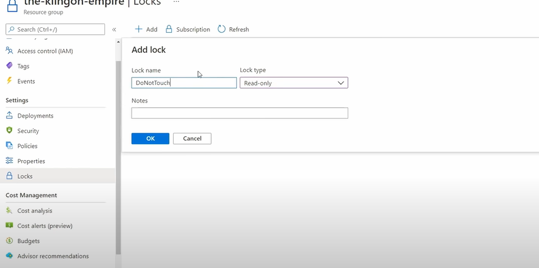
Not allowed to modify any resource in group named `the-klingon-empire`  

### Buleprints

Enable quick creations of subscriptions

`Resource Groups | Name#<group_name> | Settings | Locks`
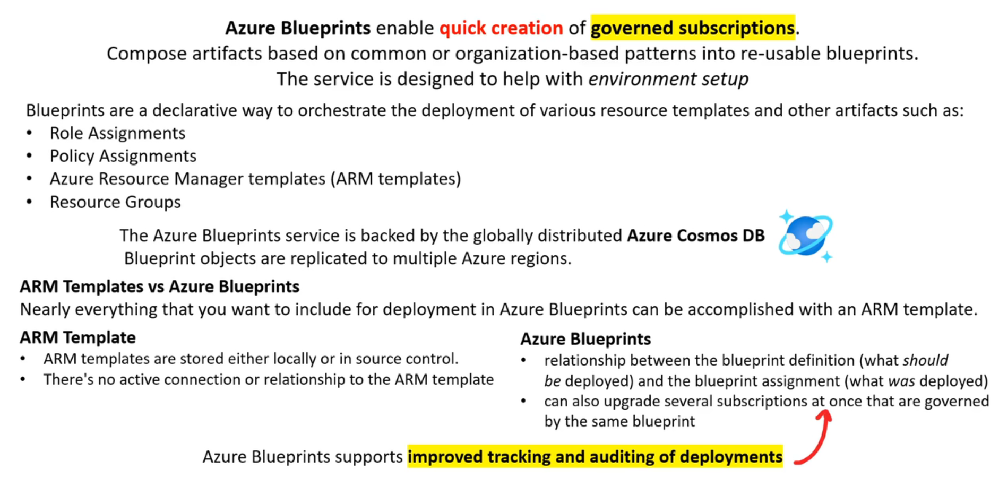

## Relationship of ARM & AZ Subscription 

Azure Resource Manager (ARM) is a `SERVICE` that `orchestrates` the deployment of resources in Azure.    
It is responsible for managing the lifecycle of Azure resources, such as virtual machines, virtual networks, and storage accounts.  

An Azure subscription is a logical `CONTAINER` that `groups` together multiple resource groups and their respective resources.  
It provides `authenticated` and `authorized` access to Azure products and services, and allows you to provision resources. 

**ARM is associated with Azure subscriptions and controls the deployment of resources within a subscription.  
It uses the RESTful API to manage resources and connects to the resource provider for each resource type to complete the request.**   

> In summary, an Azure subscription is a logical container that `groups` together multiple resource groups and their respective resources, while ARM is responsible for managing the `lifecycle` of Azure resources and controls the deployment of resources within a subscription.

## AZ resource terminology 

- resource - A manageable item that is available through Azure. Some common resources are a virtual machine, storage account, web app, database, and virtual network, but there are many more.  
- resource group - A container that holds related resources for an Azure solution. The resource group can include all the resources for the solution, or only those resources that you want to manage as a group. You decide how you want to allocate resources to resourced groups based on what makes the most sense for your organization.   
- resource provider - A service that supplies the resources you can deploy and manage through Resource Manager. Each resource provider offers operations for working with the resources that are deploye. Some common resource providers are Microsoft.Compute, which supplies the virtual machine resource, Microsoft.Storage, which supplies the storage account resource, and Microsoft.Web,   which supplies resources related to web apps.  
- template - A JavaScript Object Notation (JSON) file that defines one or more resources to deploy to a resource group. It also defines the dependencies between the deployed resources. The template can be used to deploy the resources consistently and repeatedly.  
- declarative syntax - Syntax that lets you state "Here is what I intend to create" without having to write the sequence of programming commands to create it. The Resource Manager template is an example of declarative syntax. In the file, you define the properties for the infrastructure to deploy to Azure.  

## Cheatsheet 

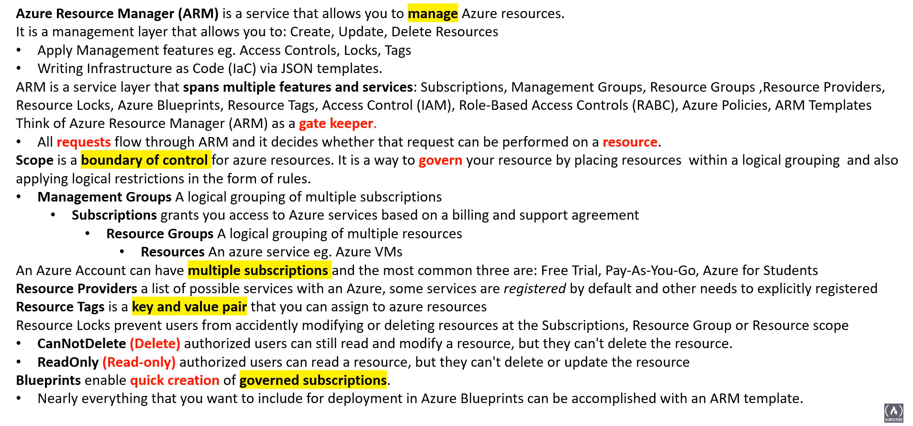