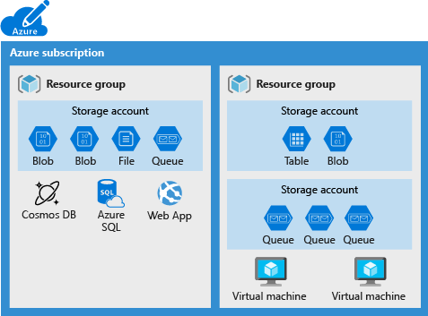

# Storage Account & Azure Storage 
Azure 提供雲端檔案系統服務、可靠傳遞訊息的訊息存放區以及 NoSQL 存放區

Azure Storage Services 提供
- 儲存檔案、訊息、資料表及其他類型的資訊
- 檔案共用
- 處理工作資料包含網站、行動應用程式 & 傳統型應用程式
- IaaS (用戶需要自己控制底層實現基礎設施邏輯) VM & PaaS (Azure Cloud)
- Azure Storage Provides Four Services
  

Azure Account
- is a container that groups a set of Azure Storage services together.
    
-  is an Azure resource and is part of a resource group.
    
- Combining data services into a single storage account enables you to manage them as a group.

Azure Account Setting
1. Subscription
2. Location
3. Performance `Standard | Premium `
4. Replication : `LRS | GRS`
5. Access tier `Cool | Hot | Archive `
6. Secure transfer required : `HTTPS | HTTP`
7. Virtual network : A security feature that allows inbound access requests only from the virtual network(s) you specify

> Azure data services, such as Azure SQL and Azure Cosmos DB, are managed as independent Azure resources and can't be included in a storage account. 
> 

## Stored Data Types 

保護虛擬機器資料(磁碟、檔案)    
- 使用資料磁碟儲存`資料庫檔案`、`網站靜態內容`或`自訂應用程式程式碼`等資料
- 資料磁碟數目取決於虛擬機器大小，每個資料磁碟都具有 `32,767 GB` 的最大容量。

非結構化資料(非關聯式格式)  
- `Azure Blob 儲存體` 和 `Azure Data Lake Storage` 來儲存
  - `Blob 儲存體` 具有高度可調整性且以 `REST` 為基礎的雲端物件存放區
  - `Azure Data Lake Storage` 以 `Hadoop 分散式檔案系統 (HDFS)` 為服務

結構化資料(關聯式格式)  
- 使用 `Azure 表格儲存體`、Azure Cosmos DB 和 Azure SQL Database 儲存
  - Azure Cosmos DB 是全域散發的資料庫服務。
  - Azure SQL 資料庫是完全受控的資料庫即服務

## How many storage accounts do you need?

A typical strategy is to start with an analysis of your data. Create partitions that share characteristics like `location`, `billing`, and `replication strategy`. Then, create one storage account for each partition.

### Consider

Data diversity  
- Organizations often generate data that differs in **where it's consumed**,  **which group pays the bills**, etc.  
- So Ask yourself    
  > Do you have data that is specific to a country/region?  
  > Do you have some data that is proprietary and some for public consumption?  

Cost Sensitivity  
A storage account by itself has no financial cost; 
however, the settings you choose for the account do influence the cost of services in the account.  
- Geo-redundant storage costs more than locally redundant storage.  
- Premium performance and the Hot access tier increase the cost of blobs.  

e.g. You can use multiple storage accounts to reduce costs.  
**(ORGANIZE YOUR DATA)** you could partition your data into critical and noncritical categories.    
**(PUT DATA IN DIFFERENT TIERS)** You could place your critical data into a storage account with geo-redundant storage and put your noncritical data in a different storage account with locally redundant storage.   

tolerance for management overhead determine the number of storage accounts you need.  
- Each storage account requires **some time** and **attention from an administrator to create and maintain.** 
- It also increases complexity for anyone who adds data to your cloud storage. 
- users who has administrator role needs to understand the purpose of each storage account so they add new data to the correct account.

### Settings

Name
- Between `3` and `24` characters

Deployment model
- The model defines the API that you use to `create`, `configure`, and `manage` those resources. Azure provides two deployment models:
  - `Resource Manager` (recommended) : the current model that uses the Azure Resource Manager API (work for a resource group which lets you deploy and manage a collection of resources as a single unit.)
  - `Classic` : a legacy offering that uses the classic deployment model
Account kind
- A set of policies that determine which data services you cna include in the account and the pricing of those services
  - Standard - `StorageV2` (general purpose v2):  
  the current offering that supports all storage types and all of the latest features
  - Premium - `Page blobs`:  
  Premium storage account type for page blobs only
  - Premium - `Block blobs`:  
  Premium storage account type for block blobs and append blobs
  - Premium - `File shares`:  
  Premium storage account type for file shares only

The core advice is to choose the Resource Manager deployment model and the Standard - StorageV2 (general purpose v2) account kind for all your storage accounts.

### How to choose a tool for creations

**Storage accounts are typically based on an analysis of your data**, so they tend to be relatively stable. 

As a result, storage-account creation is usually a one-time operation done at the start of a project. 

For one-time activities, the portal is the most common choice.

**In the rare cases where you need automation, the decision is between a programmatic API or a scripting solution**. 

**Scripts are typically faster to create** and less work to maintain because there's no need for an IDE, NuGet packages, or build steps. 

If you have an existing client application, the management libraries might be an attractive choice; otherwise, scripts are a better option.


## Azure Storage 儲存體帳戶層

標準 HDD  
- 儲存體帳戶由磁碟機支援。  
- 提供每 GB 的最低成本。   
- 通常使用標準層儲存體適用於需要`大量儲存體或其中資料不常存取的應用程式`。  

進階 SSD  
- 戶由固態硬碟所支援，提供一致而低延遲的效能。  
- 使用進階層儲存體適用於`搭配 I/O 密集型應用程式的 Azure 虛擬機器 (例如資料庫)`。  

## Considerations

利用 REPLICATION 加強資料的`耐久性`和`可用性`
- 耐久性 : 您可以在資料中心或地理區域間複寫資料，以便在發生地方性災難或天然災害時獲得保護
- 高可用 : 複寫的資料可在發生未預期的中斷事件時保持高可用性

加密後的安全存取
- Azure 儲存體會加密所有資料

可擴縮性
- 為當前應用程式的資料儲存和效能需求做調整

管理性
- Microsoft Azure 會為您處理硬體維護、更新和重大問題

多樣的資料存取方式
- 從世界各地透過 `HTTP` 或 `HTTPS` 存取 Azure 儲存體中的資料
- SDK (Software Development kit):` .NET、JAVA、Node.js、Python、PHP、Ruby、Go and REST API`
- Azure Storage 也支援 在`Azure PowerShell` 或 `Azure CLI` 中使用指令碼

## Azure Storage Services

Azure Blob Storage (`Containers`): 
- A massively scalable object store for `text` and `binary data.`

Azure Files (`SHARE FILE`): 
- Managed file shares for cloud or on-premises deployments.

Azure Queue Storage (`APPLICATION MESSAGES`) :
- A messaging store for reliable MESSAGING between application components.

Azure Table Storage (`NoSQL Data`) : 
- A service that stores `nonrelational structured data (also known as structured NoSQL data)`.

### Blob Storage

Blob Storage 已針對儲存大量**非結構化資料**或**非關聯式資料 (e.g. 或二進位資料)** 進行最佳化。  

用於   
- 直接提供映像或文件給瀏覽器。  
- **儲存檔案供分散式存取**。  
- **串流影片和音訊**。  
- **儲存資料以供備份和還原、災害復原和封存**。  
- **儲存資料供內部部署或 Azure 裝載服務進行分析**。  

存取方式
- `HTTP/HTTPS`
- `Rest API`
- `SDKs`
- `AZ CLI/PowerShell`
- `NFS 通訊協定`

### AZ Files

適合用於
Many on-premises applications use file shares。    
**AZ Files 可讓您更輕鬆地將共用資料的應用程式移轉至 Azure。**  
如果您將檔案共用掛接到內部部署應用程式所使用的相同磁碟機代號，則應用程式中存取檔案共用的部分，只需最少變更 (如果有的話) 應該就能運作。
設定檔可以儲存在檔案共用上，並從多個 VM 存取。 群組中多個開發人員使用的工具和公用程式，可以儲存在檔案共用上，確保每個人都能找到，且使用相同版本。
診斷記錄、計量和損毀傾印是三個資料範例，可寫入檔案共用及稍後處理或分析。

存取共用
- 伺服器訊息區 (SMB) 通訊協定及網路檔案系統 (NFS) 通訊協定存取
- REST 介面或儲存體用戶端程式庫
- 多部虛擬機器可以共用具有讀取和寫入存取權的相同檔案

### Azure Queue Storage

Queue messages can be up to 64 KB in size, and a queue can contain millions of messages. Queues are used to store lists of messages to be **processed asynchronously**.

適合用於
- where you want your customers to be able to upload pictures, and you want to create thumbnails for each picture. 
**You could have your customer wait for you to create the thumbnails while uploading the pictures.** 
An alternative is to use a queue. When the customer finishes the upload, you can write a message to the queue. 
Then you can use an Azure Function to retrieve the message from the queue and create the thumbnails. 
Each of the processing parts can be scaled separately, which gives you more control when tuning the configuration.

### Azure Table Storage

A service that stores non-relational structured data (also known as structured NoSQL data) in the cloud, providing a key/attribute store with a schemaless design. 

Because Table storage is schemaless, it's easy to adapt your data as the needs of your application evolve. 

相較於類似資料量的傳統 SQL，對許多類型的應用程式而言，表格儲存體資料可快速存取且符合成本效益，通常成本也較低。 除了現有 Azure 表格儲存體服務之外，還有新的 Azure Cosmos DB 表格 API 供應項目，提供最佳化輸送量的資料表、全域散發和自動次要索引。  

### Considerations

考慮`針對大量資料的儲存體最佳化`(blob storage)。 
Blob 儲存體中的物件可以透過 HTTP 或 HTTPS，從全世界各地存取。 
Blob 儲存體適用於將資料直接提供給瀏覽器、串流資料，以及儲存資料以進行備份和還原。

考慮`具有高可用性的儲存體 (file share)`。 
內部部署應用程式會使用檔案共用以便輕鬆移轉。 
儲存體帳戶認證提供檔案共用驗證，以確保掛接檔案共用的所有使用者都有正確的讀取/寫入存取權。

考慮`訊息儲存體`(message queue)。 
使用 Azure 佇列儲存體儲存大量的訊息。 
Azure 佇列儲存體通常用來建立工作待辦項目，以非同步處理。

考慮`結構化資料儲存體`(Table Storage)。  
Azure 表格儲存體很適合用來儲存結構化的非關聯式資料。   
它會提供輸送量最佳化的表格、全域散發，以及自動次要索引。   
由於 Azure 表格儲存體是 Azure Cosmos DB 的一部分，因此您可以存取完全受控的 NoSQL 資料庫服務，以進行新式應用程式開發。

## Storage Account Type 

All storage account types are encrypted by using Storage Service Encryption (SSE) for data at rest.

Standard general-purpose v2
- All Azure Storage services
- Standard storage account for most scenarios, including blobs, file shares, queues, tables, and disks (page blobs).

Premium block blobs
- Blob Storage (including Data Lake Storage)
- for block blobs and append blobs. e.g. for applications with high transaction rates
- work with smaller objects or require consistently low storage latency. 

Premium file shares
- Recommended for enterprise or high-performance scale applications.

Premium page blobs
- Page blobs only
- ideal for storing `index-based` and `sparse data structures`
  - e.g. Operating systems, data disks for virtual machines, and databases.

## Replication strategies

Azure Storage replication copies your data to protect from planned and unplanned events

Replication ensures your storage account meets the Service-Level Agreement (SLA) for Azure Storage even if there are failures.

Locally redundant storage (LRS)
- 優點 (Data might loss, low Cost)
若應用程式儲存的資料發生資料遺失，可以輕鬆重建。
資料會像即時摘要一樣不斷變更，因此不一定需要儲存資料。
應用程式由於資料控管需求而只能在國家/地區中複寫資料。
- 缺點
發生資料中心層級的災害無法修復

Zone redundant storage (ZRS)
- 區域備援儲存體會以同步方式，**將資料複寫到單一區域中的三個儲存體叢集**

Geo-redundant storage (GRS)
- 即使發生區域性中斷，GRS 仍提供很高的持久性。 GRS 的設計目的是要提供至少 `99.99999999999999%` (16 個 9) 的耐久性。  
當儲存體帳戶啟用 GRS 後，如果發生主要區域因全區中斷或嚴重損壞而無法復原的情況，資料仍會永久可用。  

Geo-zone-redundant storage (GZRS)
GZRS 儲存體帳戶中的資料會複寫到主要區域中的三個 Azure 可用區域，此外也會複寫到次要地理區域以保護其不受區域災害影響

## How to access storage

在 Azure 儲存體中的每個物件都有一個唯一的 URL 位址。 

儲存體帳戶名稱會形成 URL 位址的子網域部分。  
子網域和網域名稱的組合特定用於每個服務，並且會形成儲存體帳戶的端點。  
`//<your_storage_account_name>.<az_storage_service>.windows.net`  

例如 : 
If your storage account name is `mystorageaccount` 
the default endpoints for the Azure services : 

- Container service `//mystorageaccount.blob.core.windows.net`	 
- Table service	    `//mystorageaccount.table.core.windows.net`	 
- Queue service	    `//mystorageaccount.queue.core.windows.net`	 
- File service      `//mystorageaccount.file.core.windows.net`	 

To access the `myblob` data in the `mycontainer` location in your storage account,   use the following URL address:  
`//mystorageaccount.blob.core.windows.net/mycontainer/myblob.`

### access with Custom domain

> Azure Storage doesn't currently provide native support for HTTPS with custom domains.   
> You can implement an Azure Content Delivery Network (CDN) to access blobs by using custom domains over HTTPS.  

There are two ways to configure a custom domain: 
1. direct mapping 
  ```bash  
  Subdomain: blobs.contoso.com
  Azure storage account: \<storage account>\.blob.core.windows.net
  Direct CNAME record: contosoblobs.blob.core.windows.n
  ```
2. intermediary domain mapping.
   - This approach might result in minor downtime while the domain is being mapped.    
   - By prepending the `asverify` keyword to your own subdomain, you permit Azure to recognize your custom domain without modifying the DNS record for the domain to avoid downtime.
  ```bash  
  CNAME record: asverify.blobs.contoso.com
  Intermediate CNAME record: asverify.contosoblobs.blob.core.windows.net
  ```

## restrict access / secure service point

In the Azure portal, each Azure service requires certain steps to configure the service endpoints and restrict network access.  


- `ACCESS` : The Firewalls and virtual networks settings restrict/allow access to your storage account from specific subnets on virtual networks or public IPs.  
- `SCOPE`  : Subnets and virtual networks must exist **in the same Azure region or region pair as your storage account.**  


## CHECK  

https://learn.microsoft.com/en-us/training/modules/configure-storage-accounts/8-knowledge-check

