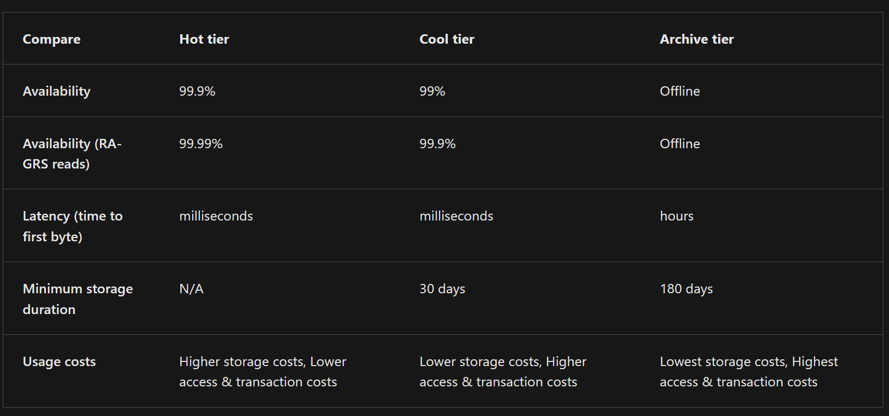
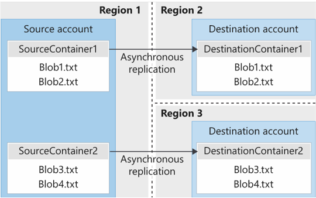
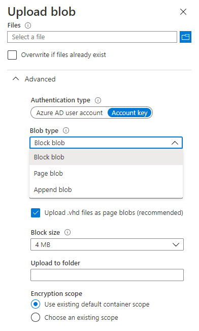
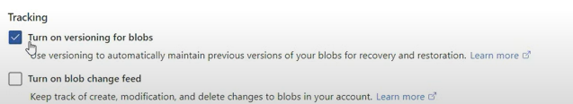
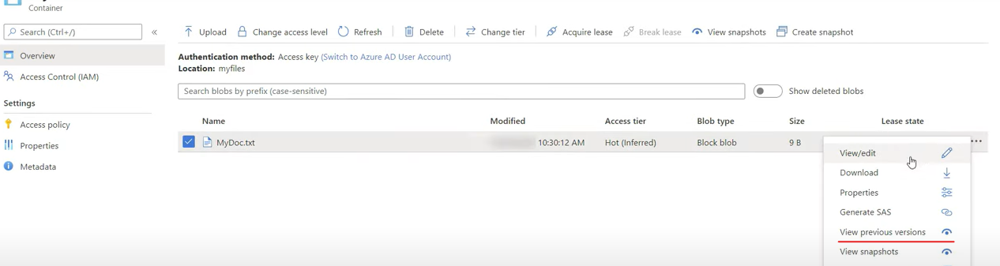

# Blob Storage Configuration 

## Blob 特性

- 所有 Blob 都必須位於 Container 中。
- 容器可以儲存不限數目的 Blob。
- Azure Storage Account 可以包含無限多個容器。

## Creations

名稱：容器名稱。**該名稱在 Azure 儲存體帳戶中必須是唯一的**。
- 名稱只能包含小寫字母、數字和連字號。
- 名稱必須以字母或數字開頭。
- 名稱的長度下限是 3 個字元。
- 名稱的長度上限是 63 個字元。

公用存取層級：
存取層級會指定是否可以公開存取容器及其 blob。 
根據預設，容器資料只能由帳戶擁有者以私人方式存取並檢視。 

存取層級選項共有三個：  
Private：(DEFAULT) 禁止匿名存取容器和 blob。   
Blob：僅針對 blob 允許匿名公開讀取存取。  
Container：針對整個容器 (包括 blob) 允許**匿名公開讀取**和**清單存取**。   

> `New-AzStorageContainer ` in Powershell

## Blob access tiers

Each access tier is optimized to support a particular pattern of data usage.

- Storing data in the Cool tier is more cost-effective

> The Cold tier is also optimized for storing large amounts of data that's infrequently accessed. This tier is intended for data that can remain in the tier for at least 90 days.

## Blob lifecycle management rules

Azure Blob Storage supports lifecycle management for data sets. It offers a rich rule-based policy for GPv2 and Blob Storage accounts.

Use lifecycle policy rules to transition your data to **the appropriate access tiers, and set expiration times for the end of a data set's lifecycle.**

Delete blobs at the end of their lifecycles.

**Define rule-based conditions to run once per day at the Azure storage account level.** and Apply rule-based conditions to containers or a subset of blobs.

### Scenario 

Consider a scenario where data is frequently accessed in the early stages of the lifecycle, but only occasionally after two weeks. After the first month, the data set is rarely accessed. 

In this scenario
1. the `Hot` tier of Blob Storage is best during the **early stages**. (frequently accessed)
2. `Cool` tier storage is most appropriate for occasional access. 
3. `Archive` tier storage is the best option after the data ages over a month.

### rule-based conditions in AZ Portal

For each rule, you create `If - Then` block conditions to transition or expire data based on your specifications. 

`If` the data is accessed or modified 
- More than (days ago)

`Then` setting optionals
- `Move` to cool storage: The blob data is transitioned to Cool tier storage.
- `Move` to archive storage: The blob data is transitioned to Archive tier storage.
- `Delete` the blob: The blob data is deleted.

## blob object replication

Object replication copies blobs in a container **asynchronously** according to **policy rules** that you configure. 

### You Should Know

replication 會複製的 Content
- The blob contents
- The blob metadata and properties
- Any versions of data associated with the blob

設定 blob object replication 前需建立複寫原則，指定來源 Azure 儲存體帳戶和目的地儲存體帳戶

物件複寫不支援 Blob 快照集
- Source 帳戶中 Blob 的任何快照集都不會複寫 Destination 帳戶

只要是Access Tier的Blob Object都能做 Replication 
- 來源和目的地帳戶可能處於不同階層
- **複寫原則包括一或多項指定來源容器和目的地容器的規則。 這些原則會識別來源容器中要複寫的 blob**

### Considerations

1. 減少延遲  
用 blob 物件複寫將延遲降至最低。 可讓用戶端從較接近的實際鄰近區域取用資料，藉此減少讀取要求的延遲。
2. 計算工作負載的效率  
使用 blob 物件複寫改善計算工作負載的效率。  
使用物件複寫，可讓**計算工作負載處理不同區域中相同的 blob 集合(same sets of blobs)。**
3. data distribution
You can process or analyze data in a single location and then replicate only the results to other regions.
4. 成本優勢 : 複寫資料之後，您可以使用生命週期管理原則將其移至 Archive tier ，藉此降低成本

## Upload Blob 

Azure Storage offers three types of blobs: 
1. block blob
   1. Most Blob Storage scenarios use block blobs.
   2. Block blobs are ideal for storing text and binary data in the cloud, like files, images, and videos.
2. page blob
   1. Append blobs are useful for logging scenarios, where the amount of data can increase as the logging operation continues.
3. append blob
   1. A page blob can be up to 8 TB in size.
   2. Page blobs are more efficient for frequent read/write operations. such as OS disks & data Disk

::star::
1. After you create a blob, you can't change its type.
2. The block blob type is the default type for a new blob.

### Tools 

A common approach for uploading blobs to your Azure storage account is to use Azure Storage Explorer.

After you identify the files to upload, you choose the blob type and block size, and the container folder. 

You also set the authentication method and encryption scope.

OR
1. `AzCopy`	
2. (SERVICE) Azure Data Box Disk
3. (SERVICE) Azure Import/Export

### Blob Version

When blob versioning is enabled, you can access earlier versions of a blob to recover your data if it's modified or deleted.

`AZ portal`
`Storage Account#resource | Blob Service | Data Protection`

Check `Container` of `Storage Account#Resource`

## Blob Storage Pricing 

Pricing model for Azure Blob Storage that's based on the tier of each blob.

Performance tiers. The Blob Storage tier determines the amount of data stored and the cost for storing that data. As the performance tier gets cooler, the per-gigabyte cost decreases.

Data access costs. Data access charges increase as the tier gets cooler. For data in the Cool and Archive tiers, you're billed a per-gigabyte data access charge for reads.

Transaction costs. There's a per-transaction charge for all tiers. The charge increases as the tier gets cooler.

Geo-replication data transfer costs. This charge only applies to accounts that have geo-replication configured, including GRS and RA-GRS. Geo-replication data transfer incurs a per-gigabyte charge.

Outbound data transfer costs. Outbound data transfers (data that's transferred out of an Azure region) incur billing for bandwidth usage on a per-gigabyte basis. This billing is consistent with general-purpose Azure storage accounts.

Changes to the storage tier. If you change the account storage tier from Cool to Hot, you incur a charge equal to reading all the data existing in the storage account. Changing the account storage tier from Hot to Cool incurs a charge equal to writing all the data into the Cool tier (GPv2 accounts only).

## Actions 

https://learn.microsoft.com/en-us/training/modules/configure-blob-storage/9-simulation-blobs