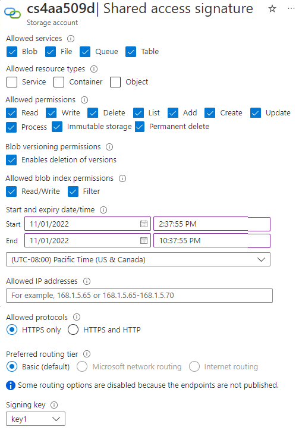
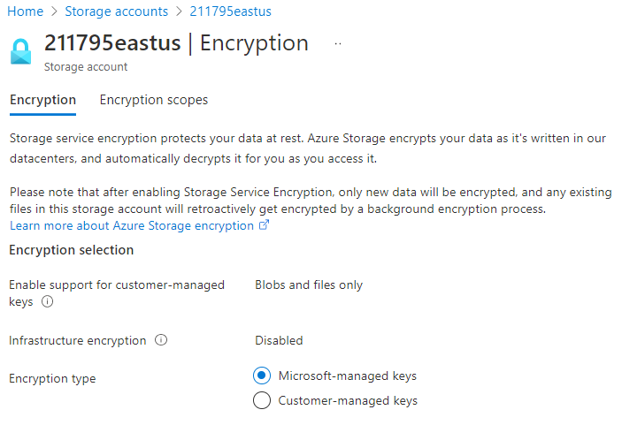

# Security 

What you need for securing storage  
- Generate shared access signature (SAS) tokens
- Manage access keys
- Configure Microsoft Entra authentication for an Azure storage account

## Strategies

### AZ Encryption
- **All data written to Azure Storage is automatically encrypted**  

### Authentication via `Microsoft Entra ID` + `role-based access control (RBAC)`

`Microsoft Entra ID` is Microsoft's cloud-based identity and access management service.  

With it, you can assign fine-grained access to users, groups, or applications by using role-based access control without storing any credentials in your code.  

`Microsoft Entra integration` is supported for **data operations on Azure Blob Storage and Azure Queue Storage.**  

AD authorization takes a two-step approach. 
First, you authenticate a security principal that returns an OAuth 2.0 token if successful.  
**This token is then passed to Azure Storage to enable authorization to the requested resource.**  

Use this form of authentication if you're running an app with managed identities or using security principals.

> Assign `RBAC` roles **SCOPED** to an Azure storage account to security principals, and use `Microsoft Entra ID` to **AUTHORIZED** resource management operations like key management.  

### Data in transit  
- Data can be secured in transit between an application and Azure by using `Client-Side Encryption`, `HTTPS`, or `SMB 3.0`.

### Azure Disk encryption  
- O.S disks and data disks used by Azur
- e VMs can be encrypted by using `Azure Disk Encryption`.

### Shared access signatures (SAS)

A (SAS) is a uniform resource identifier (URI)
It delegates access to a particular resource in your Azure storage account with specified **permissions** and for a **specified time interval** without compromising your account keys

Types
1. User delegation SAS: 
Is secured with Microsoft Entra credentials.  
Can only be used for Blob storage.  
2. Service SAS  
Is secured using a **storage account key.**  
A service SAS delegates access to a resource in any one of four Azure Storage services (Blob, Queue, Table, or File)  
3. Account SAS 
Is secured with a **storage account key.**   
An account SAS has the same controls as a service SAS, but can also **control access to service-level operations, such as Get Service Stats.**

You can create a `SAS ad-hoc` by specifying all the options you need to control, including start time, expiration time, and permissions.

**The only way to revoke or change an ad-hoc SAS is to change the storage account keys.**

#### Store Access Policy with Service SAS 

Good if you need to have granular control to change the expiration, or to revoke a SAS.  

A stored access policy can be associated with up to five active SASs. 
You can control access and expiration at the stored access policy level. 

If you plan to create a service SAS, there's also an option to associate it with a stored access policy.  

### Authorization

Authorization ensures that resources your storage account are accessible only when you want them to be, and to only those users or applications whom you grant access.

### Public Access

Anonymous (any users can) access to storage accounts,containers and blobs (no authorization requirement)

- The Storage Account.  
Configure the storage account to allow public access by setting the `AllowBlobPublicAccess` property.
- The Container.  
You can enable anonymous access only if anonymous access has been allowed for the storage account. (Public read access for (all) blobs, or public read access for a container and all its blobs.)

Both storage account and container settings are required to enable anonymous public access. The advantages of this approach are that you don't need to share keys with clients who need access to your files.

### Shared Key	

`Shared Key = Your Azure storage account access keys + other parameters.`
- It produce an encrypted signature string. 
- The string is passed on the request in the Authorization header.  

You share these keys to grant clients access to the storage account. These keys grant anyone with access the equivalent of root access to your storage.

(RECOMMENDED) Manage storage keys with Azure Key Vault because it's easy to rotate keys on a regular schedule to keep your storage account secure.

## SAS Creations

Configurations Options

You can specify the time interval for SAS (start time and the expiration time.)

You specify the permissions granted by the SAS. A SAS for a blob might grant read and write permissions to that blob

SAS provides account-level and service-level control
- You can group SASs and provide other restrictions by using a stored access policy when using service-level SAS

An account-level SAS can delegate access to multiple Azure Storage services, such as blobs, files, queues, and tables.

Signing key: Select the signing key from your list of keys.  

Signing method: Choose the signing method: Account key or User delegation key.  

Optional Settings
1. Ip Address : You can identify an IP address or range of IP addresses from which Azure Storage accepts the SAS.  
2. Protocol : Configure this option to restrict access to clients by using `HTTPS` or `HTTPS and HTTP` 

## Identify URI and SAS parameters

URI is created when you create SAS

The URI consists of your Azure Storage resource URI and the SAS token.

Parameters in URI
Resource URI 
- `https://myaccount.blob.core.windows.net/ ?restype=service &amp;comp=properties`  
this indicates that the SAS applies to service-level operations.
- When the URI is used with `GET`, the Storage properties are `retrieved`. 
- When the URI is used with `SET`, the Storage properties are `configured`.
Storage version
- `sv=2015-04-05`
Storage service 
- Specifies the Azure Storage to which the SAS applies.
Start time(OPTIONAL)
- `st=2015-04-29T22%3A18%3A26Z`	
- Specifies the start time for the SAS in UTC time.
- If you want the SAS to be valid immediately, omit the start time.
Expiry
- `se=2015-04-30T02%3A23%3A26Z`	
- Specifies the expiration time for the SAS in UTC time.
Resource	
- `sr=b`	
- Specifies which resources are accessible via the SAS
Permissions	
- `sp=rw`
- grants access to `read` and `write` operations.
IP range	
- `sip=168.1.5.60-168.1.5.70`
- Only the IP address range 168.1.5.60 ~ 168.1.5.70 from which request is accepted
Protocol
- `spr=https` 
- this indicates that only requests by using HTTPS are accepted.
Signature	
- `sig=F%6GRVAZ5Cdj2Pw4tgU7Il STkWgn7bUkkAg8P6HESXwmf%4B`
- Decode by using the SHA256 algorithm, and encoded by using Base64 encoding..

## Azure Storage encryption

**Azure Storage encryption is enabled for all new and existing storage accounts and can't be disabled.**

Data is encrypted automatically before it's persisted to Azure Managed Disks, Azure Blob Storage, Azure Queue Storage, Azure Cosmos DB, Azure Table Storage, or Azure Files.

Data is automatically decrypted before it's retrieved.

Azure Storage encryption, encryption at rest, decryption, and key management are transparent to users.

All data written to Azure Storage is encrypted through 256-bit advanced encryption standard (AES) encryption.

Encryption Type Key
You can manage the keys yourself, or you can have the keys managed by Microsoft.

## Best Practice for AZ storage SAS

在應用程式中使用 SAS 可能導致潛在風險。

若 SAS 外洩，任何取得 SAS 的人都能加以利用，惡意使用者也不例外。

如果提供給用戶端應用程式的 SAS 已過期，且該應用程式無法從您的服務擷取新的 SAS，則應用程式的功能就會受到影響。

助降低 SAS 相關風險的建議
1. 建立和發佈時一律使用 HTTPS
避免 SAS 透過 HTTP 傳遞時遭到攔截
2. 參考 `預存存取原則/Stored access policies` WHERE POSSIBLE
Stored access policies 提供了撤銷權限且無需重新產生 Azure 儲存體帳戶金鑰的選項。   
將儲存體帳戶金鑰到期日設定在遙遠的未來。  
3. 設定非計劃性 SAS 的 `短期到期時間/near-term expiry times`
將 SAS 效期限制在較短時間內，藉此減輕攻擊的影響
4. Require `clients automatically renew the SAS`
要求用戶端在到期日之前更新 SAS  
5. 仔細規劃 `SAS start time`
請將開始時間設為至少 `15` 分鐘之前的時間。或者，也可不設定特定的開始時間，讓 SAS 在所有情況下立即生效  
    - For clients that use a REST API version earlier than 2012-02-12, the maximum duration for a SAS that doesn't reference a stored access policy is 1 hour.  
    Any policies that specify a longer term will fail.   
1. 定義資源的最低存取權限
    - A security best practice is to provide a user with the minimum required privileges 
    - 如果使用者只須要針對單一實體的讀取存取權，請為該單一實體授予讀取存取權限，無須為所有實體授予讀取/寫入/刪除權限。
1. 了解包括 SAS 在內的用量帳戶計費方式
如果您提供對 blob 的寫入存取權，使用者可能選擇上傳 200 GB 的 blob。 若您同時為使用者提供讀取存取權，他們可能選擇下載該 blob 10 次，使您產生 2 TB 的輸出成本。 同理，提供受限權限有助降低惡意使用者可能動作的風險。 您可用短期 SAS 降低威脅，但請注意結束時間的時鐘誤差。
1. 使用 SAS 驗證寫入資料
如果您的應用程式需要經過驗證或授權的資料，請在寫入之後進行驗證再使用。 這麼一來，無論是透過正當管道取得 SAS 的使用者，還是濫用外洩 SAS 的攻擊者，都無法將損毀或惡意資料寫入您的帳戶。  
1. 不要假設 SAS 一律是正確的選擇
如果您想要讓容器中的所有 blob 都可供公開讀取，則可將此容器設定為 [public]，而不是將 SAS 提供給每個用戶端進行存取
1.   使用 Azure 儲存體分析監視您的應用程式