  
:arrow_left: [AZ Category]()
# AZ Storage Accounts

## Storage Account Type

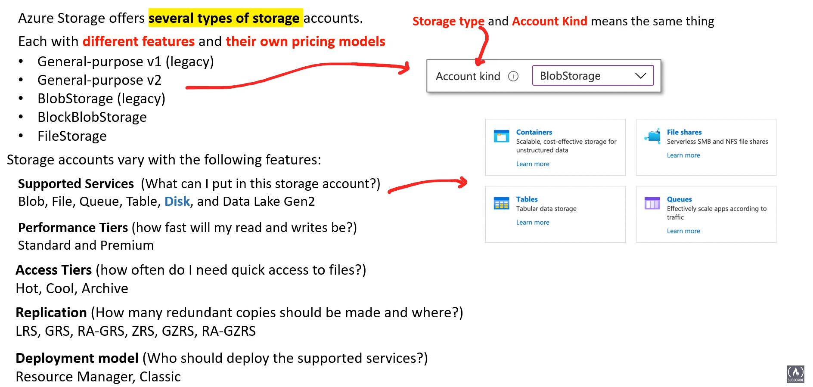    
Account Type **General-purpose V2** supports all the services  

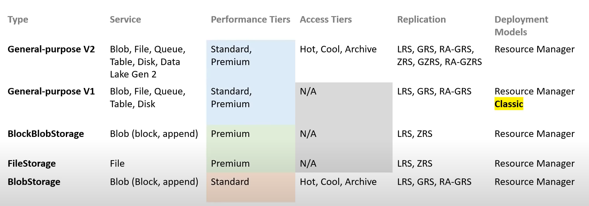  

## Performance Tiers 

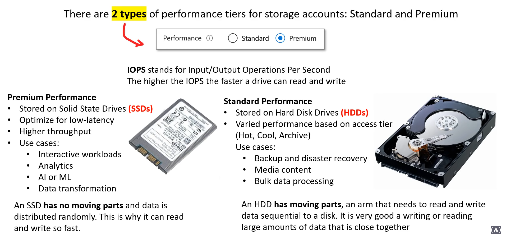

(Performance Tiers, IOPS / InputOuputOperationsPerSecond) of BlobStorage  
- Standard (HDD)
- Premium (SSD)

## Stroage Services

Azure has 5 core sotrage services  
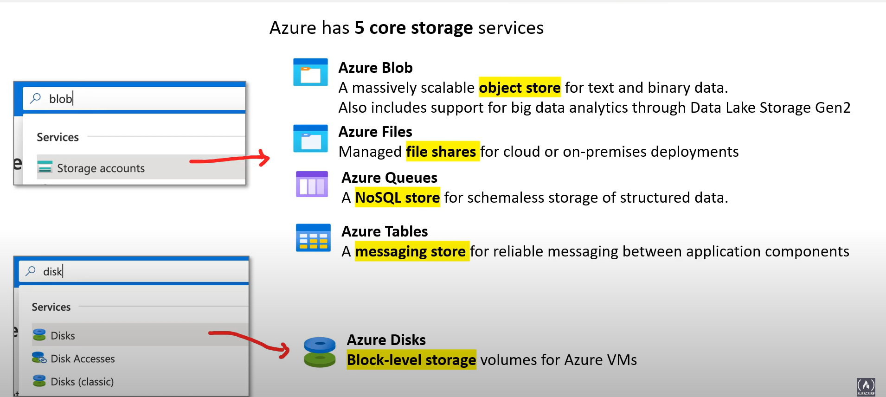

## Access Tiers for Standard Storage

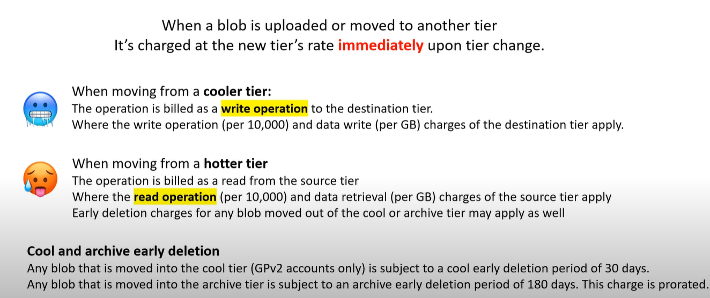

- Hot (frequently accessing)
- Cold  (infrequently accessing)
- Archive (rarely accesed stored for at least 180 days)

## Level Tiering

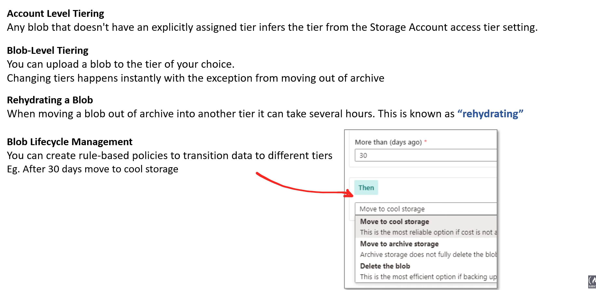

1. Account 
2. Blob-Level 
3. Rehydrating a blob
4. Blob Lifecycle Management

## Moving a blob

- moving from cooler tier
- moving from hotter tier 

## Replication Types

Replication stores the copies of the data. 

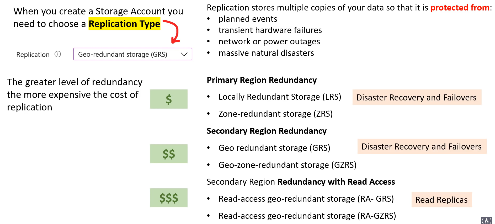

## Redundancy in the Primary Region

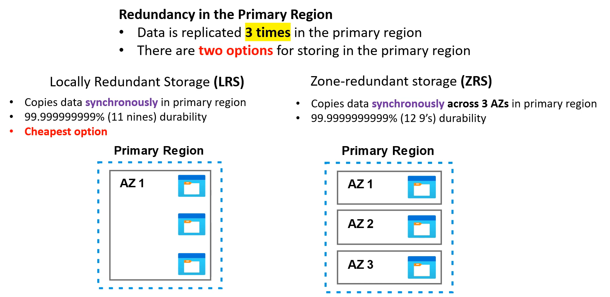

- Locallying Redundant Storage (CHEAPEST) 
- Zone Redundant Storage 

## Redundancy in the Secondary Region

Secondary Region is **determined** based on primary pair region  

Why we need Secondary Region?  
- Incase primary regional disaster    
- **Is Not available for read or write access**  

Copies data `sync` in primary or physical region.  
Copies data `async` in another region  
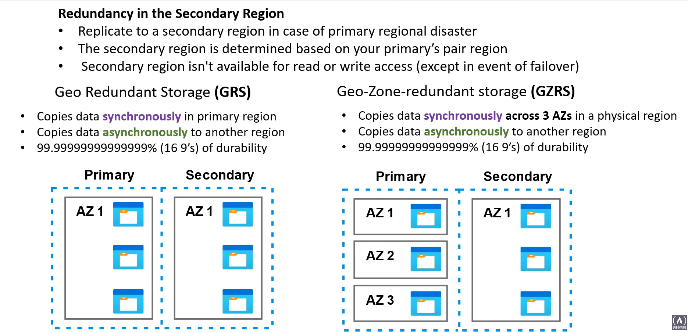  

## Redundancy in the Secondary Region with Read Access

Copeis data `sync` in primary or physical region.  
Copies data `sync` in another region  
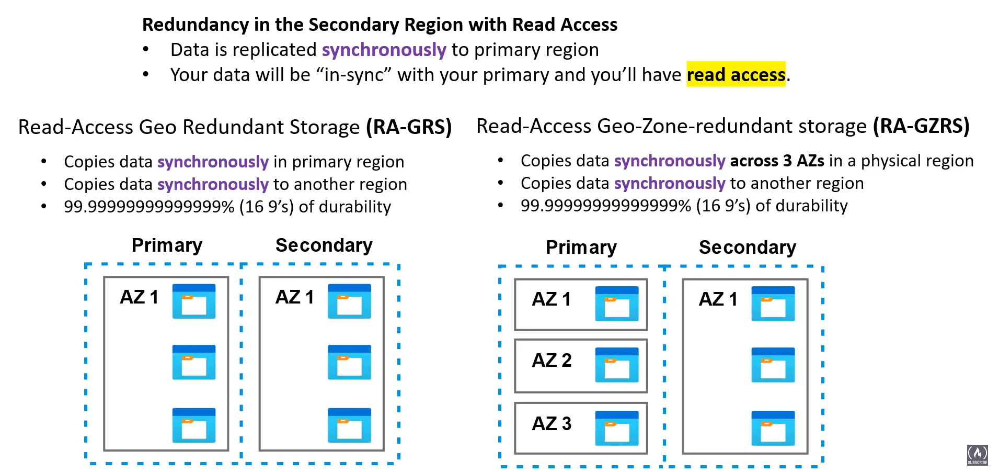   

## Blob Storage

A Object-store for sotring massiv amounts of unstructred data (e.g. text, binary data, no particular data model definitions) 

### Azure blobs

Azure blobs are composed of the components
   - namespace (unique) storage account e.g `http://<storage_account>.blob.core.windows.net`
   - container (like folder in file system)
   - blobs (the data being stored, like file in file system)

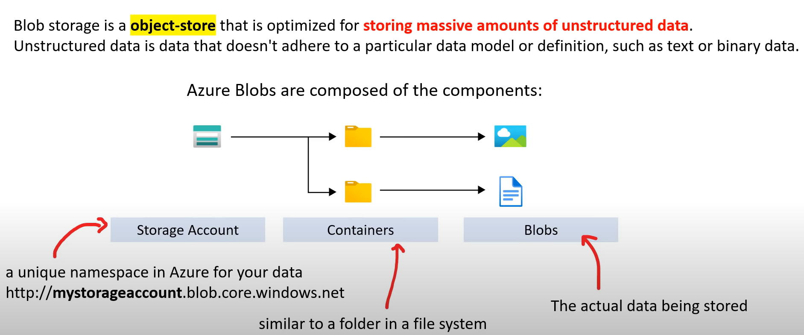

### Blob Storage Types
- Block blobs (text, binary data)
- Append blobs (logging data from VM)
- Page blobs (random access files up to 8 tb, vm-drive files and serve as disks for AZM)

## Methods of Moving Data To BlobStorage

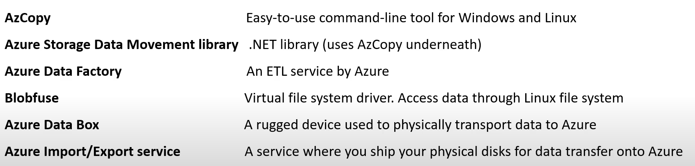  

1. AzCopy
2. Azure Storage Data Movement Libarary
3. Azure Data Factory
4. Blobfuse
5. Azure DataBox
6. Azure Im/Ex service

## Azure File 

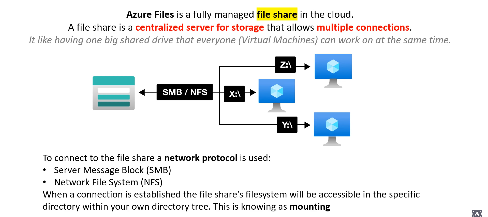  

- A File Share,Mounting to centralized Server for storage that allows multiple connections (to access the specific directory within your own directory tree, also knonwn as `mounting`)

connection protocols for file share
1. Server Message Block  
2. Network File System  

### User Case

Replace Or Supplement on-premise file server NAS devices  
Lift And Shift on-premise storage to the Cloud   
Simplify Cloud Development  
1. Shared Application Settings
2. Diagnostic Share
3. Dev/Test/Debug
Containerization
- Persist volumes for stateful containers

#### Backup 
- Back up with Shared Snapshots (200 snapshots per file share) 
- retain backups for up to 10 years
- stored in file shared

#### Deletion
Soft Delete
- avoid accidental deletions
- ATP : it's a layer of security intelligence that provides alerts when it detects anomalous activity on your storage account

#### Store Tiers
- Premium : Store on SSD with signle digit milliseconds for most IO operation
- Transaction optimized (standard) : Store on HHDD
- HOT :  azure file sync , team shares
- Cool : Stored on HDD , for online archive storage scenario 

## Azure File Sync

A service allow us to `cache` azure file shares on an on-premises, Azure VMS, Cloud VMs, Azure Backups etc.  
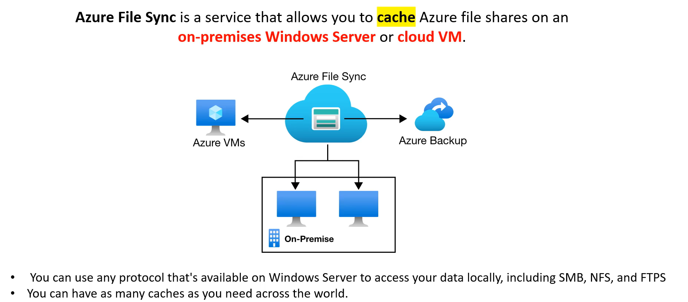

#### APP, Azure Storage Explorer 

App that Operations in MacOS, Wins and Linux

## Shared Access Signatures

- Grant Access rights to Azure Storage resource 
- A URL format  

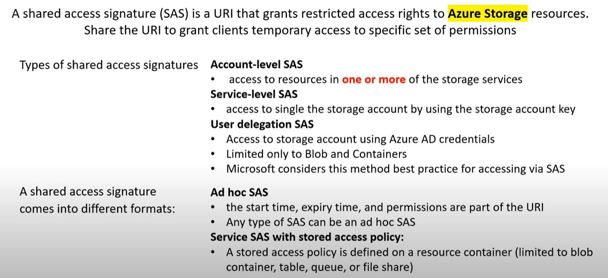

### URL Format

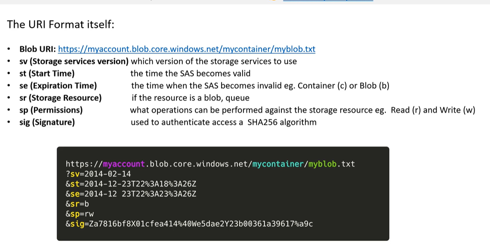

### Generating SAS 

`Storage account#resoruce | Shared access signature`
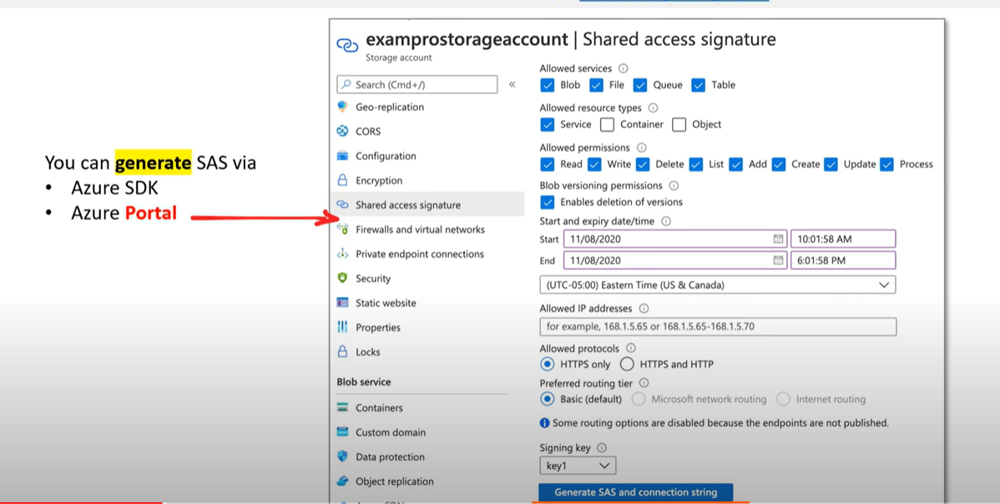

## Storage Account Copy in Action 

Copy One file in storage `account#x` to other storage `account#y`.  
1. Create Storage Account 
2. Add Container
3. Add IAM access control -> Role Assignment 
4. Download `AzCOPY` and `tar -xvzf` it 
5. log in , `azcopy login`
6. Go `Container | Properties | URL`.  TO copy BLOB URL
7. `azcopy cp <file_name_in_your_container_file_share> https://<storage_account>.blob.core.windows.net/<container_name>/<file_name>`
8. azcopy logout 

##  SAS in action

1. Go Setting | Shared access signature, generate SAS
2. azcopy cp [<file_name_in_your_container_file_share>] [https://<storage_account>.blob.core.windows.net/<container_name>/<file_name>?<SAS>]

## File Share with Storage Account share to VM

- Enable File Share while creating Storage Account#A
- Virtual Machine | Create Virtual Machine#B | Ubuntu 
- Create File Share In Storage Account#A
- GO Virtual Machine#B | Networking, the port configuration 
- OPENUP Bash | ssh <vm_user_name>@<ip_address> 
- sudo apt update && sudo apt install cifs-utils
- mount storage-account-file-share on vm 

## File Sync

Download Azure File Sync in Marketplace  
Go Virtual Machine#A | Connect | RDP | Download RDP file | OPEN OP VM WITH GUI | Powershell | `Install-Module -Name <name> -AllowClobber` | OPEN UP Server Manager | OPEN EDGE | download file sync agent | sign in the account [DO] choose sbuscription & resource group & storage sync service | Create AnyThing in Drive | [Right Click] Properties [DO] share to user 

Go Storage Sync Service#A | Sync Group [do] Choose Storage Account & Azure File Share |  Add Clound Endpoint [DO] Choose Storage Account & Azure File Share 
Go Storage Sync Service#A | Add Server Endpoint [DO] Registered Server & Path in VM#A
 

## Cheatsheet

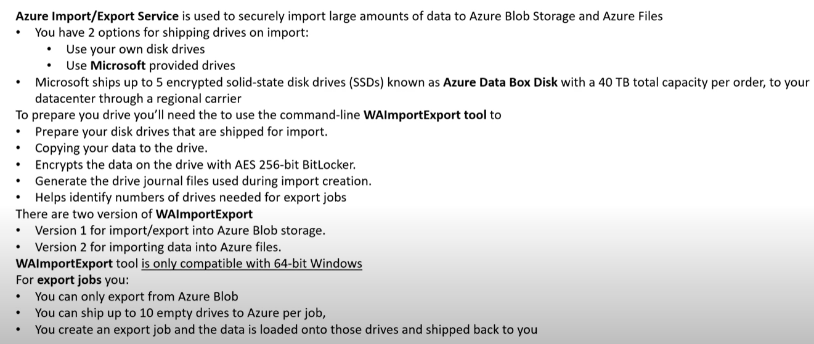
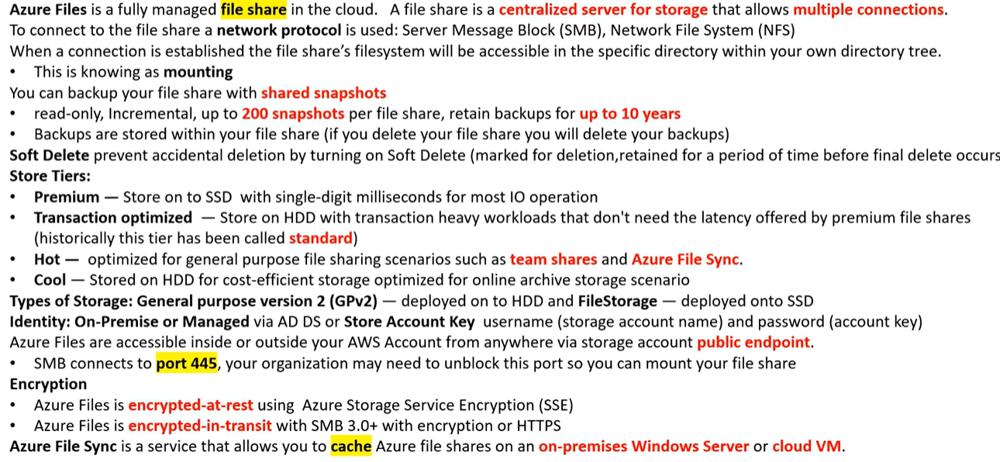
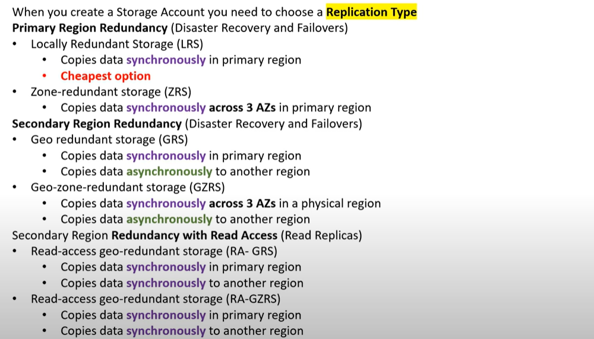
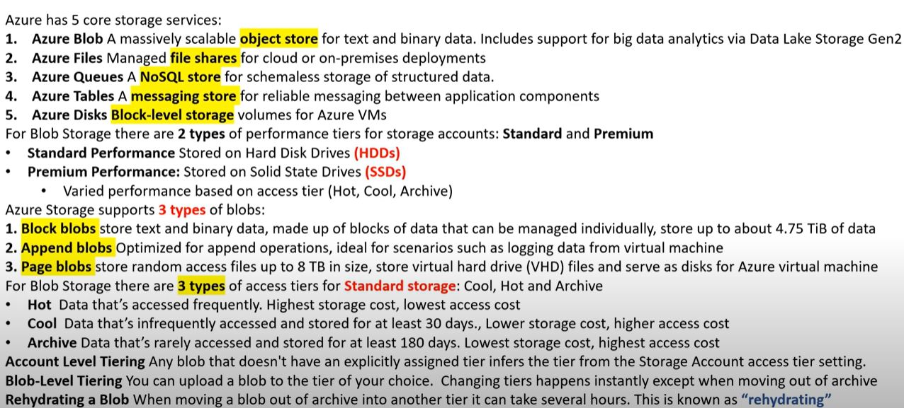
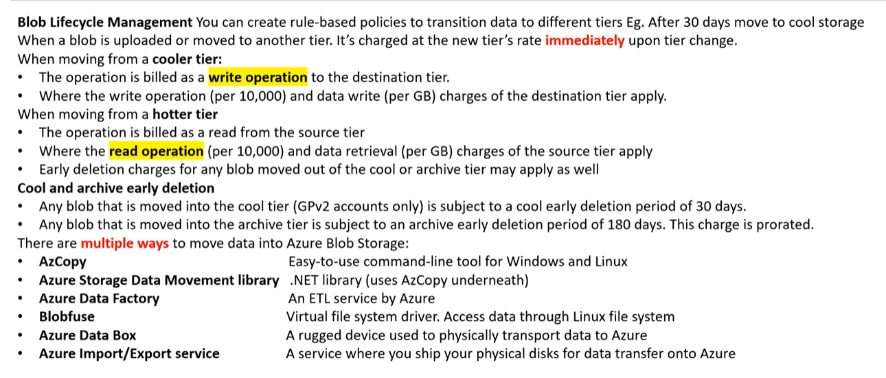
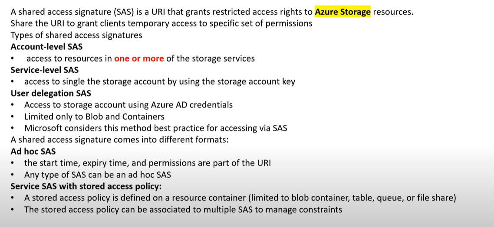