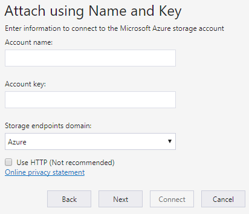
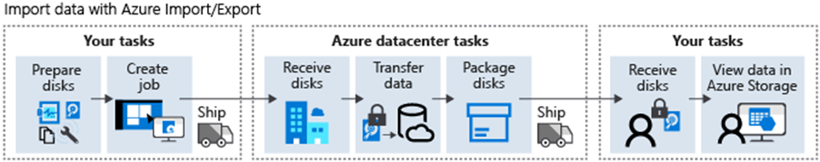
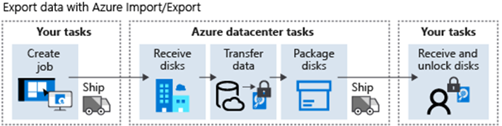

# AZ Storage Explorer 

Azure Storage Explorer requires  
1. Azure Resource Manager  
2. Data Layer permissions  
You need Microsoft Entra permissions to access your storage account, the containers in your account, and the data in the containers.  

Allow to connect to different storage accounts  
1. Connect to storage accounts associated with your Azure subscriptions.  
2. Connect to storage accounts and services that are shared from other Azure subscriptions.  
3. Connect to and manage local storage by using the Azure Storage Emulator.  

What AZ Storage Explorer Manages?
- storage resources that belong to your Azure subscription.
- local storage by using the Azure Storage Emulator.
- storage resources that belong to another Azure subscription or that are under national Azure clouds by using the storage account name, key, and endpoints. 
- storage resources that belong to another Azure subscription by using a shared access signature (SAS).
- Manage a specific Azure Storage service (blob container, queue, or table) that belongs to another Azure subscription by using a SAS.

## Shared Account

Azure Storage Explorer lets you attach to external storage accounts so storage accounts can be easily shared


- you need the external storage Account name and Account key
- To use a storage account name and key from a national Azure cloud, use the `Storage endpoints domain` drop-down menu to select `Other`, and then enter the custom storage account endpoint domain.

## Access Key 

Access keys provide access to the entire storage account. 

And you should 
- Store your access keys securely. 
- Regenerating your access keys regularly.

When you regenerate your access keys, you must update any Azure resources and applications that access this storage account to use the new keys. 

**This regenerating action doesn't interrupt access to disks from your virtual machines.**


## Azure Import/Export service

The `Azure Import/Export service` is used to **securely import LARGE AMOUNTS** of data to Azure Blob Storage and Azure Files by shipping disk drives to an Azure datacenter. 

The Azure Import/Export service is frequently used in cases where uploading or downloading data over the network is too slow or getting more network bandwidth is cost-prohibitive.

### Data Backup (DATA EXPORT & IMPORT)
  
  
1. `DATA from Disk drives` can be `IMPORTED` to `AZ blob storage or AZ files` in Your AZ Storage Account
   - you need to create an Azure Import job to import data from physical disks into Azure Blob Storage or Azure Files.
2.` DATA from AZ Storage` in Your AZ Storage Account can be `EXPORTED` to `drives` that you provide
    - you need to Create an Azure Export job to export data from Azure Storage to hard disk drives.  

> You can create jobs directly from the Azure portal or programmatically by using the Azure Storage Import/Export REST AP


### Use when 

Consider cloud migrations. 
- Move large amounts of data to Azure quickly and cost effectively with the Azure Import/Export service.

Consider content distribution. 
- Send data quickly to customer sites in diverse geographic locations.

Consider backup operations. 
- Take backups of your **on-premises data to store in Azure Blob Storage.**

Consider data recovery. 
- Recover large amounts of data stored in Blob Storage, and have the delivered to your on-premises location with the Azure Import/Export service.

## Tools 

### WAImportExport Tool 

The WAImportExport tool handles data copy, volume encryption, and creation of journal files. 

> only compatible with 64-bit Windows operating system

Available in 2 versions 
1. Version 1 is best for importing and exporting data in Azure Blob Storage.
2. Version 2 is best for importing data into Azure Files.

Journal files are necessary to create an Azure Import/Export job and help ensure the integrity of the data transfer.

### Use WAImportExport tool before & after 

**Before you create an Azure Import job**, use the WAImportExport tool to copy data to the hard disk drives you intend to ship to Microsoft.

**After your Azure Import job completes**, use it to repair any blobs that were corrupted, missing, or that have conflicts with other blobs in your Azure Storage.

**After you receive your disk drives from a completed Azure Export job** 
use it to repair any corrupted or missing files on the drives.

Consider 硬碟規格. 
- For hard disk drives, the Azure Import/Export service requires internal `SATA II/III HDDs or SSDs`.

Consider NTFS BitLocker 加密. 
When you prepare a disk for an Azure Import job, you must encrypt the **NTFS volume of each disk drive with BitLocker**.

Consider OS version. 
- To prepare a disk drive, you must connect the drive to a computer that's running a 64-bit version of the Windows client or server operating system. You run the WAImportExport tool from that computer.

### AzCopy Tool 

```bash  
azcopy copy [source] [destination] [flags]

azcopy --help
```

Every `AzCopy` instance creates **a job order and a related log file**. So You can view and restart previous jobs, and resume failed jobs.  

List or remove files or blobs in a given path with `AzCopy`.  
- `AzCopy` supports wildcard patterns in a path, `--include` flags, and `--exclude` flags.  

`AzCopy` automatically retries a transfer when a failure occurs.

When you use Azure Blob Storage, **`AzCopy` lets you copy an entire account to another account.**  
- No data transfer to the client is needed.

`AzCopy` supports Azure Data Lake Storage Gen2 APIs.

`AzCopy` is built into Azure Storage Explorer.

`AzCopy` is available on `Windows`, `Linux`, and `macOS`.

### Use when 

Consider data synchronization.  
- Use AzCopy to synchronize a file system to Azure Blob Storage and vice versa.  
- AzCopy is ideal for incremental copy scenarios.  

Consider job management.  
- Manage your transfer operations with AzCopy.  
- View and restart previous jobs. Resume failed jobs.

Consider transfer resiliency for your data transfers.  
- If a copy job fails, AzCopy automatically retries the copy.

**Consider fast account to account copy**.   
- Use AzCopy with Azure Blob Storage for the account to account copy feature.   
- Because data isn't transferred to the client, the transfer is faster.  

### Authentication

Microsoft Entra ID to authenticate
- Azure Blob Storage
- Azure Data Lake Storage Gen2

Using SAS tokens to authenticate on the command line
- Azure Blob Storage  
- Azure Files

### GUI with AZ Storage Explorer 

Azure Storage Explorer uses the AzCopy tool for all of its data transfers via your account key  

If you want to use a graphical UI to work with your files, you can use Azure Storage Explorer and gain the performance advantages of AzCopy.  

>> **AzCopy is ideal for transferring large files because the tool can run in the background.**

