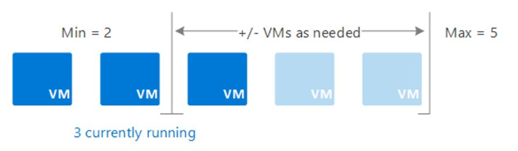

# Azure Compute resource : AZ Scale Sets 

Azure VM Scale Sets are an **Azure Compute resource** that you can use to deploy and manage **a set of identical VMs**.
- With VM Scale Sets, you don't need to pre-provision your VMs.  
- When you implement VM Scale Sets and configure all your VMs in the same way

VM Scale Sets automatically increases/reduces the number of your VM instances as application demand increases/decreases
- The process of adding and removing machines can be manual or automated, or a combination of both.

### Benefits 

All VM instances are created from the same base operating system image and configuration. 
- This approach lets you easily manage hundreds of VMs without extra configuration tasks or network management.

VM Scale Sets Load Balancer
- The use of Azure Load Balancer for basic layer-4 traffic distribution, and Azure Application Gateway for more advanced layer-7 traffic distribution and SSL termination.

You can use VM Scale Sets to run multiple instances of your application. 
- If one of the VM instances has a problem, customers continue to access your application through another VM instance with minimal interruption.

Customer demand for your application might change throughout the day or week.
- To meet customer demand, VM Scale Sets implements autoscaling to automatically increase and decrease the number of VMs.

VM Scale Sets support up to `1,000` VM instances. 
- If you create and upload your own custom VM images, the limit is `600` VM instances.

### Creation of VM Sets

> **Azure charges an HOURLY price based on the VM's size and operating system.**

[Create VM Scale Sets](https://learn.microsoft.com/en-us/training/modules/configure-virtual-machine-availability/8-create-scale-sets)

#### Under Basics

Orchestration mode 
- **Choose how VMs are managed by the scale set**.  
  - In `flexible` orchestration mode, you `manually` create and add a VM of any configuration to the scale set.  
  - In `uniform` orchestration mode, you define a VM model and AZ will generate identical instances based on that model.  

VM Architecture
- A choice of `x64` or `Arm64-based` VMs to run your applications.

Run with Azure Spot discount
- Azure Spot offers unused Azure capacity at a discounted rate versus pay as you go prices.  
- Workloads should be tolerant to infrastructure loss as Azure may recall capacity.

Size
- Select a VM size to support the workload that you want to run. 
- Size determines factors such as processing power, memory, and storage capacity.

### Under the Advanced tab

Enable scaling beyond `100` instances
- Identify your scaling allocation preference. 
  - Select `No`, your VM Scale Sets implementation is limited to one placement group with a maximum capacity of `100`.   
  - Select `Yes`, your implementation can span multiple placement groups with capacity up to `1000`. it also changes the availability characteristics of your implementation.   

Spreading algorithm (Optimal spreading)
- Microsoft recommends allocating Max spreading for your implementation.  

## VM Scale Sets with Autoscaling 

Autoscaling allows you to dynamically scale your configuration to meet changing workload demands.

  

- Autoscaling minimizes the number of unnecessary VM instances that run your application when demand is low.  
- Your customers continue to receive an acceptable level of performance as demand grows and more VM instances are automatically added.  

### Benefits

:one: Automatic adjusted capacity. 
- You can create `autoscaling rules` to define the acceptable performance for a positive customer experience. 
- When the defined thresholds are met, the `autoscale rules` act to adjust the capacity of your VM Scale Sets implementation.

:two: `Autoscale rule` to `scale out/in` dynamically
:memo: Consider `scale out` to increase.
- If your application demand increases, the load on the VM instances in your implementation increases. 
- If the increased load is consistent, rather than a brief demand, you can configure autoscale rules to increase the number of VM instances in your implementation.

:memo: Consider `scale in` to reduce.
- **On an evening or weekend, your application demand might decrease.** 
- If the decreased load is consistent over a period of time,  you can configure autoscale rules to decrease the number of VM instances in your implementation. 
- The `scale-in` action reduces the cost to run your VM Scale Sets implementation as you only run the number of instances required to meet the current demand.

:three: `scheduled events`. 
- You can implement autoscaling and schedule events to automatically increase or decrease the capacity of your implementation at fixed times.

:four: `Overhead`. 
- Using Azure VM Scale Sets with autoscaling reduces your management overhead to monitor and optimize the performance of your application

---

https://learn.microsoft.com/en-us/training/modules/configure-virtual-machine-availability/10-configure-autoscale

https://learn.microsoft.com/en-us/training/modules/configure-virtual-machine-availability/11-simulation-machine-scale

---
[Case study: Availability Sets vs. Availability Zones](https://mwesterink.wordpress.com/2018/09/20/case-study-availability-sets-vs-availability-zone/)