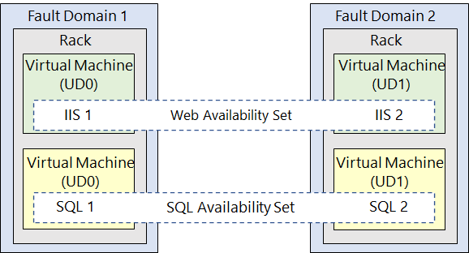
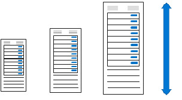

# AZ VM Management

Learn How to Implement
- **availability sets** and **availability zones**.
- **update** and **fault domains**.
- Azure **VM Scale Sets**.
- **Autoscale** VMs.

## Plans for maintenance & downtime in VM

Most seen 
1. An Unplanned hardware maintenance
2. UNEXPECTED downtime
3. An Planned maintenance

### An Unplanned hardware maintenance event  

When the Azure platform predicts a failure of any platform component associated to a physical machine, it issues an unplanned hardware maintenance event.  

Azure uses `Live Migration` technology to migrate your VMs from the failing hardware to a healthy physical machine.  

> **`Live Migration` is a VM preserving operation that only pauses the VM for a short time, but performance might be reduced `before` or `after` the event.**

### Unexpected DOWNTIME

Unexpected downtime can include 
1. local network failures, 
2. local disk failures, 
3. or other rack level failures.  

**When detected, the Azure platform automatically migrates (heals) your VM to a healthy physical machine in the same datacenter.**  

*During the healing procedure, **VMs experience downtime (reboot) and in some cases loss of the temporary drive**. 

### Planned maintenance events  

Events are periodic updates made by Microsoft to the underlying Azure platform to improve overall `reliability`, `performance`, and `security` of the platform infrastructure that your VMs run on.  

**Most of these updates are performed without any impact to your VMs or Cloud Services.**  

Microsoft doesn't automatically update your VM operating system or other software.  
You have complete control and responsibility for those updates.   

However, **the underlying software host and hardware are periodically patched to ensure reliability and high performance.**  

## Update Domain & Fault Domain

Each VM in your availability set is assigned an **update domain** and a **fault domain** by the underlying Azure platform.  

Update domains indicate groups of VMs and underlying physical hardware that **can be rebooted at the same time**.  
- Using two or more VMs in an availability set helps highly available applications and meets the 99.95% Azure SLA.

Availability sets offer improved VM to VM latencies compared to availability zones, since VMs in an availability set are allocated in closer proximity.

Availability sets have **fault isolation** for many possible failures, minimizing single points of failure, and offering high availability.

However, availability sets are still susceptible to certain shared infrastructure failures, like datacenter network failures, which can affect multiple fault domains.

**If your highest priority is the best reliability for your workload, replicate your VMs across multiple availability zones.(more reliability than availability sets)**  

## VMs Management

https://mwesterink.wordpress.com/2018/09/20/case-study-availability-sets-vs-availability-zone/

Availability Sets : 預防機台硬體損壞 
- (e.g. 某公司的某一台機器故障 -> 轉移至該公司相同運作正常的機器)
- No Application Level Protection

Availability Zones: 
- 同一區域   (e.g. 高雄楠梓區區域性停電 -> 轉移至 -> 高雄岡山區的機台)

Region Pairs : 
- 預防地域性的災難 (e.g. 日本大地震->則轉移至->另一個安全區域)

## Availability Sets

Availability sets allow workloads to be **spread over multiple hosts, racks but still remain at the same data center**

- Adding your VMs to an availability set **won't protect your applications from operating system or application-specific failures**.   
- You'll **need to explore other disaster recovery and backup techniques to provide application-level protection**.    

### When to considerate this Usage

:mag: [Redundancy](https://g.co/kgs/kiK9LX) (refers same Identical VM in a Set).  
- To achieve redundancy in your configuration, place multiple VMs in an availability set.  

:mag: **Separation of application tiers**.  
- The separation helps to mitigate single point of failure on all machines.
- Each application tier exercised in your configuration should be located in a separate availability set. 

:mag: Load balancing availability Set  
- By using Azure Load Balancer availability set allow us to distributes incoming traffic across working instances of services that are defined in your load-balanced availability set.

:mag: Managed disks for block-level storage (AZ block storage).   
- (can) use Azure managed disks with your Azure VMs in availability sets for block-level storage.

### Benefits

:one: (Redundancy) All VMs in an availability set should perform the identical set of functionalities and have the same software installed.

:two: Azure ensures that VMs in an availability set run across multiple physical servers, compute racks, storage units, and network switches.

:three:  If a hardware or Azure software failure occurs, only a subset of the VMs in the availability set are affected.  
- Your application stays up and continues to be available to your customers

:four: You can create a VM and an availability set `at the same time`.

:five:  A VM can only be ADDED to an availability set when the VM is created. 
- To change the availability set for a VM, you need to delete and then recreate the VM.  

:six: Multiple availability sets creation options.   
- Azure portal,   
- ARM templates,   
- scripting,   
- or API tools.  

:seven: Microsoft provides robust Service Level Agreements (SLAs) for Azure VMs and availability sets.  

## Availability Zones

:memo: you must know what is fault domain and update domain before Availability Zone topic

An availability zone in an Azure region is a combination of a fault domain and an update domain. 

-  The Azure platform recognizes this distribution across update domains to make sure that VMs in different zones aren't updated at the same time. 
- You can use availability zones to build high-availability into your application architecture by collocating your compute, storage, networking, and data resources within a zone and replicating in other zones.  

### When Using Availability Zones

:one: Zonal Service  
- Azure zonal services pin each resource to a specific zone.
for example : AZ VMs, AZ Managed Disks, Standard IP addresses.   

:two: Zone-redundant services
- For Azure services that are zone-redundant, the platform replicates automatically across all zones.
for example : AZ SQL Database, AZ storage (redundant)

:::danger  
Build your application architecture by using a combination of availability zones with Azure region pairs.  
:::  

### Benefits

:one: Availability zones are **unique physical locations within an Azure region**.

:two: Zone 涵蓋一至多個 Datacenters
- **Each zone is made up of one or more datacenters** that are equipped with independent power, cooling, and networking.

:three: 一個區域至少有要三Zones
- To ensure resiliency, there's a minimum of three separate zones in all enabled regions.
  
:four: 預防 Application 以及 Data 來自 Datacenter 
- The physical separation of availability zones within a region **protects applications and data from datacenter failures.**

:five: 預防 Single Point Of Failure (Database/Storage)
- Zone-redundant services replicate your applications and data across availability zones to protect against single-points-of-failure.

## Update Domains & Fault Domains

[:link: 4-review-update-fault-domains](https://learn.microsoft.com/en-us/training/modules/configure-virtual-machine-availability/4-review-update-fault-domains)

- Each VM in an availability set is placed in one update domain and one fault domain (two nodes).

### Update Domains in Availability Set

#### What Update Domains Handles 

An update domain is a group of nodes that are upgraded together during the process of a service upgrade or rollout.   

An update domain allows Azure to perform incremental or rolling upgrades across a deployment.     

Each update domain contains a set of VMs and associated physical hardware that can be updated and rebooted at the same time.

**During planned maintenance, only one update domain is rebooted at a time.**

Update Domains Size
- By default, there are `5` (non-user-configurable) update domains. 
- You can configure up to `20` update domains.

### Fault Domains

A fault domain is a group of nodes that represent a physical unit of failure.    
- Think of a fault domain as nodes that belong to the same physical rack.  

A fault domain defines a group of VMs that share a common set of hardware (or switches) that share a single point of failure.    

An example is a server rack serviced by a set of power or networking switches.  
   
- Two fault domains work together to mitigate against hardware failures, network outages, power interruptions, or software updates.   
- The VMs in each fault domain are contained in different availability sets.   
- The Web availability set contains two VMs with one machine from each fault domain.  
- The SQL availability set contains two different VMs with one from each fault domain.  

## Which Scaling Type to use

:one: Consider `limitations`.  
- `Horizontal scaling has fewer limitations than vertical scaling.`     

Why :question: 
1. A vertical scaling implementation depends on the availability of larger HARDWARE, which quickly hits an upper limit and can vary by region.  
2. **Vertical scaling also usually requires a VM to stop and restart, which can temporarily limit access to applications or data.**

:two: `flexibility`.   
- `When operating in the cloud, horizontal scaling is more flexible.`  
- A horizontal scaling implementation allows you to run potentially thousands of VMs to manage changes in workload and throughput.

:three: Consider `re-provisioning`.   
- `Re-provisioning is the process of removing an existing VM and replacing it with a new machine.`  

A robust availability plan considers where re-provisioning might be required and plans for interruptions to service.  

If re-provisioning might be required, determine if any data needs to be maintained and migrated to the new machine.

### Vertical Scaling (Up & Down)

Vertical scaling involves increasing(scale up) or decreasing(scale down) the VM size in response to a workload.

- scenarios e.g. the VM size (in response to a workload)

Tips 
- If you have a service built on a VM that's **under-utilized (未充分利用) such as on the weekend**, you can use vertical scaling to decrease the VM size and reduce your monthly costs.
- You can implement vertical scaling to increase your VM size to support larger demand without having to create extra VMs.

### Horizontal Scaling (out & in)

When you implement horizontal scaling, there's an increase (scale out) or decrease (scale in) in the number of VM instances.

