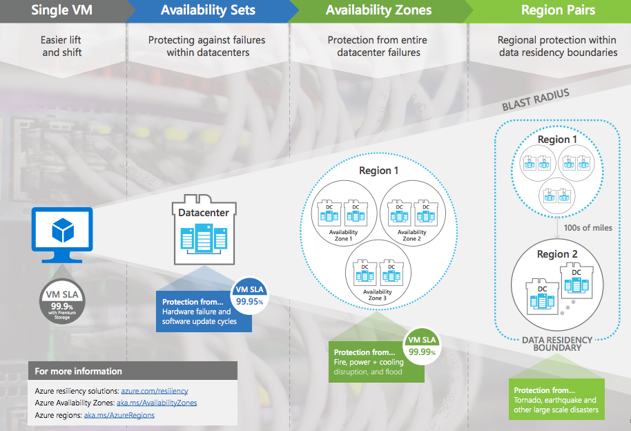

# AZ VM Management

Learn How to Implement
- **availability sets** and **availability zones**.
- **update** and **fault domains**.
- Azure **VM Scale Sets**.
- **Autoscale** VMs.

## Plans for maintenance & downtime

An unplanned hardware maintenance event  
- When the Azure platform predicts a  failure of any platform component associated to a physical machine, it issues an unplanned hardware maintenance event.  
Azure uses Live Migration technology to migrate your VMs from the failing hardware to a healthy physical machine.  

**Live Migration is a VM preserving operation that only pauses the VM for a short time, but performance might be reduced before or after the event.**

Unexpected downtime   
- Unexpected downtime can include local network failures, local disk failures, or other rack level failures.  
**When detected, the Azure platform automatically migrates (heals) your VM to a healthy physical machine in the same datacenter.**   
**During the healing procedure, VMs experience downtime (reboot) and in some cases loss of the temporary drive.**  

Planned maintenance events  
- Events are periodic updates made by Microsoft to the underlying Azure platform to improve overall `reliability`, `performance`, and `security` of the platform infrastructure that your VMs run on.  
**Most of these updates are performed without any impact to your VMs or Cloud Services.**  

:::danger  
Microsoft doesn't automatically update your VM operating system or other software.  
You have complete control and responsibility for those updates.   

However, **the underlying software host and hardware are periodically patched to ensure reliability and high performance.**  
:::

Each VM in your availability set is assigned an **update domain** and a **fault domain** by the underlying Azure platform. 
- Update domains indicate groups of VMs and underlying physical hardware that can be rebooted at the same time.

Using two or more VMs in an availability set helps highly available applications and meets the 99.95% Azure SLA.

Availability sets offer improved VM to VM latencies compared to availability zones, since VMs in an availability set are allocated in closer proximity.

Availability sets have **fault isolation** for many possible failures, minimizing single points of failure, and offering high availability.

However, availability sets are still susceptible to certain shared infrastructure failures, like datacenter network failures, which can affect multiple fault domains.

**If your highest priority is the best reliability for your workload, replicate your VMs across multiple availability zones.(more reliability than availability sets)**  

## VMs Management

https://mwesterink.wordpress.com/2018/09/20/case-study-availability-sets-vs-availability-zone/

## Availability Sets

Availability sets allow workloads to be **spread over multiple hosts, racks but still remain at the same data center**;

:::danger  
Adding your VMs to an availability set **won't protect your applications from operating system or application-specific failures**.   

You'll **need to explore other disaster recovery and backup techniques to provide application-level protection**.  
:::  

### Considerations  

[Redundancy](https://g.co/kgs/kiK9LX) (refers same Identical VM in a Set).  
- To achieve redundancy in your configuration, place multiple VMs in an availability set.  

**Separation of application tiers**.  
- The separation helps to mitigate single point of failure on all machines.
- Each application tier exercised in your configuration should be located in a separate availability set. 

Load balancing availability Set  
- By using Azure Load Balancer availability set allow us to distributes incoming traffic across working instances of services that are defined in your load-balanced availability set.

Managed disks for block-level storage (AZ block storage).   
- (can) use Azure managed disks with your Azure VMs in availability sets for block-level storage.

### Benefits

1. (Redundancy) All VMs in an availability set should perform the identical set of functionalities and have the same software installed.
2. Azure ensures that VMs in an availability set run across multiple physical servers, compute racks, storage units, and network switches.
3. **If a hardware or Azure software failure occurs, only a subset of the VMs in the availability set are affected.**  
Your application stays up and continues to be available to your customers
4. You can create a VM and an availability set `at the same time`.
5. A VM can only be added to an availability set when the VM is created.  
To change the availability set for a VM, you need to delete and then recreate the VM.  
1. Multiple availability sets creation options. 
**Azure portal, Azure Resource Manager (ARM) templates, scripting, or API tools**.
2. Microsoft provides robust Service Level Agreements (SLAs) for Azure VMs and availability sets.  

## Availability Zones

**An availability zone in an Azure region is a combination of a fault domain and an update domain.**

The Azure platform recognizes this distribution across update domains to make sure that VMs in different zones aren't updated at the same time.  

You can use availability zones to build high-availability into your application architecture by collocating your compute, storage, networking, and data resources within a zone and replicating in other zones.

### Properties

1. Availability zones are unique physical locations within an Azure region.
2. Each zone is made up of one or more datacenters that are equipped with independent power, cooling, and networking.
3. **To ensure resiliency, there's a minimum of three separate zones in all enabled regions.**
4. The physical separation of availability zones within a region protects applications and data from datacenter failures.
5. Zone-redundant services replicate your applications and data across availability zones to protect against single-points-of-failure.

### When Using Availability Zones

1. Zonal service  
   1. Azure zonal services pin each resource to a specific zone.
   2. for example : AZ Vms, AZ managed Disks, Standard IP addresses.   
2. Zone-redundant services
   1. For Azure services that are zone-redundant, the platform replicates automatically across all zones.
   2. for example : AZ SQL Database, AZ storage (redundant)

:::danger  
Build your application architecture by using a combination of availability zones with Azure region pairs.  
:::  

## Update Domains & Fault Domains

https://learn.microsoft.com/en-us/training/modules/configure-virtual-machine-availability/4-review-update-fault-domains

Each VM in an availability set is placed in one update domain and one fault domain (two nodes).

### Update Domains

An update domain is a group of nodes that are upgraded together during the process of a service upgrade or rollout.  
An update domain allows Azure to perform incremental or rolling upgrades across a deployment.   

- Each update domain contains a set of VMs and associated physical hardware that can be updated and rebooted at the same time.
- During planned maintenance, only one update domain is rebooted at a time.
- **By default, there are five (non-user-configurable) update domains. You can configure up to 20 update domains.**

### Fault Domains

A fault domain is a group of nodes that represent a physical unit of failure. 

> Think of a fault domain as nodes that belong to the same physical rack.

A fault domain defines a group of VMs that share a common set of hardware (or switches) that share a single point of failure. 

An example is a server rack serviced by a set of power or networking switches.

Two fault domains work together to mitigate against hardware failures, network outages, power interruptions, or software updates.

Let's look at a scenario with two fault domains that have two VMs each. 

The VMs in each fault domain are contained in different availability sets. 

- The web availability set contains two VMs with one machine from each fault domain. 
- The SQL availability set contains two different VMs with one from each fault domain.

## Scaling  

### Considerations

1. Consider `limitations`.  
`Horizontal scaling has fewer limitations than vertical scaling.`     
A vertical scaling implementation depends on the availability of larger hardware, which quickly hits an upper limit and can vary by region.  
Vertical scaling also usually requires a VM to stop and restart, which can **temporarily limit access to applications or data.**

2. Consider `flexibility`.   
`When operating in the cloud, horizontal scaling is more flexible.`  
A horizontal scaling implementation allows you to run potentially thousands of VMs to manage changes in workload and throughput.

3. Consider `reprovisioning`.   
`Reprovisioning is the process of removing an existing VM and replacing it with a new machine.`  
A robust availability plan considers where reprovisioning might be required and plans for interruptions to service.  
If reprovisioning might be required, determine if any data needs to be maintained and migrated to the new machine.

### Vertical Scaling
Vertical scaling involves increasing(scale up) or decreasing(scale down) the VM size in response to a workload.

- scenarios e.g. the VM size (in response to a workload)

Tips 
- If you have a service built on a VM that's **under-utilized** such as on the weekend, you can use vertical scaling to decrease the VM size and reduce your monthly costs.
- You can implement vertical scaling to increase your VM size to support larger demand without having to create extra VMs.

### Horizontal Scaling

When you implement horizontal scaling, there's an increase (scale out) or decrease (scale in) in the number of VM instances.

## AZ Scale Sets Implementation

Azure VM Scale Sets are an Azure Compute **resource** that you can use to deploy and manage **a set of identical VMs**.

VM Scale Sets automatically increases the number of your VM instances as application demand increases, and reduces the number of machine instances as demand decreases.

The process of adding and removing machines can be manual or automated, or a combination of both.

> With VM Scale Sets, you don't need to pre-provision your VMs.  

> `autoscaling` : When you implement VM Scale Sets and configure all your VMs in the same way

### Properties 

All VM instances are created from the same base operating system image and configuration. 
- This approach lets you easily manage hundreds of VMs without extra configuration tasks or network management.

VM Scale Sets support
- the use of Azure Load Balancer for basic layer-4 traffic distribution, and Azure Application Gateway for more advanced layer-7 traffic distribution and SSL termination.

You can use VM Scale Sets to run multiple instances of your application. 
- If one of the VM instances has a problem, customers continue to access your application through another VM instance with minimal interruption.

Customer demand for your application might change throughout the day or week.
- To meet customer demand, VM Scale Sets implements autoscaling to automatically increase and decrease the number of VMs.

VM Scale Sets support up to `1,000` VM instances. 
- If you create and upload your own custom VM images, the limit is 600 VM instances.

### Creation

[Create VM Scale Sets](https://learn.microsoft.com/en-us/training/modules/configure-virtual-machine-availability/8-create-scale-sets)

#### Under Basics

Orchestration mode 
- **Choose how VMs are managed by the scale set**.  
  - In `flexible` orchestration mode, you `manually` create and add a VM of any configuration to the scale set.  
  - In `uniform` orchestration mode, you define a VM model and AZ will generate identical instances based on that model.  

VM Architecture
- A choice of `x64` or `Arm64-based` VMs to run your applications.

Run with Azure Spot discount
- Azure Spot offers unused Azure capacity at a discounted rate versus pay as you go prices.  
- Workloads should be tolerant to infrastructure loss as Azure may recall capacity.

Size
- Select a VM size to support the workload that you want to run. 
- It determines factors such as processing power, memory, and storage capacity.

> **Azure charges an hourly price based on the VM's size and operating system.**

#### Under the Advanced tab

Enable scaling beyond `100` instances
- Identify your scaling allocation preference. 
  - If you select `No`, your VM Scale Sets implementation is limited to one placement group with a maximum capacity of `100`.   
  - If you select `Yes`, your implementation can span multiple placement groups with capacity up to `1000`. it also changes the availability characteristics of your implementation.   

Spreading algorithm (optimal spreading)
- Microsoft recommends allocating Max spreading for your implementation.  

## Autoscaling 

Autoscaling allows you to dynamically scale your configuration to meet changing workload demands.

  
Autoscaling minimizes the number of unnecessary VM instances that run your application when demand is low.   

Your customers continue to receive an acceptable level of performance as demand grows and more VM instances are automatically added.  

### Consideration

Consider `automatic adjusted capacity`. 
- You can create autoscaling rules to define the acceptable performance for a positive customer experience. When the defined thresholds are met, the autoscale rules act to adjust the capacity of your VM Scale Sets implementation.

Consider `scale out`. 
- If your application demand increases, the load on the VM instances in your implementation increases. 
- If the increased load is consistent, rather than a brief demand, you can configure autoscale rules to increase the number of VM instances in your implementation.

Consider `scale in`. 
- On an evening or weekend, your application demand might decrease. 
- If the decreased load is consistent over a period of time,  you can configure autoscale rules to decrease the number of VM instances in your implementation. 
- The `scale-in` action reduces the cost to run your VM Scale Sets implementation as you only run the number of instances required to meet the current demand.

Consider `scheduled events`. 
- You can implement autoscaling and schedule events to automatically increase or decrease the capacity of your implementation at fixed times.

Consider `overhead`. 
- Using Azure VM Scale Sets with autoscaling reduces your management overhead to monitor and optimize the performance of your application

https://learn.microsoft.com/en-us/training/modules/configure-virtual-machine-availability/10-configure-autoscale

https://learn.microsoft.com/en-us/training/modules/configure-virtual-machine-availability/11-simulation-machine-scale

---
[Case study: Availability Sets vs. Availability Zones](https://mwesterink.wordpress.com/2018/09/20/case-study-availability-sets-vs-availability-zone/)