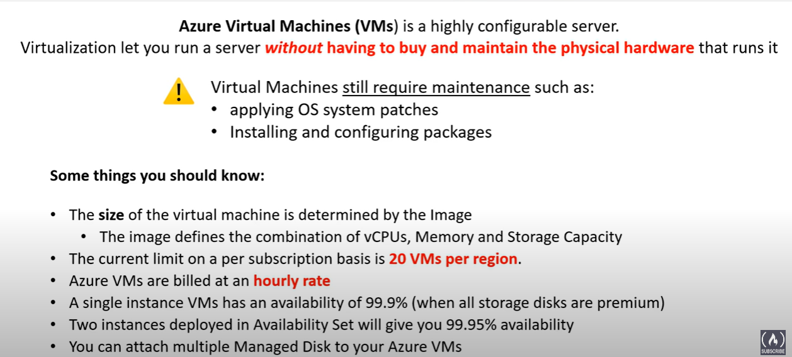

# AZ Virtual Machine

## Scenario 

Your company is doing consumer research, and your team manages the on-premises servers. The servers you administer run the entire company infrastructure from web servers to databases. However, the hardware is aging and starting to struggle to keep up with some of the new data analysis applications being deployed. Rather than upgrade the hardware, the company has decided to deploy Azure virtual machines.  

  

Azure Virtual Machines is the basis of the Azure infrastructure as a service (IaaS) model. 
- **IaaS is an instant computing infrastructure, provisioned and managed over the internet.**
- A virtual machine provides its own OS, storage, and networking capabilities, and can run a wide range of applications.
- You can implement multiple virtual machines, and configure each machine with different software and settings to support separate operation scenarios, such as development, testing, and deployment.
- You can use virtual machines to quickly scale up and down with demand and pay only for what you use.

The responsibilities associated with configuring and maintaining virtual machines is shared between Microsoft and the customer.  
The following chart shows how the responsibilities are handled across the `IaaS` (virtual machines), `PaaS`, `SaaS`, and `on-premises` offerings.

## VM & Networking Components

Once VM is created, the networking components will be either created or associated to the VM.  

## Benefit IaaS & VMs

1. **Test and Development**. 
IaaS and VMs make it quick and economical to scale up dev-test environments up and down.
2. **Website hosting**. 
Less expensive than traditional web hosting.
3. **Storage, Backup, & Recovery**. 
VMs let organizations avoid the expense for storage and complexity of storage management.
Recovery typically requires a skilled staff to manage data and meet legal and compliance requirements. 
IaaS is useful for handling unpredictable demand and steadily growing storage needs.  
You can simplify planning and management of backup and recovery systems.
1. Consider **high-performance computing**. 
Virtual machines enable high-performance computing (HPC) on supercomputers, computer grids, or computer clusters. 
HPC helps solve complex problems involving millions of variables or calculations. 
You can support scenarios such as earthquake and protein folding simulations, climate and weather predictions, financial modeling, and evaluating product designs.
1. Consider **big data analysis**.  
Big data is a popular term for massive data sets that contain potentially valuable patterns, trends, and associations.  
Mining data sets to locate or tease out these hidden patterns requires a huge amount of processing power, which IaaS economically provides.
1. Consider **extended datacenters**. 
Add capacity to your datacenter by adding virtual machines in Azure.  
Avoid the costs of physically adding hardware or space to your physical location.  
Connect your physical network to the Azure cloud network seamlessly.  

Cloud-Init
- Cloud-init is an open-source package widely used in cloud computing environments to perform initial configuration of virtual machines (VMs) during their instantiation.
- Azure VM supports for Cloud-Init Across Most Linux Distros That Support It

Cloud Instance Initialization
- The Process of Preparing an Instance with config-data for OS and Runtime Env
- Initialized From A Disk image and Instance Data
  1. User Data
  2. Meta Data
  3. Vendor-Data 

User Data is Script that You want to RUN when an Instance first boots up
e.g. Apache Web-Server. 

## Deploy Vm resource

Consider network configuration, machine name, location, size, storage, pricing, and operating system.

### Virtual Network 

Virtual networks are used in Azure to provide private connectivity between Azure VMs and other Azure services.  
VMs and services that are part of the same virtual network can access one another.   

**By default, services outside the virtual network can't connect to services within the virtual network**. 
**You can, however, configure the network to allow access to the external service, including your on-premises servers.**
**Network addresses and subnets aren't trivial to change after they're configured.**  

If you plan to connect your private company network to the Azure services, make sure you consider the topology before you put any virtual machines into place.

### Naming conventions

for example : `<env_OR_purpose><location>-<role><product_service><instance>` `devusc-webvm01`

### Location

The regional location lets you place your virtual machines as close as possible to your users. 

The location of the machine can improve performance and ensure you meet any legal, compliance, or tax requirements.

There are two other points to consider about the virtual machine location.
1. The machine location can limit your available options. Each region has different hardware available, and some configurations aren't available in all regions.
2. There are price differences between locations. To find the most cost-effective choice, check for your required configuration in different regions.

### VM-Size

Azure offers different memory and storage options for different virtual machine sizes. 

Rather than specify processing power, memory, and storage capacity independently, Azure provides different virtual machine sizes that offer variations of these elements in different size configurations.

The best way to determine the appropriate machine size is to consider the type of workload your machine needs to run. 
Based on the workload, you can choose from a subset of available virtual machine sizes (to optimized for specific use cases).  
  

#### Resizing 

Azure allows you to change the VM size when the existing size no longer meets your needs. 

You can resize a virtual machine if your current hardware configuration is allowed in the new size. 
This option provides a fully agile and elastic approach to virtual machine management.   
**When you stop and deallocate the virtual machine, you can select any size available in your region.**

:::danger  
**Resizing a machine might require a restart that can cause a temporary outage or change configuration settings such as the IP address.**  
:::  

### AZ storage 

Azure Managed Disks handle Azure storage account creation and management in the background for you. You specify the disk size and the performance tier (Standard or Premium). Azure creates and manages the disk. As you add disks or scale the virtual machine up and down, you don't have to worry about the storage being used.

### Virtual machine pricing options

**A subscription is billed two separate costs for every virtual machine: compute and storage.**  
By separating these costs, you can scale them independently and only pay for what you need.  

**Compute expenses are priced on a per-hour basis but billed on a per-minute basis.**

If the virtual machine is deployed for 55 minutes, you're charged for only 55 minutes of usage. You're not charged for compute capacity if you stop and deallocate the virtual machine. The hourly price varies based on the virtual machine size and operating system you select. For the compute costs, you're able to choose from two payment options:

- Consumption-based: 
With the consumption-based option, you pay for compute capacity by the second. You're able to increase or decrease compute capacity on demand and start or stop at any time. Use consumption-based pricing if you run applications with short-term or unpredictable workloads that can't be interrupted. An example scenario is if you're doing a quick test or developing an app in a virtual machine.

- Reserved Virtual Machine Instances:  
The Reserved Virtual Machine Instances (RI) option is an advance purchase of a virtual machine for one or three years in a specified region. The commitment is made up front, and in return, you get up to 72% price savings compared to pay-as-you-go pricing. RIs are flexible and can easily be exchanged or returned for an early termination fee. Use this option if the virtual machine has to run continuously, or you need budget predictability, and you can commit to using the virtual machine for at least a year.

Storage costs are charged separately for the Azure Storage used by the virtual machine. 
The status of the virtual machine has no relation to the Azure Storage charges that are incurred.  
You're always charged for any Azure Storage used by the disks.  

### OS & Images

Images can be found in the Azure Marketplace, for example 
- SUSE Enterprise
- RED Hat Enterprise 
- Ubuntu Server / Debian
- FreeBSD
- Azure Marketplace Flatcar Container Linux
- RancherOS
- Bitnami Library For Azure
- Mesosphere DC/OS on Azure
- Docker Images
- CloudBees Jenkins Platform

you can also create your own disk image. (64-bit operating systems is required) and it can be uploaded to Azure Storage and used to create an Azure virtual machine.  

> What is OS? The Program that manages all other programs in A Computer   

## Determine VM storage

VMs in Azure use disks as a place to store the operating system, applications, and data.  

All Azure virtual machines have at least two disks
- an operating system disk 
- a temporary disk. 

Virtual machines can also have one or more data disks.  
All disks are stored as virtual hard disks (VHDs).  
A VHD is like a physical disk in an on-premises server but, virtualized.  

You could `Bring Your Own Linux` by creating a linux Virtual Hard Driver
- `Hyper-V VHD` format is not supported in Azure ONLY FIXED `VHD`

### OS disk 

The OS disk has a pre-installed operating system, which **is selected when the VM is created**.   
The OS disk is registered as a **SATA drive** (Serial Advanced Technology Attachment) and labeled as the `C:` drive by default.

### Temporary Disk 

Data on a temporary disk might be lost during a maintenance event or when you redeploy a virtual machine  
> Any data on the temporary drive shouldn't be data that's critical to the system.  

On Windows virtual machines, the temporary disk is labeled as the `D:` drive by default. 
- This drive is used for storing the` pagefile.sys` file.

On Linux virtual machines, the temporary disk is typically `/dev/sdb`. 
- This disk is formatted and mounted to `/mn`t by the Azure Linux Agent.

> This disk provides temporary storage for applications and processes and is intended to only store data like page or swap files.

### Data Disk 

> A data disk is a managed disk that's attached to a virtual machine to store application data, or other data you need to keep. 

Data disks are registered as `SCSI` drives and are labeled with a letter you choose.   

**The size of a virtual machine determines how many data disks you can attach and the type of storage you can use to host the data disks.**  

### Choose your Storage for your VM

## Create VM in AZ portal

- The `Basics` tab contains the project details, administrator account, and inbound port rules.  
- On the `Disks` tab, you select the OS disk type and specify your data disks.  
- The `Networking` tab provides settings to create virtual networks and load balancing.  
- On the `Management` tab, you can enable auto-shutdown and specify backup details.  
- On the `Advanced` tab, you can configure agents, scripts, or virtual machine extensions.  
- Other settings are available on the Monitoring and Tags tabs.  

https://learn.microsoft.com/en-us/training/modules/configure-virtual-machines/6-create-portal

## Azure Compute Unit, ACU

ACU provides a way of comparing compute CPU performance across AZ-SKUs

## VM (Hyper-V) Generations
 

Hyper-V
- MS' hardware virtualization Product 
- Hyper-V just like Virtual Box

## (Connect) Accessing AZ VM

you can connect Azure virtual machines with the `SSH` and `RDP` protocols, `Cloud Shell`, and `Azure Bastion`.

### SSH 

To connect to a Linux-based virtual machine 
- port `22` TCP
- RSA key accessing authorization

SSH key pairs has 2 keys `ssh-keygen -t rsa`   
- The public key is placed on your Linux virtual machine, or any other service that you wish to use with public-key cryptography.
- The private key remains on your local system.

`ssh -i ~/.ssh/id_rsa.pub <vm-user-name>@<public_addr_ip>`  
> Protect your private key. Don't share your private key. Your public key can be shared with anyone, but only you (or your local security infrastructure) should possess your private key.

## AZ Update Management 

- Allow you to manage and install O.S updates and patches for both win & linux VM that are deployed in Azure, On-premises, or in other cloud providers
- Perform every 12H on a Win and every 3H on a linux by default
- GO Operations | Guest + Host Update , it install the MS Monitoring Agent (MMA) 

### AZ automation 
  
It allows us enable Update Management, Change Tracking & Inventory, and Start/Stop Vms during Off-Hours Features For Your Servers And Virtual machines.  

These Features have a dependency on a LOG Analytics workspace, and therefore Require Linking The WorkSpace With An Automation Account

Delete VM should also delete related Resource Group

## SSH 

Create A VM : Virtual Machine | Add | Select an Image (FROM MARKETPLACE) , Select a VM Size , Select Authentication Type [SSH PUBLIC KEY] | Select inbound port [Port 22] | Select OS disk Type [Standard SSD] | Select Encryption Type [By Default]

`GO NETWORK | SSH [SETUP SSH] | BASTION [ADD VM SUBNET] & [UPLOAD *.pem file] | ENTER BROWSER MODE TO OPERATE VM`

Log Analytics workspace
- Keep the error logs

Automation Account
- Let update management work
- Once A Automation Account is created A update management can be setup by you 
- Runbooks gallery : Provide script run automatically for specific purpose 
- Python Package

Server Manager In WIN VM
- All Servers | Start Performance Counters, sending metrics to Diag

### Bastion 

The Azure Bastion service is a fully platform-managed PaaS service.  
Azure Bastion provides secure and seamless RDP/SSH connectivity to your virtual machines directly over SSL. 

It provides
- browser and the Azure Portal
- for person who uses the OS that has no terminal (google chrome book etc.)
- Subnet to VNet (called `AzureBastionSubnet`, 32 address)

When you connect via Azure Bastion, your virtual machines don't need a public IP address. 
https://learn.microsoft.com/en-us/training/modules/configure-virtual-machines/7-connect-to

**Azure Bastion protects your virtual machines from exposing RDP/SSH ports to the outside world** while still providing secure access with RDP/SSH.  
**Azure Bastion lets you connect to the virtual machine directly from the Azure portal.**  
You aren't a client, agent, or another piece of software.  

### RDB  

To connect to a Windows-based virtual machine hosted on Azure

Remote Desktop Protocol 
- provide GUI  
- port 3389 via TCP and UDP  

To create an RDP connection, you specify the IP address for the virtual machine.     
As an option, you can select the port to use for the connection.  
The system provides you with a downloadable RDP file to use for the connection.  