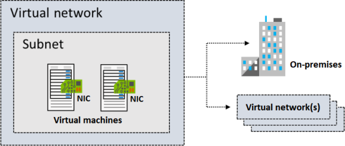
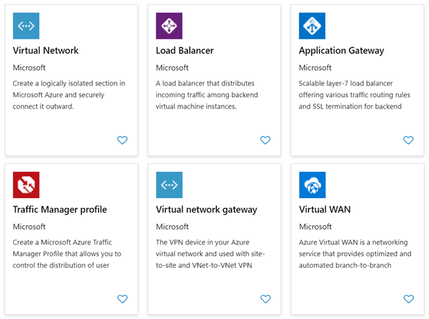
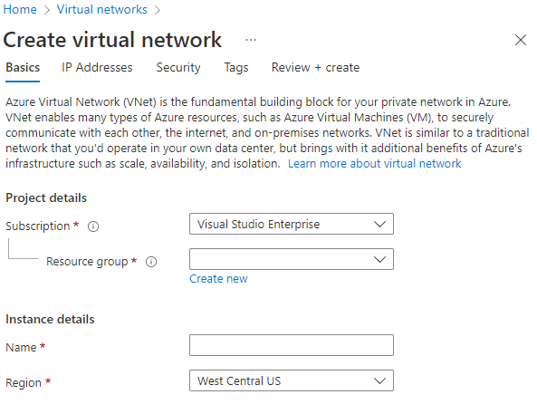
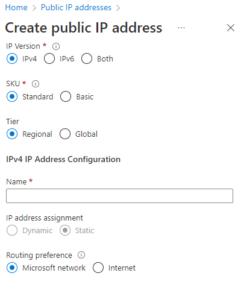
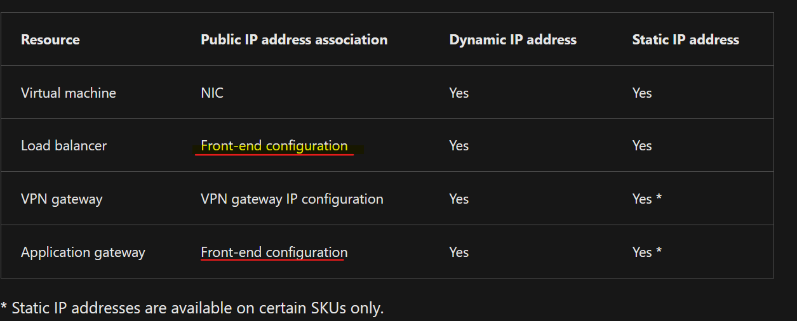
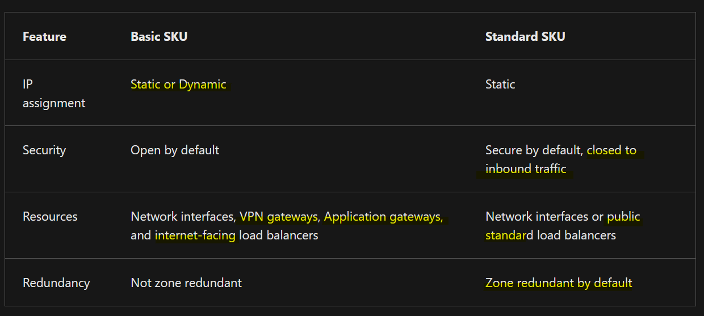
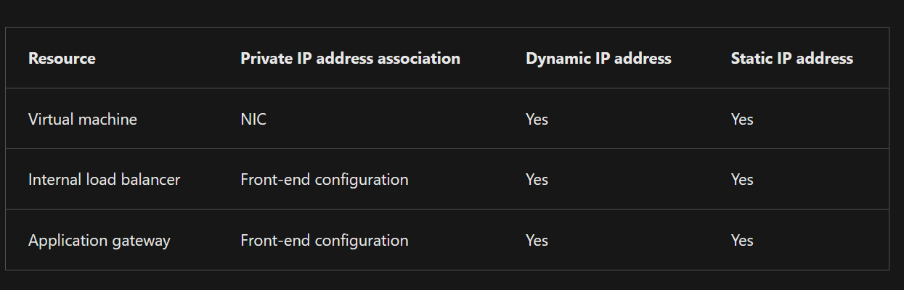

# VNet

**An Azure virtual network is a logical isolation of the Azure cloud resources**.  
Azure virtual networks are an essential component for creating `PRIVATE` networks in Azure.  

Catch Up
- Azure virtual networks **allow different Azure resources to securely communicate with each other, the internet, and on-premises** networks.  
- Subnets within virtual networks provide logical divisions, improving security, performance, and management.  
- When creating virtual networks, ensure that the IP address space is unique and doesn't overlap with other subnets.  
- IP addresses can provide public or private access to resources.  

VNets allow different Azure resources to securely communicate with each other, the `internet`, and `on-premises` networks.
- Each virtual network has its own **Classless Inter-Domain Routing (CIDR) block and can be linked to other virtual networks and on-premises networks.**
- VNet connects Azure resources including virtual machines, the `Azure App Service Environment`, `Azure Kubernetes Service (AKS)`, and `Azure Virtual Machine Scale Sets`.
- Moving resources to the cloud can save money and simplify administrative operations.  

You can
1. **use VNets to provision and manage `Virtual Private Networks (VPNs)` in Azure.** 
2. **use service endpoints to connect to other Azure resource types**, such as `Azure SQL databases` and `storage accounts`.
3. link virtual networks with an on-premises IT infrastructure to create hybrid or cross-premises solutions, when the CIDR blocks of the connecting networks don't overlap.
4. control the DNS server settings for virtual networks, and segmentation of the virtual network into subnets.

- :arrow_up: shows this virtual network that has a subnet containing two virtual machines. 
- :arrow_up: shows this virtual network has connections to an on-premises infrastructure and a separate virtual network.

## AZ network services

### Considerations

Create a `dedicated private cloud-only virtual network`
- your services and virtual machines within your virtual network can communicate directly and securely with each other in the cloud.
You can still configure endpoint connections for the virtual machines and services that require internet communication, as part of your solution.

Securely `extend your data center with virtual networks`
- 組建傳統的站對站 VPN 以安全地擴充資料中心容量
- 站對站 VPN 使用 IPSEC 在貴公司 VPN 閘道與 Azure 之間提供安全連線。

Enable `hybrid cloud` scenarios
- You can securely connect cloud-based applications to any type of on-premises system, such as mainframes and Unix systems.

## Subnets

Virtual Networks 可以分割成子網路，以協助改善**安全性**、提升效能及管理。

### 保留的位址 Reserved addresses

Available : `4` ~ `254`  
Reserved : `0`,`1`,`2`,`255`  

`192.168.1.0`	
- 此值會識別虛擬網路位址。  

`192.168.1.1`	
- Azure 會將此位址設定為預設閘道。  

`192.168.1.2` & `192.168.1.3`	
- Azure 會將這些 Azure DNS IP 位址對應至虛擬網路空間。  

`192.168.1.255`	
- 這個值會提供虛擬網路廣播位址。  

### Considerations

Consider service requirements
- A service might require or create their own subnet. There must be enough unallocated space to meet the service requirements.  
Suppose you connect a virtual network to an on-premises network by using Azure VPN Gateway. 
The virtual network must have a dedicated subnet for the gateway.  

Consider network virtual appliances

Consider service endpoints for limiting access

Consider network security groups
- Each network security group contains rules that allow or deny traffic `to and from` sources and destinations.

Consider private links
- Private Link simplifies the network architecture and secures the connection between endpoints in Azure. The service eliminates data exposure to the public internet.

### Creations

https://learn.microsoft.com/en-us/training/modules/configure-virtual-networks/4-create-virtual-networks

1. Define IP address 
   1. The address space for the network can be either on-premises or in the cloud, but not both.
   2. Once you create the IP address space, it can't be changed.  
   If you plan your address space for cloud-only virtual networks, you might later decide to connect an on-premises site.
2. To create a virtual network, you need to define at least one subnet
   1. Each subnet contains a range of IP addresses that fall within the virtual network address space.
   2. The address range for each subnet must be unique within the address space for the virtual network.
   3. **The range for one subnet can't overlap with other subnet IP address ranges in the same virtual network.**

In AZ portal   
  
> Default limits on Azure networking resources can change periodically. Be sure to consult the Azure networking documentation for the latest information.  

## IP addressing

Assign IP addresses to Azure resources to communicate with other Azure resources (`on-premises network`/`the internet`)

There are two types of Azure IP addresses :  
- `Private` enables communication within an Azure virtual network and your on-premises network
- `Public` allows your resource to communicate with internets such as virtual machine network `interfaces`, internet-facing `load balancers`, VPN & application `gateways`

> Dynamic assignment is the default allocation method.  

### IP addresses assignment type

Azure can provide an IP address (dynamic assignment) or you can assign the IP address (static assignment).

IP addresses can be `statically assigned` or `dynamically assigned`.

You can separate `dynamically` and `statically assigned` IP resources into different subnets.

### Advantage of Static IP Address 

Static IP addresses don not change and are best for certain situations, such as:
1. `DNS` name resolution, where a change in the IP address requires updating host records.
2. `IP address-based` security models that require apps or services to have a static IP address.
3. `TLS/SSL` certificates linked to an IP address.
4. `Firewall rules` that allow or deny traffic by using IP address ranges.
5. `Role-based virtual machines` such as Domain Controllers and DNS servers.

### Public Addressing Creation

public IP addressing

`IP Version`: `IPv4` or `IPv6` address, or `Both` addresses.   
- The `Both` option creates two public IP addresses: an IPv4 address and an IPv6 address.  

`SKU`: **Select the `SKU` for the public IP address**, including `Basic` or `Standard`. 
- The value must match the SKU of the Azure load balancer with which the address is used.
- When you create a public IP address, you select the Basic or Standard SKU.  
**Your SKU choice affects the IP assignment method, security, available resources, and redundancy options.**

`Name`: Enter a `name` to identify the IP address. 
- **The `name` must be unique** within the resource group you select.

IP address assignment: Identify the type of IP address assignment to use.
- Dynamic addresses are assigned after a public IP address is associated to an Azure resource and is started for the first time. 
  - **Dynamic addresses can change if a resource such as a virtual machine is stopped (deallocated) and then restarted through Azure.** 
  - The address **remains the same if a virtual machine is rebooted or stopped from within the guest OS.**
  - When a public IP address resource is removed from a resource, the dynamic address is released.
- Static addresses are assigned when a public IP address is created. 
  - Static addresses aren't released until a public IP address resource is deleted. 
  - **If the address isn't associated to a resource, you can change the assignment method after the address is created.** 
  - If the address is associated to a resource, you might not be able to change the assignment method.

### Private Addressing Creation

A private IP address resource can be associated with `virtual machine network interfaces`, `internal load balancers`, and `application gateways`.   
  

`Dynamic`: 
Azure assigns the next available unassigned or unreserved IP address in the subnet's address range.  
- Suppose addresses `10.0.0.4` through `10.0.0.9` are already assigned to other resources. 
In this case, Azure assigns the address `10.0.0.10` to a new resource.  

`Static`: 
You select and assign any unassigned or unreserved IP address in the subnet's address range.
- Suppose a subnet's address range is `10.0.0.0/16`, and addresses `10.0.0.4` through `10.0.0.9` are already assigned to other resources.  
- In this scenario, you can assign any address between `10.0.0.10` and `10.0.255.254`.  

