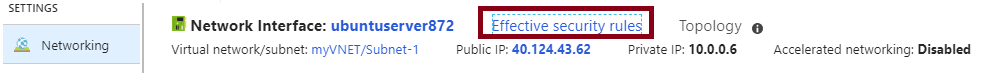
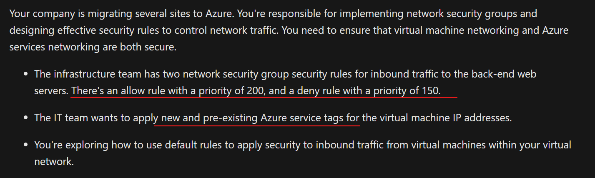
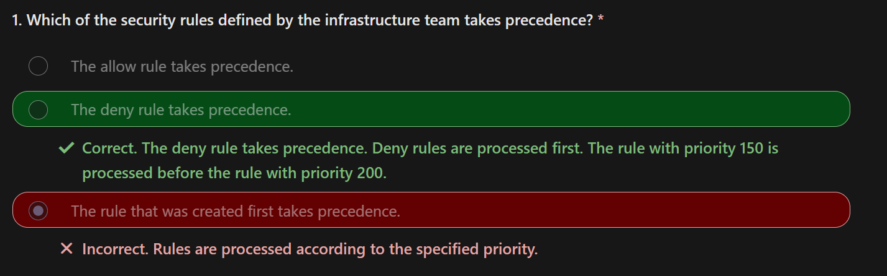
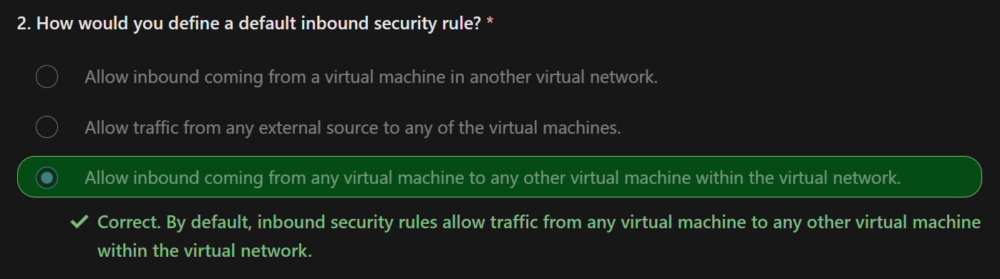
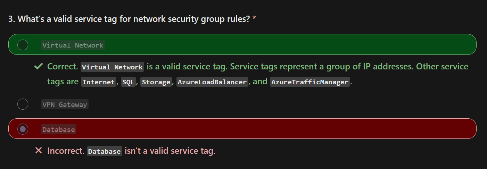

# Network Security

Catch Up
- Network security groups are essential for controlling network traffic in Azure virtual networks.
- NSG rules are evaluated and processed based on priority and can be created for subnets and network interfaces.
- Effective NSG rules can be achieved by considering rule precedence, intra-subnet traffic, and managing rule priority.
- Application security groups provide an application-centric view of infrastructure and simplify rule management.

## Network Security Groups, NSGs

NSG的目的 : 
Network Security Groups are a way to **(作用對象) limit network traffic to resources in your virtual network**. 

透過什麼實現 :
**A network security group contains a list of (透過什麼設定)security `RULES` to allow or deny inbound or outbound traffic** to resources in your VNet.

### Check If VM is associated with any NSGs

The `Overview` page in Azure Portal for a virtual machine provides information about the associated network security groups.   
  

### DMZ/demilitarized zone

A DMZ network (also known as Components of a perimeter network) provides an extra layer of security to an internal
network.  
It acts as a BUFFER between resources within your virtual network and the internet.

### :star: Associations (NSG能關聯的對象)

A network security group can be associated multiple times to
- a subnet
- a network interface.

### :star: NSG Assignment  

[Create, change, or delete a network security group](https://learn.microsoft.com/en-us/azure/virtual-network/manage-network-security-group?tabs=network-security-group-portal)

:arrow_up: **A NSG Resource(e.g. `NSG1`) can be attached to multiple subnets and/or network interfaces.**

Unless you have a specific reason to, **it is recommended that you associate a network security group to a subnet or a network interface, but not both.**  

Subnet
- Use the NSG to restrict traffic flow to all VMs that reside within the subnet.
- Each Subnet can have a `maximum of one` associated NSG.  

NIC
- Define NSG rules to control all traffic that flows through a NIC.
- **Each Network Interface that exists in A SUBNET can have `zero`, or `one`, associated NSGs**

## Security Rules In NSG

Security rules in NSGs enable you to filter (`inbound` and `outbound`) network traffic.

- **Azure creates the DEFAULT SECURITY RULES in each NSG** that you create and **NOT ABLE TO REMOVE IT.** 
- **You can override a default security rule by creating another security rule with a HIGHER PRIORITY setting for your NSG.**
- All security rules for a network security group are processed in priority order.

### Add Inbound / OutBound Security Rules in NSG resource

Some important rules configuration condition settings:  
- Name (e.g. `AllowAnyDeviceOutBound`)
- Priority (the higher value than the lower order)
- Port (e.g. `1.10.2.0/26`, `*`)
- Protocol (`Any`, `TCP`, `UDP` and `ICMP`)
- Source (`Any`, `IP addresses`, `Service tag`)
- Destination (`Any`, `IP addresses`, `Virtual network`)
- Action (`Allow` or `Deny`)

Examples  

- **Allow inbound traffic from your virtual network and Azure load balancers ONLY**

- **Only allow outbound traffic to the internet and your virtual network.**

### View The Rules

### :star: Example

**Each network security group and its defined security rules are evaluated independently.**

For inbound traffic, Azure first processes NSG security rules for any associated `subnets` and then any associated `network interfaces`. (inbound -> subnet -> nic)

For outbound traffic, the process is reversed.   
Azure first evaluates NSG security rules for any associated network interfaces followed by any associated subnets. (outbound -> nic -> subnet)

For both the inbound and outbound evaluation process, Azure also checks how to apply the rules for intra-subnet traffic.

:arrow_down: Show network security groups (NSGs) controlling traffic to virtual machines (VMs).

- **Each VM has a network interface card (NIC).**
- The configuration requires security rules to manage network traffic `to` and `from` the internet over TCP port `80` via the network interface.  
- `Subnet 1` contains two virtual machines :  
VM 1 and VM 2.  
- `Subnet 2` and `Subnet 3` each contain one virtual machine :   
VM 3 and VM 4, respectively.  

### Inbound traffic effective rules : DenyAllInbound

When an NSG is created, Azure creates the default security rule `DenyAllInbound` (deny all inbound traffic from the
internet) for the group.

Azure identifies
1. if the VMs are members of an NSG
2. if they have an associated subnet or NIC.

If an NSG has a subnet or NIC, the rules for the subnet or NIC can override the default Azure security rules.

- n the same VM, NSG inbound rules for a subnet take precedence over (`>>>>`) the ones for a NIC

### Outbound traffic effective rules : AllowInternetOutbound

When an NSG is created, Azure creates the default security rule `AllowInternetOutbound` (allow all outbound traffic to
the internet.) for the group.

Azure processes rules for outbound traffic by first examining NSG associations for NICs in all VMs.

If an NSG has a subnet or NIC, the rules for the subnet or NIC can override the default Azure security rules.

- NSG outbound rules for a NIC in a VM take precedence over (`>>>>`) the ones for a subnet.

### Check Effective Security Rules Information in AZ Portal

You can use the tab `Effective security rules` link in the Azure portal to verify which security rules (of NSGs) are applied to your machines, subnets, and network interfaces.

`Setting | Networking`  

### NGS rule Setup

You can configure your virtual network security group rule settings, and **select from a large variety of communication services, including `HTTPS`, `RDP`, `FTP`, and `DNS`.**

##### Configuration Options

Source
- The source filter can be any resource, an `IP address range`, an `application security group`, or `a default tag`.

Destination
- The value can be any resource, an `IP address range`, an `application security group`, or a `default(service) tag`.

Service
- you can choose a predefined service like `RDP` or `SSH` or provide a `custom port range`.

Priority
- The lower the priority value, the higher priority for the rule.

## Application Security Groups, ASG

ASGs work in the same way as NSGs.  
You join your VMs to an ASG.  You join your VMs to an ASG.  
Then you use the ASG as a source or destination in the NSG rules configuration.  

**Question :**

Requirement
- We have 6 VMs in our configuration with two web servers and two database servers.
- Customers access the online catalog hosted on our web servers.
- The web servers must be accessible from the internet over `HTTP port 80` and `HTTPS port 443.`
- Inventory information is stored on our database servers.
- The database servers must be accessible over `HTTPS port 1433.`
- Only our web servers should have access to our database servers.

1. **Create `application security groups` for the VMs.**
    - Create an application security group named `WebASG` to group our web server machines.
    - Create an application security group named `DBASG` to group our database server machines.
2. **Assign the `network interface` for the VMs.**
    - For each VM server, assign its NIC to the appropriate application security group.
3. **Create the `NSG` & `security rules`.**
    - `Rule 1`:
      Set Priority to 100. Allow access from the internet to machines in the WebASG group from HTTP port 80 and HTTPS
      port 443.  
      It has the lowest priority value, so it has precedence over the other rules in the group.  
      Customer access to our online catalog is paramount in our design.
    - `Rule 2`:
      Set Priority to 110. Allow access from machines in the WebASG group to machines in the DBASG group over HTTPS port
      1433.
    - `Rule 3`:   
      Set Priority to 120. Deny access from anywhere to machines in the DBASG group over HTTPS port 1433.    
      `Rule 2` and `Rule 3` ensures that only our web servers can access our database servers.

### When should you apply ASG

There are few considerations below  

For Better IP address maintenance. (更有效率的管理多個VMs的IP)
- If you HAVE MANY virtual machines in your configuration, it can be difficult to specify all of the affected IP
  addresses.  

**No subnets.**

Simplified Security rules (整合 + 統一 Security Rules)
- ASGs help to eliminate the need for multiple rule sets.   
**You don't need to create a Separate Rule for each virtual machine.**
- New security rules are automatically applied to all the virtual machines in the specified ASG.

Workload support (便捷好懂得架構設計Pattern)
- A configuration that implements application security groups is easy to maintain and understand  
because the organization is based on workload usage  
(for your applications, services, data storage, and workloads.)

## In Actions

https://learn.microsoft.com/en-us/training/modules/configure-network-security-groups/7-simulation-create-network-groups

  
  
  
  