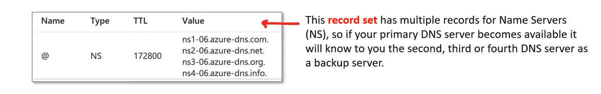
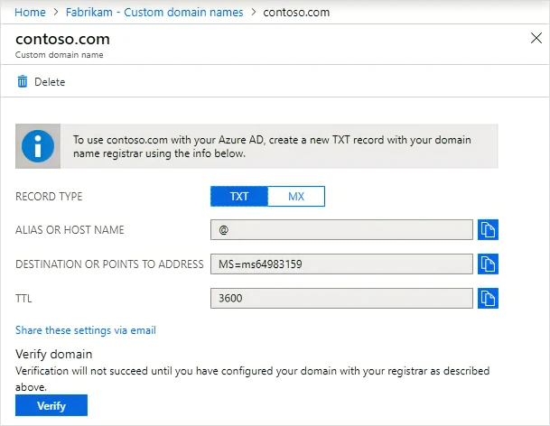
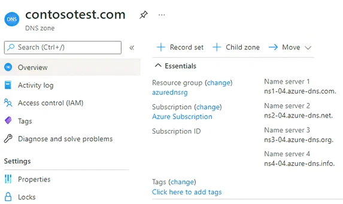
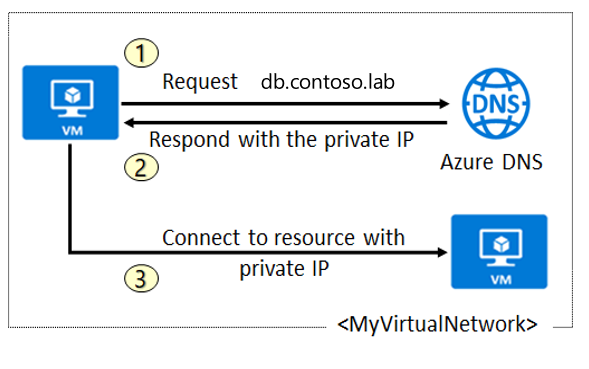
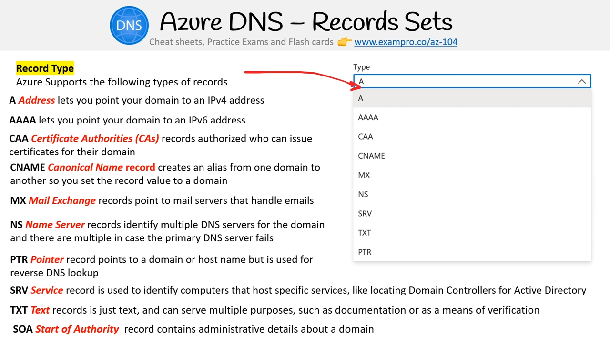
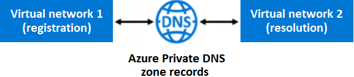
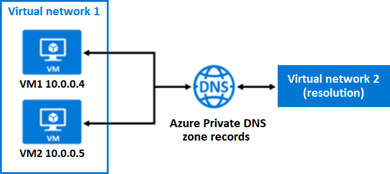

# Azure DNS

Azure DNS should have these configurations
1. DNS record :  
A rule that says where to send your domain name.  
It is composed of   
  - `name` tells record how to listen. e.g `www`.  
  - `type` tells how to handle the record. e.g. `A`.    
  - `value` inform us what we should e.g. IP address
2. Record Set :  
Group of bunch of DNS records

3. DNS zone :  
A container for all your DNS records for a specific Domain Name

> **In Azure You Always Create Record Sets** even there is no dns records in set. 

## What is Azure DNS

1. DNS Hosting
Allow you to host your DNS domain in AZ and provide name resolution using MS AZ Infrastructure
2. Integration with AZ Services
Manage your DNS records using same credentials, APIs, tools, and billing as your other AZ Services
3. Free DNS Queries
Azure DNS provides faster responses to DNS queries with a global network of name servers.
4. High Availability
Azure DNS ensures ultra-high availability for your domains with the scale and redundancy of the Microsoft global network of name servers.
5. Private Zones and Private Resolver
Azure DNS also supports `private DNS domains` and `Private Resolver`, allowing you to use your own custom domain names in your private virtual networks.
6. Security
Azure DNS is based on Azure Resource Manager, which provides features such as Azure role-based access control (Azure RBAC) and activity logs to monitor how a user in your organization modified a resource.

## Initial Domain Name & Custom Domain Names Implementation

When `a global administrator` creates an AZ subscriptions, Azure automatically creates a `Microsoft Entra domain` for your subscription   
Azure applies an initial domain name to your initial domain instance that follows the form `<Your Domain Name>` followed by `.onmicrosoft.com`.  

The purpose of a custom domain name is to provide `a simplified form` to support `specific users` or `tasks`.  
For example: 
Azure creates the initial domain name for the Microsoft Entra instance as `azureadminincorg.onmicrosoft.com`.   
A custom domain name for the instance could be `azureadmininc.org.`

The initial domain name is intended to be used until your custom domain name is verified.  
Before a custom domain name can be used by `Microsoft Entra ID`, the custom domain name must be added to your directory and verified.  

The initial domain name **can't be changed or deleted**, but you can add a routable custom domain name that you control.

In `Microsoft Entra ID`, domain names must be globally unique. **When one `Microsoft Entra directory` has verified a specific domain name, other Microsoft Entra directories can't use that same domain name.**  

## Custom Domain Name Verification 

you must verify ownership of your custom domain name for your Microsoft Entra instance in the Azure portal.  

You initiate the verification process by adding a DNS record for your custom domain name.

### DNS Record

The DNS record type can be `MX` or `TXT`.  
- The `MX` (or Mail exchange) record lists mail exchange servers that accept email for your domain
- The `TXT` (or Text) record indicates human-readable text or machine-readable data about your domain.


After the verification process, Azure adds your new custom domain name to your subscription for the Microsoft Entra instance.

> The Azure verification process can take several minutes or hours.

## DNS Zones

Azure provides Secure DNS service to manage and resolve domain names in a virtual network without needing to add a custom DNS solution.  

You need to create a DNS zone for your domain name to host your domain in Azure DNS.  
- **An `Azure DNS zone` hosts the `DNS records` for a domain. Each DNS record for your domain is then created inside your DNS zone**

> A Domain must be created before configuring.  

### Characteristics 

Within a resource group, **the name of a DNS zone must be unique**.  
- **Multiple DNS zones can have the same name, but the DNS zones must exist in different resource groups or in different Azure subscriptions.**
- When multiple DNS zones share the same name, each DNS zone instance is assigned to a different DNS name server address.

The `Root/Parent` domain is registered at the registrar and then pointed to Azure DNS.  
`Child` domains are registered directly in Azure DNS.  

### Name Server

In Azure DNS, **a Name Server is a server that hosts a DNS zone**.   
Each time a zone is created in Azure DNS, it is assigned name servers from a pool.   
These name servers are part of Azure's global network of DNS name servers.   

1. When you create a DNS zone in Azure, you are given a list of name servers.
   - These name servers are then configured at your domain registrar for the domain that you are hosting in Azure.
2. The registrar stores the Name Server (NS) records in the parent zone (for example, `.com` for `contoso.com`).
3. Internet users around the world are then directed to your domain in your Azure DNS zone when they try to resolve DNS records in your domain1.

**This setup ensures that each DNS query is answered by the closest available DNS server**, providing fast performance and high availability for your domain.

## Delegate DNS domains

`Azure DNS(domain (DNS Zone(DNS NAME Servers)))`

To delegate your domain to Azure DNS, you need to identify the DNS name servers for your DNS zone.
**Each time a DNS zone is created, Azure DNS allocates DNS name servers from a pool.**   
After the DNS name servers are assigned, Azure DNS automatically creates authoritative NS (or Name server) records in your DNS zone.  

Identify your DNS name servers
- In the Azure portal, we can examine the custom domain and find that Azure assigned four DNS name servers to the DNS zone for the domain


Update your parent domain
- Each registrar has their own DNS management tools to manage the DNS name server records for a domain. 
- The term registrar refers to the third-party domain registrar, which is the company where you registered your domain.
- Process : `Registrar's DNS management page | Find the existing NS records for your parent domain | Replace the existing NS records with the NS records created for your domain by Azure DNS ` 

Delegate subdomains (optional)
- You can delegate a subdomain for your domain in Azure DNS by setting up a separate child DNS zone.

> The parent and child DNS zones can be in the same or different resource group.

### NS records & Name Servers For DNS Zone

Considerations
1. When you copy an NS record (a DNS name server address), `be sure to include the trailing period (.) at the end of the address`.  
for example : `ns1-02.azure-dns.com.`, `ns3-02.azure-dns.org.`  
2. To delegate your domain to Azure DNS, you must use the exact names of the DNS name servers as created by Azure DNS

## DNS Records Sets 

https://learn.microsoft.com/en-us/training/modules/configure-azure-dns/6-add-dns-record-sets

A DNS record set (also known as a resource record set) is a collection of records in a DNS zone.

A Record that 
- has a name is considered a Fully Qualified Domain (FQDN) or you can think of it as a subdomain `https://{name}.exampro.co`
- left empty is considered an apex or naked domain e.g. `https://exampro.co`
- set wildcards which act as catch-alls e.g. `httpsL//*.exampro.co` or `https://*this.exampro.co`
- with `@` is a shorthand for saying ORIGIN which means you are pointing to the naked domain


All records in a DNS record set must `have the same name` and the `same record type`.
For example : 
1. All records have the same `name`
2. All records have the same `record type`
3. Each record in the set has a `different value` (unique)

```bash 
Name                    TTL          TYPE   IP Address
www.contoso.com.        3600    IN    A     134.170.185.46
www.contoso.com.        3600    IN    A     134.170.188.221
```

Record Set Type `CNAME` (Canonical name record) can contain only one record
- It provides an alias of one domain name to another
- The `DNS lookup operation` tries to find your domain by retrying the `lookup` with the other name specified in the `CNAME` record.
  
A Empty Record Set is allowed (which is called an empty record set)  
- the set doesn't appear on your Azure DNS name servers.

TTL
- tells other servers requesting you domain how long it should catch this record
- a long ttl can reduce costs coz server check less frequency
- a short TTL can have failover happen faster (you have to wait for the cache to expiry for a server)

## Azure Private DNS zones

**Azure Private DNS zones can be created by using your own custom domain names rather than the names provided by Azure.** 

You gain name resolution for virtual machines within your virtual network and between virtual networks. 

You can configure DNS zone names with a `split-horizon view`, which allows a `private` and a `public DNS zone` to `share the same domain name`.


Record Type


### Benefits 

1. No custom DNS solution required
Azure Private DNS removes the burden of creating and managing custom DNS solutions.
2. Support for common DNS records types  
`A`, `AAAA`, `CNAME`, `MX`, `PTR`, `SOA`, `SRV`, and `TXT`.  
3. Automatic hostname record management  
Azure Private DNS automatically maintains hostname records for the virtual machines in the specified virtual networks without needing to create custom DNS solutions or modify applications.
4. Hostname resolution between virtual networks 
Unlike Azure-provided host names, Azure Private DNS zones can be shared between virtual networks.  
Simplify cross-network and service-discovery scenarios, such as virtual network peering.  
5. Familiar tools and user experience
`PowerShell`, `Azure Resource Manager (ARM) templates`, and the `REST API`.
6. Split-horizon DNS support
7. Azure region support	  
AZ Private DNS zones are available in all AZ regions in the AZ public cloud.

### Alias 

Azure Alias that work with `A`, `AAAA` and `CNAME` records

So Azure Alias records always pont to the right place after you deploy a service (which causes the IP to change left domain dangling, pointing to now where)
- you don't have to manually update the record to the new correct address.  

### Scenarios 

Case 1  

- Virtual network 1 (`VNet#1`) is designated for `registration`. Virtual network 2 (`VNet#2`) is designated for `name resolution`.
- both virtual networks to share the common DNS zone address.  e.g. `contoso.lab`.
- both virtual networks are linked to the common DNS zone.
- Azure Private DNS zone records
  - in `VNet#1` are created **automatically**  
  - in `VNet#2` can be created **manually**  
- in Case 1, Azure DNS uses both virtual networks to resolve domain name queries.  
An Azure DNS query from a VM in `VNet#2` (resolution) for a VM in `VNet#1` (registration) receives an Azure DNS response containing the private IP address of the virtual machine.
- **Reverse DNS queries are scoped to the same virtual network.** For example 
  - A Reverse DNS (PTR) query from VM in `VNet#1` for a VM also in `VNet#1` receives the FQDN for the VM. 
  - A reverse DNS (PTR) query from a VM in `VNet#2` for a VM in `VNet#1` receives an Azure DNS response containing the `NXDOMAIN` of the virtual machine
  **NXDOMAIN is an error message that indicates the queried domain doesn't exist.**  

Case 2

- `VNet#1` contains two VMs: VM1 and VM2. VM1 and VM2 each have a private IP address.
- When an Azure Private DNS zone address is created (such as `contoso.lab`) and linked to `VNet#1`, Azure DNS automatically creates two A records in the DNS zone if Auto registration is enabled in the link configuration.
- In case2, Azure DNS uses only Virtual network 2 to resolve domain name (or DNS zone) queries.  
Azure DNS queries from VM1 in `VNet#1` to resolve the `VM2.contoso.lab` address receive an Azure DNS response that contains the private IP address of VM2 (`10.0.0.5`).  
- A reverse DNS query (PTR) for the private IP address of VM1 (10.0.0.4) issued from VM2 receive an Azure DNS response that contains the FQDN of VM1, as expected.  

