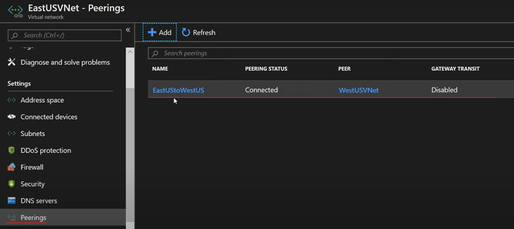

# VNet Peering

Virtual Network peering enables you to seamlessly connect two Azure virtual networks.  
After the networks are peered, the two virtual networks operate as a single network

There are two types of Azure Virtual Network peering: regional and global.

- Regional : AZ VNets in the same region   
e.g. in the same Azure public cloud region, or in the same China cloud region, or in the same Microsoft Azure Government cloud region.
- Global : AZ VNets in different region.   
e.g in any Azure public cloud region, or in any China cloud region.

**Global peering of virtual networks in different Azure Government cloud regions isn't permitted.**

**After you create a peering between virtual networks, the individual virtual networks are still managed as separate resources.**

## Catch Up

Azure Virtual Network peering allows for the connection of virtual networks in a hub and spoke topology.

There are two types of peering: regional and global. Regional peering connects virtual networks in the same region. Global peering connects virtual networks in different regions.

Network traffic between peered virtual networks is private and kept on the Azure backbone network.

You can configure Azure VPN Gateway in the peered virtual network as a transit point to access resources in another network.

Network security groups can be applied to block or allow access between virtual networks when configuring virtual network peering.


## Benefit 

Seamless data transfer
- AZ VNet peering configuration to transfer data across Azure subscriptions, deployment models, and across Azure regions.

(NO DOWNTIME) No resource disruptions while creating the peering
- AZ VNet peering doesn't require downtime for resources in either virtual network when creating the peering, or after the peering is created.

Simplified communication
- Azure Virtual Network peering lets resources in one virtual network communicate with resources in a different virtual network, after the virtual networks are peered.

Strong performance
- gain a low-latency, high-bandwidth connection between resources in different virtual networks. thanks to the Azure infrastructure

Private network connections
- Network traffic between peered virtual networks is private. 
- **Traffic between the virtual networks is kept on the Microsoft Azure backbone network.**
- **No public internet, gateways, or encryption is required in the compemunication between the virtual networks.**

## Azure VPN Gateway `Gateway Transit`

When virtual networks are peered, you can configure `Azure VPN Gateway` in the peered virtual network as a `transit point`.  

You can configure `Azure VPN Gateway` in the peered virtual network as a transit point to access resources in another network.  

> In Azure, `transitivity` refers to the ability of a network to route traffic across multiple paths.

How Azure VPN Gateway is implemented with Azure Virtual Network peering
- A virtual network can have only one VPN gateway.
- Gateway transit is supported for both `regional` and `global` virtual network ering.
    - Regional : Communications btw VM within SAME NETWORK
- When you allow VPN gateway transit, the virtual network can communicate to resources outside the peering.

Peering Type 
Use a `site-to-site` VPN to connect to an on-premises network.
Use a `vnet-to-vnet` connection to another virtual network.
Use a `point-to-site` VPN to connect to a client. (creates a secure connection to a virtual network from an individual client computer.)
- Gateway transit allows peered virtual networks to share the gateway and get access to resources.
- When you configure virtual network peering, **you can choose to open or close the network security group rules between the virtual networks**.

## Creation 

To implement virtual network peering  

In AZ portal   

Choose the VNet


`Setting | Peerings` IN CHOSEN VNet


You can check VM's private IP address by `Overview` in AZ Portal


Configurations 

1. Permission Rule  
Your Azure account must be assigned to the `Network Contributor` or `Classic Network Contributor role`.    
Alternatively, your Azure account can be assigned to a custom role that can complete the necessary peering actions.   
For details, see Permissions.   
 
2. Virtual Networks & Peering
To create a peering, you need two virtual networks.  
The second virtual network in the peering is referred to as the remote network.   
**Initially, the VMs in your virtual networks can't communicate with each other.**  

3. Peering  
After the peering is established, the machines can communicate within the peered network based on your configuration settings.  

### Status

Your peering isn't successfully established until both virtual networks in the peering have a **status of `Connected`**.  

For `deployment` with the Azure Resource Manager, the two primary status conditions are `Initiated` and `Connected`.  

For `the classic deployment` model, the Updating status condition is also used.  

When you create the initial peering to the second (remote) virtual network from the first virtual network, the peering status for the first virtual network is `Initiated`.  

When you create the subsequent peering from the second virtual network to the first virtual network, the peering status for both the first and remote virtual networks is Connected. In the Azure portal, you can see the status for the first virtual network change from `Initiated` to `Connected`.

## Hub And Spoke & User-defined routes

Help You Extend peering with user-defined routes and service chaining

Here comes the Scenario : 

We know that The communication capabilities in a PEERING that are **available to only the VNets and `resources` in the peering**.   

```python
A <---> B <---> C
```  

But The virtual network peering capabilities that you set up between networks B and C don't automatically enable peering communication capabilities between networks A and C.
```python 
A  ???  C
```

To enable peering communication btw A and C we need : 

HUB-and-SPOKE networks
- When you deploy a hub-and-spoke network, the hub virtual network can host infrastructure components like a network virtual appliance (NVA) or Azure VPN gateway. All the spoke virtual networks can then peer with the hub virtual network. Traffic can flow through NVAs or VPN gateways in the hub virtual network.

User-Defined Routes
- Virtual network peering enables the next hop in a user-defined route to be the IP address of a virtual machine in the peered virtual network, or a VPN gateway.

Service chaining
- Service chaining lets you define UDRs. 
These routes direct traffic from one virtual network to an NVA or VPN gateway.

```python
A <-> Extensions <-> C
```

