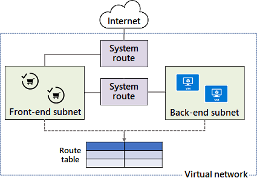
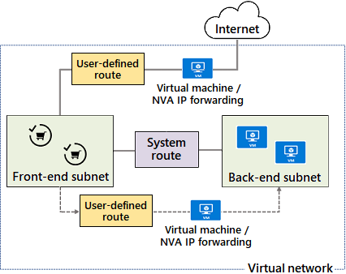
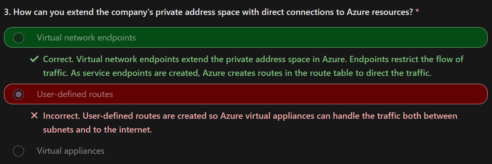
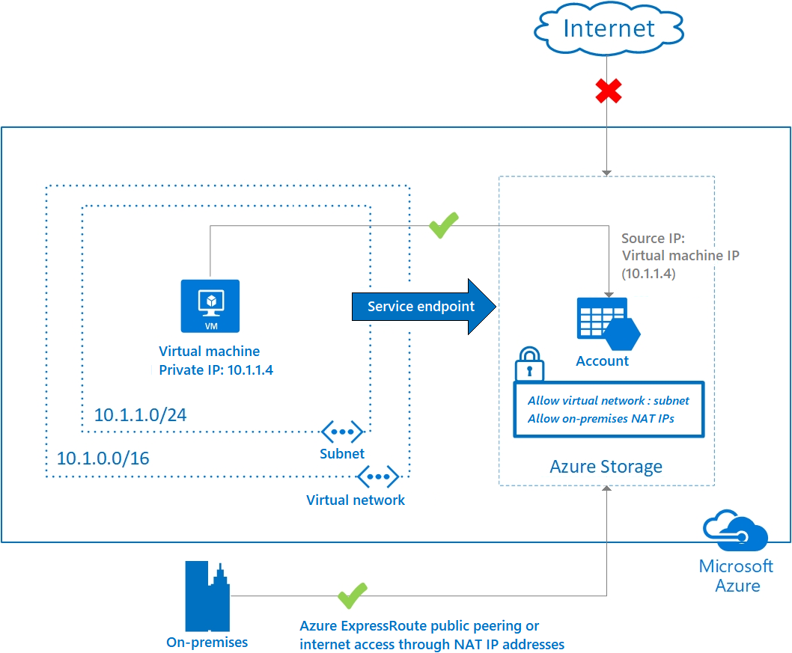

# Azure System Routes 

Router
> How to direct network traffic 

## System Routes & Route Tables 

Azure uses system routes to direct `network traffic between virtual machines`, `on-premises` networks, and the `internet`.   

**Information about the system routes is recorded in a route table.**   
you can use Azure system routes to control communication between the subnets and between subnets and the internet.  
For example a virtual network with two subnets. 

- A frontend subnet can use a system route to access the internet. 
- A backend subnet can use a system route to access the front-end subnet. 
Both subnets access a route table. 

## how Azure implements system routes.

A route table contains a set of rules (called `routes`) that specifies how packets should be routed in a virtual network.

Route tables record information about the system routes, where the tables are associated to subnets.   
Each packet leaving a subnet is handled based on the associated route table.

When a matching route can't be found, the packet is dropped.

**Packets are matched to routes by using the destination.** 
The destination can be an IP address, a VNet gateway, a virtual appliance, or the internet.

Azure uses system routes to control traffic for virtual machines in several scenarios:

Traffic (COMMUNICATION) between virtual machines 
1. In the same subnet
2. **In different subnets within the same VNet**

Traffic from VMs to the internet

## User Defined routes, UDR

Azure automatically handles all network traffic routing, but in some cases, a custom configuration is preferable to configure user-defined routes (UDRs) and next hop targets.    

UDRs control network traffic by defining routes that specify the next hop of the traffic flow.  

**Similar to system routes, UDRs also access route tables.**  

The next hop can be one of the following targets:  
- `Virtual network gateway`  
- `Virtual network`  
- `Internet`  
- `Network virtual appliance (NVA)`  
- `MS Edge`  
- `VNet Service Endpoint`  
- `VNet Peering`  
 
**Each route table can be associated to multiple subnets.**  
**Each subnet can be associated to one route table only.**   

For example : 
A virtual machine that performs a network function like `routing`, `firewalling`, or `WAN optimization`.  
You want to direct certain subnet traffic to the NVA. 
To accomplish this configuration, you can place an NVA between subnets or between one subnet and the internet.  
  
The subnet can use a UDR to access the NVA and then the internet.  
The subnet can use another UDR and NVA to access the back-end subnet.  

## Endpoint

A virtual network service endpoint provides the identity of your virtual network to the Azure service to **secure Azure service resources to your virtual network by adding a virtual network rule to the resources**.  

Azure service traffic from a virtual network uses public IP addresses as source IP addresses. 

With service endpoints, **service traffic switches to use virtual network private addresses as the source IP addresses** when accessing the Azure service from a virtual network. 

This switch allows you to access the services without the need for reserved public IP addresses that are typically used in IP firewalls.

**Service endpoints can extend your virtual network IDENTITY to your Azure services to secure your service resources**.
- Secure your Azure service resources to your virtual network by using virtual network rules.
- Virtual network rules can remove public internet access to resources, and allow traffic only from your virtual network.

Service endpoints always take service traffic directly from your virtual network to the service on the Microsoft Azure backbone network.

Service endpoints are configured through the subnet. 
No extra overhead is required to maintain the endpoints.

### Considerations

Consider `improved security for resources.`  
- you secure Azure service resources to your virtual network with virtual network rules. 
The rule improves security by fully removing public internet access to resources, and allowing traffic only from your virtual network.

Consider `optimal routing for service traffic/forced-tunneling`. 
- Routes in your virtual network that force internet traffic to your on-premises or network virtual appliances also typically force Azure service traffic to take the same route as the internet traffic. 
- This traffic control process is known as . Service endpoints provide optimal routing for Azure service traffic to allow you to circumvent forced tunneling.

Consider `direct traffic to the Microsoft network.` 
- Use service endpoints to keep traffic on the Azure backbone network. 
- This approach allows you to continue auditing and monitoring outbound internet traffic from your virtual networks, through forced-tunneling, without impacting service traffic.

Consider `easy configuration and maintenance` while configuring service endpoints in your subnets.   
- You no longer need reserved public IP addresses in your virtual networks to secure Azure resources through an IP firewall. 
- There are no `NAT` or `gateway` devices required to set up the service endpoints.

### Creation In Azure Portal

https://learn.microsoft.com/en-us/training/modules/configure-network-routing-endpoints/5-determine-service-endpoint-services

## Private Link

Azure Private Link provides private connectivity from a virtual network to Azure platform as a service (PaaS), customer-owned, or Microsoft partner services.  

It simplifies the network architecture and secures the connection between endpoints in Azure by eliminating data exposure to the public internet.

Private Link is global and there are no regional restrictions.

### Considerations 

Consider how you can implement the service.  

Consider `private connectivity to services on Azure`. 
- Connect privately to **services running in other Azure regions**. 
- **Traffic remains on the Microsoft network** with no public internet access.

Consider `integration with on-premises and peered networks.` 
- Access private endpoints over private peering or VPN tunnels from on-premises or peered virtual networks.
- Microsoft hosts the traffic, so you don't need to set up public peering or use the internet to migrate your workloads to the cloud.

Consider `protection against data exfiltration/Leakage for Azure resources.` 
- `Map private endpoints to Azure PaaS resources.` When there's a security incident within your network, only the mapped resources are accessible.   
This implementation eliminates the threat of data exfiltration.

Consider `services delivered directly to customer virtual networks.` 
- Privately consume `Azure PaaS, Microsoft partner, and your own services in your virtual networks on Azure.`  
- **Private Link works across Microsoft Entra tenants to help unify your experience across services. Send, approve, or reject requests directly without permissions or role-based access controls.**  

## IN Action 

https://learn.microsoft.com/en-us/training/modules/configure-network-routing-endpoints/7-simulation-routing

## Q&A

1. Which statement best describes Azure routing?  
[X] Administrators can create system routes.  
[Y] Traffic routed to the none next hop type is dropped and not routed outside the subnet.  
[X] Azure gateways are needed to route traffic between subnets : Gateways aren't needed to route traffic between subnets.
2. What's a valid next hop type?  
[X] Load Balancer & ExpressRoute : ExpressRoute isn't a valid next hop type.
[Y] Internet : The valid next hop choices are virtual appliance, virtual network gateway, virtual network, internet, and none.
3. How can you extend the company's private address space with direct connections to Azure resources?  
[X] Virtual appliances : Virtual appliances are for traffic control and high availability.   
[Y] Virtual network `Endpoints` : Virtual network endpoints extend the private address space in Azure. Endpoints restrict the flow of traffic. As service endpoints are created, Azure creates routes in the route table to direct the traffic.  
[X] User-defined : User-defined routes are created so **Azure virtual appliances can handle the traffic both between subnets and to the internet.** 

