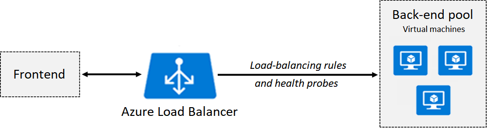

# Azure Load Balancer

Administrators use load balancing to efficiently distribute incoming network traffic across back-end servers and resources. A load balancer is implemented by using load-balancing rules and health probes.

Azure Load Balancer can be used for inbound and outbound scenarios.

You can implement a public or internal load balancer, or use both types in a combination configuration.

To implement a load balancer, you configure four components:

Front-end IP configuration
Back-end pools
Health probes
Load-balancing rules
The front-end configuration specifies the public IP or internal IP that your load balancer responds to.

The back-end pools are your services and resources, including Azure Virtual Machines or instances in Azure Virtual Machine Scale Sets.

Load-balancing rules determine how traffic is distributed to back-end resources.

Health probes ensure the resources in the backend are healthy.

Load Balancer scales up to millions of TCP and UDP application flows.

## Catch Up

The load balancer provides the access point.  

Azure Load Balancer helps distribute network traffic across servers and resources.  

Default distribution type for traffic through a load balancer
- The load balancer uses a five-tuple (source IP, source port, destination IP, destination port, and protocol type) hash to map traffic to available servers.

Load balancing can be used for `inbound` and `outbound` scenarios.

There are `public` and `internal` load balancers.
- `internal` : The virtual machines that use a load balancer to distribute a load must be in the same virtual network.

Load-balancing rules specify how traffic is distributed to your back-end pools.  
Back-end pools contain the IP addresses of the virtual NICs that are connected to your load balancer.  

Health probes dynamically add or remove virtual machines based on virtual machine health checks.