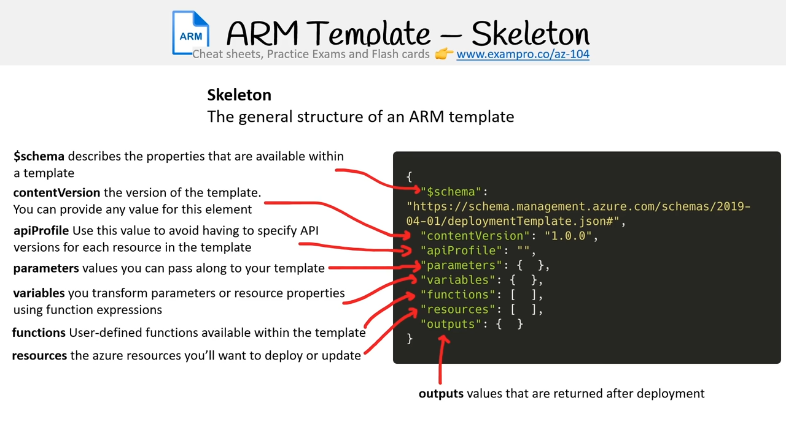

Resource in ARM

Most Important Keys 
```json 
"resource": [
    {
        "type": "{ResourceProvider}/{ResourceType}",
        "apiVersion": "20XX-XX-XX",
        "name": "{provide-unique-name}",
        "location": "{theRegionWhereTheResourceWillBeDeployed}" 
    }
]
```

Parameters
```
"parameters":{

}
```

Nested Variable
```json

```

Outputs
Returns values from deployed resources, you can use them
```json 
"output": {
    "{resource}": {
        "type": "{type}",
        "value": 
    }
}
```