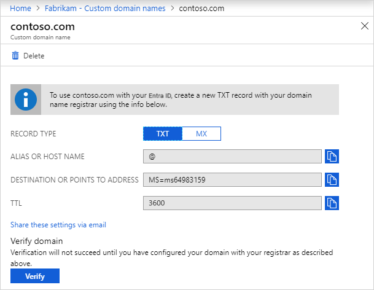
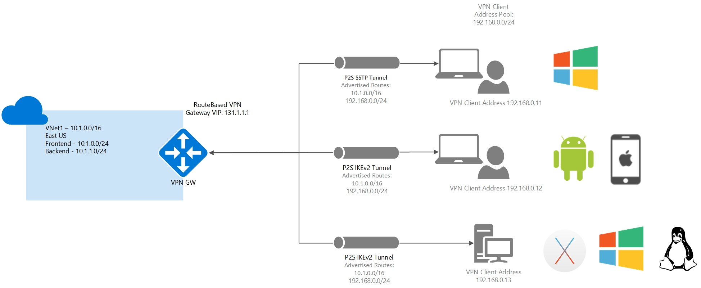

## Load Balancer 

Public Load Balancers are used to load balance Internet traffic to your VMs using the feature called Session Persistence

```java
internet -> load balancer -> [VM#1(Private_IP, port), 
                              VM#2(Private_IP, port), 
                              VM#3(Private_IP, port)]
```


Session persistence also known  
- Session affinity
- Source IP affinity
- Client IP affinity


## Domain Name TXT & MX

You can verify your custom domain name by using TXT or MX record types.

Reminder : 

`Microsoft Entra ID` is a 
cloud-based identity & access management service that enables your employees access external/internal resources.  

External resources include Microsoft 365, the Azure portal, and thousands of other SaaS applications.

Internal resources including apps on your corporate intranet, and any cloud apps developed for your own organization.

Every new Microsoft Entra ID tenant comes with an initial domain name  
```java
<domainname>.onmicrosoft.com.
```

You can’t change or delete the initial domain name, but you can add your organization’s names

## AZ storage 

Question

There is a requirement to identify the storage accounts that can be converted to zone-redundant storage (ZRS) replication. This must be done only through a live migration from Azure Support.


Azure Storage always stores multiple copies of your data so that it is protected from planned and unplanned events.  

What events? 
- transient hardware failures
- network or power outages
- massive natural disasters

`Redundancy` (stands for `R`) ensures that your storage account meets its availability and durability targets even in the face of failures.

Data in an Azure Storage account is always replicated three times in the primary region.

- `LRS` copies your data **synchronously** three times within a single physical location in the primary region.
- `ZRS` copies your data **synchronously** across three Azure availability zones in the primary region.

GEO REPLICATION Synchronously & Asynchronously  
- `GRS` copies your data **synchronously** three times within a single physical location in the primary region using LRS.  
It then copies your data **asynchronously** to a single physical location in a secondary region that is hundreds of miles away from the primary region.  
- `GZRS` copies your data **synchronously** across three Azure availability zones in the primary region using ZRS.  
It then copies your data **asynchronously** to a single physical location in the secondary region.  

If you want to add or remove geo-replication or read access to the secondary region, you can use the `Azure portal`, `PowerShell`, or `Azure CLI` to update the replication setting.   

**Live migration is supported only for storage accounts that use LRS or GRS replication.** 
E.G. If your account uses RA-GRS then you need to first change your account’s replication type to either LRS or GRS before proceeding. This intermediary step removes the secondary read-only endpoint provided by RA-GRS before migration.

`BlobStorage` account type does not support zone-redundant storage (ZRS) as its replication option. 
`general-purpose V1` storage account type does not support zone-redundant storage (ZRS).  
Only General-purpose V2, FileStorage, and BlockBlobStorage support ZRS.  


## VPN



`Point-to-Site (P2S)` VPN connection allows you to create a secure connection to your virtual network from an individual client computer.
- It's established by starting it from the client's computer
- Is useful for telecommuters who want to connect to Azure VNets from a remote location, such as from home or a conference. 
- P2S VPN is also a helpful solution to utilize instead of S2S VPN when you have only a few clients that need to connect to a VNet.

**As part of the P2S configuration, you install a certificate and a VPN client configuration package which are contained in a zip file.**  
- Configuration files provide the settings required for a native Windows, Mac IKEv2 VPN, or Linux clients to connect to a VNet over P2S connections that use native Azure certificate authentication and are specific to the VPN configuration for the VNet.  

After creating the P2S connection between `TD1` and `TDVnet1`, there is already a change in network topology when you created the virtual network peering with `TDVnet1` and `TDVnet2`.  
**Whenever there is a change in the topology of your network, you will always need to download and re-install the VPN configuration file.** so we must `Download the VPN client configuration file and re-install it on TD1`.  

The option that says: Restart `TDGW1` to re-establish the connection is incorrect because restarting the VPN gateway is only done when you lose cross-premises VPN connectivity on one or more `Site-to-Site` VPN tunnels. In this scenario, TD1 can connect to TDVnet1 which implies that TDGW1 is working and running.

The options that say: Enable transit gateway for TDVnet1 and Enable transit gateway for TDVnet2 are incorrect. Transit gateway is a peering property that lets one virtual network use the VPN gateway in the peered virtual network for cross-premises or VNet-to-VNet connectivity. Since TDVnet2 can connect to the on-premises network, it means that the transit gateway is already enabled and as such, enabling the transit gateway is not necessary.

## Storage : File Share

Azure File Share

Using Server Message Block (SMB) protocol.
Multiple VMs can share the same files with both read & access. 
Also provide read access with REST interface or storage client libraries
e.g. using a URL that points to the file and includes a shared access signature (SAS) token.


1. Many on-premises applications use file shares.  
This feature makes it easier to migrate those applications that share data to Azure.   
If you mount the file share to the same drive letter that the on-premises application uses, the part of your application that accesses the file share should work with minimal, if any, changes.   

2. Configuration files can be stored on a file share and accessed from multiple VMs. Tools and utilities used by multiple developers in a group can be stored on a file share, ensuring that everybody can find them and that they use the same version.

3. Resource logs, metrics, and crash dumps are just three examples of data that can be written to a file share and processed or analyzed later.


## Traffic


Private (or Internal) Load balancer provides a higher level of availability and scale by spreading incoming requests across virtual machines (VMs).   
Private load balancer distributes traffic to resources that are inside a virtual network.  
E.G **Traffic between the web tier and application tier must be spread equally across all the virtual machines.**

Internal load balancers distribute traffic within a VNET  
while public load balancers balance traffic to and from an internet-connected endpoint.

Azure Application Gateway is a web traffic load balancer that enables you to **manage traffic to your web applications**. 

For example, you can route traffic based on the incoming URL.   
if `/images` are in the incoming URL, you can route traffic to a specific set of servers (known as a pool) configured for images.  
If `/video` is in the URL, that traffic is routed to another pool that’s optimized for videos.   

Web Application Firewall (WAF) within Azure Application Gateway
It protects against the following web vulnerabilities:   
– SQL injection attacks   
– Cross-site scripting attacks  
– Other common attacks, such as command injection, HTTP request smuggling, HTTP response splitting, and remote file inclusion  
– HTTP protocol violations  
– HTTP protocol anomalies, such as missing host user-agent and accept headers  
– Bots, crawlers, and scanners  
– Common application misconfigurations (for example, Apache and IIS)  

`Traffic Manager` is incorrect because Traffic Manager does not protect your application from SQL injection attacks. This service is mainly used for DNS-based traffic load balancing.  

`Public Load Balancer` is incorrect because you only use this if you want to load balance Internet traffic to your virtual machines. Public Load Balancer also does not support WAF protection for your web tier.  

### Two Tenant VNet Connection


What is VNent
VNet enables many types of Azure resources, such as Azure Virtual Machines (VM), to securely communicate with each other, the Internet, and on-premises networks.
 
VNet is similar to a traditional network that you’d operate in your own datacenter but brings with it additional benefits of Azure’s infrastructure such as scale, availability, and isolation.

There are two ways to connect two virtual networks, based on your specific scenario and needs, you might want to pick one over the other.

**VNet Peering**
It provides **low latency, high bandwidth connection** useful in scenarios such as cross-region `data replication` and `database failover` scenarios. 
- Since traffic is completely private and remains on the Microsoft backbone, customers with strict data policies prefer to use VNet Peering as public Internet is not involved.   
- Since there is no gateway in the path, there are no extra hops, ensuring low latency connections.   

**VPN Gateways**
They provide a limited bandwidth connection and is **useful in scenarios where encryption is needed**, but bandwidth restrictions are tolerable. In these scenarios, customers are also not latency-sensitive.

You can use a VPN gateway to send traffic between VNets. Each VNet can have only one VPN gateway.

Take note, **`VNet-to-VNet` connections that use Azure VPN gateways work across Azure Active Directory tenants. It will also work for VNETs that have different subscriptions.**  

Based on the image above, you will need one VPN gateway for each virtual network. 
Since we have `TDVnet1` and `TDVnet2`, two virtual network gateways are required.

## Site-to-Site VPN gateway connection 

It connects your on-premises network to an Azure virtual network.  


Create it by deploying the following in order
1. Deploy a virtual network

2. Deploy a gateway subnet

– You need to create a gateway subnet for your VNet in order to configure a virtual network gateway. All gateway subnets must be named ‘GatewaySubnet’ to work properly. Don’t name your gateway subnet something else. It is recommended that you create a gateway subnet that uses a /27 or /28.

3. Deploy a VPN gateway

– A VPN gateway is a specific type of virtual network gateway that is used to send encrypted traffic between an Azure virtual network and an on-premises location over the public Internet.

4. Deploy a local network gateway

– The local network gateway is a specific object that represents your on-premises location (the site) for routing purposes.

5. Deploy a VPN connection

– A VPN connection creates the link for the VPN gateway and local network gateway. It also gives you the status of your site-to-site connection.


### Storage Account Type


- Azure File storage is only supported using General-purpose V2 and Premium file shares, while Azure Queue storage is supported using General-purpose V2 only.


## Recovery Services Vault & VMs in Different Resource Groups Backup

A Recovery Services vault is a storage entity in Azure that houses data.

The data is typically copies of data, or configuration information for virtual machines (VMs), workloads, servers, or workstations

Azure services such as IaaS VMs (Linux or Windows) and Azure SQL databases. Recovery Services Vaults support System Center DPM, Windows Server, Azure Backup Server, and more.


Azure Backup is a cost-effective, secure, one-click backup solution that’s scalable based on your backup storage needs. 

The centralized management interface makes it easy to define backup policies and protect a wide range of enterprise workloads, including Azure Virtual Machines, SQL and SAP databases, and Azure file shares.

Take note that **you can only backup data sources or virtual machines that are in the same region as the Recovery Services vault.** 
So You can back up virtual machines that have different resource groups or operating systems as long as they are in the same region as the vault.


## AZ DNS Hosting

Q : 
You have a server in your on-premises datacenter that contains a DNS server named TD1 with a primary DNS zone for the tutorialsdojo.com domain.

You plan to migrate the `tutorialsdojo.com` zone to an Azure DNS zone in TD-Subscription1. 

You must ensure that you minimize administrative effort.

### Catch up

Azure DNS is a hosting service for DNS domains that provides name resolution by using Microsoft Azure infrastructure.    
By hosting your domains in Azure, you can manage your **DNS records** by using the same credentials, APIs, tools, and billing as your other Azure services.   

**You can’t use Azure DNS to buy a domain name.**   
For `an annual fee`, you can buy a domain name by using App Service domains or a third-party domain name registrar.   
Your domains can then be hosted in Azure DNS for record management.  

### Solution
**Using a zone file is a quick, reliable, and convenient way to transfer a DNS zone into or out of Azure DNS.**

A DNS zone file is a text file that contains details of every Domain Name System (DNS) record in the zone. 

It follows a standard format, making it suitable for transferring DNS records between DNS systems. 


**Take note that Azure DNS supports importing and exporting zone files by using the Azure CLI and Azure Portal.** 

Azure PowerShell, Azure Resource Manager templates, and Azure CloudShell are incorrect because these user tools are not supported by Azure DNS for importing a DNS zone file


## VNet Peering & Hub-Spoke


### Catch UP

Azure Virtual Network (VNet) is the fundamental building block for your private network in Azure. 

**Virtual network peering enables you to connect two or more Virtual Networks in Azure seamlessly.**  

VNet enables many types of Azure resources, such as Azure Virtual Machines (VM), to securely communicate with each other, the Internet, and on-premises networks.    
VNet is similar to a traditional network that you’d operate in your own datacenter but brings with it additional benefits of Azure’s infrastructure such as scale, availability, and isolation.


In the image above, `TDVnet1` is the hub while `TDvnet2` and `TDVnet3` are the spoke. 

Virtual Machines on `TDVnet1` can communicate to hosts on `TDVnet1` only because the peerings associated with `TDVnet1` (`TDvnet2` and `TDVnet3` ) are in a `disconnected` state. It means that traffic between virtual networks is prohibited.

If your VNet peering connection is in a `Disconnected` state, it means one of the links created was deleted.  
**To re-establish a peering connection, you will need to delete the disconnected peer and recreate it.**  

The option that says: 
- `Change the address space` is incorrect because **you can not change the address space of a virtual network if there is an active peering connection. You need to delete the peer first to change the address space.**

The option that says: 
- `Delete a subnet` is incorrect because even if you `delete` or `add` a subnet, it will not have any impact on the state of the peering connection.

The option that says: 
- `Enable gateway transit` is incorrect because this feature is simply a peering property that lets one virtual network use the VPN gateway in the peered virtual network **for cross-premises or VNet-to-VNet connectivity.**


## App Service slots swap & backup

Azure App Service is an HTTP-based service for hosting web applications, REST APIs, and mobile back ends


A possible reason why the tutorialsdojo-portal web app is not working properly is that several settings are configured in the tutorialsdojo-dev and tutorialsdojo-staging.

When you perform the swap operation the following settings are swapped:
– General settings, such as framework version, 32/64-bit, web sockets
– App settings (can be configured to stick to a slot)
– **Connection strings (can be configured to stick to a slot)**
– Handler mappings
– **Public certificates**
– **WebJobs content**


If you want to revert your app to its previous state, you have a few options depending on your scenario:

1. If you have deployed your app using a deployment slot, you can swap the slot with the `production` slot to roll back the changes. You can also use the auto-swap feature to automatically swap the slots after a successful deployment.  
If you have enabled the `backup and restore` feature for your app, you can restore your app from a backup point. You can either restore the app to the same app service or to a different app service. You can also configure the backup frequency and retention policy3.
If you have deleted your app accidentally, you can recover it from the Azure portal, PowerShell, or CLI. You can use the Get-AzDeletedWebApp and Restore-AzDeletedWebApp commands to list and restore the deleted apps4.
If none of the above options work for you, you may need to redeploy your app from the source code or the package file. You can use various methods to deploy your app, such as Visual Studio, GitHub, FTP, or Azure DevOps.


## App Service Plan


If you encountered the image shown above, this means that your App Service plan does not have the capability to add a staging slot for your application.  

To resolve this problem, you can upgrade your App Service plan to a Standard or Premium tier.  

The option that says: 
`Scale-out the App Service plan` is incorrect because the process of scaling out only allows you to enable autoscaling of your resources.  

## App Service Plan & ARM

Q : 
Plan to use an Azure Resource Manager (ARM) template to deploy 5 web apps in the same region to launch the application in the most cost-effective way. 


The main requirement in this scenario is to deploy web apps in the most cost-effective way. To accomplish this requirement, you can create one App Service plan and use the plan to deploy five web apps. If you recall the Azure App Service concepts, you can configure one or more apps to run on the same computing resources (or in the same App Service plan). Therefore, if you deploy the five web apps in the same region, you can use one App Service plan for your resources.

## Monitor  

You need to identify idle and underutilized resources to reduce the overall costs of your account


## Azure Advisor

Q : 
You are managing 50 virtual machines.  
You need to identify idle and underutilized resources to reduce the overall costs of your account. The service tier of your development virtual machines must also be changed to a less expensive offering.  

Azure Advisor is a **personalized cloud consultant** that helps you follow best practices to optimize your Azure deployments. It analyzes your resource configuration and usage telemetry and then recommends solutions that can help you improve the cost-effectiveness, performance, reliability, and security of your Azure resources.   

`Azure Event Hubs` is incorrect   
because this service is **mainly used for big data streaming platforms.**  
Instead of using Azure Event Hubs to identify underutilized virtual machines, you must use the Azure Advisor.   

`Azure Monitor` is incorrect.    
Although Azure Monitor has several features to monitor specific Azure services, this service won’t provide you recommendations that can reduce the overall costs of your account.   

Azure Compliance Manager is incorrect.  
This service only allows you to `assign`, `track`, and `record` compliance and assessment-related activities.    
You can’t use Azure Compliance Manager to identify idle and underutilized resources in your Azure account.  


## ID & Governance

## Public Load Balancer 

You created an Azure public load balancer with the following settings:   
Name: Manila
SKU: Standard
Virtual Network: TDVnet1

  
You need to be able to attach the virtual machines above to the backend pool of Manila.  
Solution: Remove the public IP address attached to TD4.  


A public load balancer can provide outbound connections for virtual machines (VMs) inside your virtual network. These connections are accomplished by translating their private IP addresses to public IP addresses.

Public Load Balancers are used to load balance Internet traffic to your VMs.

A public IP associated with a load balancer serves as an Internet-facing frontend IP configuration. 
1. The Frontend is used to access resources in the backend pool. 
2. The Frontend IP can be used for members of the backend pool to egress to the Internet.

Remember the following concepts when attaching virtual machines to the backend pool of a load balancer:
– The **SKU of the IP address of a VM** must match the **SKU of the load balancer**.
– You can attach virtual machines to the backend pool of a load balancer that **does not contain an IP address**.
– You can attach virtual machines to the backend pool of a load balancer even if **they are in a stopped state**.

Without implementing any changes, you would only be able to attach TD1, TD2, and TD3 to Manila.

The solution is correct because you can now attach TD4. 

Take note that VMs attached to a backend pool do not need a public IP address, even if it will be attached to a public load balancer. 

Another correct solution is by upgrading the SKU the public IP address of TD4 to standard.

## Blob Storage Times


Based on the image above, the following will happen:
– Previous versions will be deleted 60 days after creation.
– Blob data will be tiered to cool tier 90 days after last modification.
– Blob data will be tiered to archive tier 365 days after last modification.
– Blob data deleted 1000 days after last modification.
## VPN Gateway 

Your company has multiple offices located in the Philippines and a virtual network named `TDNet1`.  
You need to establish a route-based VPN site-to-site connection from `TDNet1` to your multiple offices.  
```
TDNet1 --> VPN GATEWAY 
                  + ---->  iPsec ---> On-Premises Office#2
                  + ---->  iPsec ---> On-Premises Office#1 
```


A Site-to-Site VPN gateway connection is used to connect your on-premises network to an Azure virtual network over an IPsec/IKE (IKEv1 or IKEv2) VPN tunnel. This type of connection requires a VPN device located on-premises that has an externally facing public IP address assigned to it.

Take note that multi-site-to-site VPN connections only support IKEv1 and IKEv2.

## AzCopy 

AzCopy is a command-line utility that you can use to copy blobs or files to or from a storage account. You can also provide authorization credentials on your AzCopy command by using Azure Active Directory (AD) or by using a Shared Access Signature (SAS) token.

For blob storage, the supported authorization methods are: shared access signature and by using your Active Directory credentials.

Meanwhile, for file storage, the only supported authorization method is shared access signature.

Therefore, for both blob storage and file storage, you have to use shared access signature token as your authorization method.


## VM Scale Set

Q: You plan to create a solution that automatically increases the number of VMs when there is high demand.

**ANS**  

In this scenario, you can create a VM scale set to automatically increase the number of VMs when there is high demand.   
Take note that scale sets are built from VM Configuration.    
**With scale sets, the management and automation layers are provided to run and scale your applications.**

The option that says: 
- Deploy the virtual machine in an Availability Set is incorrect 
>> because an Availability Set only allows you to **deploy the VM in a single data center.**  

The option that says: 
- Deploy the virtual machine in multiple Availability Zones is incorrect. 
>> Same as Availability Set, the virtual machine won't scale as the traffic increases by default. 

The option that says: 
- Create an Azure ARM template to deploy a virtual machine is incorrect 
>> because this template only deploys one virtual machine to Azure. **If the template would create virtual machine scale sets then this option would satisfy the requirements in the scenario.**

## Application Gateway & SSL

Q:
You need to deploy a load balancer that supports SSL termination.

**ANS**
相較於Traditional load balancers operate at the transport layer (OSI layer 4 – TCP and UDP) and route traffic based on source IP address and port, to a destination IP address and port. 

Application Gateway is a web traffic load balancer that enables you to manage traffic to your web applications which can make routing decisions based on additional attributes of an HTTP request, for example, **URI path** or **host headers**.


- SSL termination refers to the process of decrypting encrypted traffic before passing it along to a web server. 
- TLS (the above image) is just an updated, more secure, version of SSL. 
- An SSL connection sends encrypted data between a user and a web server by using a certificate for authentication. 
- SSL termination **helps speed the decryption process** and reduces the processing burden on the servers.

Azure Application Gateway supports end-to-end traffic encryption and TLS/SSL termination. 
Based on the defined routing rules, the gateway applies the rules to the traffic, re-encrypts the packet, and forwards the packet to the appropriate server.   
Any reply from the web server goes back to the same process.  

Azure Traffic Manager is incorrect 
- because Traffic Manager does not support SSL termination.  
> This service is mainly used for DNS-based traffic load balancing.

Azure Load Balancer is incorrect. 
Just like the option above, this service does not support SSL termination.   
You can use this service to create public and internal load balancers only.

Azure Front Door is incorrect. 
- Although it supports SSL offloading, **this service is not a load balancer**. Azure Front Door is a global, scalable entry-point that uses the Microsoft global edge network to create fast, secure, and widely scalable **web applications**.

 
## Azure Files 


- Azure Files offers fully managed file shares in the cloud that are accessible via the industry standard Server Message Block (SMB) protocol or Network File System (NFS) protocol. 
- Azure Files SMB file shares are accessible from Windows, Linux, and macOS clients. 
- Azure Files NFS file shares are accessible from Linux or macOS clients. 
- Additionally, Azure Files SMB file shares can be cached on Windows Servers with Azure File Sync for fast access near where the data is being used.

Q:
You need to use an Azure storage service that can be mounted concurrently on the cloud and on-premises data center.

**ANS**
The requirements in the scenario are:
– Move the existing file server to a more efficient service.
– **Ensure that the file server can be mounted from Azure and on-premises data center.**

1. Azure file shares can be mounted concurrently on the cloud or on-premises deployments. 
2. Azure Files can be used to completely replace or supplement traditional on-premises file servers or NAS devices. 
3. Azure File SMB file shares can also be replicated with Azure File Sync to Windows Servers, either on-premises or in the cloud, for performance and distributed caching of the data where it’s being used.


`Azure Blob` is incorrect 
- because this service can’t be mounted concurrently on the cloud and on-premises data center.

`Azure Table` is incorrect 
- because this service simply stores structured NoSQL data.    
You can’t mount this storage service to your on-premises data center.   

`Azure Disk` is incorrect 
- because this storage service can only be used on Azure resources. 
If you need to move your existing file server to the cloud, you can use Azure Files.


## Bastion & VNets of VMs of Different Region

**Azure Bastion opens the RDP/SSH connection to your Azure VM directly by using the private IP address on your VM. You don’t need a public IP address on your virtual machine.**  
When VNet peering is configured, you don’t have to deploy Azure Bastion in each peered VNet. 
This means if you have an Azure Bastion host configured in one virtual network (VNet), it can be used to connect to VMs deployed in a peered VNet without deploying an additional bastion host.  

Azure Bastion and VNet peering can be used together so that TD2 and TD3 can communicate with each other.     
You also don’t need to apply any NSGs to the Azure Bastion subnet. 

**Normally virtual machines can connect to other virtual machines located in different virtual networks by their public IP addresses provided that their network security groups permit them.**  

Since TD3 and TD1 are using the same virtual network, they can communicate with each other using their respective private IP addresses. 
This removes the hassle of managing NSGs each time you need to connect securely to your virtual machines.
Hence, this statement is correct: TD3 can connect to TD1 using the private IP address of TD1.  

The statement that says: 
TD3 can connect to TD2 is incorrect because since TD3 and TD2 are in different virtual networks, they will not be able to communicate with each other.   
**For them to be able to connect, their respective virtual networks must have VNet peering or VPN gateway enabled.**

The statement that says: 
TD3 can only connect to TD1 using the public address of TD1 is incorrect 
- because TD3 can connect to TD1 using the public and private IP addresses of TD1. 
It is highly advisable though to use the private IP address of TD1 for security reasons.


## 


File sync – Centralize your organization’s file shares.


Azure Storage Explorer – Standalone app that makes it easy to work with Azure Storage data on Windows, macOS, and Linux.


Azure Import/Export – Securely import large amounts of data to Azure by shipping disk drives to an Azure datacenter.


AzCopy – Command-line utility for copying data to/from Microsoft Azure Blob and File storage.

## Recovery Services Vault

A Recovery Services vault is a storage entity in Azure that houses data.

You can use Recovery Services vaults to hold backup data for various Azure services such as IaaS VMs (Linux or Windows) and Azure SQL databases.

Recovery Services vaults make it easy to organize your backup data while minimizing management overhead.


## Public Load Balancer


- A public load balancer can provide outbound connections (Internet traffic) for VMs inside your virtual network  
- The connections are accomplished by translating their private IP addresses to public IP addresses.

A public IP associated with a load balancer serves as an Internet-facing frontend IP configuration. 
- The Frontend is used to access resources in the backend pool. 
- The frontend IP can be used for members of the backend pool to egress to the Internet.

Remember the following concepts when attaching virtual machines to the backend pool of a load balancer:

– The SKU of the IP address of a virtual machine must match the SKU of the load balancer.

– You can attach virtual machines to the backend pool of a load balancer that does not contain an IP address.

– You can attach virtual machines to the backend pool of a load balancer even if they are in a stopped state.

Without implementing any changes, you would only be able to attach TD1, TD2, and TD3 to Manila.

The solution is incorrect because even if you attach a public IP address with an SKU of basic to TD1, you still won’t be able to attach it because its SKU must match the SKU of Manila which is Standard.

Q: 
You created an Azure public load balancer with the following settings:
Name: Manila
SKU: Standard
Virtual Network: TDVnet1

You need to be able to attach the virtual machines above to the backend pool of Manila.

