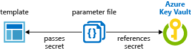
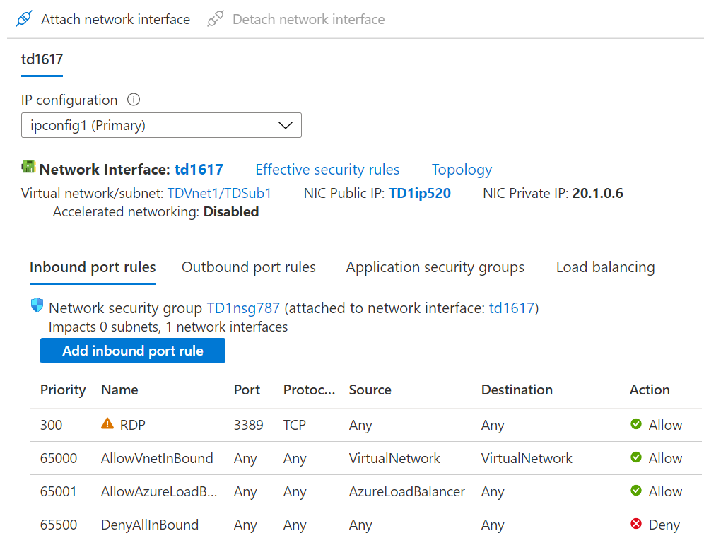
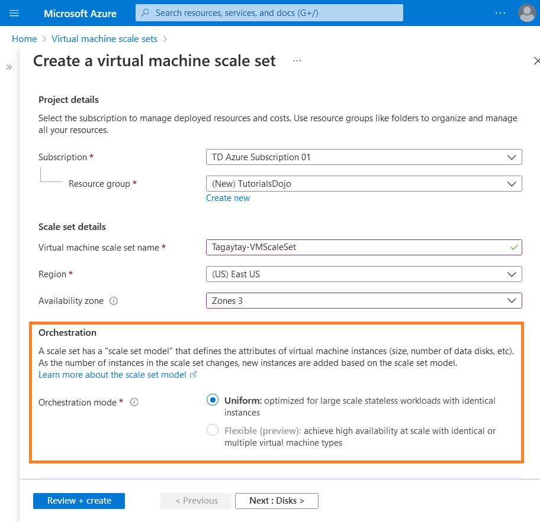
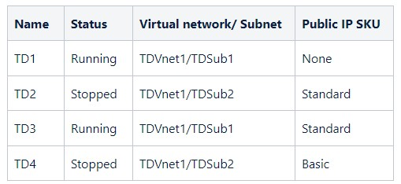

## Load Balancer 

Public Load Balancers are used to load balance Internet traffic to your VMs using the feature called `Session Persistence` refers to the process where a client's requests are directed to the same backend web or application server for the **duration of a session or the time it takes to complete a task or transaction**.  

Session persistence also known  
- Session affinity
- Source IP affinity
- Client IP affinity

:question: : 

```bash
client -> internet -> load balancer(sessionMode) 
                           + -> VM#1(Private_IP, port) 
                           + -> VM#2(Private_IP, port) 
                           + -> VM#3(Private_IP, port)
```


## Custom Domain Name TXT & MX & Verify for Entra ID tenant

:mag: Create Custom Domain Name
**You can't change or delete the initial domain name, but you can add your organization's names by verifying your custom domain name by using `TXT` or `MX` record types.**
- Every new Microsoft Entra ID tenant comes with an initial domain name `<domainname>.onmicrosoft.com`.


:mag: what is MS-ID
`Microsoft Entra ID` is a cloud-based identity & access management service that enables your employees access `EXTERNAL/INTERNAL` resources.  
- External resources : `Microsoft 365`, `the Azure portal`, and thousands of other `SaaS applications`.
- Internal resources : `apps on your corporate intranet`, and `any cloud apps developed for your own organization`.  

:link: https://learn.microsoft.com/en-us/entra/fundamentals/whatis  
:link: https://learn.microsoft.com/en-us/entra/fundamentals/add-custom-domain  

---

:question: :
Your company has a Microsoft Entra ID tenant named `tutorialsdojo.onmicrosoft.com` and a public DNS zone for `tutorialsdojo.com`.

You added the custom domain name `tutorialsdojo.com` to Microsoft Entra ID. 

You need to verify that Azure can verify the domain name.  
What DNS record type should you use?  

:a: :

:o: You can verify your custom domain name by using TXT or MX record types.  

:x: A, CNAME, and SOA are incorrect because these record types are not supported by the Microsoft Entra ID for verifying your custom domain. Only TXT and MX record types are supported.


## :star: AZ storage : Live Migration

Azure Storage always stores multiple copies of your data so it is protected from planned and unplanned events
- transient hardware failures
- network or power outages
- massive natural disasters

`Redundancy` (stands for `R`) ensures that your storage account meets its availability and durability targets even in the face of failures.

Data in an Azure Storage account is always replicated three times in the primary region.  
- `LRS` copies your data **synchronously** three times within a single physical location in the primary region.    
- `ZRS` copies your data **synchronously** across three Azure availability zones in the primary region.  

:mag: 非同步異地備份 
- `GRS` copies your data **synchronously** three times within a single physical location in the primary region using LRS.  
It then copies your data **asynchronously** to a single physical location in a secondary region that is hundreds of miles away from the primary region.  
- `GZRS` copies your data **synchronously** across three Azure availability zones in the primary region using ZRS.  
It then copies your data **asynchronously** to a single physical location in the secondary region.  

If you want to add or remove geo-replication or read access to the secondary region, you can use the `Azure portal`, `PowerShell`, or `Azure CLI` to update the replication setting.   

**Live migration is supported only for storage accounts that use `LRS` or `GRS` replication.** 
- E.G. If your account uses RA-GRS then you need to first change your account’s replication type to either LRS or GRS before proceeding. This intermediary step removes the secondary read-only endpoint provided by RA-GRS before migration.

Only General-purpose V2, FileStorage, and BlockBlobStorage support ZRS.  
  

https://docs.microsoft.com/en-us/azure/storage/common/storage-redundancy

https://docs.microsoft.com/en-us/azure/storage/common/redundancy-migration

---

:question: :  
  

There is a requirement to identify the storage accounts that can be converted to zone-redundant storage (ZRS) replication. 

This must be done only through a live migration from Azure Support.  

Which of the accounts can you convert to ZRS?

:a: : 

To request a live migration to `ZRS`, `GZRS`, or `RA-GZRS`, you need to migrate your storage account from `LRS` to `ZRS` in the primary region with no application downtime. 

To migrate from `LRS` to `GZRS` or `RA-GZRS`, first switch to GRS or RA-GRS and then request a live migration. 

Similarly, you can request a live migration from GRS or RA-GRS to GZRS or RA-GZRS. 

To migrate from GRS or RA-GRS to ZRS, first switch to LRS, then request a live migration.

Live migration is supported only for storage accounts that use LRS or GRS replication. 

If your account uses `RA-GRS` then you need to first change your account’s replication type to either `LRS` or `GRS` before proceeding. 

This intermediary step removes the secondary read-only endpoint provided by RA-GRS before migration.

:x: `tdaccount2` is incorrect 
- because you need to first change your account’s replication type to either LRS or GRS before you change to zone-redundant storage (ZRS). 
- The requirement states that you must only request live migration.

:x: `tdaccount3` is incorrect 
- because a general-purpose V1 storage account type does not support zone-redundant storage (ZRS) as its replication option.

:x: `tdaccount4` is incorrect 
- because a BlobStorage account type does not support zone-redundant storage (ZRS) as its replication option. 

## :star2: P2S & Its configuration file

`Point-to-Site (P2S)` VPN connection allows you to create a secure connection to your VNet from an individual client computer.  
  
- **It's established by starting it from the client's computer**
- Is useful for telecommuters who want to connect to Azure VNets from a remote location, such as from home or a conference. 
- P2S VPN is also a helpful solution to utilize instead of S2S VPN when you have only a few clients that need to connect to a VNet.

:mag: Configuration Files
**As part of the P2S configuration, you install a certificate and a VPN client configuration package which are contained in a zip file.**  
- Configuration files provide the settings required for the following O.S to connect to a VNet over P2S connections that use native Azure certificate authentication and are specific to the VPN configuration for the VNet.  
  1. Native Windows  
  2. Mac IKEv2 VPN  
  3. Linux clients  

<font color="red">Whenever there is a change in the topology of your network, you will always need to `download` and `re-install the VPN configuration file`.</font>


:mag: Gateway transit  
A transit gateway is a network transit hub that facilitates the interconnection of virtual private clouds (VPCs) and on-premises networks

In Azure, a transit gateway plays a crucial role in connecting virtual networks (VNets) and facilitating cross-premises communication.  
1. VNet Peering  
2. Gateway Transit (VNet to VNet or Cross-Prmises Connectivity)  
3. Hub-And-Spoke Network  
4. Route Control  
5. Deployment Models  

Gateway transit simplifies network architecture and enhances connectivity across VNets and on-premises networks in Azure


https://azure.microsoft.com/en-us/services/vpn-gateway/

https://docs.microsoft.com/en-us/azure/vpn-gateway/point-to-site-about

---

:question: :

A company has two virtual networks named `TDVnet1` and `TDVnet2`. 

A site-to-site VPN, using a VPN Gateway (`TDGW1`) with static routing, connects your on-premises network to `TDVnet1`. 

- On your Windows 10 computer, `TD1`, you've set up a point-to-site VPN connection to `TDVnet1`.
- You've recently established a virtual network peering between `TDVnet1` and `TDVnet2`. 
- Tests confirm connectivity to `TDVnet2` from your on-premises network and to `TDVnet1` from `TD1`. 

However, `TD1` is currently unable to access `TDVnet2`.

:a: :  

:o: Take note that after creating the point-to-site connection between TD1 and TDVnet1, **there is already a change in network topology when you created the virtual network peering with TDVnet1 and TDVnet2.** 
- So you have to download and re-install the configuration file

:x: Restart `TDGW1` to re-establish the connection is incorrect
- because **restarting the VPN gateway is only done when you lose cross-premises VPN connectivity on one or more `Site-to-Site` VPN tunnels.**   
- In this scenario, `TD1` can connect to `TDVnet1` which implies that `TDGW1` is working and running.  

:x: Enable transit gateway for `TDVnet1` and Enable transit gateway for `TDVnet2` are incorrect.   
- Since `TDVnet2` can connect to the on-premises network, it means that the transit gateway is already enabled and as such, enabling the transit gateway is not necessary.

## Azure Storage : File Share

:mag: Azure File Share Properties
1. Using Server Message Block (SMB) protocol. (`port 445`)
2. Multiple VMs can share the same files with both read & access. 
3. Also provide read access with REST interface or storage client libraries.   
E.G. using a URL that points to the file and includes a shared access signature (SAS) token.

```
RSV
Storage Account : File Share
File Share Snapshot
```


:mag: Storage Data in Azure File Share  
1. For Many on-premises applications  
This feature makes it easier to MIGRATE those applications that share data to Azure.   
If you mount the file share to the same drive letter that the on-premises application uses, the part of your application that accesses the file share should work with minimal, if any, changes.      
2. Configuration files can be stored on a file share and accessed from multiple VMs.  
**Tools and utilities used by multiple developers in a group can be stored on a file share**, ensuring that everybody can find them and that they use the same version.
3. **Resource logs, metrics, and crash dumps** are just three examples of data that can be written to a file share and processed or analyzed later.

https://docs.microsoft.com/en-us/azure/storage/files/storage-files-introduction

https://docs.microsoft.com/en-us/azure/storage/files/storage-sync-files-deployment-guide

---

:question: :
You have a file share in your Azure subscription named `Manila-Subscription-01`.

You plan to synchronize files from your on-premises file server named `TDFileServer1` to Azure.

You created an Azure file share and a storage sync service.  

Which the actions should you perform in sequence to synchronize files from `TDFileServer1` to Azure?  

:a: :

- Deploy the Azure File Sync agent to `TDFileServer1`
- Register `TDFileServer1` with Storage Sync Service
- Create a sync group and a cloud endpoint
- Create a server endpoint


1. Prepare Windows Server to use with Azure File Sync
You need to disable Internet Explorer Enhanced Security Configuration in your server.   
This is required only for initial server registration.   
You can re-enable it after the server has been registered.    

2. Deploy the Storage Sync Service
Allows you to **create sync groups** that contain Azure file shares across multiple storage accounts and multiple registered Windows Servers.

3. Deploy the Azure File Sync agent to `TDFileServer1`   
**The Azure File Sync agent is a downloadable package** that enables Windows Server to be synced with an Azure file share.

4. Register `TDFileServer1` with Storage Sync Service  
This establishes a trust relationship between your server (or cluster) and the Storage Sync Service. 
**A server can only be registered to one Storage Sync Service and can sync with other servers and Azure file shares associated with the same Storage Sync Service.**

5. Create a sync group and a cloud endpoint   
A sync group defines the sync topology for a set of files.  
Endpoints within a sync group are kept in sync with each other.

6. Create a server endpoint   
A server endpoint represents a specific location on a registered server, such as a folder on a server volume.

## Application Gateway : Load Balancer to route traffics

  
- Azure Application Gateway (application tier) is a web traffic load balancer that enables you to **manage traffic to your WEB APPLICATION**. 

For example, you can route traffic based on the incoming URL.   
- if `/images` are in the incoming URL, you can route traffic to a specific set of servers (known as a pool) configured for images.  
- If `/video` is in the URL, that traffic is routed to another pool that’s optimized for videos.  

Web Application Firewall (WAF) within Azure Application Gateway
It protects against the following web vulnerabilities:   
- SQL injection attacks   
- Cross-site scripting attacks  
- Other common attacks, such as command injection, HTTP request smuggling, HTTP response splitting, and remote file inclusion  
- HTTP protocol violations    
- HTTP protocol anomalies, such as missing host user-agent and accept headers  
- Bots, crawlers, and scanners  
- Common application misconfigurations, such as Apache and IIS

---

:question:
Due to compliance requirements, you need to find a solution for the following:

Traffic between the web tier and application tier must be spread equally across all the virtual machines.

The web tier must be protected from SQL injection attacks.

Which Azure solution would you recommend for each requirement?

:a: :

:o: Traffic between the web tier and application tier must be spread equally across all the virtual machines. :arrow_right: Internal Load Balancer  
The web tier must be protected from SQL injection attacks.  :arrow_right: Application Gateway WAF tier


:x: `Traffic Manager` is incorrect   
- Traffic Manager does not protect your application from SQL injection attacks.  
**This service is mainly used for DNS-based traffic load balancing.**  

:x: `Public Load Balancer` is incorrect 
- you only use this if you want to load balance (OUTBOUND)Internet traffic to your virtual machines.  
- **Public Load Balancer also does not support WAF protection for your web tier.**  

---

Private/Internal Load balancer (TCP/UDP tier) provides a higher level of availability and scale by spreading incoming requests across virtual machines (VMs).    
- Private load balancer distributes traffic to resources that are inside a virtual network.  
E.G. **Traffic between the WEB TIER and APPLICATION TIER must be spread equally across all the virtual machines.**

:mag: Internal vs Public Load Balancer
- Internal load balancers distribute traffic within a VNet   
while public load balancers balance traffic to and from an internet-connected endpoint.  
- In short 私人LD處理VNet & 公共LD處理網際網路

  

## :star2: VNet-to-VNet Connection from Different tenant 

:mag: VNet Usage
- VNet enables many types of Azure resources, such as Azure Virtual Machines (VM), to securely communicate with each other, the Internet, and on-premises networks.   
- VNet is similar to a traditional network that you’d operate in your own datacenter but **with it additional benefits of Azure’s infrastructure such as scale, availability, and isolation.**

 
:memo: VNet Communication
There are two ways to connect two VNets, based on your specific scenario and needs, you might want to pick one over the other.
1. VNet Peering
It provides **low latency, high bandwidth connection** useful in scenarios such as `cross-region data replication` and `database failover` scenarios. 
   - Since traffic is completely `private` and `remains on the Microsoft backbone`, customers with strict data policies prefer to use **VNet Peering** as public Internet is not involved.  
   If there is no gateway in the path, there are no extra hops, ensuring low latency connections.   

2. VPN Gateways

They provide a **limited bandwidth connection** and is **useful in scenarios where encryption is needed, but bandwidth restrictions are tolerable**.  
   - In these scenarios, customers are also not latency-sensitive.
   - `VNet-to-VNet` connections that use Azure VPN gateways work across Azure Active Directory tenants. 
   It will also work for VNETs that have different subscriptions.

https://docs.microsoft.com/en-us/azure/virtual-network/virtual-networks-overview

https://docs.microsoft.com/en-us/azure/vpn-gateway/vpn-gateway-howto-vnet-vnet-resource-manager-portal


:question: :


Based on the image above, you will need one VPN gateway for each virtual network.   

Since we have `TDVnet1` and `TDVnet2`, two virtual network gateways are required.  

:a: 


You can use a VPN gateway (of Each VNet) to send traffic between VNets.    
- **Each VNet can have only one VPN gateway.**  

:x: Change the address space of TDVnet2 is incorrect 
- because the address spaces of TDVnet1(10.1.0.0/16) and TDVnet2(10.10.0.0/18) do not overlap.   
Therefore, you can directly connect the two VMs by creating two virtual network gateways without changing the IP address ranges.

:x: Transfer TDVnet1 to TD2 and Transfer VM1 to TD2 are incorrect 
- because VNet-to-VNet connections that use VPN gateways work across Azure AD tenants. 
- You can also connect two virtual networks that have different subscriptions.

## Site-to-Site Connection 

https://docs.microsoft.com/en-us/azure/virtual-network/virtual-networks-overview

https://docs.microsoft.com/en-us/azure/vpn-gateway/tutorial-site-to-site-portal

:question: : 
You have an Azure subscription that contains an Azure virtual network named `TDVnet1` with an address space of `10.1.0.0/18` and a subnet named `TDSub1` with an address space of `10.1.0.0/22`.  

- You need to connect your on-premises network to Azure by using a site-to-site VPN.

Which actions should you perform in sequence?

:a: : 

It connects your on-premises network to an Azure virtual network.
   

Create it by deploying the following in order  

1. `Deploy a virtual network`  

2. `Deploy a gateway subnet`  
You need to create a gateway subnet for your VNet in order to configure a virtual network gateway. 
All gateway subnets must be named `GatewaySubnet` to work properly.  
Don't name your gateway subnet something else. 
It is recommended that you create a gateway subnet that uses a `/27` or `/28`.  

1. `Deploy a VPN gateway`  
A VPN gateway is a specific type of virtual network gateway that is used to send encrypted traffic between an Azure virtual network and an on-premises location over the public Internet.

1. `Deploy a local network gateway`
The local network gateway is a specific object that represents your on-premises location (the site) for routing purposes.

1. `Deploy a VPN connection` (tunnel)
A VPN connection creates the link for the VPN gateway and local network gateway.  
**It also gives you the status of your site-to-site connection.**  

## Communication VMs in Different VNets with LB sku

:question: :
  
  

You plan to create an internal load balancer with the following parameters:
``` 
Name: TDB1
SKU: Basic
Subnet: TDSub2
Virtual network: TDVnet1
```

:a: :


Take note that in this scenario, you need to determine if you can load balance traffic in between virtual machines according to the parameters of `TDB1`. 

TD1 and TD2 are the only virtual machines that are associated with an availability set. 

In the image above, it states that only virtual machines within a single availability set or virtual machine scale set can be used as backend pool endpoints for load balancers that use `Basic` as its SKU.

:mag: Backend Pool
- The backend pool is a critical component of the load balancer. The backend pool defines the group of resources that will serve traffic for a given load-balancing rule.

Hence, this statement is correct: Traffic between TD1 and TD2 can be load balanced by TDB1

The following statements are incorrect because TDB1 is using the Basic SKU. 

Since the virtual machines below do not have an availability set or a virtual machine scale set, it does not have the capability to load balance the traffic.  
- Traffic between TD3 and TD4 can be load balanced by TDB1  
- Traffic between TD5 and TD6 can be load balanced by TDB1  

https://docs.microsoft.com/en-us/azure/load-balancer/load-balancer-overview  

https://docs.microsoft.com/en-us/azure/load-balancer/skus  

## Storage Account Type

:question:


What storage account supports Azure File storage?   
What storage account supports Azure Queue storage?   

:a: :

   
- Azure File storage is only supported using `General-purpose V2` and `Premium file shares`
- Azure Queue storage is supported using `General-purpose V2` only.

## RSV's az Backup x VMs in Different RGs Backup

A RSV is a storage entity in Azure that houses data.   
The data is typically copies of data, or configuration information for virtual machines (VMs), workloads, servers, or workstations, Azure services such as IaaS VMs (Linux or Windows) and Azure SQL databases. 

:mag: what rsv supports ?
Recovery Services Vaults support System Center DPM, Windows Server, Azure Backup Server, and more.  

:mag: Azure Backup of RSV
Azure Backup is a cost-effective, secure, one-click backup solution that’s scalable based on your backup storage needs.
  
- The centralized management interface makes it easy to define backup policies and protect a wide range of enterprise workloads, including Azure Virtual Machines, SQL and SAP databases, and Azure file shares.  

<font color="red">Take note that **you can only backup `data sources` or `VMs` that are in the same region as the Recovery Services vault.** 
So You can back up virtual machines that `have different resource groups or operating systems as long as they are in the same region` as the vault.</font>

https://docs.microsoft.com/en-us/azure/backup/backup-overview

https://docs.microsoft.com/en-us/azure/backup/backup-azure-arm-vms-prepare

---

:question: :

Your company has an Azure subscription that contains a recovery services vault named `TDBackup1`, located in `Southeast Asia`.


You need to identify which virtual machines can be backed up to TDBackup1.

## Azure DNS Zone file(`.txt`)

:mag: AZ DNS
Azure DNS is a hosting service for DNS domains that provides name resolution by using Microsoft Azure infrastructure.    
By hosting your domains in Azure, you can manage your **DNS records** by using the same credentials, APIs, tools, and billing as your other Azure services.   

**You can't use Azure DNS to buy a domain name.**   
For `an annual fee`, you can buy a domain name by using App Service domains or a third-party domain name registrar.   
Your domains can then be hosted in Azure DNS for record management.  

:mag: What DNS supports 
Azure DNS supports **importing and exporting zone files by using the Command-Line `Azure CLI` and UI `Azure Portal`.** 

:memo: DNS ZONE FILE
**A DNS zone file is a `.txt` file that contains details of every Domain Name System (DNS) record in the zone.** 
It follows a standard format, making it suitable for transferring DNS records between DNS systems. :arrow_down:


---

:question: :

You have a server in your on-premises datacenter that contains a DNS server named `TD1` with a primary DNS zone for the `tutorialsdojo.com` domain.  

You plan to migrate the `tutorialsdojo.com` zone to an Azure DNS zone in `TD-Subscription1`.   

You must ensure that you minimize administrative effort.

:a: :
**Using a zone file is a quick, reliable, and convenient way to transfer a DNS zone into or out of Azure DNS.**

The followings are incorrect because these user tools are not supported by Azure DNS for importing a DNS zone file
1. Azure PowerShell
2. Azure Resource Manager templates
3. Azure CloudShell 


## VNet Peering & Hub-Spoke

**VNet peering enables you to connect two or more VNets in Azure seamlessly.**  

- VNet peering connection is in a `Disconnected` state, it means one of the links created was deleted also means that traffic between VNets is prohibited.  
- <font color="red">To re-establish a peering connection, you will need to delete the disconnected peer and recreate it.</font>

:mag: AZ VNet 
- Azure VNet is the **fundamental building block for your private network** in Azure.  
- VNet enables many types of Azure resources, such as Azure VMs, to securely communicate with each other, the Internet, and on-premises networks. **(VNet to VNet, VNet to On-premises, Vnet to Internet)**  
- It's **with benefits of Azure’s infrastructure such as scale, availability, and isolation.**  
- In the context of virtual networking, hosts typically refer to the physical machine on which the virtualization environment is running.  
These hosts can run multiple virtual machines (VMs), each with its own operating system and applications, just like a physical computer.  

https://docs.microsoft.com/en-us/azure/virtual-network/virtual-networks-overview

https://docs.microsoft.com/en-us/azure/virtual-network/virtual-network-peering-overview

---

:question: : 
  

In the image above, `TDVnet1` is the HUB while `TDvnet2` and `TDVnet3` are the spoke. 

VMs on `TDVnet1` can communicate to hosts on `TDVnet1` only.  
Because the peerings (`TDvnet2` and `TDVnet3`) associated with `TDVnet1` are in a `Disconnected` state.   

:o ?
1. Virtual Machines on TDVnet1 has network connectivity with hosts on?
2. What is the first thing you need to do to change the status of the peering connection for TDVnet2 to Connected

:a: :
  
:o: 
1. virtual machines on `TDVnet1` can communicate to hosts on TDVnet1 only because the peerings associated with `TDVnet1` are in a disconnected state.  
It means that traffic between virtual networks is prohibited.

2. you need to Delete `TDVnet1-2` to re-establish the connection. Once you have deleted the disconnected peer, you can then recreate it.

:x: `Change the address space` is incorrect 
- because **you can not change the address space of a virtual network if there is an active peering connection. You need to delete the peer first to change the address space.**

:x: `Delete a subnet` is incorrect 
- because even if you `delete` or `add` a subnet, it will not have any impact on the state of the peering connection.

:x: `Enable gateway transit` is incorrect 
- because this feature is simply a peering property that lets one virtual network use the VPN gateway in the peered virtual network **for cross-premises or VNet-to-VNet connectivity.**

## RDB x NIC 

:question: :
Your company has an Azure subscription that contains a virtual machine named TD1.

You need to connect to `TD1` from a computer connected to the Internet named `Workstation1`. 

`TD1` has a network security group with the following inbound security rules:

  

You try to connect to `TD1` using `Workstation1` but you are unable to.

:memo: : 

:mag: Public IP Address of VM
Public IP addresses allow Internet resources to communicate inbound to Azure resources.   
Public IP addresses enable Azure resources to communicate to the Internet and public-facing Azure services.   

- The address is dedicated to the resource until it’s unassigned by you. 
- A resource without a public IP assigned can communicate outbound.
- Azure dynamically assigns an available IP address that isn’t dedicated to the resource.

:mag: Assignment Method of Public IP
There are two types of public IP address assignment methods: static and dynamic.  
- Static addresses are assigned when a public IP address is created.  
Static addresses are not released until a public IP address resource is deleted.  
:red_circle: If the address is not associated to a resource, you can change the assignment method after the address is created.  
:red_circle: If the address is associated to a resource, you may not be able to change the assignment method.  
- Dynamic addresses are assigned only after a public IP address is associated to an Azure resource, and the resource is started for the first time.   
Dynamic addresses can change if they're assigned to a resource, such as a virtual machine, and the virtual machine is stopped (deallocated) and then started.


The address remains the same if a virtual machine is rebooted or stopped (but not deallocated). Dynamic addresses are released when a public IP address resource is dissociated from a resource it is associated with.

:a: :

Take note that since TD1 does not have an assigned IP address, it only means that TD1 is deallocated (stopped).   
- Remember, if you want to retain your public IP address, you need to use a static IP address.

Hence, the correct answer is: Start TD1.

:x: Remove the RDP rule is incorrect 
- because the RDP rule already allows Remote Desktop connection from the Internet.   
- Removing the RDP rule will prevent `Workstation1` from establishing a Remote Desktop connection to TD1 once it is in a Running state.  

:x: Modify the priority of the RDP rule is incorrect. 
- Since this is the highest rule, it will be the first one that the network security group will evaluate.

:x: Redeploy TD1 is incorrect 
- because redeploying TD1 will only add to the administrative effort.  
- It would be best if you simply started TD1 for it to receive a public IP address.

## Backup x File Sync x File Group

:question: : 
You have an Azure subscription named `TDSubscription` that contains Azure file share called `TDShare1` and `TDShare2`. 

Both have the same storage account and the same region.


TDShare1 is the cloud endpoint of TDGroup1

You plan to back up the following file servers in your on-premises datacenter to Azure:  

- You then add `E:\tutorials` of FileServer1 as the server endpoint of `TDGroup1`.  


:a: : 


Take note that multiple server endpoints can exist on the same volume if their namespaces are not overlapping (for example, `F:\sync1` and `F:\sync2`) and each endpoint is syncing to a unique sync group meaning **you can not have more than one server endpoint from the same server in the same sync group.**

Take note that you can not have more than one server endpoint from the same server in the same sync group. 
- If you need to add the folder `F:\dojo` of FileServer1, you need to create another sync group.

You can add `C:\files` of `FileServer2` as a server endpoint of TDGroup1 : 
- Yes
- because FileServer2 has no server endpoint yet on TDGroup1.

You can add `F:\dojo` of `FileServer1` as a server endpoint to TDGroup1	: 
- No
- because TDGroup1 already has a server endpoint for FileServer1 for the folder `E:\tutorials`. 

You can add `TDShare2` to `TDGroup1` as a cloud endpoint : 
- No
- because you can only have one cloud endpoint per sync group. If you want to add another cloud endpoint, you must create another sync group.

---

:mag: Sync Group & (Server/Cloud) Endpoints  
- A sync group defines the sync topology for a set of files. 
- Endpoints within a sync group are kept in sync with each other. 
- **A sync group must contain one cloud endpoint, which represents an Azure file share, and one or more server endpoints.**

:mag: cloud endpoint  
A cloud endpoint is a pointer to an Azure file share. All server endpoints will sync with a cloud endpoint, making the cloud endpoint the hub.

:mag: server endpoint  
A server endpoint represents a specific location on a registered server, such as a folder on a server volume.


https://docs.microsoft.com/en-us/azure/storage/files/storage-files-introduction

https://docs.microsoft.com/en-us/azure/storage/files/storage-sync-files-deployment-guide

## Lost of Data while redeploying VM

You need to perform the following actions in a Windows virtual machine:  
- Create a document on drive C.
- Create a document on drive D.
- Create a new folder on the desktop.
- Create a local user account.
- Modify the desktop background
- You plan to `redeploy` the virtual machine.
 
Which of the following changes will be lost after you redeploy the virtual machine to a new Azure node?

:a: 

:o: :


Most VMs contain a temporary disk, which is not a managed disk. The temporary disk **provides short-term storage for applications and processes and is intended to only store data such as page or swap files**. 

Data on the temporary disk may be lost during a maintenance event or when you redeploy a VM. 
- During a successful standard reboot of the VM, data on the temporary disk will persist.

On Azure Linux VMs, the temporary disk is typically `/dev/sdb` and on Windows VMs the temporary disk is `D:` by default. 
- The temporary disk is not encrypted by server-side encryption unless you enable encryption at host.

In this scenario, the only changes that will be lost are the data in the temporary disk. 
- The temporary disk is just short-term storage for applications and processes. 
- The data loss occurs **when the virtual machine moves to a different host server**, **the host is updated**, and **the host experiences a hardware failure**. 

Hence, the correct answer is: The data on `drive D`.

:x: The created folder is incorrect. 
- Even if you redeploy the virtual machine into a new node, the new folder will still be on the desktop of the virtual machine since `drive C` is the default storage.

:x: The created local user account is incorrect 
- because user accounts are stored in `drive C`. 
- After you redeploy the virtual machine to a new Azure node, the user account would still be stored in the virtual machine.

:x: The data on `drive C` is incorrect 
- because drive C is a persistent storage. 
- This means the data stored on this drive wouldn’t be deleted even if you redeploy the virtual machine.

https://docs.microsoft.com/en-us/azure/virtual-machines/managed-disks-overview#temporary-disk

https://docs.microsoft.com/es-mx/archive/blogs/mast/understanding-the-temporary-drive-on-windows-azure-virtual-machines

## BackUp VM with Difference O.S

You created a new Recovery Services vault in your Azure account as part of your company's Disaster Recovery Plan. 

Your account subscription has the following virtual machines, each with its respective auto-shutdown configuration:  


The scheduled backup will run every day at 23:59.

Which of the following virtual machines allows you to create a backup using the Azure Backup service?

:a: : 

SetUp backup policy


**With Azure Backup service, you can back up on-premises machines, workloads, and Azure VMs.**

If you would recall, the VM in a stopped/deallocated state only stops the virtual machine. 

Take note that Azure Backup only takes snapshots of the VM disks. 
- <font color="red">This means that even if the VM status is `running` or `stopped`, you can still create a backup as long as the disk is attached to the VM.</font>

When creating a backup, you need to ensure that the virtual machines are in the same region as the Recovery Services vault.

Based on the given table in the question, all the virtual machines enable you to create a backup using the Azure Backup service.

Hence, the correct answer is: VirtualMachine1, VirtualMachine2, VirtualMachine3 and VirtualMachine4.

https://docs.microsoft.com/en-us/azure/backup/backup-support-matrix-iaas

https://docs.microsoft.com/en-us/azure/backup/backup-azure-vm-backup-faq

## AZ VM scale set Creation

In Az PORTAL



:mag: orchestration modes
Scale set orchestration modes give you more control over how virtual machine instances are managed by the scale set. The two types of orchestration modes are:

Uniform
- uses a virtual machine profile or template to scale up to desired capacity. This orchestration mode is mainly used for large-scale stateless workloads that require identical VM instances. It also provides fault domain high availability (less than 100 VMs).

Flexible 
- offers high availability with identical or multiple VM types (up to 1000 VMs) by spreading VMs across fault domains in a region or within an Availability Zone.

Orchestration mode also helps you design a highly available infrastructure since the virtual machines are deployed in fault domains and Availability Zones. In Flexible orchestration mode, you manually create and add the VM to the scale set. While in Uniform orchestration mode, you just need to define a VM model and Azure will automatically create identical instances based on that model. Remember that the orchestration mode is defined when you create the scale set and cannot be changed or updated later.

https://docs.microsoft.com/en-us/azure/virtual-machine-scale-sets/virtual-machine-scale-sets-orchestration-modes

https://docs.microsoft.com/en-us/azure/virtual-machine-scale-sets/overview

---

:question: :
You plan to provision ten virtual machines using the Azure VM scale sets.

The virtual machines must be optimized for large-scale stateless workloads.

Which of the following options allows you to deploy VMs as quickly as possible

:a: :

In this scenario, you must use the Azure virtual machine scale sets to provision ten virtual machines. 

Among the options given, you can select between the two orchestration modes: Uniform and Flexible. 

It is stated in the scenario that the virtual machines must be optimized for large-scale stateless workloads. 

Therefore, you must set the orchestration mode to Uniform in order to satisfy this requirement.

:o: Create a VM scale set and set the orchestration mode to `Uniform`.

:x: Create a VM scale set and set the orchestration mode to `Flexible` is incorrect 
- because the requirement is to create virtual machines that are optimized for large-scale stateless workloads. 
- Flexible orchestration mode is mainly used for quorum-based or stateful workloads.

:x: Create ten virtual machines in Azure CLI using the az vm create command is incorrect 
- because you need to use `Uniform` orchestration scale set to provision ten virtual machines and not just using the Azure VM via the CLI. 
- **Also, the `az vm create` command will only create 1 virtual machine.**

:x: Create ten virtual machines in the Azure portal is incorrect. 
- Instead of creating one virtual machine at a time, you must use a VM scale set and set the orchestration mode to Uniform.

## Availability Zone

You plan to host a web application in three Azure virtual machines.

You need to make sure that there are at least two virtual machines running if an Azure data center becomes inaccessible.

:a: :


Based on the given requirements, you can protect your web application from data center outages if you will deploy the three virtual machines in a separate Availability Zone. 

Remember that Availability Zones are unique physical locations within an Azure region. 

**Each zone is made up of one or more data centers equipped with independent power, cooling, and networking.** 

To ensure resiliency, there is a minimum of three separate zones in all enabled regions. 

The physical separation of Availability Zones within a region protects applications and data from datacenter failure

:x: Deploy all the virtual machines in a single Availability Zone is incorrect 
- because if the Availability Zone becomes inaccessible then all of the resources in that location will also be affected. To achieve a highly available application, you must deploy the virtual machines in multiple Availability Zones.

:x: Deploy all the virtual machines in a single Availability Set is incorrect 
- because an Availability Set only isolates virtual machines from each other. This means that the virtual machines are still in the same data center. To protect your application from a data center outage, you must deploy the virtual machines in three Availability Zones.

:x: Deploy one virtual machine in each Availability Set is incorrect. 
- Deploying the virtual machines in a separate Availability Set does not mean that it is protected from a data center outage. 
- Take note that this option only ensures that your VMs are distributed across multiple fault domains in the Azure data center. Therefore, if the data center becomes unavailable, your application becomes unavailable too.


https://docs.microsoft.com/en-us/azure/virtual-machines/manage-availability#use-availability-zones-to-protect-from-datacenter-level-failures

https://docs.microsoft.com/en-us/azure/availability-zones/az-overview#availability-zones

## Fault Domain & Update Domain

:question: :
You have deployed two Azure virtual machines to host a web application.

You plan to set up an Availability Set for your application.

You need to make sure that the application is available during planned maintenance.

Which of the following options will allow you to accomplish this?

:a: :


Planned maintenance is periodic updates made by Microsoft to the underlying Azure platform to improve the platform infrastructure’s overall reliability, performance, and security that your virtual machines run on.

To ensure that the application is available during planned maintenance, you must assign two update domains in the Availability Set. 

An update domain will make sure that the VMs in the Availability Set are not updated at the same time. 

The order of update domains being rebooted may not proceed sequentially during planned maintenance, but only one update domain is rebooted at a time. 
A rebooted update domain is given 30 minutes to recover before maintenance is initiated on a different update domain.

Hence, the correct answer is: Assign two update domains in the Availability Set.

:x: Assign one update domain in the Availability Set is incorrect 
- because you need to assign one update domain for each virtual machine.

:x: Assign two fault domains in the Availability Set is incorrect 
- because the requirement in the scenario is only planned maintenance. 
- Even if you assigned two or more fault domains, the application will still be unavailable during planned maintenance. 
- You must assign two update domains and one virtual machine for each update domain.

:x: Assign one fault domain in the Availability Set is incorrect 
- because the fault domain is mainly used for unplanned maintenance. 
- Instead of assigning a fault domain in the Availability Set, you must assign an update domain in order to satisfy this requirement.


https://docs.microsoft.com/en-us/azure/virtual-machines/manage-availability

https://docs.microsoft.com/en-us/azure/virtual-machines/windows/tutorial-availability-sets

## App Application Creation for App Service Plan

:question: :

You are planning to host several web applications in Azure App Service with the following runtime stack.


How many App Service plan should you create at the minimum to properly deploy all applications?

:a: : 

**Before you launch a web app in Azure App Service, you must create an App Service plan.** 

You must also select the Operating System that will be used in the App Service plan. 

**Take note that some runtime stacks will only work on Windows such as ASP.NET while Ruby will only work with Linux.**

If your runtime stack can be deployed to both Linux and Windows like Java, then you can only select one Operating System when creating a Web App.
- ASP.NET V4.8 = Windows
- Node 16 LTS = Windows & Linux
- Java 11 = Windows & Linux
- PHP 8.2 = Linux
- Python 3.10 = Linux

Based on the given runtime stack, you need to create two App Service plan for O.S (Linux and Windows).
Hence, the correct answer is: Two.  


https://docs.microsoft.com/en-us/azure/app-service/overview-hosting-plans

https://docs.microsoft.com/en-us/azure/app-service/overview

## RSV VMs Region

:question:
You deployed four Azure virtual machines in the following regions.


You have created a Recovery Services vault to hold backup data for `VirtualMachine1` and `VirtualMachine2`.  

You need to ensure that VirtualMachine3 and VirtualMachine4 are protected by a storage entity in Azure that houses data.  

What should you do?

:a:

:o: Create another Recovery Services vault.

## :star2: Revert App Service version & Slots Swap & Backup

Azure App Service is an HTTP-based service for hosting web applications, REST APIs, and mobile back ends

When you perform the swap operation the following settings are swapped:
- General settings, such as framework version, 32/64-bit, web sockets
- App settings (can be configured to stick to a slot)
- **Connection strings (can be configured to stick to a slot)**
- Handler mappings
- **Public certificates**
- **WebJobs content**

:question: :  


You configured several settings in the `tutorialsdojo-dev` and `tutorialsdojo-staging`.

You performed a swap operation between the production and staging slots. 

Upon testing the `tutorialsdojo-portal app`, it was discovered that the new features are not working properly.

:a: : 
If you want to revert your app to its previous state, you have a few options depending on your scenario:


1. If you have deployed your app `using a deployment slot`, you can swap the slot with the `production` slot to roll back the changes. 
You can also use the auto-swap feature to automatically swap the slots after a successful deployment.  
2. If you have `enabled the backup and restore` feature for your app, you can restore your app from a backup point.   
You can either restore the app to the same app service or to a different app service. You can also configure the backup frequency and retention policy
3. If you have deleted your app accidentally, you can recover it from the `Azure portal`, `PowerShell`, or `CLI`.   
You can use the `Get-AzDeletedWebApp` and `Restore-AzDeletedWebApp` commands to list and restore the deleted apps  
4. If none of the above options work for you, you may need to redeploy your app `from the source code` or `the package file`.  
You can use various methods to deploy your app, such as Visual Studio, GitHub, FTP, or Azure DevOps.

To revert the tutorialsdojo-portal app to its previous state, you can swap the slots of the tutorialsdojo-staging and tutorialsdojo environments. Since the slots have been swapped again, the app will no longer experience any performance issues.

Hence, the correct answer is: Swap the slots of tutorialsdojo-staging and tutorialsdojo.

:x: Swap the slots of tutorialsdojo-dev and tutorialsdojo is incorrect 
- because several settings are also configured in the tutorialsdojo-dev. 
- If you perform the swap operation, it will not restore the previous state of the tutorialsdojo-portal web app.

:x: Swap the slots of tutorialsdojo-staging and tutorialsdojo-dev is incorrect 
- because you don’t need to swap the slots of tutorialsdojo-staging and tutorialsdojo-dev. 
- The only requirement in the scenario is to revert the tutorialsdojo-portal web app to its previous state.

:x: Restore the previous state of tutorialsdojo using app backup is incorrect 
- because you must configure the backup settings of the web app first   
before you can restore the previous state.  
Also, the fastest way is to swap the slots of tutorialsdojo-staging and tutorialsdojo-portal.

## Scale Up the App Service Plan

https://docs.microsoft.com/en-us/azure/app-service/manage-scale-up

https://docs.microsoft.com/en-us/azure/app-service/deploy-staging-slots

:question:
You created a new Azure web app with an **F1 App Service plan**.
  
You want to add a `staging` slot for your application but the option seems unavailable in the Azure Portal.  

What must be done first to satisfy the above requirement?

:a: 


If you encountered the image shown above, this means that your App Service plan does not have the capability to add a staging slot for your application. 

To resolve this problem, you can upgrade your App Service plan to a `Standard` or `Premium` tier. 

After you successfully upgraded your plan, you can now add a slot in the deployment slots.

Hence, the correct answer is: Scale up the App Service plan.

:x: Add a new deployment slot 
- is incorrect because you can’t add a slot using the F1 App Service plan. 
- You must first upgrade your plan tier to a Standard or Premium tier.

:x: Scale-out the App Service plan is incorrect 
- because the process of scaling out only allows you to enable autoscaling of your resources. 
- This option will not help you add a staging slot to your application.

:x: Configure a custom domain is incorrect 
- because a custom hostname is not needed and irrelevant in the scenario. 
- Also, you can’t configure a custom domain in an F1 App Service plan. 
- You must upgrade your plan tier first to enable this feature.

## ARM deployment with web app

You plan to use an Azure Resource Manager (ARM) template to deploy **5 web apps in the same region**.

You are required to launch the application in the most cost-effective way.

Which of the following options fulfills this requirement?
- Create a CDN endpoint.
- Create five App Service plans.
- Create one App Service plan.
- Create an Application Gateway

:a: : 

The main requirement in this scenario is to deploy web apps in the most cost-effective way. 

To accomplish this requirement, you can create one App Service plan and use the plan to deploy five web apps. 

If you recall the Azure App Service concepts, you can configure one or more apps to run on the same computing resources (or in the same App Service plan). 

Therefore, if you deploy the five web apps in the same region, you can use one App Service plan for your resources.

:o: Hence, the correct answer is: Create one App Service plan.

:x: Create five App Service plan is incorrect because the requirement in this scenario is to deploy the five web apps to the same region in the most cost-effective way. This approach is applicable if you need to deploy web apps in different regions.

:x: Create an Application Gateway is incorrect because you can’t deploy five web apps using Azure Application Gateway. This service is simply a web traffic load balancer and is not capable of hosting an application.

:x: Create a CDN endpoint is incorrect because a CDN endpoint only represents a specific configuration of content delivery behavior and access. You must create one App Service plan to fulfill the requirement in the scenario.

:link: https://docs.microsoft.com/en-us/azure/app-service/overview-hosting-plans  
:link: https://docs.microsoft.com/en-us/azure/azure-resource-manager/templates/overview  


## 

You have an Azure subscription named TDSubscription that contains Azure file share called TDShare1 and TDShare2. Both have the same storage account and the same region.

You deploy the following resources:

## Azure Advisor to give Recommendation for Subscription

:question: :  
You are managing 50 virtual machines. 

You need to identify idle and underutilized resources to reduce the overall costs of your account. 

The service tier of your development virtual machines must also be changed to a less expensive offering.  

:a: :

:o: Azure Advisor  


With Azure Advisor, you can optimize and improve the efficiency of your infrastructure by identifying idle and underutilized resources. Azure Cost Management works with Azure Advisor to provide cost optimization recommendations. 

To view cost optimization recommendations for a subscription, you can open the desired scope in the Azure portal and select Advisor recommendations. 

The list of recommendations identifies usage inefficiencies or shows purchase recommendations that can help you save costs.

:x: `Azure Event Hubs` is incorrect   
because this service is **mainly used for big data streaming platforms.**  
Instead of using Azure Event Hubs to identify underutilized virtual machines, you must use the Azure Advisor.   

:x: `Azure Monitor` is incorrect.    
Although Azure Monitor has several features to monitor specific Azure services, **this service won’t provide you `recommendations` that can reduce the overall costs of your account.**   

:x: `Azure Compliance Manager` is incorrect.  
- This service only allows you to `assign`, `track`, and `record` compliance and assessment-related activities.    
**You can’t use Azure Compliance Manager to identify idle and underutilized resources in your Azure account.**  

https://docs.microsoft.com/en-us/azure/cost-management-billing/costs/tutorial-acm-opt-recommendations

https://docs.microsoft.com/en-us/azure/advisor/advisor-overview

## User Assigned Roles Management

You are managing an Azure AD tenant that has `500` user accounts.

You created a new user account named `AppAdmin`.

You must assign the role of Application Administrator to the `AppAdmin` user account.

What should you do in the Azure Active Directory settings to accomplish this requirement?
Select the user profile and assign it to an administrative unit.
Select the user profile and add the user to the admin group.
:o: Select the user profile and add the role assignments.
Select the user profile and enable the My Staff feature.

:a: 

:mag: Azure AD built-in admin roles
Azure AD has a set of built-in admin roles for granting access to manage configuration in Azure AD for all applications. 
- These roles are the recommended way to grant IT experts access to manage broad application configuration permissions without granting access to manage other parts of Azure AD not related to application configuration. 

Here are the two common built-in roles in Azure Active Directory:
- Application Administrator: Users in this role can create and manage all aspects of enterprise applications, application registrations, and application proxy settings. This role also grants the ability to consent to delegated permissions, and application permissions excluding Microsoft Graph. Users assigned to this role are not added as owners when creating new application registrations or enterprise applications.
- Cloud Application Administrator: Users in this role have the same permissions as the Application Administrator role, excluding the ability to manage application proxy. Users assigned to this role are not added as owners when creating new application registrations or enterprise applications.

If you want to grant a user permission to manage Azure AD resources, you must assign them to a role that provides the permissions they need. 

Based on the given scenario, the new user account needs the role of Application Administrator.   
To grant a role to the new user account, you must 
1. select the user profile and click on add assignments in the assigned roles option.
2. Add the Application Administrator role, and the user can now create and manage all aspects of app registrations and enterprise apps.

Hence, the correct answer is: Select the user profile and add the role assignments.

:x: Select the user profile and add the user to the admin group is incorrect 
- because adding the user to the admin group doesn’t mean that the Application Administrator’s role is automatically assigned to the user account.

:x: Select the user profile and assign it to an administrative unit is incorrect 
- because this option only restricts permissions in a role to any portion of your organization that you define. 
- Take note that the requirement in the scenario is to assign an Application Administrator role to the new user account and not to restrict its permissions in your account.

:x: Select the user profile and enable the My Staff feature is incorrect 
- because the **My Staff feature simply enables you to delegate to a figure of authority, such as a store manager or a team lead**, the permissions to ensure that their staff members are able to access to their Azure AD accounts.

https://docs.microsoft.com/en-us/azure/active-directory/fundamentals/active-directory-users-assign-role-azure-portal

https://azure.microsoft.com/en-us/services/active-directory/

## Azure Key Vault

Azure Key Vault is a cloud service for securely storing and accessing secrets. 


A secret is anything that you want to tightly control access to, such as API keys, passwords, certificates, or cryptographic keys. 

Key Vault service supports two types of containers: 
vaults and managed HSM pools. 

- Vaults support storing software and HSM-backed keys, secrets, and certificates. 
- Managed HSM pools only support HSM-backed keys.

:question: :
You need to use an existing Azure Resource Manager (ARM) template to provision ten Azure virtual machines.  

You should retrieve the password using the ARM template. 

The password must not be stored in plain text.  

:a: :

In this scenario, you can use the ARM template to retrieve the password in Azure Key Vault. 

Instead of putting a secure value (like a password) directly in your template or parameter file, you can retrieve the value from an Azure Key Vault during deployment. 

You retrieve the value by referencing the key vault and secret in your parameter file. 

The value is never exposed because you only reference its key vault ID.

Hence, the correct answer is: Create a key vault and configure an access policy.

:x: Create a storage account and configure data protection is incorrect because you can’t store a secret in a storage account. You must use a key vault to store and use several types of secret/key data. Also, data protection in the storage account is primarily used for the recovery and tracking of blobs.

:x: Configure label protection is incorrect. This option is a feature of Azure Information Protection. Label protection is used for protecting sensitive documents and emails by using the Rights Management service. You can’t use label protection to store secret values in Azure Key Vault.

:x: Configure Azure AD Password Protection is incorrect because this option only detects and blocks known weak passwords in your organization. Take note that the requirement in the scenario is to store the password as a secret that is not in plaintext. Therefore, you must use the Azure Key Vault.

 

References:

https://docs.microsoft.com/en-us/azure/key-vault/general/assign-access-policy-portal

https://docs.microsoft.com/en-us/azure/azure-resource-manager/templates/key-vault-parameter

https://docs.microsoft.com/en-us/azure/key-vault/secrets/quick-create-template

## Microsoft Entra ID Licenses x Role Assignment

Your company has an Microsoft Entra ID tenant named `TD-Entra-ID` that contains 3 User Administrators and 2 Global Administrators.

You recently purchased 5 Premium P1 licenses.

You need to make sure that the users in your tenant have access to all the Premium P1 features.

What should you do to satisfy the above requirement?

:a:

There are several license plans available for the Microsoft Entra ID service, including:
– Microsoft Entra ID Free
– Microsoft Entra ID P1
– Microsoft Entra ID P2

To ensure that the users in your tenant have access to Premium P1 license features, you must manually add the license to each user or add the license to a group. Remember that only the users with active licenses can access and use the licensed Microsoft Entra ID services. Also, licenses are applied per tenant, and you can’t transfer them to other tenants.

Hence, the correct answer is: In the Licenses blade of Microsoft Entra ID, select the user in your tenant and assign the license.

:x: Select the user in your tenant and assign a new role in the Directory role blade of each user is incorrect because this approach only assigns a new role to your user. To assign the Premium P1 licenses to your users, you must go to the Licenses tab and click Assignments.

:x: Select the user in your tenant and assign it to an administrative unit is incorrect because this option only restricts permissions in a role to any portion of your organization that you define. You must select the user in your tenant and manually add the Premium P1 license.

:x: Select the user in your tenant and add the user to an Microsoft Entra ID group is incorrect because this approach would only work if the license is already added to the group. Take note that this option only adds the user to a Microsoft Entra ID group. To ensure that the users in the Microsoft Entra ID group have access to the Premium P1 license features, you will need to assign a license to the group.


References:

https://learn.microsoft.com/en-us/entra/fundamentals/whatis

https://learn.microsoft.com/en-us/entra/fundamentals/license-users-groups

## :star: update/fault domains + un/planned maintenance

You plan to migrate your business-critical application to Azure virtual machines.

You need to make sure that at least two VMs are available during planned Azure maintenance.

What should you do?

:a:

Azure periodically updates its platform to improve the reliability, performance, and security of the host infrastructure for virtual machines. The purpose of these updates ranges from patching software components in the hosting environment to upgrading networking components or decommissioning hardware.

Updates rarely affect the hosted VMs. 
When updates do have an effect, Azure chooses the least impactful method for updates:
- If the update doesn’t require a reboot, the VM is paused while the host is updated, or the VM is live-migrated to an already updated host.
- If maintenance requires a reboot, you’re notified of the planned maintenance. Azure also provides a time window in which you can start the maintenance yourself, at a time that works for you. The self-maintenance window is typically 35 days unless the maintenance is urgent. Azure is investing in technologies to reduce the number of cases in which planned platform maintenance requires the VMs to be rebooted.


:o: the correct answer is: Create an Availability Set that has three update domains and two fault domains.
- Since it’s a requirement in the scenario that at least two virtual machines must be available during planned maintenance, you should add three update domains in the Availability Set. 

Take note that each virtual machine in your availability set is assigned to an update domain and a fault domain.  

During scheduled maintenance, only one update domain is updated at any given time.  
- Update domains aren't necessarily updated sequentially.   
- A rebooted update domain is given 30 minutes to recover before maintenance is initiated on a different update domain.   

For fault domains, you can set a minimum number of fault domains in your Availability Set 
- because the main requirement in the scenario is to prepare for planned maintenance.

:x: Create an Availability Set that has three update domains and one fault domain is incorrect 
- because if you set 3 update domains and 1 fault domain in an Availability Set, you will receive an error message: `The update domain count must be 1 when fault domain count is 1.` 
- To resolve this error, you must have 2 fault domains instead of 1 fault domain.

:x: Create an Availability Set that has two update domains and three fault domains is incorrect 
- because you need to have three update domains instead of two update domains.

:x: Create an Availability Set that has one update domain and three fault domains is incorrect 
- because three fault domains are not needed in this scenario. 
- **Fault domains are mainly used for unplanned maintenance.**


References:

https://docs.microsoft.com/en-us/azure/virtual-machines/maintenance-and-updates

https://docs.microsoft.com/en-us/azure/virtual-machines/manage-availability

## Move Web App to Resource Group

Your company has several Azure subscriptions.

The TD-Subscription-01 contains the following resource groups:


The TD-Subscription-02 contains the following resource groups.


Now You deployed a web app named TD-WebApp2 in TD-RG2.

Which statements are correct ?


## Backend Pool of Public Load Balancer 

Public Load Balancers are used to load balance Internet traffic to your VMs.  
- It can provide outbound connections for `Vnet(VMs)`.  
These connections are accomplished by translating their private IP addresses to public IP addresses.

**A public IP associated with a load balancer serves as an Internet-facing frontend IP configuration.** 

1. `The Frontend` is used to access resources in the backend pool. 
2. `The Frontend IP` can be used for members of the backend pool to egress to the Internet.

Attaching VMs to the backend pool requires 3 concepts
1. The **SKU of the IP address of a VM** must match the **SKU of the load balancer**
2. You can attach VMs to the backend pool of a load balancer that **does not contain an IP address(its public ip sku is `none`)**.  
3. You can attach VMs to the backend pool of a load balancer even if **they are in a `stopped` state**.   

---

:question: 

You created an Azure public load balancer with the following 
settings:   
```bash 
Name: Manila
SKU: Standard
Virtual Network: TDVnet1
```
  
You need to be able to attach the VMs above to the backend pool of Manila.  

Solution: 
1. Attach a public IP address with an SKU of Basic to TD1 :x:
2. Ensure TD2 and TD4 are in a running state. :x:  
you can attach virtual machines to the backend pool of a load balancer even if it’s in a stopped state, and if TD4 is in a running state, you still won’t be able to attach it because its public IP address has an SKU of basic.
3. Remove the public IP address attached to TD4.

The solution is correct because you can now attach TD4. Take note that virtual machines attached to a backend pool do not need a public IP address, even if it will be attached to a public load balancer. Another correct solution is by upgrading the SKU the public IP address of TD4 to standard.


**ANS :**
REMOVE the public IP address to `NONE` attached to TD4 OR UPGRADING the SKU the public IP address of TD4 to `standard`.  
Without implementing any changes, you would only be able to attach `TD1`(Concept#1), `TD2`(Concept#2), and `TD3`(Concept#3) to `Manila`.    

## Site-To-Site VPN Connection tunnel


:question: :
Your company has multiple offices located in the Philippines and a virtual network named `TDNet1`.  

You need to establish a route-based VPN site-to-site connection from `TDNet1` to your multiple offices.  
```
TDNet1 --> VPN GATEWAY 
                  + ---->  iPsec ---> On-Premises Office#2
                  + ---->  iPsec ---> On-Premises Office#1 
```

**ANS :**


A Site-to-Site VPN gateway connection is used to connect your on-premises network to an Azure virtual network over an `IPsec/IKE (IKEv1 or IKEv2)` VPN tunnel. 

This type of connection requires a VPN device located on-premises that has an externally facing public IP address assigned to it.   

Take note that multi-site-to-site VPN connections only support IKEv1 and IKEv2.

TCP, OpenVPN, and SSTPare incorrect because these protocols are not supported by Azure VPN gateway for establishing site-to-site VPN connections. Only IPsec/IKE (IKEv1 or IKEv2) are supported.

## AzCopy & its operate system

AzCopy is a command-line utility that you can use to copy blobs or files to or from a storage account. You can also provide authorization credentials on your AzCopy command by using Azure Active Directory (AD) or by using a Shared Access Signature (SAS) token.

For blob storage, the supported authorization methods are: shared access signature and by using your Active Directory credentials.

Meanwhile, for file storage, the only supported authorization method is shared access signature.

Therefore, for both blob storage and file storage, you have to use shared access signature token as your authorization method.

Which of the following operating systems are supported by AzCopy?
:a: Windows, Linux, and macOS

Download the AzCopy executable file to any directory on your computer.   
AzCopy V10 is just an executable file, so there’s nothing to install.   
These files are compressed as a zip file (Windows and Mac) or a tar file (Linux).  

## Application Gateway x Azure Load Balancer x SSL

https://docs.microsoft.com/en-us/azure/application-gateway/overview

https://azure.microsoft.com/en-us/services/application-gateway/

---

:question: 
You need to deploy a load balancer that supports SSL termination.

:a:  

:o: the correct answer is: Azure Application Gateway.

相較於 Traditional load balancers operate at the transport layer (OSI layer 4 – TCP and UDP) and route traffic based on source IP address and port, to a destination IP address and port.   
Application Gateway is a web traffic load balancer that enables you to manage traffic to your web applications which can make routing decisions based on additional attributes of an HTTP request, for example, **URI path** or **host headers**.


1. SSL termination refers to the process of decrypting encrypted traffic before passing it along to a web server. 
2. TLS is just an updated, more secure, version of SSL.  

An SSL connection sends encrypted data between a user and a web server by using a certificate for authentication. 
**SSL termination helps speed the decryption process and reduces the processing burden on the servers.**

Azure Application Gateway supports end-to-end traffic encryption and TLS/SSL termination. 
- Based on the defined routing rules, the gateway applies the rules to the traffic, re-encrypts the packet, and forwards the packet to the appropriate server. 
- Any reply from the web server goes back to the same process.

:x: Azure Traffic Manager is incorrect 
- because Traffic Manager does not support SSL termination.  
> This service is mainly used for DNS-based traffic load balancing.

:x: Azure Load Balancer is incorrect. 
- Just like the option above, this service does not support SSL termination.   
- You can use this service to create public and internal load balancers only.

:x: Azure Front Door is incorrect. 
- Although it supports SSL offloading, **this service is not a load balancer**. 
- Azure Front Door is a global, scalable entry-point that uses the Microsoft global edge network to create fast, secure, and widely scalable **web applications**.

 
## Azure Files 


- Azure Files offers fully managed file shares in the cloud that are accessible via the industry standard Server Message Block (SMB) protocol or Network File System (NFS) protocol. 
- Azure Files SMB file shares are accessible from Windows, Linux, and macOS clients. 
- **Azure Files NFS file shares are accessible from Linux or macOS clients.** 
- Additionally, Azure Files SMB file shares can be cached on Windows Servers with Azure File Sync for fast access near where the data is being used.

**Q :**
You need to use an Azure storage service that can be mounted concurrently on the cloud and on-premises data center.

**ANS**
The requirements in the scenario are:
– Move the existing file server to a more efficient service.
– **Ensure that the file server can be mounted from Azure and on-premises data center.**

1. Azure file shares can be mounted concurrently on the cloud or on-premises deployments. 
2. Azure Files can be used to completely replace or supplement traditional on-premises file servers or NAS devices. 
3. Azure File SMB file shares can also be replicated with Azure File Sync to Windows Servers, either on-premises or in the cloud, for performance and distributed caching of the data where it’s being used.


`Azure Blob` is incorrect 
- because this service can’t be mounted concurrently on the cloud and on-premises data center.

`Azure Table` is incorrect 
- because this service simply stores structured NoSQL data.    
You can’t mount this storage service to your on-premises data center.   

`Azure Disk` is incorrect 
- because this storage service can only be used on Azure resources. 
If you need to move your existing file server to the cloud, you can use Azure Files.


## The Service for Storage


File sync – Centralize your organization’s file shares.


Azure Storage Explorer – Standalone app that makes it easy to work with Azure Storage data on Windows, macOS, and Linux.


Azure Import/Export – Securely import large amounts of data to Azure by shipping disk drives to an Azure datacenter.


AzCopy – Command-line utility for copying data to/from Microsoft Azure Blob and File storage.

## az aks command for `kubctl`

:question:

Your company has an Azure Kubernetes Service (AKS) cluster and a Windows 10 workstation with Azure CLI installed.

You plan to use the kubectl client on Windows 10.

:a: :


To connect to the Kubernetes cluster from your local computer, you need to use `kubectl` (Kubernetes command-line client). 

But before you can use kubectl, you should first run the command az `aks install-cli` in the command-line interface. 

The kubectl allows you to deploy applications, inspect and manage cluster resources, and view logs.

Hence, the correct answers is: az aks install-cli.

:x: az aks nodepool is incorrect 
- because this command only allows you to manage node pools in a Kubernetes cluster. 
- It is stated in the scenario that you need to use the kubectl client. Therefore, you should first run the az aks install-cli command.

:x: az aks create is incorrect 
- because this will just create a new managed Kubernetes cluster. 
- Take note that in this scenario, you need to use the Kubernetes command-line client in Windows 10. In order for you to manage cluster resources, you should use the kubectl client.

:x: az aks browse is incorrect 
- because it will simply show the dashboard of the Kubernetes cluster in your web browser. Instead of running the command az aks browse, you should run az aks install-cli to download and install the Kubernetes command-line tool.


## Check resource date & time for its deployment in Resource Group

https://docs.microsoft.com/en-us/azure/azure-resource-manager/templates/template-tutorial-create-first-template

https://docs.microsoft.com/en-us/azure/azure-resource-manager/management/manage-resource-groups-portal

---

You created a new Azure subscription. 
The subscription has a resource group named TD-RG. 
The resources in TD-RG is created using ARM templates.

You need to get the exact date and time when the resources in TD-RG was deployed.

Which Solutions are correct : 
1. In the resource group settings, select Policies. :x: 
2. In the resource group settings, select Properties. :x: 
3. In the resource group settings, select Deployments. :o:
:a: 


:x: The `policy` in the resource group is mainly used for implementing governance for resource consistency, regulatory compliance, security, cost, and management. 
- Azure Policy does not contain the date and time when the resources were deployed.

:x: The `properties` in the resource group contain the name, location, location ID, resource ID, subscription, and subscription ID. 
- This setting does not contain the date and time when the resources were deployed.

:o: To verify the date and time the resources were deployed, you can select the resource group and click the deployment settings. You will see a summary of the deployment: the deployment name, status, last modified, duration, and related events. If you select the specific template, you can check the inputs, outputs, and the template used during deployment.

## Mounted concurrently on the cloud and on-premises data center. 

Contoso Limited is an online learning portal for technology-related topics that empowers its users to upgrade their skills and career. 

Contoso Limited has users from all over the world, ranging from the United States, Europe, and Asia.

Existing Environment

Currently, Contoso Limited utilizes a three-tier system for their LMS application on-premises, including the following:

- Web frontend tier
- Application tier
- SQL Server

Each tier contains three virtual machines with no ability to scale out.

The contents of the application are stored in the file server.

:m: Planned changes

Contoso Limited plans to implement the following modifications for their migration to Azure:

- Migrate the web and application tier to Azure virtual machines.
- Migrate the SQL server to the Azure SQL database.
- Move the existing file server to a more efficient service.

:m: Technical Requirements
- Minimize administrative effort and cost whenever possible.
- Ensure that the user can increase the number of virtual machines for the web tier and application tier when there is high demand.
- Ensure that there will be automated backups for all virtual machines.
- Ensure that the file server can be mounted from Azure and on-premises data center.
- Enable Multi-Factor Authentication (MFA) for administrators only.
- Assets must be stored in the Azure Storage service.
- Enable SSL termination at the load balancer layer.

The architecture must be highly available.

**You need to use an Azure storage service that can be mounted concurrently on the cloud and on-premises data center.**

:a: :


The requirements in the scenario are:
- Move the existing file server to a more efficient service.
- Ensure that the file server can be mounted from Azure and on-premises data center.

Among the given options, only Azure Files can satisfy the given requirements. 

**Azure file shares can be mounted concurrently on the cloud or on-premises deployments.** 

Azure Files can be used to completely replace or supplement traditional on-premises file servers or NAS devices. 

Azure File SMB file shares can also be replicated with Azure File Sync to Windows Servers, either on-premises or in the cloud, for performance and distributed caching of the data where it’s being used.

Hence, the correct answer is: Azure Files.

:x: Azure Disk is incorrect because this storage service can only be used on Azure resources.  
:x: Azure Blob is incorrect because this service can’t be mounted concurrently on the cloud and on-premises data center.  
:x: Azure Table is incorrect because this service simply stores structured NoSQL data. You can’t mount this storage service to your on-premises data center.  


## Scale Set

You plan to create a solution that automatically increases the number of VMs when there is high demand.

:a: :


In this scenario, you can create a VM scale set to automatically increase the number of VMs when there is high demand. Take note that scale sets are built from virtual machines. With scale sets, the management and automation layers are provided to run and scale your applications.

Hence, the correct answer is: Create Azure virtual machine scale sets.

:x: Deploy the virtual machine in an Availability Set is incorrect because an Availability Set only allows you to deploy the virtual machine in a single data center. Therefore, this option does not meet the technical requirements of being scalable and highly available.

:x: Deploy the virtual machine in multiple Availability Zones is incorrect. Just like the option above, the virtual machine won’t scale as the traffic increases by default. You have to create Azure virtual machine scale sets instead.

:x: Create an Azure ARM template to deploy a virtual machine is incorrect because this template only deploys one virtual machine to Azure. If the template would create virtual machine scale sets then this option would satisfy the requirements in the scenario.


## Bastion & VNets of VMs of Different Region

**Azure Bastion opens the RDP/SSH connection to your Azure VM directly by using the private IP address on your VM. You don’t need a public IP address on your virtual machine.**  

When VNet peering is configured, you don’t have to deploy Azure Bastion in each peered VNet.
- This means if you have an Azure Bastion host configured in one virtual network (VNet), it can be used to connect to VMs deployed in a peered VNet without deploying an additional bastion host.  
- Azure Bastion and VNet peering can be used together so that TD2 and TD3 can communicate with each other.     

**Normally VMs can connect to other VMs located in different virtual networks by their public IP addresses provided that their network security groups permit them.**  


https://docs.microsoft.com/en-us/azure/bastion/bastion-overview

https://docs.microsoft.com/en-us/azure/bastion/vnet-peering

---

:question: 

You have an Azure subscription that contains the resources shown in the following table.


You provisioned an Azure Bastion named `TD3` in the Singapore region with TDVnet1 as its virtual network.

:a: :

Azure Bastion and VNet peering can be used together so that TD2 and TD3 can communicate with each other. When VNet peering is configured, you don’t have to deploy Azure Bastion in each peered VNet. This means if you have an Azure Bastion host configured in one virtual network (VNet), it can be used to connect to VMs deployed in a peered VNet without deploying an additional bastion host.

You also don’t need to apply any NSGs to the Azure Bastion subnet. Since TD3 and TD1 are using the same virtual network, they can communicate with each other using their respective private IP addresses. This removes the hassle of managing NSGs each time you need to connect securely to your virtual machines.

Normally virtual machines can connect to other virtual machines located in different virtual networks by their public IP addresses provided that their network security groups permit them.

Hence, this statement is correct: TD3 can connect to TD1 using the private IP address of TD1.

The statement that says: TD3 can connect to TD2 is incorrect because since TD3 and TD2 are in different virtual networks, they will not be able to communicate with each other. For them to be able to connect, their respective virtual networks must have VNet peering or VPN gateway enabled.

The statement that says: TD3 can only connect to TD1 using the public address of TD1 is incorrect because TD3 can connect to TD1 using the public and private IP addresses of TD1. It is highly advisable though to use the private IP address of TD1 for security reasons.

## RSV failover secondary backup

https://docs.microsoft.com/en-us/azure/site-recovery/site-recovery-overview

https://docs.microsoft.com/en-us/azure/site-recovery/azure-to-azure-tutorial-enable-replication

---

Your company hosts its business-critical Azure virtual machines in the Australia East region.

The servers are then replicated to a secondary region using Azure site recovery for disaster recovery.

The Australia East region is experiencing an outage and you need to failover to your secondary region.


:a: :


When you enable replication for a VM to set up disaster recovery, the Site Recovery Mobility service extension installs on the VM and registers it with Azure Site Recovery.

During replication, VM disk writes are sent to a cache storage account in the source region. Data is sent from there to the target region, and recovery points are generated from the data. When you fail over a VM during disaster recovery, a recovery point is used to restore the VM in the target region.

To perform a failover, you should complete the following steps:

Verify the VM settings – Check if the VM is healthy and protected. You also need to verify if the VM is running a support Windows or Linux operation system and if the VM complies with compute, storage and networking requirements.
Run a failover – In the failover tab, you are required to choose a recovery point. The Azure VM in the target region is created using data from this recovery point.
Reprotect the VM – After failover, you reprotect the VM in the secondary region so that it replicates back to the primary region.
Hence, the correct answers are:

– Verify if the virtual machines are protected and healthy.

– Run a failover.

– Reprotect the VM.

Initiate replication is incorrect because this is the first step in setting up a disaster recovery for virtual machines. The question states that the servers are already replicated to the secondary region which indicates that it is ready for a failover

Run a failback is incorrect because this option allows you to failback to your primary region and is only executed once the primary region is running as normal again.

Run a test failover is incorrect because you only run a test failover to check if an actual failover will work. This is done during disaster recovery drills.

## Authentication methods for AzCopy 

Which of the following authentication methods can you use when transferring data using AzCopy to Blob storage and File storage?


## 


You have an Azure subscription that has the following vCPU quotas.


The vCPU quotas for virtual machines and virtual machine scale sets are arranged in two tiers for each subscription in each region.
- Total Regional vCPUs
- VM size family cores

Every time you deploy a new VM, the vCPUs must not exceed the vCPU quota for the VM size family or the total regional vCPU. If either of those quotas has been exceeded, the VM deployment will not be allowed. Take note that there is also a quota for the overall number of virtual machines in the region. The quota is calculated based on the total number of cores in use, both allocated and deallocated. If you need additional cores, you can request a quota increase or delete VMs that are no longer needed.

The statement that says: You can create VM4 in North Central US Region is correct because the remaining vCPU quota in North Central US is 3 vCPUs. If you created VM4 in the North Central US Region, the total vCPUs in that Region is 14 of 15 vCPUs.

The statement that says: You can create VM5 in North Central US Region is incorrect. Take note that you already created the VM4 instance. Therefore, the remaining vCPU quota in the North Central US is only 1 vCPU.

The statement that says: You can create VM6 in North Central US Region is incorrect because if you create VM6 in the North Central US, it will exceed the total regional vCPU quota.