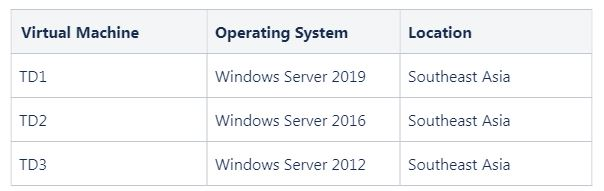
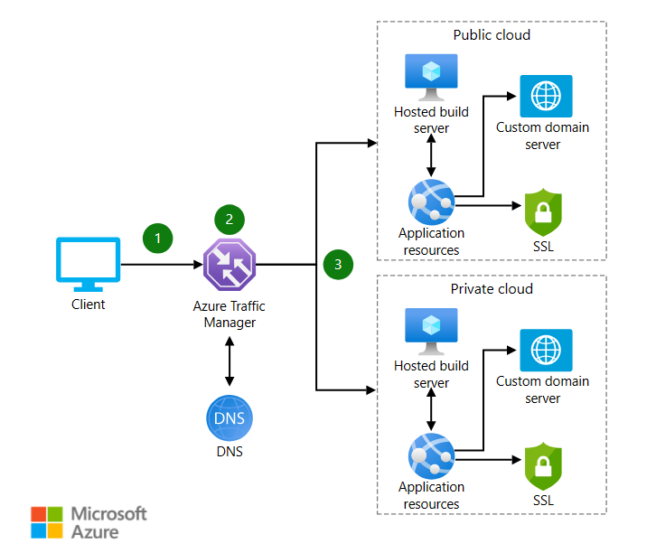

## Replication & the failure of a single datacenter in an Azure Region

:star: The storage account provides a unique namespace for your Azure Storage data that is accessible from anywhere in the world over HTTP or HTTPS.    
:star: Data in an Azure Storage account is always replicated 3 times in the primary region.  

:mag: Account Types

~~General-purpose v1 accounts~~ :
- Use general-purpose v2 accounts instead when possible.
- Legacy account type for blobs, files, queues, and tables.  
- Supports `LRS, GRS, RA-GRS` replication options  

~~BlobStorage accounts~~ : 
- Use `general-purpose v2` accounts instead when possible. 
- Legacy Blob-only storage accounts. 
- Supports `LRS, GRS, RA-GRS` replication options

:star: **General-purpose v2** accounts: 
- Recommended for 
  - most scenarios using Azure Storage.
- Basic storage account type for 
  - blobs, files, queues, and tables.  
- Supports replication options.
  - `LRS, GRS, RA-GRS, ZRS, GZRS, RA-GZRS` 

**BlockBlobStorage** accounts: 
- Recommended for scenarios with 
  - `high transaction rates`, or 
  - scenarios that use `smaller objects` 
  - or require `consistently low storage latency`. 
- Storage accounts with 
  - premium performance  
- **characteristics for block blobs and append blobs**. 
- Supports replication options 
  - `LRS, ZRS` 

**FileStorage** accounts: 
- Recommended for 
  - enterprise 
  - or high-performance scale applications. 
- Files-only storage accounts with 
  - premium performance characteristics. 
- Supports replication options 
  - `LRS, ZRS` 

:question: **Q :**
You are planning to migrate your on-premises media files to Azure.  

You need to create a storage account named `TutorialsDojoMedia` that must meet the following requirements:  
- It must be able to **tolerate the failure of a single datacenter** in an Azure Region.
- Replication must be `synchronous`.

:bell: **ANS :**

To achieve the fault-tolerance requirements, you need to utilize Zone-redundant storage (ZRS) as it copies your data synchronously across three Azure availability zones in the primary region.

Account Type that supports `ZRS`
- FileStorage
- BlockBlobStorage
- General-purpose V2

The options that say:   
:x: Geo-zone-redundant storage (GZRS)    
:x: Read-access geo-zone-redundant storage (RA-GZRS) 
- because these exceed the requirements. 
- Take note that the requirement is that your storage account must tolerate a single data center failure.

## AzCopy blobs & files

:question: 
You currently have an on-premises file server that contains a directory named `E:\TutorialsDojoMedia`.

There is a requirement to migrate the folder `E:\TutorialsDojoMedia` and its subdirectories to a public container in an Azure Storage Account named `TutorialsDojoAccount`.


:mag: AzCopy
- AzCopy is a command-line utility that you can use to **copy blobs or files `to` or `from` a storage account.** 
```bash   
azcopy copy [source] [destination] [flags]

azcopy copy E:\TutorialsDojoMedia https://TutorialsDojoAccount.blob.core.windows.net/public --recursive
```
You can also provide authorization credentials on your AzCopy command 
- by using `Azure Active Directory (AD)` or 
- by using a `Shared Access Signature (SAS) token`.

:mag: AZ Storage
- The Azure Storage platform is Microsoft’s cloud storage solution for modern data storage scenarios. Core storage services offer a massively scalable object store for data objects, disk storage for Azure virtual machines (VMs), a file system service for the cloud, a messaging store for reliable messaging, and a NoSQL store.

:mag: Blob Storage
- Azure Blob storage is Microsoft’s object storage solution for the cloud. 

:mag: Blob storage is optimized for storing massive amounts of unstructured data. 
- **Unstructured data is data that doesn't adhere to a particular data model or definition, such as text or binary data.**

:mag: Blob storage is designed for:
- Serving images or documents directly to a browser.
- Storing files for distributed access.
- Streaming video and audio.
- Writing to log files.
- Storing data for backup and restore disaster recovery and archiving.
- Storing data for analysis by an on-premises or Azure-hosted service.

## NSG & S2S

:mag: VNet :
- Azure Virtual Network (VNet) is the fundamental building block for your private network in Azure.

:mag: VPN Gateway : 
- A VPN gateway is a specific type of VNet gateway that is used to send encrypted traffic 
  - between an Azure VNet and an on-premises` location over the public Internet 
  - or between Azure VNets over the Microsoft network.

:mag: NSG : 
   
- Azure NSG is used to filter network traffic `to` and `from` Azure resources in an Azure virtual network.  
- A NSG contains security rules that allow or deny  
- inbound network traffic to, or outbound network traffic from, several types of Azure resources.  
- For each rule, you can specify `source` and `destination`, `port`, and `protocol`.  
- It can be attached to subnets and/or network interfaces. 

:mag: Rules
- **Unless you have a specific reason to, it is recommended that you associate a NSG to a subnet or a network interface**, but not both.   
Since rules in a NSG associated with a subnet can conflict with rules in a NSG associated with a network interface, you can have unexpected communication problems that require troubleshooting.
- **It’s important to note that security rules in an NSG associated with a subnet can affect connectivity between virtual machines within it.** 
For example, if a rule is added to `NSG1` which denies all inbound and outbound traffic, `VM1` and `VM2` will no longer be able to communicate with each other.  
Another rule would have to be added specifically to allow this.  

https://docs.microsoft.com/en-us/azure/virtual-network/virtual-networks-overview

https://docs.microsoft.com/en-us/azure/virtual-network/network-security-groups-overview

---

:question: **Q :**

You have an Azure subscription that contains a virtual network named TDVNet1 with a subnet named TDSubnet1. 

3 VMs have been provisioned to `TDSubnet1`, each with a public IP address.  

There are several applications that are hosted in your virtual machines that are accessible over port `443` (HTTPS) and `3389` (RDP) to users over the Internet.  

You have extended your on-premises network to TDVNet1 using a site-to-site VPN connection.

- Due to compliance requirements, you need to ensure that the Remote Desktop Protocol (RDP) connection is only accessible from the on-premises network.
- The solution must still allow internet users to access all the applications.

:bell: **ANS :**

:o: Add a rule to deny incoming RDP connection using network security group (NSG) which is linked to `TDSubnet1`

:x: Detach the public IP address of the virtual machines is incorrect.   
- **Removing the public IP address of your virtual machines will also remove their ability to connect to the Internet**.  
- The requirement in this scenario states that the virtual machines must still be accessible by Internet users.   

:x: Change the address space of the local network gateway is incorrect.  
- Address space in the local network gateway refers to one or more IP address ranges (in CIDR notation) that define your on-premises address space.  
- In this case, **modifying the address space might also remove RDP access from your on-premises network to Azure.**

:x: Change the address space of `TDSubnet1` is incorrect 
- because changing the address space of a subnet has no effect on restricting traffic going into it.  
**If you change the address space of `TDSubnet1`, you also need to terminate or move the virtual machines that are associated with TDSubnet1.**  

## Storage account deployment with ARM

**Q :**
Your organization plans to create a storage account in your Azure subscription.

Due to compliance requirements, you need to deploy your storage account according to the following conditions:

Your data must be replicated to another region to ensure redundancy. 
- Ensure costs are minimized whenever possible.
- Block public access to all blobs or containers.
- Disable shared key access.
- Allows HTTPS traffic only to storage service.
- Minimum TLS version – 1.1.
- Cool tier must be the default access tier.

:bell: **ANS :**
The question states several requirements. 

:x: Your data must be replicated to another region to ensure redundancy.  
Ensure costs are minimized whenever possible.
- The SKU specified is `Standard_ZRS`.  
- This will only provide redundancy when an availability zone fails, but if the entire region fails, then your data will not be available.

This does not satisfy the requirement.

Solutions : We can opt for `Geo-zone-redundant storage` (GZRS) which provides maximum consistency and redundancy, but one of the requirements also states that we need to minimize costs whenever possible.   
The bare minimum to satisfy this requirement is to use `Geo-redundant storage` (GRS) or `Standard_GR`  

:x: Block public access to all blobs or containers.
- There is no declared property for blocking public access. 
- The default value is True.
- This does not satisfy the requirement.

:x: Disable shared key access.
- There is no declared property for shared key access. 
- The default value is True.
- This does not satisfy the requirement.

:x: Allows HTTPS traffic only to storage service.
- There is no declared property requiring `HTTPS` traffic only to storage service. 
- The default value is True.
- This does not satisfy the requirement.

:x: Minimum TLS version – 1.1.
- There is no declared property forcing minimum TLS requests to Azure storage. 
- The default value is `1.0`.
- This does not satisfy the requirement.

:x: Cool tier must be the default access tier.
- There is no declared default access tier.   
- If the access tier is not explicitly stated, **the default access tier will be the `Hot` tier.**  
- This does not satisfy the requirement.  

Hence, the correct answer is: `No.`

Correct 
  


## :star: Virtual Network Service Endpoint  link to File Share Azure Backup

:mag: Virtual Network service endpoint   
- **It allows administrators to create network rules that allow traffic only from selected VNets and subnets, creating a secure network boundary for their data.**  
- **Service endpoints extend your VNet private address space and identity to the Azure services, over a direct connection.** 
  - This allows you to secure your critical service resources to only your virtual networks, providing private connectivity to these resources and fully removing Internet access. 

:mag: Azure Backup Service
- Azure Backup can access your storage account in the same subscription for running backups and restores of unmanaged disks in VMs. 
- To enable this, you need to tick the `Allow trusted Microsoft Services to access this storage account` box.

Enable Virtual Network service endpoint in a Storage Account Resource
  

---

:question Q:
You have an Azure subscription that contains several virtual machines deployed to a virtual network named TDVnet1.

You created an Azure storage account named tdstorageaccount1 as shown in the following exhibit:


You need to explicitly specify which subnets can access your storage account.

:a:
1 : Your virtual machines deployed to the `20.2.1.0/24` subnet will have access to the file shares in `tdstorageaccount1` : Never 
- The only subnet included in the lists of allowed subnets to Storage Account `tdstorageaccount1` is `20.2.0.0/24`.

2 : The unmanaged disks of the virtual machines can be backed up to `tdsotrageaccount1` by using Azure Backup?  : Never
- The `Allow trusted Microsoft Services to access this storage account` is not enabled. 
- This means that Azure Backup will never have the capability to backup the unmanaged disks of the VMs to `tdstorageaccount1`.

## :star: Object Replication

:mag: Object replication 
- is a powerful feature in cloud storage services that allows you to asynchronously copy data (such as files or block blobs) from a source storage account to a destination account located in a different region.


:mag: Some scenarios supported by object replication include:
1. `Minimizing latency`. 
Reduce latency for read requests by enabling clients to consume data from a region that is in closer physical proximity.
2. `Increase efficiency` for compute workloads. 
Compute workloads can process the **same sets of block blobs** in different regions.
3. `Optimizing data distribution.` 
You can process or analyze data in a single location and then replicate just the results to additional regions.
4. `Optimizing costs.` 
After your data has been replicated, you can **reduce costs by moving it to the archive tier using life cycle management policies**.

**Object replication is supported for `general-purpose v2 storage accounts` and` premium block blob` accounts.**    
**Object replication supports block blobs only; append blobs and page blobs aren’t supported.**  

https://learn.microsoft.com/en-us/azure/storage/blobs/object-replication-overview

https://learn.microsoft.com/en-us/azure/reliability/cross-region-replication-azure

:question: **Q 2-8:** 

You have an Azure blob storage account in your Azure subscription named TD1, located in the Southeast Asia region.

Due to compliance requirements, data uploaded to TD1 must be duplicated to the Australia Central region for redundancy. 

The solution must minimize administrative effort.

:a: :

:o: Configure object replication
- Since the regional pair of Southeast Asia is East Asia, we won’t be able to use geo-redundant storage (GRS) as we cannot choose the secondary region due to regional pairs.  **(The requirement states that whenever data is uploaded to TD1 must be duplicated to Australia Central due to compliance requirements.)**  
- Instead, we can use object replication to copy data from TD1 to a storage account in Australia Central region.

:x: Configure firewalls and virtual networks 
- It does not have any capability to replicate data to another region.
- this feature only allows users of Azure storage accounts to `block or allow specific traffic to your storage account.`

:x: Configure `versioning` 
- because this allows you to automatically maintain previous versions of an object in a single storage account. 
- Although, to use object replication, versioning must be enabled in the source and target storage accounts.

:x:  Configure Geo-redundant storage (GRS) 
- because the data will automatically be stored in East Asia since it is the regional pair of Southeast Asia region. 
- You don’t get to choose the secondary region when enabling geo-redundant storage. Instead, use object replication.

## Private DNS zone with LINKed VNet

Azure Private DNS provides a reliable, secure DNS service to manage and resolve domain names in a VNet without the need to add a custom DNS solution. 

Take note that you can only the following feature with a private DNS zone only.  
1. **LINK a virtual network.**   
2. **use the `auto registration` feature** 

You can not use public DNS zones as they do not have the capability to use virtual network links and the auto registration feature.

:mag: Private DNS Zones
**By using private DNS zones, you can use your own custom domain names rather than the Azure-provided names available today.**
- Using custom domain names helps you to tailor your virtual network architecture to best suit your organization's needs.  
- It provides name resolution for virtual machines (VMs) <font color="red">`within` a virtual network and `between` virtual networks.</font>

- Additionally, you can configure zone names with a split-horizon view, which allows a private and a public DNS zone to share the name.

:mag: **DNS RECORDS for a VNet & Private DNS ZONE CONFIGURATION**    
- Once you create a private DNS zone in Azure,   
You must link it to a VNet before a VM hosted in that network can access the private DNS zone.
- **When you create a link between a private DNS zone and a VNet, you will have an option to turn on `autoregistration` of DNS records for VMs.** 
- **You can not use public DNS zones as they do not have the capability to use virtual network links and the auto registration feature.**

:warning: Usage of Public DNS Zones
- For GLOBALLY accessible domains over the internet.

:warning: Usage of Private DNS Zones: 
- For INTERNAL name resolution within VNets, ensuring privacy and custom domain management.

:mag: Enable DNS Record autoregistration  
- A **Registration Virtual Network (VNet)** for a private DNS zone in Azure is a virtual network that is linked to the private DNS zone with `autoregistration` enabled.  
- With this setting enabled, the virtual network becomes a registration virtual network for the private DNS zone. 
  - A DNS record is automatically created for the VMs that you deploy in the network.  
  - DNS records are also created for the VMs that you have already deployed in the VNet.  
  - When you delete a virtual network, all the virtual network links and `autoregistered` DNS records associated with it in different private DNS zones are automatically deleted.
- **A private DNS zone can have multiple registration VNets. However, every VNet can only have one registration zone associated with it.**   

:mag: Not Enable DNS Record `autoregistration`
- Link your virtual network with the private DNS zone without autoregistration, **the virtual network is treated as a resolution virtual network only**.  
- And DNS records for VMs deployed in such networks will not be automatically created in the linked private DNS zone. **However, the VMs deployed in such a network can still successfully query the DNS records from the private DNS zone.**   
  - These records may be manually created by you 
  - or may be populated from other VNets that have been linked as `registration` networks with the private DNS zone.    
- One private DNS zone can have multiple resolution virtual networks and a virtual network can have multiple resolution zones associated to it.

:mag: Linking VNet with Private DNS zone  

The virtual networks deployed using classic deployment model isn't supported.
You can create only one link between a private DNS zone and a virtual network.  

Each VNet link under a private DNS zone must have a unique name within the context of the private DNS zone.  
You can have links with the same name in different private DNS zones. 

After creating a virtual network link, check the "Link Status" field of the virtual network link resource.   
Depending on the size of the virtual network, it can take a few minutes before the link is operational and the Link Status changes to Completed.

https://docs.microsoft.com/en-us/azure/dns/private-dns-overview

https://docs.microsoft.com/en-us/azure/dns/private-dns-virtual-network-links

https://docs.microsoft.com/en-us/azure/dns/private-dns-autoregistration

---

:question:   
You have an Azure subscription that contains a Windows virtual machine named TD1 with the following configurations:
```bash 
Virtual network: TDVnet1
Public IP Address: 20.10.0.1
Private IP Address: 48.156.83.51
Location: Southeast Asia
```
You deploy the following Azure DNS zones:


You need to determine which DNS zones can be linked to `TDVnet1` and which DNS zones `TD1` can be automatically registered.

:a:  
- `TDVnet1` can be linked to the following DNS zones:  
Manila.com and Davao.com only    
(private DNS zone only)
- TD1 can be automatically registered to the following DNS zones:  
Manila.com and Davao.com only  
(private DNS zone only)


## Peering Status with VNets

https://docs.microsoft.com/en-us/azure/virtual-network/virtual-networks-overview

https://docs.microsoft.com/en-us/azure/virtual-network/virtual-network-peering-overview

---

:question: **Q :**


:bell: **ANS :**


---

:mag: Hub and Spoke

- `TDVnet1` is the hub while `TDvnet2` and `TDVnet3` are the spoke. 

**VNet peerings are non-transitive**, meaning VNets that are directly peered can only communicate with each other but can't communicate with the peers of their peers. 
- For example : It would be best to create a peering connection between `TDVnet2` and `TDVnet3` to route packets with each other.

The traffic between virtual machines in peered virtual networks uses the Microsoft backbone infrastructure. **Like traffic between virtual machines in the same network, traffic is routed only through Microsoft’s private network.**

https://docs.microsoft.com/en-us/azure/virtual-network/virtual-networks-overview

https://docs.microsoft.com/en-us/azure/virtual-network/virtual-network-peering-overview

## :star: Usage of Azure Import/Export service.

**Q :**
You have 14 TB of files you need to migrate to a storage account using Azure Import/Export service.

You need to identify the two files you need to create before the preparation of the drives for journal file.

Which two files should you create?
- Dataset  (The data)
- Driveset (Tell Which file/directory i want to pick)

`Driveset -> check what data to be pick from DataSet`

---

Azure Import/Export service is used to securely import large amounts of data to Azure Blob storage and Azure Files by shipping disk drives to an Azure datacenter.  

Consider using Azure Import/Export service when   
- transferring data from Azure Blob storage to disk drives and ship to your on-premises sites.
- Data from one or more disk drives can be imported either to Azure Blob storage or Azure Files.
- uploading or downloading data over the network is too slow 
- or getting additional network bandwidth is cost-prohibitive.   

:star: Especially in the following scenarios:
- `Data migration` to the cloud:  
Move large amounts of data to Azure quickly and cost-effectively.
- `Content distribution` to sites :   
Quickly send data to your customer sites.
- `Backup` from on-premises:  
Take backups of your on-premises data to store in Azure Storage.
- `Data recovery` from storage to on-premises:   
Recover large amount of data stored in storage and have it delivered to your on-premises location.

:mag: Journal File x Import Procedure :
The first step of an import job is the preparation of the drives.   
This is where you need to generate a journal file.  

The following files are needed before you create a journal file: 
- The `Dataset` CSV File  (Directories & files)
Dataset CSV file is the value of `/dataset` flag is a CSV file that contains a list of directories and/or a list of files to be copied to target drives.      
The first step to creating an import job is to determine which directories and files you are going to import.
   - This can be a list of directories, a list of unique files, or a combination of those two. 
   - When a directory is included, all files in the directory and its subdirectories will be part of the import job.

- The `Driveset` CSV file (disks)
The value of the `/InitialDriveSet` or `/AdditionalDriveSet` flag is a CSV file that contains the list of disks to which the drive letters are mapped so that the tool can correctly pick the list of disks to be prepared.  

https://docs.microsoft.com/en-us/azure/import-export/storage-import-export-service

https://docs.microsoft.com/en-us/azure/import-export/storage-import-export-data-to-files

## Azure Backup Service & RSV

:mag: Azure Backup Service
- It provides `independent and isolated backups` to guard against unintended destruction of the data on your VMs. 


:mag: Azure Backup#RSV
- **Backups are stored in a Recovery Services vault with built-in management of recovery points.**
- Configuration and scaling are simple, backups are optimized, and you can easily restore as needed.

:mag: Snapshot 
- As part of the backup process, a snapshot is taken, and the data **is transferred to the RSV with no impact on production workloads.**  
- The snapshot provides different levels of consistency, as described here.

:mag: Recovery Point (backup and restore)
- Azure Backup also has specialized offerings for database workloads like `SQL Server running in VMs` and `SAP HANA` that is workload-aware, **offers 15 minute RPO (recovery point objective), and allows backup and restore of individual databases.**

:mag: Region
- **Take note that you can not backup resources that are located in another region.**
---

:question:
In this scenario, there are two recovery services vaults located in different regions. 
  

You create an Azure file share named TDShare1 and an Azure Blob container named TDBlob1 using TDAccount1.

What resources can you backup using TDBackup1 and TDBackup2?

:a:  
:one: you can backup `TDShare1` with `TDBackup1`
- only because it resides within the same region as `TDBackup1` and you can backup an Azure FileShare using Azure Backup.   
- Also, as you look at the table above, `TDAccount1` or the Storage Account service is created in Southeast Asia.  

:two: `TDBackup2` can backup `TD1` 
- because they are in the same region and you can backup Azure VMs using Azure Backup.  

https://docs.microsoft.com/en-us/azure/backup/backup-overview

https://docs.microsoft.com/en-us/azure/backup/backup-azure-arm-vms-prepare

https://docs.microsoft.com/en-us/azure/backup/backup-afs

## DNS Record & App Service

Azure App Service is an HTTP-based service for hosting web applications, REST APIs, and mobile back ends
- Applications run and scale with ease on both Windows and Linux-based environments.
- App Service not only adds the power of Microsoft Azure to your application, such as security, load balancing, autoscaling, and automated management.

`App Service#Resource | Settings | Custom Domain` :arrow_down:

- You can configure Azure DNS to host a custom domain for your web apps.  

For example, you can create an Azure web app and have your users access it using either DNS `www.tutorialsdojo.com` or `tutorialsdojo.com` as a fully qualified domain name (FQDN).

To do this, you have to create three records:
- A root `A` record pointing to your domain.
- A root `TXT` record for verification
- A `CNAME` record for any subdomain name that your domain has.

<font color="red"> Keep in mind that if you create an A record for a web app in Azure, the A record must be manually updated if the underlying IP address for the web app changes. </font>

---

**Q :**
You have a custom domain named `tutorialsdojo.com` that needs to be added to App Service `TDApp1`.
What should you do first?

**ANS :**

:o: Add A DNS record

:x: Modify the app settings is incorrect  
- because these are simply configurations **passed as environment variables** to the application code.

:x: Create a Private Endpoint is incorrect  
- because this only **allows clients located in your private network to securely access the app over a Private Link** which helps you eliminate exposure from the public Internet.

:x: Configure VNet integration is incorrect (web app -> vnet -> resource`<vm#database>`)
- because this is just **a feature that enables your apps to access resources in or through a VNet**.  
This type of integration doesn't enable your apps to be accessed privately.  
**You use this if you want to privately connect to the resources inside a virtual machine.**

https://docs.microsoft.com/en-us/azure/app-service/overview

https://docs.microsoft.com/en-us/Azure/app-service/app-service-web-tutorial-custom-domain

## RSV

- **Backups are stored in a Recovery Services vault with built-in management of recovery points.** 

Tips
1. You need to ensure that the machine you are recovering the file to meets the requirements before executing the script.
2. You can only 
   - restore a virtual machine by creating a new VM, 
   - restoring a disk, 
   - or replace the existing VM disk.

**Q :**
You have an Azure Recovery Services vault named `TDBackup1` that backs up VMs `TD1`, `TD2`, and `TD3` daily *without an Azure Backup Agent*  



:bell: **ANS :**
you can perform file recovery to `TD2` only 
- because the operating systems of `TD1` and `TD3` are not compatible with `TD2`.     

Conversely, you can restore `TD3` to `TD3` only 
- because you can not restore the disk of `TD3` to `TD1` and `TD2`.  
You can only restore a virtual machine by creating a new VM, restoring a disk, or replace the existing VM disk.    

--- 


Step of Recover Specific File
1. To recover a specific file, you must `specify the recovery point of your backup and download a script that will mount the disks from the selected recovery point.`  
2. After the script is successfully downloaded, make sure you have the `right machine to execute this script`.

You can restore files 
- from a VM to the same server operating system, or to the compatible client operating system.   

:warning: **When recovering files, you can’t restore files to a `previous or future` operating system version.**  
- For example, you can’t restore a file from a Windows Server 2016 VM to Windows Server 2012 or a Windows 8 computer.   

You can restore a virtual machine with Disk in the following options:
1. Create a new VM
2. Restore Disk
3. Replace existing disk (OLR) with the selected restore point

In Option#3 there are few things to note
- **The current VM must exist**.  
If it’s been deleted, option#3 can’t be used.   
- Azure Backup takes a snapshot of the existing VM before replacing the disk, and **stores it(snapshot of existing VM) in the staging location you specify.**  
  - **The snapshot is copied to the vault and retained in accordance with the retention policy.**
- After the Replace Disk operation, **the original disk is retained in the resource group.** 
- You can choose to manually delete the original disks if they aren’t needed.

https://docs.microsoft.com/en-us/azure/backup/backup-overview

https://docs.microsoft.com/en-us/azure/backup/backup-azure-arm-restore-vms

https://docs.microsoft.com/en-us/azure/backup/backup-azure-restore-files-from-vm

## Azure Files & SMB & SYNC

Azure Files enables you to set up highly available network file shares that can be accessed by using` the standard Server Message Block (SMB) protocol`. 
1. That means that multiple VMs can share the same files with both read and write access. 
2. You can also `read the files using the REST interface` or the `storage client libraries`.


Remember that whenever you make changes to any cloud endpoint or server endpoint in the sync group, it will be synced to the other endpoints in the sync group. 
- If you make a change to the cloud endpoint (Azure file share) directly, changes first need to be discovered by an Azure File Sync change detection job. 
- is only initiated for a cloud endpoint once every 24 hours.


**Azure does not overwrite any files in your sync group.**  
Instead, it will keep both changes to files that are changed in two endpoints at the same time. 
1. **The most recently written change keeps the original file name.**
2. The older file (determined by LastWriteTime) has the endpoint name and the conflict number appended to the filename. 

For server endpoints, the endpoint name is the name of the server. 

For cloud endpoints, the endpoint name follows this taxonomy:   `<FileNameWithoutExtension>-<endpointName>[-#].<ext>`   
- For example, `tutorials-FileServer1.docx`

:mag: File Sync Conflict Number
**Azure File Sync supports `100` conflict files per file.** 
- Once the maximum number of conflict files has been reached, the file will fail to sync until the number of conflict files is less than `100`.

:link: https://docs.microsoft.com/en-us/azure/storage/files/storage-files-introduction

:link: https://docs.microsoft.com/en-us/azure/storage/files/storage-sync-files-deployment-guide

---

:question:

You have an Azure subscription that contains a sync group named `TDSync1` which has an associated cloud endpoint called `TDCloud1`.  

You have the following on-premises `Windows Server 2019` file servers that you want to synchronize to Azure :  


You first registered `FileServer1` as a server endpoint to `TDSync1` and then registered `FileServer2` as a server endpoint to `TDSync1`.


:a: : 

:o: `dojo.mp4` will be synced to `FileServer1`.  

:x: The following statements are incorrect  
- `tutorials.docx` on `FileServer1` will be overwritten by `tutorials.docx` from `TDCloud1`.  
- `tutorials.docx` on `TDCloud1` will be overwritten by `tutorials.docx` from `FileServer1`.  

Because **Azure File Sync will not overwrite any files in your endpoints.**       
It will simply append a conflict number to the filename of the older file, while the most recent change will RETAIN the original file name.  

## :star: Site-to-Site Connection

Azure Application Gateway  
```
browser -> App Gateway Frontend IP -> HTTP/s listener-> Http Rules -> Backend Pool
```
  
- <font color="red">Azure Application Gateway can be configured with an `Internet-facing VIP` or with `an internal endpoint that is not exposed to the Internet`, also known as an `internal load balancer (ILB) endpoint`.</font>  

Configuring the gateway with an ILB is useful  
- For internal line-of-business applications that are not exposed to the Internet.  
- For services and tiers within a multi-tier application that sits i a security boundary that is not exposed to the Internet but still requires `round-robin load distribution`, `session stickiness`, or `Transport Layer Security (TLS)`, previously known as `Secure Sockets Layer (SSL)`, termination.

A frontend IP address 
- is the IP address associated with a network-facing service, such as an application gateway. 
- It's the IP address that clients connect to when they want to access the service.  
  
In the context of Azure services, you can configure an application gateway to have a public IP address, a private IP address, or both. 
- An application gateway supports one public or one private IP address.  

An internal load balancer distributes traffic to resources that are inside a virtual network.
- Azure restricts access to the frontend IP addresses of a virtual network that is load balanced.   
- Front-end IP addresses and virtual networks are never directly exposed to an Internet endpoint.  

Internal line-of-business applications run in Azure and are accessed from  
1. Within Azure 
2. On-premises resources.

In summary,   
  
- If you want to load balance between your servers in a region at the application layer, you should review Application Gateway. 
- If you want to do network layer load balancing, you should review Load Balancer

:link: https://docs.microsoft.com/en-us/azure/load-balancer/components

:link: https://docs.microsoft.com/en-us/azure/application-gateway/overview

---

**Q :**
Your company has an Azure subscription named `TDSubscription1`.  

You have a `line-of-business (LOB) application` that is hosted on several VMs in an Azure virtual machine scale set named `TDSet1`.  

Requirement
1. You have an on-premises network that has a site-to-site VPN connection to your Azure environment that allows your users to access your application only.   
2. You need to recommend a solution that will load balance the traffic to your VMs coming from the on-premises network.  

TIPS
- Take note that in this scenario, **the line-of-business application is only accessed by your on-premises network that is connected by a site-to-site VPN connection.**  
- This means that access to your VMs must be intranet and must use a load balancing service that supports internal load balancing.  

:a:  

:o: the correct answers are:
- Azure Application Gateway
- Internal Load Balancer (Requirement 1)

:x: Traffic Manager `Application layer (Layer-7)`

- Azure Traffic Manager is a DNS-based traffic load balancer
- It only allows you to distribute traffic to your public-facing applications across the global Azure regions. 
- Traffic Manager also provides your public endpoints with high availability and quick responsiveness.
- **Traffic Manager uses DNS to direct clients to specific service endpoints based on the rules of the traffic-routing method**. Clients connect to the selected endpoint directly. 
- **Traffic Manager is not a proxy or a gateway.**  
:m: Traffic Manager does not see the traffic passing between the client and the service.  
:m: You can not use this to load balance internal traffic to your virtual machines.

[:link: Public facing Azure Container Registry Reference Architecture
](https://techcommunity.microsoft.com/t5/azure-architecture-blog/public-facing-azure-container-registry-reference-architecture/ba-p/4016387)

:x: Public Load Balancer is incorrect 
- It simply **balances the incoming Internet traffic to your virtual machines.** 

Take note that you need to implement an internal load balancing solution since the <u>_on-premises network is connected by a site-to-site VPN connection, which is not directly accessible on the public Internet._</u>

:x: Azure Front Door is incorrect
- Azure Front Door is a global, scalable entry-point that uses the Microsoft global edge network to create fast, secure, and widely scalable web applications.
- **It just enables you to `define`, `manage`, and `monitor` the global `routing` for your web traffic.** 


## device settings

**Q :**
You purchased an Azure AD Premium P2 license.  

**You plan to `add a local administrator` to manage all the computers and devices that will join your domain.**  

What do you need to configure in Azure Active Directory to satisfy this requirement?

**ANS :**

:o: Configure device settings.

To add local administrators that will manage joined devices in Azure AD, you must configure the settings shown in the image above. 

You can select the users that are granted local administrator rights on a device. 

These users will be added to the Device Administrators' role in Azure AD. 

**By default, global administrators in Azure AD and device owners are granted local administrator rights.** 

This configuration is a premium edition capability, and it is available through products such as Azure AD Premium or the Enterprise Mobility Suite (EMS).

[:link: How to manage the local administrators group on Microsoft Entra joined devices](https://learn.microsoft.com/en-us/entra/identity/devices/assign-local-admin#manage-the-device-administrator-role)  
[:link: Manage device identities using the Microsoft Entra admin center](https://learn.microsoft.com/en-us/entra/identity/devices/manage-device-identities)  
 
:x: `Require users to re-register for MFA`
because this approach is mainly used for troubleshooting MFA end-user issues.     Also, this option won’t help you add local administrators to manage joined devices.  
:x: `Enable app registrations in user settings`    
If this option is enabled, non-admin users can register custom-developed applications within the directory.    
This option is not needed.    
Take note that the requirement in the scenario is to add local administrators and not to register applications.  
:x: `Configure group naming policy`   
This option only allows you to add a specific prefix or suffix to the group name and alias of any Microsoft 365 group created by users.  
Group naming policy is not needed in the scenario because you only need to add local administrators to your domain.     

## Resource Group & Exported ARM of existing VM

:question:

You created a template based on the configuration of the `TDAzureVM1` virtual machine and uploaded it to the Azure Resource Manager (ARM) Library.

You need to provision a new virtual machine named `TDAzureVM2` using the same template in ARM.

What can be configured in this custom deployment process?

:o: the correct answer is: Resource group.  

- **You can export the template (is composed of parameters and template JSON files.) of an existing virtual machine and save it in Azure Resource Manager.**  
- In custom deployment (as shown in the figure above), the only options that you can configure are `Subscription`, `Resource` `Group`, and `Location`.  

The following options are incorrect.
:x: The operating system  
:x: availability options
:x: size of VM are already configured in the ARM template.

:link: https://docs.microsoft.com/en-us/azure/virtual-machines/linux/create-ssh-secured-vm-from-template

:link: :red_circle: https://docs.microsoft.com/en-us/azure/azure-resource-manager/templates/overview

## :star: Delete Azure Backup RSV Resource

:question:


- **The backup of `VM1` is stored in `RSV1` (RSV).**
- You plan to delete the resource group after 30 days.

Delete a Recovery Services Vault : 
You can't delete a Recovery Services vault with any of the following dependencies:
- a Vault that contains protected data sources. 
- a Vault that contains backup data.  
- a vault that contains backup data in the soft-deleted state.
- a vault that has registered storage accounts.

> Once backup data is deleted, it will go into the soft-deleted state. 

:question: **Q :**  
You created a resource group and added the resources shown

You plan to delete the resource group after 30 days.  

What should you do first to delete the resource group?  

:bell: **ANS :**  

:o: Stop the backup of VM1.

Based on the given scenario, the backup is still running. 
If you try to delete the vault without removing the dependencies, you will receive an error message `Failed to delete resource group.` 

To resolve this problem, **you must stop the backup first, then disable soft delete and delete the resource group**. Hence, the correct answer is: Stop the backup of VM1.

:x: Delete VM1.

:x: Delete storage1.

:x: Restart VM1.

 

## Azure Log Analytics & KQL

:question: **Q :**
Your company has an Azure Log Analytics workspace in their Azure subscription.  

You are instructed to `find` the error in the `table` named `EventLogs`  

:bell: **ANS :**

To retrieve data in the Log Analytics workspace, you need to use a Kusto Query Language (KQL). 

Remember that there are different types of log queries in Azure Monitor. 

```SQL
search in (TableName) "value"
```

If you omit the `in (TableName)`` part and just run the search `"value"`, the search will go over all tables, which would take longer and be less efficient.  
Hence, the correct answer is: `search in (EventLogs) "error"`   

The option that says: 

:x: `EventLogs | take 10`
- because this option would only take 10 results in the EventLogs table. 

:x: `search "error"` 
- because this query would search `error` in all the tables.
- Take note that you only need to query the table `EventLogs`.

:x: `EventLogs | sort by TimeGenerated desc`
- because this query will only sort the entire EventLogs table by the TimeGenerated column.

## Azure Custom Script Extension PostDeployment :x: ARM templates  

:mag: Azure Virtual Machine Scale Sets 
- It let you create and manage a group of load-balanced VMs. 
- The number of VM instances can automatically increase or decrease in response to demand or a defined schedule. 
Scale sets provide high availability to your applications and allow you to centrally manage, configure, and update a large number of VMs. 
- With virtual machine scale sets, you can build large-scale services for areas such as `compute`, `big data`, and `container workloads`.

:mag: Custom Script Extension
Apply `Custom Script Extension` to download and execute scripts on Azure VMs.  
- This extension is useful for 
  - post-deployment configuration, 
  - software installation, 
  - or any other configuration/management task.   
- Scripts can be downloaded from Azure storage or GitHub, or provided to the Azure portal at extension run-time. 
- The Custom Script extension integrates with ARM templates, and can also be used with the `Azure CLI`, `Azure PowerShell`, `Azure portal`, or the `REST API`.

https://docs.microsoft.com/en-us/azure/virtual-machine-scale-sets/tutorial-install-apps-template

https://docs.microsoft.com/en-us/azure/virtual-machines/extensions/custom-script-windows

---

:question: **Q :**

You plan to use an Azure Resource Manager (ARM) template to create a virtual machine scale set that will launch five Ubuntu servers.  

**You need to make sure that NGINX is installed in all the virtual machines.**  

:bell: **ANS**

:o: Azure Custom Script Extension.


:x: Azure Blueprints 
- because you can't use Blueprints to execute scripts and install NGINX in virtual machines. 
- The Azure Blueprints service simply enables you to **define a repeatable set of Azure resources that implements and adheres to an organization’s standards**, patterns, and requirements.

:x: Azure Policy
- because this service is **mainly used to create, assign, and manage policies across your organization**.

:x: Azure Service Bus 
- because this is just a fully **managed enterprise message broker with message queues and public-subscribe topics**.  

## App Services & Logging feature

:question:
You created a web app named `tdwebapp-prod` using Azure App Service.  

Several users are complaining that they received `HTTP 500` errors whenever they try to connect to `tdwebapp-prod`.

Requirement
**You must grant the developers real-time access to the application in order to view the connection error details.**

:a: : 

To Check Error Details you must Enable diagnostics logging for apps in Azure App Service


- Since you are dealing with raw HTTP requests data, you need to **enable `Web Server Logging` in Azure App Service**. 
- Each log message includes data such as the `HTTP method`, `resource URI`, `client IP`, `client port`, `user agent`, `response code`, and so on.  

**For web server logging, you can store the logs in a storage or file system and set the number of days the logs should be retained.**

Hence, the correct answer is: Enable the Web Server Logging feature.

:x: `Create a security playbook` is incorrect  
because this is just a collection of procedures that can be run from Microsoft Sentinel in response to an alert.  
Take note that web server logging is not directly supported in Microsoft Sentinel.

:x: `Enable Application Logging feature` is incorrect 
because HTTP 500 is an internal server error.  
This means that there is a problem with the web server itself.  
To help you find the root cause, you can enable the Web Server Logging feature in Azure App Service.

:x: `Create resource health alerts` is incorrect  
because this option only sends resource health notifications.   
If you need to find information about HTTP requests in your web app, you need to enable web server logging.


## Web App x Azure Load Balancer's session persistence

To redirect the client request to the same virtual machine, you need to add a session persistence in the load balancing rule. 

:mag: Session persistence
**Session persistence specifies that traffic from a client should be handled by the same virtual machine in the backend pool for the duration of a session.**

:memo: There are 3 options in session persistence:
- `None`
specifies that successive requests from the same client may be handled by any virtual machine.
- `Client IP`
specifies that the same virtual machine will handle successive requests from the same client IP address.
- `Client IP & protocol`
specifies that the same virtual machine will handle successive requests from the same client IP address and protocol combination.

https://docs.microsoft.com/en-us/azure/load-balancer/manage

https://docs.microsoft.com/en-us/azure/load-balancer/load-balancer-overview

---

:question: **Q :**
You deployed `10` web servers that are running in `Windows Server 2019` virtual machines behind an Azure load balancer. 

- **The virtual machines host a stateless web application**.

You need to ensure that successive requests from the same client IP address and protocol will be handled by the same virtual machine.

What should you configure in the load balancer?

:bell: **ANS :**

:o: Set the session persistence to Client IP and protocol.  
- Since the requirement in the scenario is to handle the same client IP address and protocol, you need to set the Session Persistence to Client IP and protocol.

:x: Configure Client IP as the session persistence type is incorrect  
- because the requirement in the scenario is the same client IP address and protocol. 
- This type of configuration is only applicable if you want to persist the same client IP address, excluding its protocol.

:x: Set idle timeout to the maximum available limit is incorrect 
- because the maximum available limit in idle timeout is 30 minutes.   
Also, idle timeout is used to keep TCP or HTTP connections open without relying on clients to send keep-alive messages.   

:x: Enable Floating IP is incorrect   
- because this feature just changes the IP address mapping to the front-end IP of the load balancer.   
- **The Floating IP feature is not capable of handling sticky sessions.**

## Azure Automation 

Azure Automation delivers a cloud-based automation and configuration service that supports consistent management across your Azure and non-Azure environments. 

**Automation gives you complete control during <font color="red"> deployment, operations, and decommissioning of workloads and resources.</font>**


It comprises process `automation`, `configuration` management, `update` management, `shared` capabilities, and `heterogeneous` features. 

https://docs.microsoft.com/en-us/azure/automation/shared-resources/schedules

https://docs.microsoft.com/en-us/azure/automation/start-runbooks

---

**Q :**
The requirement in the scenario is to improve the vCPU performance of the virtual machine at the end of each month.   

:a: 
There are two options to improve the `vCPU` performance of the virtual machine.   
1. scale up  (Vertical)
2. scale out (Horizontal).   

Since scale-out is not supported by the application, you would need to use the first option. 

Scaling up the virtual machine will increase its size in response to the workload.

Hence Scaling up the virtual machine will increase its VM size in response to the workload.

:x: Add the virtual machine to a scale set    
- because the application does not support multiple virtual machines. 
- **Take note that a VM scale set is a group of load-balanced VMs.**

:x: Add the Azure Performance Diagnostics VM Extension   
as this feature only collects performance diagnostic data from your Windows VM not processes improving.

:x: Set the Desired State Configuration Extension    
- This feature only bootstraps a VM to the Azure Automation State Configuration (DSC) service and doesn’t size of (upgrade the vCPU) of the VM. 

## :star: System Downtime

**Q :** :question:

You are planning to make the following changes:
- Create and attach a new disk.
- Change the VM size.
- Detach a network interface.
- Move the VM to a new resource group.
- Add a Desired State Configuration (DSC) extension.

Which of the following changes would cause system downtime?

:a: :

https://docs.microsoft.com/en-us/azure/virtual-machines/windows/resize-vm

https://azure.microsoft.com/en-us/blog/resize-virtual-machines/


Based on the given scenario, the VM is currently running a business-critical application. 

There are two ways to change the size of a VM, the first option is to stop the VM, change the size of the VM in the size settings, and start the VM again.

The second option is to resize the VM when the VM is in a running state. 

**Take note that if the virtual machine is currently running, changing its size will cause it to be restarted and will result in system downtime.**   
Hence, the correct answer is: Changing the VM size.   

:x: Creating and attaching a new disk is incorrect 
- **because adding a new disk to your virtual machine won't cause system downtime.**  
- Take note that you can attach multiple disks while the virtual machine is running.

:x: Detaching a network interface is incorrect 
- because if the virtual machine is in a running state, the detach network interface option in the networking settings is greyed out.  
You need to stop the virtual machine first before you can detach/attach a network interface.  

:x: Move the VM to a new resource group is incorrect 
- because this option also won’t cause downtime in your application. 
**A resource group is simply a logical grouping of your VMs.**


## Azure Site Recovery & VM with managed Disk 

**Q :**
A company plans to deploy an Azure Virtual Machine with the following parameters:  
```bash 
Region: South Central US
OS disk type: Standard HDD
Ultra Disk compatibility: Disabled
Managed disks: Disabled
```  
<font color="red">To prevent downtime, you need to make sure that the instance can be moved in different Availability Zones using Site Recovery.</font>  

:a: 
  

Managed disks are designed to have a 99.999% uptime. 
- Managed disks achieve this by storing three copies of your data, resulting in high durability. 
- If one or two replicas fail, the remaining replicas help ensure data persistence and high failure tolerance.

With Azure Site Recovery, you can move single-instance VMs into Availability Zones in a target region.   
- **In order to move a VM to an Availability Zone, you must first ensure that the VM is using managed disks.** 
- You can also convert existing `WINDOW VMs` that use unmanaged disks to use managed disks.

:x: Region is incorrect 
- because South Central US already allows you to select Availability Zone as an option. 
- This means that you can move the VM to different AZs. 
- Take note that some Regions or locations don't support AZs.

:x: OS disk type is incorrect 
- because it doesn't matter what type of disk the VM is using, if you already enabled `use managed disks` in `advanced disk` configuration.

:x: Ultra Disk compatibility is incorrect  
- because the requirement is not related to data-intensive workloads.   
- You only need to ensure that the VMs can be moved to a different AZ in the event of a disaster.

---

**Site Recovery replicates workloads running on physical and virtual machines (VMs) from a primary site to a secondary location.**  

When an outage occurs at your primary site, you fail over to a secondary location, and access apps from there. After the primary location is running again, you can fail back to it.  

Site Recovery can manage replication for :  
- Azure VMs replicating between Azure regions   
- Replication from Azure Public Multi-Access Edge Compute (MEC) to the region  
- Replication between two Azure Public MECs  
- On-premises VMs, Azure Stack VMs, and physical servers  


:link: https://learn.microsoft.com/en-us/azure/site-recovery/move-azure-vms-avset-azone

:link: https://learn.microsoft.com/en-us/azure/virtual-machines/windows/convert-unmanaged-to-managed-disks

## View Template in Resource Group

:question: **Q :**  
Your company has an Azure subscription that is used by several departments.    

The resources in the subscription are listed in the table below.    
  

There's another Azure Administrator who created several virtual machines and storage accounts using an ARM template. 

You need to find the template that was used to deploy the new resources.

:bell: **ANS :**

`Resource Group#Name | Settings | Deployment | View Template`


Remember that you can’t change the configuration of a template after you deployed it. 

Remember that in the ARM template of the virtual machine, you can find the resources associated with that specific virtual machine only.


## Move resources to other subscription

**Q :** :question:
Your company has an Azure subscription named TD-Sub1 that contains the resources shown in the table below.

You created a new Azure subscription named `TD-Sub2`.  
You plan to move the resources from `TD-Sub1` to `TD-Sub2`.  

Which resources in TD-Sub1 can you move to the new subscription?


**ANS :**

:o: Virtual machine, Virtual network, Recovery Services vault, and Storage account

`Resource Group#name | Overview | Move`

If you need to move your resources to a new subscription or resource group under the same subscription, you can use `Azure portal`, `Azure PowerShell`, `Azure CLI`, or `the REST API`. 

<font color="red">Take note that when you move a resource to a new resource group or subscription, `the location of the resource won’t change`.</font>

https://docs.microsoft.com/en-us/azure/azure-resource-manager/management/move-resource-group-and-subscription

https://docs.microsoft.com/en-us/azure/azure-resource-manager/management/overview

## :star: IT Service Management Connector (ITSMC)

IT Service Management Connector (ITSMC) allows you to connect Azure to a supported IT Service Management (ITSM) product or service.   

**The ITSM connector provides a connection between Azure and ITSM tools to help users RESOLVE TROUBLESHOOTING issues that are detected by Azure services, such as Azure Monitor and Log Analytics that reside in an ITSM service.**  

:mag: What ITSMC supports?
ITSMC supports connections with the ITSM tools, such as `ServiceNow`, `System Center Service Manager`, `Provance`, and `Cherwell`.  

[<font color="red">:link: Create ITSM work items from Azure alerts </font>](https://learn.microsoft.com/en-us/azure/azure-monitor/alerts/itsmc-definition#create-itsm-work-items-from-azure-alerts)

`Monitor#name | Alerts | Actions Groups`
  

On the Actions tab, select `ITSM` in the Action type list.  
For Name, provide a name for the action.  
Then select :pen: button that represents Edit details.  
  

In the Subscription list, select the subscription that contains your Log Analytics workspace. 
- In the Connection list, select your ITSM Connector name. It will be followed by your workspace name. An example is MyITSMConnector(MyWorkspace).

With ITSMC, you can:
- :m: `[work items -> azure alerts]`Create `work items` in your ITSM tool, based on your Azure alerts (metric alerts, activity log alerts, and Log Analytics alerts).  
- :m: `Sync` your incident and change request data from **your ITSM tool to an Azure Log Analytics workspace.**  
  

**Before you can create a connection in ITSM, you must first install the ITSMC in the Azure Log Analytics workspace.**  
[:link: 使用IT服務管理將 Azure 連線 至 ITSM 工具](https://learn.microsoft.com/zh-tw/azure/azure-monitor/alerts/itsmc-definition)  
  

https://docs.microsoft.com/en-us/azure/azure-monitor/platform/itsmc-overview  

https://docs.microsoft.com/en-us/azure/azure-monitor/platform/itsmc-connections  

https://docs.microsoft.com/en-us/azure/azure-monitor/platform/action-groups  

---

**Q :** :question:
You deployed a **System Center Service Manager** on your computer and a virtual machine in your Azure subscription.  

You plan to create an alert for the Service Manager to notify you  
- if the _available memory on the virtual machine_ is less than 15%.

What should you create first?

:a: :

:o: To create work items in your ITSM tool based on Azure alerts, you'll need to use the ITSM action in action groups.  
- The action groups provide a modular and reusable way to trigger actions for your Azure alerts.   

:x: Set up a function app using Azure Functions is incorrect   
- because the function app is not supported in Service Manager.   

:x: Create a connection monitor is incorrect  
- because you can't create an alert in the connection monitor.  
- **it is primarily used to track connection reachability, latency, and topology changes of your network connection.**

:x: Configure an automation runbook is incorrect    
- because **the automation runbook is not supported in Service Manager.**  
- This option only allows you to automate your Azure management tasks and orchestrate actions across external systems.

## :star: Entra ID x Security Group Assignment Type x Microsoft 365 groups

  
When creating a new group in Microsoft Entra ID, you can select two types of membership.
1. The `assigned` membership type :  
lets you `MANUALLY` add specific users to be members of the group and to have unique permissions.
2. While `dynamic` membership type :  
lets you add and remove members `automatically` based on your dynamic membership rules (user attributes such as department, location, or job title).

https://docs.microsoft.com/en-us/microsoft-365/solutions/microsoft-365-groups-expiration-policy

https://learn.microsoft.com/en-us/entra/fundamentals/how-to-manage-groups

https://learn.microsoft.com/en-us/entra/identity/users/groups-create-rule

---

**Q :** :question: 
You need to grant several users who must belong to the same Azure group temporary access to the Microsoft SharePoint document library. 

The group must automatically be deleted after 180 days for compliance purposes.

**ANS :**

:o: Set up an assigned/dynamic membership on Microsoft 365 groups.  

Since you need to delete the groups automatically from the given requirement, you can set an **expiration policy in Microsoft 365 groups**. 

- **Take note that when a group expires, all of its associated services will also be deleted.**

:x: Set up an assigned membership on security groups and Set up a dynamic membership on security groups are incorrect 
- because security groups can <font color="red">only be used for devices or users and not for groups.</font>

:x: Set up an external identity provider is incorrect 
- because **external identities only allow users outside your organization to access your resources.** This option won’t help you create an expiration policy.

## Device Service : device settings in AZ AD

https://docs.microsoft.com/en-us/azure/active-directory/devices/device-management-azure-portal

https://docs.microsoft.com/en-us/azure/active-directory/fundamentals/active-directory-whatis

---

:question: :
Your company has several client computers at the office headquarters. 

Two years ago, you migrated the on-premises directory to Azure AD.

To meet the compliance requirement, personal and corporate devices must be registered and joined to the Azure AD domain.


> You received a report that a user cannot register her personal device to Azure AD. 
- Upon checking, the user was able to register her other devices in the past. 
- You also verified that all other users were able to join their devices to Azure AD last month.

You need to make sure that the user can access and join her new device to Azure AD.

:a: :

:o: Modify the maximum number of devices per user in the device settings  

The device settings in Azure AD allows you to customize the maximum number of devices per user. 
- It can be` 5`, `10`, `20`, or `unlimited`. 
If the users reached the limit, they will not be allowed to add new devices until one or more devices have been removed.   


:x: Move the user to a new group is incorrect  
- because even if you move the user to a different group, the user won’t be able to access Azure AD.   

:x: Add a custom domain name is incorrect  
- because creating a new custom domain is not needed in the scenario. The user won’t still access Azure AD.

:x: Assign a new role to the user is incorrect   
- because a new role won’t resolve the problem of the user.  
Remember that the user was able to register and join her other devices to Azure AD in the past.   
Therefore, the role associated with her doesn’t have any issues at all.  

## Vm Scale Set & proximity placement group

**A proximity placement group is a logical grouping used to make sure that Azure compute resources are physically located close to each other.** 

Proximity placement groups are useful for workloads where low latency is a requirement. 

When you assign your virtual machines to a proximity placement group, the virtual machines are placed in the same data center, resulting in lower and deterministic latency for your applications.

**The region of the virtual machine scale set and the proximity placement group should be the same.**  

https://docs.microsoft.com/en-us/azure/virtual-machines/windows/proximity-placement-groups-portal

https://azure.microsoft.com/en-us/blog/announcing-the-general-availability-of-proximity-placement-groups/

---

:question: **Q :**  
  
You plan to configure a proximity placement group for the `TD-VMSS1` virtual machine scale set.  


:a: :  

<font color="red">Remember that when you are configuring a proximity placement group for a virtual machine scale set. 
- Both the placement group and scale set must be in the same region.</font>

It is stated in the scenario that you must configure a placement group for `TD-VMSS1`. 

Among the given placement groups, you can only assign `TD-Proximity3` since **it belongs to the same region** as `TD-VMSS1`.  

Hence, the correct answer is: TD-Proximity3.  

:x: TD-Proximity2 is incorrect 
- because TD-VMSS1 is located in East Asia and not in Australia East.   
- Although both TD-VMSS1 and TD-Proximity2 belong to the same resource group, take note that the location of the resource group is irrelevant in this scenario. 
- You should assign TD-VMSS1 to the TD-Proximity3 placement group to satisfy the requirement.

:x: TD-Proximity1 and TD-Proximity3 is incorrect.  
- You can’t configure TD-Proximity1 for TD-VMSS1 since the location of TD-Proximity1 is in Southeast Asia while TD-VMSS1 is in Australia East. 

:x: TD-Proximity1, TD-Proximity2, and TD-Proximity3 is incorrect  
- because you can only assign TD-VMSS1 in TD-Proximity3. 
- In this scenario, both the virtual machine scale set and proximity placement group must be in the same region.


## AZ Monitors x Alert Group x Action rules

:mag: Action Rule 
Action rules help you define or suppress actions at any Azure Resource Manager scope 
- Azure subscription, resource group, or target resource. 

It has various filters that can help you narrow down the specific subset of alert instances that you want to act on.  

An action group is a collection of notification preferences defined by the owner of an Azure subscription. Azure Monitor and Service Health alerts use action groups to notify users that an alert has been triggered. Various alerts may use the same action group or different action groups depending on the user’s requirements.

**Take note that you need to create one alert rule per signal type.**  

**the action groups are created for each unique set of users that will be notified.**

https://docs.microsoft.com/en-us/azure/azure-monitor/platform/alerts-action-rules

https://docs.microsoft.com/en-us/azure/azure-monitor/platform/action-groups

:question:  :


:a: :


The requirement in the scenario is to identify how many alert rules and action groups should be created. 

Based on the given signal types, you should create four alert rules.   

For the action groups, you only need to create 3 action groups 
- because the users that will be notified for Availability and Create/Update Storage Account are the same (User 1, User 2, and User 3).   

Therefore, the correct answers are:  
```bash 
Alert rules = 4  
Action groups = 3  
```

## :star: Dynamic or Assigned Membership type x Role

**TIPS :**
You need to know few things
- Role Assignment (Membership Type)
- Join Type
- AD Roles  

:question: :

You are managing an Azure subscription that has an Azure AD tenant named `tutorialsdojo.onmicrosoft.com`.   

The tenant contains the following users:  


You created the following security groups in this tenant


The `tutorialsdojo.onmicrosoft.com` contains the following Windows 10 devices : 


:a: :

:o: `TD-User1` can add `TD-Device2` to `TD-SG1` is correct 
- because TD-User1 has the role of User Administrator and also the owner of TD-SG1. 
- Since the membership type of TD-SG1 is assigned, TD-User1 would be able to add or assign TD-Device2 to the group.

:x: `TD-User2` can add TD-Device1 to TD-SG1 is incorrect. 
- Take note that the `Cloud Device Administrator` role can only manage devices in Azure AD. 
The role does not have permission to manage a group like a User Administrator role.  
- But if `TD-User2` is the owner of `TD-SG1`, then it has the permission to add `TD-Device1` to` TD-SG1`.  

:x: TD-User1 can add TD-Device2 to `TD-SG2` is incorrect 
- because `TD-SG2` is a dynamic group (you can't manually add or remove users and devices in TD-SG2).

---

Azure Active Directory (Azure AD) is Microsoft's cloud-based identity and access management service, **which helps your employees sign in and access resources in external (such as Microsoft 365, the Azure portal, and thousands of other SaaS applications) and internal resources (such as apps on your corporate network and intranet, along with any cloud apps developed by your own organization).**

Azure RBAC has several Azure built-in roles that you can assign to
  
1. users 
2. groups
3. service principals
4. managed identities

Role assignments of Azure RBAC are the way you control access to Azure resources.  
- If the built-in roles don’t meet the specific needs of your organization, you can create your own Azure custom roles. 
- the `Owner` role has full access to manage all resources, including the ability to assign roles in Azure RBAC.

AD Roles  
1. User Administrator role  
Can create users and manage all aspects of users with some restrictions, and can update password expiration policies.  
Additionally, users with this role can create and manage all groups.  
1. Cloud Device Administrator role   
Can enable, disable, and delete devices in Azure AD and read Windows 10 BitLocker keys (if present) in the Azure portal.  
The role does not grant permission to manage any other properties on the device.  
1. Security Administrator role  
Has permissions to manage security-related features in the Microsoft 365 security center, Azure Active Directory Identity Protection, Azure Active Directory Authentication, Azure Information Protection, and Office 365 Security & Compliance Center.  

Role Assignment Type
1. Assigned
the Administrators can manually assign users or devices to this group, and manually remove users or devices.   
2. Dynamic  
automatically add/remove users or devices to user groups or device groups based on an expression you create.  
For example, when a user is added with the manager title, the user is automatically added to an All managers users group.    
Or, when a device has the iOS/iPadOS device OS type, the device is automatically added to an All iOS/iPadOS devices group.  

Device Join Type
- Azure AD registered (PERSONALLY)
  1. <font color="red">Devices that are Azure AD registered are typically `personally` owned or `mobile` devices</font>  
  2. Are signed in with a personal Microsoft account or another local account.   
- Azure AD joined  
  1. <font color="red">Devices that are Azure AD joined are owned by an organization</font>  
  2. Are signed in with an Azure AD account belonging to that organization.  
  3. Exist only in the cloud.  
- Hybrid Azure AD joined  
   1. <font color="red"> devices that are hybrid Azure AD joined are owned by an organization</font>
   2. Are signed in with an Active Directory Domain Services account belonging to that organization. 
   3. They exist in the cloud and on-premises.

https://docs.microsoft.com/en-us/azure/active-directory/roles/permissions-reference

https://docs.microsoft.com/en-us/mem/intune/fundamentals/groups-add

https://docs.microsoft.com/en-us/azure/role-based-access-control/built-in-roles

## Redeploy VM to move to New Azure Host


https://docs.microsoft.com/en-us/azure/virtual-machines/troubleshooting/redeploy-to-new-node-linux

https://docs.microsoft.com/en-us/azure/virtual-machines/troubleshooting/redeploy-to-new-node-windows

:mag: virtual machine donwtime
Take note that when you redeploy a VM, it moves the VM to a new node within the Azure infrastructure and then powers it back on. 

This means that the **virtual machine will be unavailable when the redeployment is in progress.**

---


:question: : 
You received an email notification that your resources will be affected by the planned maintenance.   

You need to migrate the virtual machine to a new Azure host.  

:a: : 

:o: When you redeploy a VM, it moves the VM to a new node within the Azure infrastructure and then powers it back on. 
- The requirement in this scenario is to migrate the VM to a new Azure host.   
- Instead of moving the virtual machine to a new resource group, you must select the redeploy button in the `Support + Troubleshooting` section.  

:x: Moving the VM to a new resource group doesn’t mean that it is also moved to a new host.  
- A resource group is just a container that holds related resources. 


:x: Changing the associated subscription of your Azure Virtual Machines won’t cause any internal changes.   

## :star: Rules for RDB connection 

https://docs.microsoft.com/en-us/azure/virtual-network/virtual-networks-overview

https://docs.microsoft.com/en-us/azure/virtual-network/network-security-groups-overview

---

:question: : 
Your company has an Azure subscription that contains a virtual network with a subnet named `TDSub1` and a virtual machine named `TD1` with a public IP address and is configured to allow Remote Desktop Connections.

You created two network security groups named `TDSG-TD1` attached to the network interface of `TD1` and `TDSG-TDSub1` attached to `TDSub1`.

`TDSG-TDSub1` uses default inbound security rules while `TDSG-TD1` has the default inbound security rules with a custom rule:  
```bash 
Name: RDP
Priority: 100
Source: Any
Source port range: *
Destination: *
Destination port range: 3389
Protocol: ICMP
Action: Allow
```

You need to ensure that you can connect to `TD1` from the Internet using Remote Desktop connections.  

:a: : 


:x: Solution: You add an inbound security rule to `TDSG-TDSub1` with the following configuration:  
```bash 
Priority: 200
Source: Any
Source port range: *
Destination: *
Destination port range: 3389
Protocol: TCP
Action: Allow
```

The solution in this scenario states that you will add a new inbound security rule that allows port `3389` traffic from the Internet using TCP protocol to `TDSG-TDSub1`.  

In the image above, the Remote Desktop connection will be evaluated  
1. by the security rules in `TDSG-TDSub1`, since it is associated to `TDSub1` and `TD1` is in `TDSub1`. 
2. The connection is allowed and will be evaluated next by `TDSG-TD1`.    

The connection is then denied by `TDSG-TD1` because the custom rule only allows port `3389` traffic from the Internet using `ICMP` protocol.

You should modify the current custom rule of `TDSG-TD1` 
- **by changing the ICMP protocol to TCP protocol** 
- or you can create a new inbound security rule in `TDSG-TD1` that allows port 3389 traffic from the Internet using TCP protocol.
  ```bash  
  Priority: 200
  Source: Any
  Source port range: *
  Destination: *
  Destination port range: 3389
  Protocol: Any
  Action: Allow
  ```  


To allow port 3389 from the Internet to TD1, you create an inbound security rule to TDSG-TDSub1 that allows port 3389 from the Internet instead of the virtual network service tag and you disassociate TDSG-TD1 from the network interface of TD1.

In the image above, the Remote Desktop connection will first be evaluated by the security rules in TDSG-TDSub1, since it is associated to TDSub1 and TD1 is in TDSub1. The connection is allowed and will be evaluated next by TDSG-TD1. The connection is then ALLOWED by TDSG-TD1 because the newly created custom rule allows port 3389 traffic from the Internet by using Any protocol. You will now be able to connect to TD1.

## :star: Azure Cost Management's view Advisor recommendations

:question: : 
You have been tasked to manage all computing resources.    

You must determine unattached disks that can be deleted in order to reduce costs.

Which of the following options should you use?

:a: : 

:o: Use Azure Cost Management to **view Advisor recommendations**.

- Advisor recommendations show how to optimize and improve efficiency by identifying idle and underutilized resources. Alternatively, they can display less expensive resource options.  
- When you follow the advice, you change the way you use your resources to save money.  
- It is important to note that deleting the disk eliminates the possibility of recovery. **Azure recommends taking a snapshot before deleting data or ensuring that the data on the disk is no longer required.**  

https://learn.microsoft.com/en-us/azure/advisor/advisor-reference-cost-recommendations

https://learn.microsoft.com/en-us/azure/cost-management-billing/cost-management-billing-overview

 

:x: Use Azure Advisor to identify low usage virtual machines is incorrect (不甘VM的事情)
- because you only need to identify unattached disks and not the virtual machine usage.

:x: Use Azure Cost Management cost analysis to download resources data is incorrect  (cost analysis只會給你資料)
- because cost analysis only helps you view accumulated costs over time to estimate monthly, quarterly, or even yearly cost trends against a budget.

:x: Use Azure Monitor VM insights is incorrect (這是看效能)
- because you don’t need to monitor the health and performance of virtual machines just to identify unattached disks.

## :star: Monitor the alert rule & Log Analytics workspace

**A Log Analytics workspace is a unique environment for logging data from Azure Monitor** as well as other Azure services such as Microsoft Sentinel and Microsoft Defender for Cloud. 

Although each workspace has its own data repository and configuration, data from different services can be combined.

You need a Log Analytics workspace if you collect data from:
- `Azure resources` in your subscription.
- `On-premises` computers monitored by System Center Operations Manager.
- `Device` collections from `Configuration Manager`.
- Diagnostics or log data from `Azure Storage`.

https://learn.microsoft.com/en-us/windows-server/storage/storage-spaces/configure-azure-monitor

https://learn.microsoft.com/en-us/azure/azure-monitor/agents/data-sources-windows-events

---

:question: **Q :**
You configured Azure Monitor to collect events from virtual machines.

You plan to create an `alert rule` to notify the System Administrator whenever an error is logged in the system of `TD-Samar`.

Which of the following should you monitor in the alert rule?

:bell: **ANS :**

:o: Azure Log Analytics workspace.
- In this scenario, you’ll need to use alert conditions in order to trigger the alert rule whenever an error is logged in the virtual machine. 
- When you create an alert rule and select the signal type log search, you must enter a log query in the Log Analytics workspace and configure the alert logic.

:x: Azure Virtual Machine is incorrect 
- because you’ve already set up the collection of events. The log data is delivered to the Log Analytics workspace, where the alert rule will be triggered.

:x: Azure Disk and Azure Storage Account are both incorrect 
- because the logs are not sent in these Azure storage services. - Also, when you create an alert rule for custom logs, it will automatically show the Log Analytics workspace.

## Azure BACKUP & Back Policy

:question: **Q :**
Your organization has an e-commerce application hosted in a virtual machine.

You need to create a protection using Azure Backup. 

The backup must be created daily at 6:00 and stored for at least 180 days.

What should you use?    

:o: **ANS :**
- Storage : Recovery Services Vault  
- Protection : Backup Policy  

In this scenario, you’ll need to use Azure Backup to protect the application from any unexpected circumstances. 

Since the main requirement is to create a backup at a specific time and retain the data for a number of days, you can just configure a backup policy.

https://learn.microsoft.com/en-us/azure/backup/backup-azure-arm-vms-prepare

https://learn.microsoft.com/en-us/azure/backup/backup-azure-vms-first-look-arm

Backup Policy :arrow_down:


## :star: Azure Active Directory x Azure policy x Management Group x role of Global Administrator

https://learn.microsoft.com/en-us/azure/governance/management-groups/overview

https://learn.microsoft.com/en-us/azure/role-based-access-control/rbac-and-directory-admin-roles

https://learn.microsoft.com/en-us/azure/role-based-access-control/elevate-access-global-admin

:mag: Root Management Group
- Each directory is given a single top-level management group called the root management group. 
- The root management group is built into the hierarchy to have all management groups and subscriptions fold up to it. 
- This root management group allows for global policies and Azure role assignments to be applied at the directory level.

:mag: Assign Access right for Azure AD Global Administrators
- **No one is given default access to the root management group.**
- Azure AD Global Administrators are the only users that can elevate themselves to gain access.** 
- Once they have access to the root management group, the global administrators can assign any Azure role to other users to manage it.

:mag: Global Administrator
- If you are a Global Administrator in Azure AD, you can assign yourself access to all Azure subscriptions and management groups in your directory. 
- Use this capability if you don’t have access to Azure subscription resources, such as virtual machines or storage accounts, and you want to use your Global Administrator privilege to gain access to those resources.


---

**Q :**

You have created a new Azure Active Directory user named TD-Juan.

You need to make sure that TD-Juan is able to assign an Azure policy to the root management group.

Which of following options should you do?

:a: :

:o: the correct answer is: Assign the role of Global Administrator and enable access management for Azure resources.
- In this scenario, you need to have a role of Global Administrator and activate access management for Azure resources in Azure AD. 
- After that, you should now have access to all subscriptions and management groups in your directory. 
- When you view the Access control (IAM) pane, you’ll notice that you have been assigned the User Access Administrator role at root scope.

:x: Create a management group and assign the role of Owner is incorrect 
- because this option won’t still allow you to assign a policy to the tenant root group.

:x: Create a management group and assign the role of Contributor is incorrect. 
- Just like the option above, even if you assign a Contributor role, you still need to enable access management for Azure resources.

:x: Assign the role of Owner and enable access management for Azure resources is incorrect 
- because this role only has access to the subscription level. You can’t use this role to access the tenant root, management group.

## :star: AKS autoscaling methods


AKS clusters can scale in one of two ways:
- The `cluster autoscaler watches` for pods that can’t be scheduled on nodes because of resource constraints. 
  - The cluster then automatically increases the number of nodes.
- The `horizontal pod autoscaler` uses the Metrics Server in a Kubernetes cluster to monitor the resource demand of pods. 
  - If an application needs more resources, the number of pods is automatically increased to meet the demand.
  
If you need to create an AKS cluster, use the :arrow_down:
```bash 
az aks create
```   
To enable and configure the cluster autoscaler on the node pool for the cluster :arrow_down: 
```bash 
# add parameter 
--enable-cluster-autoscaler 
# and specify a node 
--min-count 
# and 
--max-count
```

---

:question: 
Your company has an app that is currently running in an Azure Kubernetes Service cluster called `TD-Manila`.

You have been assigned to configure cluster autoscaling.

:a: :

:o: Use `az aks commands` or `Use Azure portal`.

:x: Use `az vmss scale` is incorrect 
- Because this command is for virtual machine scale sets.

:x: Use `kubectl` commands is incorrect 
- because you don't need to configure horizontal pod autoscaling.

:x: Use `az group create` is incorrect 
- because it is mainly used for creating resource groups.

## Blob Container Scope

https://learn.microsoft.com/en-us/azure/storage/blobs/storage-blobs-overview

https://learn.microsoft.com/en-us/azure/storage/blobs/encryption-scope-overview

  
- By default, a storage account is encrypted with a key that is scoped to the entire storage account. 

**When you define an encryption scope, you specify a key that may be scoped to a container or an individual blob.**

- When the encryption scope is applied to a blob, the blob is encrypted with that key. 
- When the encryption scope is applied to a container, it serves as the default scope for blobs in that container so that all blobs that are uploaded to that container may be encrypted with the same key.  

- The container can be configured to enforce the default encryption scope for all blobs in the container 
- or to permit an individual blob to be uploaded to the container with an encryption scope other than the default.
 
:x: Create a new key vault is incorrect. 
- Although it is possible, creating a new key vault will require more administrative effort.   
- You can instead use encryption scopes by using the same key vault that is used by TD1 and TD2.

:x: Create a new encryption key and apply it to all containers is incorrect 
- because the encryption key for TD3 must be different from TD1 and TD2. 
- **With encryption scopes, you can create a separate key that is solely dedicated to TD3**.

:x: Move TD3 to another storage account is incorrect 
- because you do not need to move data from TD3 to another storage account. 
- because you can satisfy the requirements by simply applying an encryption scope to TD3.

## SMB communicates with File Share Storage Account

:question: **Q :**
A company has a storage account that contains a file share named `Davao`.  

A user needs to mount `Davao` to their macOS device.  

What outbound port should the user open to ensure a successful mount?  

:a: : 

:o: the correct answer is: `445`.  
  
- SMB protocol communicates over TCP port `445`.  
On your client machine (the Mac), check to make sure your firewall isn’t blocking TCP port `445`.  
- If your organization or ISP is blocking port `445`, you may need to **set up a VPN from on-premises to your Azure storage account with Azure Files exposed on your internal network using private endpoints** so that the traffic will go through a secure tunnel as opposed to over the internet.

:x: `22` is incorrect 
- because this port is the default port for ssh client connections.

:x: `587` is incorrect 
- because this port is mainly used for the secure submission of emails for delivery.

:x: `3306` is incorrect 
- because this port is the default port for the classic MySQL protocol.


## :star: Usage Service Tag (for NSG)

In Azure, a service tag represents a group of IP address prefixes associated with a specific Azure service. 

Purpose of Service Tags:
- A service tag simplifies network security configuration by grouping IP address ranges related to a particular Azure service.
- Microsoft manages the address prefixes within the service tag, 
ensuring automatic updates as addresses change.
- Service tags minimize the complexity of frequent updates to network security rules.

:mag: Usage Scenarios:
- Network Security Groups (NSGs):
Use service tags in place of specific IP addresses when creating security rules in NSGs.
- User-Defined Routes:  
You can also use service tags in the address prefix of a route.  
Route traffic intended for any of the prefixes encapsulated by the service tag to a desired next hop type.
- Azure Firewall


**Use service tags in place of specific IP addresses** (易讀)   
- when you create security rules and routes. e.g. By specifying the service tag name, such as `Storage`, in the appropriate source or destination field of a security rule, you can `allow` or `deny` the traffic for the corresponding service.  


:mag: Service tags cover various Azure services and their IP address ranges.  
The Most Seen service tags:
- `ApiManagement`: Management traffic for Azure API Management.
- :warning: `AzureCloud`: Represents all Azure IP ranges (use with caution).
- `Storage`: Represents Azure Storage for the entire cloud.
- Some service tags allow more granular control by restricting IP ranges to specific regions (e.g., `Storage.WestUS`).

:mag: Use Cases:
- Achieve network isolation by allowing/denying traffic to/from specific Azure services.
- Protect Azure resources from the general internet while accessing Azure services with public endpoints.

---

:question: **Q :**
You created a NSG with default rules named `Bilibid` and associate it with `TD1` and `TD3`.

You added a new security rule that allows `TD1` and `TD3` to communicate but prevents them from receiving traffic from Azure storage.  

What should the source of the new security rule be set to?

:bell: **ANS :**


There are two requirements stated in the question:
1. `TD1` and `TD3` must be able to communicate with each other.
2. `TD1` and `TD3` must not receive traffic from Azure storage.

With the default security rules of `Bilibid`, the first requirement is already satisfied. `65000`
- The default security rule allows resources deployed to the same virtual network to communicate with one another unimpeded.

With service tags, you can restrict traffic from Azure storage. You need to create a rule in `Bilibid`, set the source to service tag, and the source service tag should be `Storage`, and set the action to `Deny`.

:x: Any is incorrect 
- because this will also block the traffic between TD1 and TD3. You must only block traffic coming in from Azure storage.

:x: IP Address is incorrect. 
- Blocking IP addresses is always a tedious and ineffective task as IP addresses tend to change. 
- You can instead use service tags as Microsoft manages the address prefixes encompassed by the service tag and automatically updates the service tag as addresses change, minimizing the complexity of frequent updates to network security rules.

:x: My IP address is incorrect 
- because this will only block your IP address. This action will not prevent TD1 and TD3 receiving traffic from Azure storage.

## Object Replication to desired region  

https://learn.microsoft.com/en-us/azure/storage/blobs/storage-blobs-overview

https://learn.microsoft.com/en-us/azure/storage/blobs/object-replication-overview

Object replication is supported for `general-purpose v2 storage` accounts and `premium block blob` accounts. 

**Object replication requires that blob versioning is enabled on both the source and destination accounts.** 
- When a replicated blob in the source account is modified, a new version of the blob is created in the source account that reflects the previous state of the blob before modification. The current version in the source account reflects the most recent updates.   
- Both the current version and any previous versions are replicated to the destination account.  

---

:question: :  
You have an Azure subscription named `Boracay`.  

You plan on creating a storage account for your media files.  

The media files must be asynchronously copied to another storage account to minimize latency for your users.　　

What storage account type should the source and target account be?  

:a: 

Both the source and destination accounts must be either general-purpose v2 or premium block blob accounts. Object replication supports block blobs only; append blobs, and page blobs aren’t supported.

Therefore, for both the source and target storage accounts, you can only use general-purpose v2 or premium block blob storage accounts.

## Usage of Service EndPoint

:question:  
You have an Azure subscription that contains a storage account named `Nido` and a virtual machine named `TD1`.

`Nido` must be able to communicate with `TD1`. 

**The traffic must traverse through the Azure backbone network.**

What should you configure?


:a: 

Virtual Network (VNet) service endpoint provides secure and direct connectivity to Azure services over an optimized route over the Azure backbone network. Endpoints allow you to secure your critical Azure service resources to only your virtual networks. Service Endpoints enable private IP addresses in the VNet to reach the endpoint of an Azure service without needing a public IP address on the VNet.

Service endpoint policies allow you to filter egress virtual network traffic to Azure Storage accounts over service endpoint and allow data exfiltration to only specific Azure Storage accounts. Endpoint policies provide granular access control for virtual network traffic to Azure Storage when connecting over the service endpoint.

Hence, the correct answer is: Service endpoint.

Site-to-site VPN connection is incorrect because used to connect your on-premises network to an Azure virtual network over an IPsec/IKE (IKEv1 or IKEv2) VPN tunnel.

VNet peering is incorrect because only enables you to seamlessly connect two or more Virtual Networks in Azure. The virtual networks appear as one for connectivity purposes. This won’t force your traffic to use the Azure backbone network.

Azure Firewall is incorrect because this service is simply used for cloud-native and intelligent network firewall security service that provides the best-of-breed threat protection for your cloud workloads running in Azure.


## Roles

:question: 
You have an Azure Subscription and a Microsoft Entra ID group named Developers.

The Azure Subscription has a resource group named Dev.

You need to assign a role in the Developers group to allow the users to `create` Azure Logic Apps in the resource group.

Solution: In the Dev resource group, assign a Logic App Operator role to the Developers group.


Solution: In the Dev resource group, assign a User Access Administrator role to the Developers group.
- The associated permissions for the User Access Administrator role are only related to the specific access of each user to access different Azure resources. This role cannot create or manage any type of Azure resources.

:a: : 

No

The Logic App Operator role only lets you read, enable, and disable logic apps. 

ou can’t edit, update, or create logic apps.

To satisfy the requirement in the scenario, you have to assign a Contributor role to the Developers Microsoft Entra ID group of the Dev resource group.

## Configure the managed identity of Virtual Machine

You need to make sure that the services running on virtual machine resource should be able to manage the resources in Resource group using its identity.  

:a: 


There are two types of managed identities:

- System-assigned: some Azure services allow you to enable a managed identity directly on a service instance. When you enable a system-assigned managed identity, an identity is created in Microsoft Entra ID that is tied to the lifecycle of that service instance. So when the resource is deleted, Azure automatically deletes the identity for you. By design, only that Azure resource can use this identity to request tokens from Microsoft Entra ID.

- User-assigned: you may also create a managed identity as a standalone Azure resource. You can create a user-assigned managed identity and assign it to one or more instances of an Azure service. In the case of user-assigned managed identities, the identity is managed separately from the resources that use it.

In this scenario, you can use the system-assigned managed identity. 
- Take note that this identity is restricted to only one resource. You can grant permissions to the managed identity by using Azure RBAC. The managed identity is authenticated with Microsoft Entra ID, so you don’t have to store any credentials.

Hence, the correct answer is: Configure the managed identity of TD-VM1.

:x: Configure the security settings of TD-RG1 is incorrect 
- because it only provides security recommendations and security alerts for your resource group. As per the scenario, you need to ensure that the services running on TD-VM1 are able to manage the resources in TD-RG1 using its identity. Therefore, you need to configure the managed identity settings of TD-VM1.

:x: Configure the access control of TD-VM1 and Configure the access control of TD-RG1 are incorrect 
- because these are only adding role assignments to an Azure resource. 

A role assignment is a process of attaching a role definition to a user, group, or service principal to provide access to a specific resource. Remember that access is granted by creating a role assignment, and access is revoked by removing a role assignment. You have to configure a managed identity instead.


https://learn.microsoft.com/en-us/entra/identity/managed-identities-azure-resources/qs-configure-portal-windows-vm

https://learn.microsoft.com/en-us/entra/identity/managed-identities-azure-resources/overview
 

## Change App Service Plan (Region x Policy)

**Take note that you cannot change an App Service plan’s region. Also, if you move a resource to a new resource group or subscription, the location of the resource would not change.**

:mag: App Cloning 
- If you need to run your app in a different region, one alternative is app cloning. 
- Cloning makes a copy of your app in a new or existing App Service plan in any region.


If you moved a resource to a different resource group, 
- the location of the resource would not change.
- policy will be changed as the target resource group one

https://docs.microsoft.com/en-us/azure/app-service/app-service-plan-manage

https://docs.microsoft.com/en-us/azure/azure-resource-manager/management/move-resource-group-and-subscription

---

:question: 
You checked the subscription and it contains the following resources.


TD-RG3 contains a web app named TD-App3 which is located in North Europe.  

You plan to move `TD-App3` to `TD-RG1`.  

:a: : 


In this scenario, the TD-App3 is located in the North Europe region. 

Since you plan to move TD-App3 to TD-RG1, the policy that will be applied to TD-App3 is the policy of TD-RG1 (Policy1). Remember that the assigned policy on the resource group will also be applied to the resources. You can also assign multiple policies in one resource group.

Hence, the correct answer is: The TD-App3 remains in the North Europe region and the policy applied to the resource will be Policy 1.

## 

