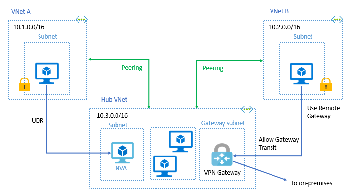

## AZ storage for Azure Docker Container

**Q :**
You are tasked with deploying a new Azure container instance that will run a custom-developed .NET application requiring persistent storage for operation.   
You need to create a storage service that will meet the requirements for Azure Container named `TDContainer`.  

By default, Azure Container Instances are stateless. 

If the container crashes or stops, all of its states are lost.   
To persist state beyond the lifetime of the container, you must mount a volume from an external store. 
**Azure Container Instances can mount an Azure file share created with Azure Files.**  

Azure Files offers fully managed file shares hosted in Azure Storage that are accessible via the industry standard Server Message Block (SMB) protocol.   
**Using an Azure file share with Azure Container Instances provides file-sharing features similar to using an Azure file share with Azure virtual machines.**
**
Azure Disks or Files are commonly used to provide persistent volumes for Azure Container Instances and Azure VMs.**

Hence, the correct answer is: Azure Files.

Azure Queue Storage is incorrect because this service is simply used for storing large numbers of messages to enable communication between components of a distributed application.

Azure Table Storage and Azure Blob Storage are both incorrect because **Azure Container Services does not support direct integration of these services.**

## Create Azure Container Image

**Q :**
There is a requirement to **copy a virtual machine image** to a container named tdimage from your on-premises datacenter. You need to provision an Azure Container instance to host the container image.

TIPS : Take note that it is mentioned in the scenario that container images and instances are used.

1. Which AzCopy command should you run?
2. Azure Blob storage is Microsoft’s object storage solution for the cloud. 

**ANS :**
`AzCopy` is a command-line utility that you can use to copy blobs or files to or from a storage account.   
**The `azcopy make` command is commonly used to create a container or a file share.**    
`azcopy make "https://[account-name].blob.core.windows.net/[top-level-resource-name]"`   

- `Copy` is incorrect  
because it simply copies source data to a destination location.
- `Sync` is incorrect  
because it only replicates the source location to the destination location.
- `File` is incorrect  
because when you execute this command, it will create a file share.  
- `Table` is incorrect  
because this is just a NoSQL data store that accepts authenticated calls from inside and outside the Azure cloud which allows you to store large amounts of structured data.
- `Queue` is incorrect  
because this simply **provides cloud messaging between application components that allows you to decouple your applications so that they can scale independently.**

---

A container organizes a set of blobs, similar to a directory in a file system.   
A storage account can include an unlimited number of containers, and a container can store an unlimited number of blobs.     
Blob storage is optimized for storing massive amounts of unstructured data.   
Unstructured data is data that doesn’t adhere to a particular data model or definition, such as text or binary data.   
Blob storage is designed for:  
- Serving `images or documents directly to a browser`.
- Storing `files for distributed access`.
- Streaming Media `video and audio`.
- Writing to `log` files.
- Storing data for `backup and restore` disaster recovery, and archiving.
- Storing data for `analysis` by an on-premises or Azure-hosted service.  

VHD files can be used to create custom images that can be stored in an Azure Blob container, which are used to provision virtual machines.   

## Virtual Peering to Different VNets

The virtual networks appear as one for connectivity purposes.  
**Via the Microsoft backbone infrastructure. Make connection just like traffic between virtual machines in the same network, traffic is routed through Microsoft’s private network only.**  

Azure supports the following types of peering:
- Virtual network peering: Connect virtual networks within the same Azure region.   
- Global virtual network peering: Connecting virtual networks across Azure regions.  

**The virtual networks you peer with must have non-overlapping IP address spaces.**  
Hence, the correct answer is: `TDVnet3` and `TDVnet4` only.

---

You need to plan ahead when you create your virtual network address spaces in the event that you will need to peer your virtual networks. You can always change the address space of a virtual network, but you need to make sure that the subnets within it must be contained to the new address space of your virtual network.

## NSG assignment

**You can only associate a network security group to a subnet or network interface within the same region as the network security group.** 

So if your network security is in the Azure security groups, it can’t be moved from one region to another. 

However, you can use an Azure Resource Manager template to export the existing configuration and security rules of an NSG. 
**You can then stage the resource in another region by exporting the NSG to a template, modifying the parameters to match the destination region, and then deploying the template to the new region.**

## Point To Site Connection &

**When you configure a point-to-site VPN connection, you must use a route-based VPN type for your gateway.**  
**Policy-based VPN type for point-to-site VPN connection is not supported by Azure.**  

---

**Q :**
Your company has a virtual network named TDVnet1 and a policy-based virtual network gateway named TD1 in your Azure subscription.

You have users that need to access TDVnet1 from a remote location.

What should you do?

**ANS :**
If you create a policy-based VPN type as your gateway, you need to delete it and deploy a route-based VPN gateway instead.
Hence, the correct answers are:
- Delete TD1
- Deploy a route-based VPN gateway

The option that says: 

Deploy a gateway subnet is incorrect.   
- A gateway subnet is a prerequisite when you create a point-to-site VPN connection and since there is already an existing point-to-site VPN connection in your Azure subscription, you don’t have to deploy one again.

Reset `TD1` is incorrect.  
- Resetting TD1 will not work since it is a policy-based VPN type.   
Take note that you need a route-based VPN type for point-to-site VPN connections.

**Download and install the VPN client configuration file is incorrect.**   
- Even if you have downloaded and installed the VPN client configuration file, the users still won’t be able to connect to `TDVnet1` because `TD1` is a policy-based VPN type. 

## Access Tiers & Storage Account Type for Copies Of Data

Access Tiers
Hot
- Optimized for storing data that is accessed frequently.

Cool 
- Optimized for storing data that is infrequently accessed and stored for at least `30` days.

Archive
- Optimized for storing data that is rarely accessed and stored for at least `30*6` days with flexible latency requirements on the order of hours.

Storage Account Type for Copies Of Data

---

**Q :**

Account Kind is incorrect because it simply offers several types of storage accounts, such as StorageV2, Storage, and BlobStorage. Each type supports different features and has its own pricing model.

Versioning is incorrect because this feature is for automatically maintaining the previous versions of an object. When blob versioning is enabled, you can restore an earlier version of a blob to recover your data if it is erroneously modified or deleted.

Performance is incorrect because 
- this tiering system is primarily used for determining the speed capability of your storage account. 
- There are two types of performance tiers:    
  - Standard :arrow_right: optimized for high capacity/throughput, 
  - Premium  :arrow_right: optimized for high transaction rates and single-digit consistent storage latency.

## DNS

**Q :**
You need to use a DNS service that will resolve domains for your two virtual networks. You created an Azure private zone named `tutorialsdojo.com`.  

You link TDVnet2 to `tutorialsdojo.com` with auto registration enabled. The parameters of your private zone are as follows:

