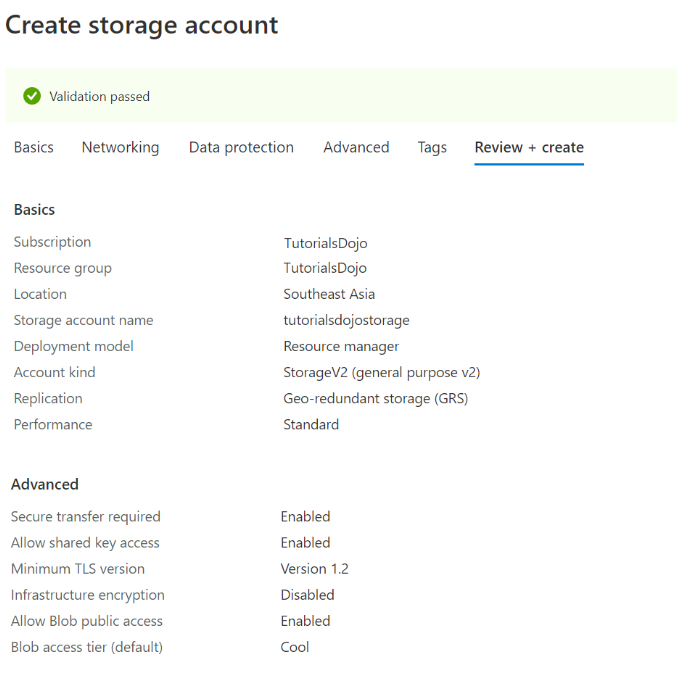
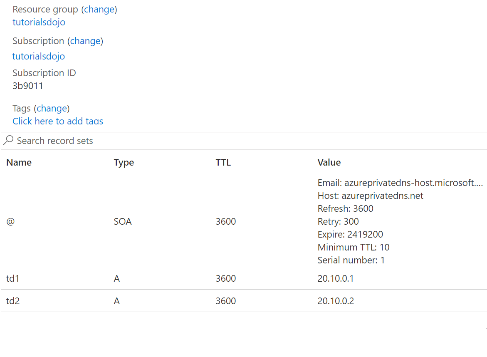
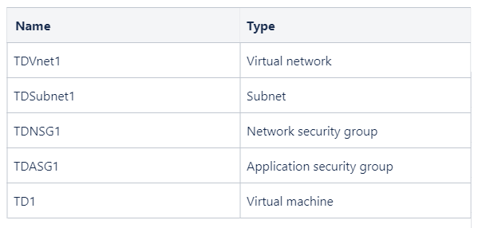
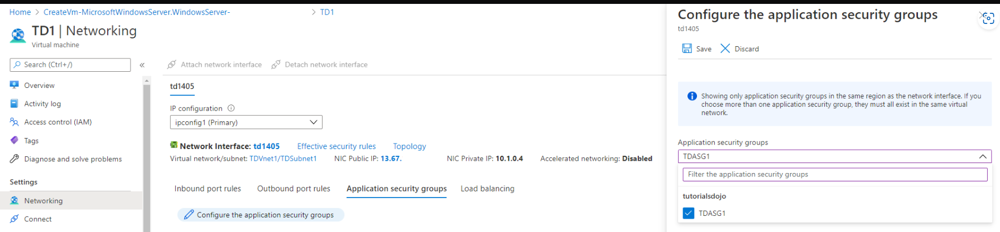
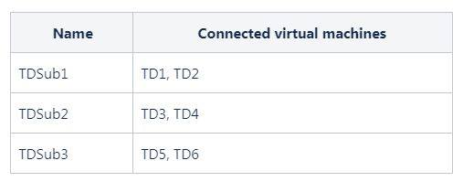
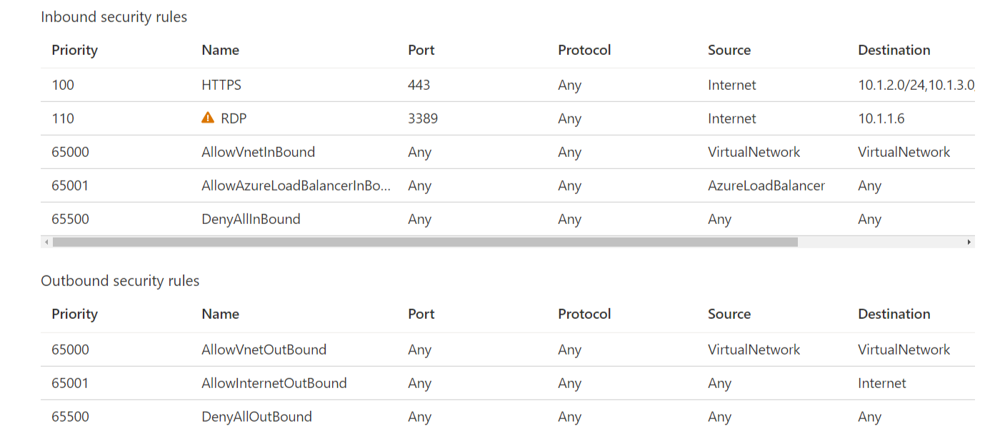
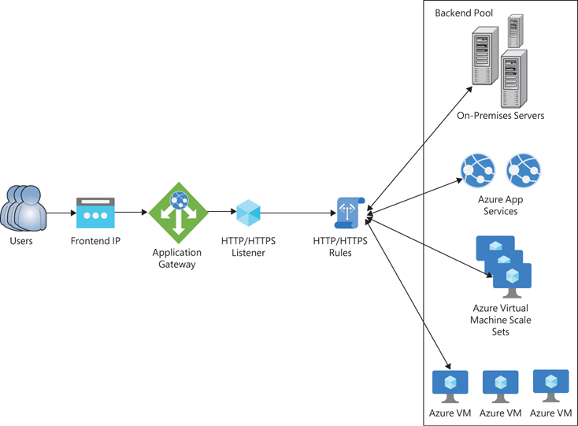
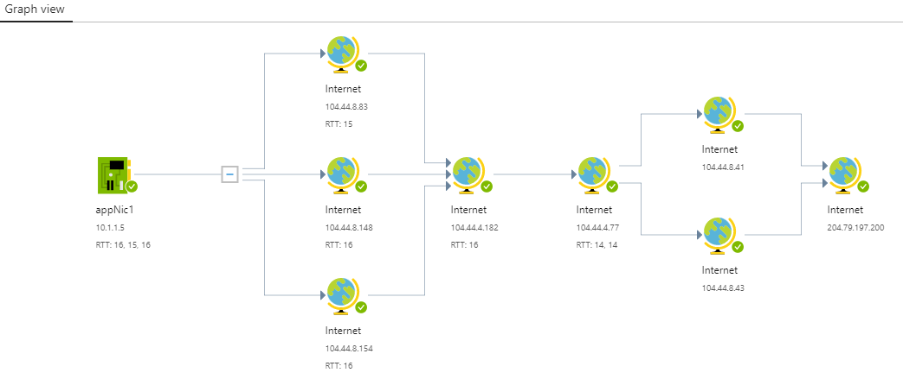
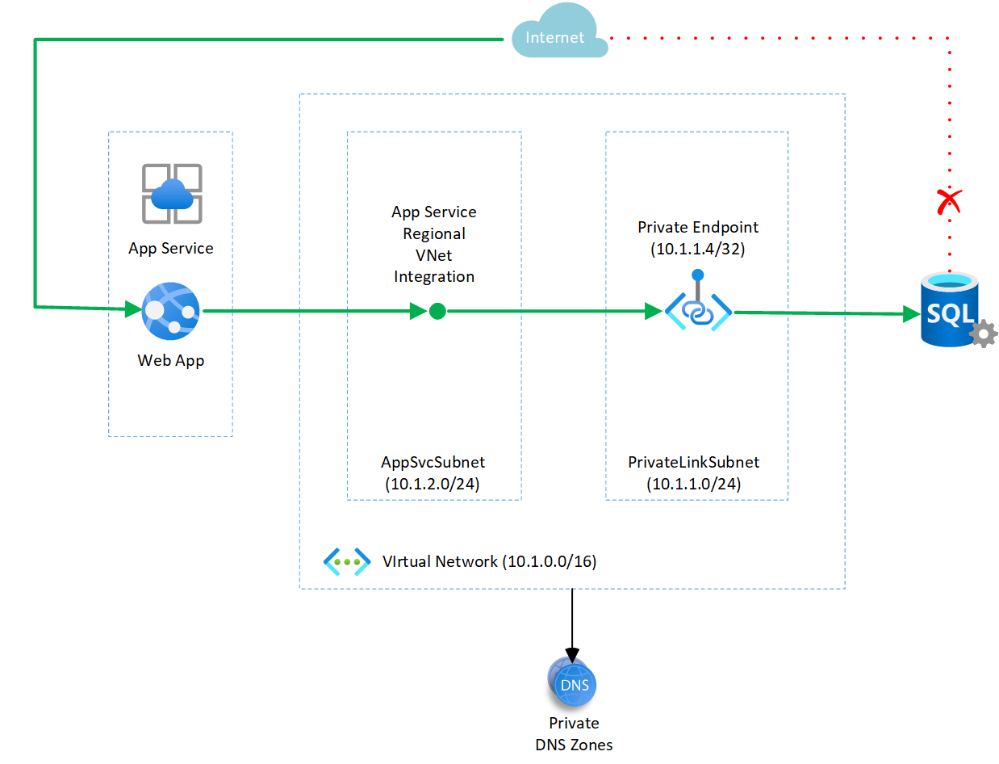

## AZ storage for Azure Docker Container

**Q :**
You are tasked with deploying a new Azure container instance that will run a custom-developed .NET application requiring persistent storage for operation.   
You need to create a storage service that will meet the requirements for Azure Container named `TDContainer`.  

By default, Azure Container Instances are stateless. 

If the container crashes or stops, all of its states are lost.   
To persist state beyond the lifetime of the container, you must mount a volume from an external store. 
**Azure Container Instances can mount an Azure file share created with Azure Files.**  

Azure Files offers fully managed file shares hosted in Azure Storage that are accessible via the industry standard Server Message Block (SMB) protocol.   
**Using an Azure file share with Azure Container Instances provides file-sharing features similar to using an Azure file share with Azure virtual machines.**
**
Azure Disks or Files are commonly used to provide persistent volumes for Azure Container Instances and Azure VMs.**

Hence, the correct answer is: Azure Files.

Azure Queue Storage is incorrect because this service is simply used for storing large numbers of messages to enable communication between components of a distributed application.

Azure Table Storage and Azure Blob Storage are both incorrect because **Azure Container Services does not support direct integration of these services.**

## Create Azure Container Image

**Q :**
There is a requirement to **copy a virtual machine image** to a container named tdimage from your on-premises datacenter. You need to provision an Azure Container instance to host the container image.

TIPS : Take note that it is mentioned in the scenario that container images and instances are used.

1. Which AzCopy command should you run?
2. Azure Blob storage is Microsoft’s object storage solution for the cloud. 

**ANS :**
`AzCopy` is a command-line utility that you can use to copy blobs or files to or from a storage account.   
**The `azcopy make` command is commonly used to create a container or a file share.**    
`azcopy make "https://[account-name].blob.core.windows.net/[top-level-resource-name]"`   

- `Copy` is incorrect  
because it simply copies source data to a destination location.
- `Sync` is incorrect  
because it only replicates the source location to the destination location.
- `File` is incorrect  
because when you execute this command, it will create a file share.  
- `Table` is incorrect  
because this is just a NoSQL data store that accepts authenticated calls from inside and outside the Azure cloud which allows you to store large amounts of structured data.
- `Queue` is incorrect  
because this simply **provides cloud messaging between application components that allows you to decouple your applications so that they can scale independently.**

---

A container organizes a set of blobs, similar to a directory in a file system.   
A storage account can include an unlimited number of containers, and a container can store an unlimited number of blobs.     
Blob storage is optimized for storing massive amounts of unstructured data.   
Unstructured data is data that doesn’t adhere to a particular data model or definition, such as text or binary data.   
Blob storage is designed for:  
- Serving `images or documents directly to a browser`.
- Storing `files for distributed access`.
- Streaming Media `video and audio`.
- Writing to `log` files.
- Storing data for `backup and restore` disaster recovery, and archiving.
- Storing data for `analysis` by an on-premises or Azure-hosted service.  

VHD files can be used to create custom images that can be stored in an Azure Blob container, which are used to provision virtual machines.   

## Virtual Peering to Different VNets

The virtual networks appear as one for connectivity purposes.  
**Via the Microsoft backbone infrastructure. Make connection just like traffic between virtual machines in the same network, traffic is routed through Microsoft’s private network only.**  

Azure supports the following types of peering:
- Virtual network peering: Connect virtual networks within the same Azure region.   
- Global virtual network peering: Connecting virtual networks across Azure regions.  

**The virtual networks you peer with must have non-overlapping IP address spaces.**  
Hence, the correct answer is: `TDVnet3` and `TDVnet4` only.

---

You need to plan ahead when you create your virtual network address spaces in the event that you will need to peer your virtual networks. You can always change the address space of a virtual network, but you need to make sure that the subnets within it must be contained to the new address space of your virtual network.

## NSG assignment

**You can only associate a network security group to a subnet or network interface within the same region as the network security group.** 

So if your network security is in the Azure security groups, it can’t be moved from one region to another. 

However, you can use an Azure Resource Manager template to export the existing configuration and security rules of an NSG. 
**You can then stage the resource in another region by exporting the NSG to a template, modifying the parameters to match the destination region, and then deploying the template to the new region.**

## Point To Site Connection &

**When you configure a point-to-site VPN connection, you must use a route-based VPN type for your gateway.**  
**Policy-based VPN type for point-to-site VPN connection is not supported by Azure.**  

---

**Q :**
Your company has a virtual network named TDVnet1 and a policy-based virtual network gateway named TD1 in your Azure subscription.

You have users that need to access TDVnet1 from a remote location.

What should you do?

**ANS :**
If you create a policy-based VPN type as your gateway, you need to delete it and deploy a route-based VPN gateway instead.
Hence, the correct answers are:
- Delete TD1
- Deploy a route-based VPN gateway

The option that says: 

Deploy a gateway subnet is incorrect.   
- A gateway subnet is a prerequisite when you create a point-to-site VPN connection and since there is already an existing point-to-site VPN connection in your Azure subscription, you don’t have to deploy one again.

Reset `TD1` is incorrect.  
- Resetting TD1 will not work since it is a policy-based VPN type.   
Take note that you need a route-based VPN type for point-to-site VPN connections.

**Download and install the VPN client configuration file is incorrect.**   
- Even if you have downloaded and installed the VPN client configuration file, the users still won’t be able to connect to `TDVnet1` because `TD1` is a policy-based VPN type. 

## Access Tiers & Storage Account Type for Copies Of Data

Access Tiers
Hot
- Optimized for storing data that is accessed frequently.

Cool 
- Optimized for storing data that is infrequently accessed and stored for at least `30` days.

Archive
- Optimized for storing data that is rarely accessed and stored for at least `30*6` days with flexible latency requirements on the order of hours.

Storage Account Type for Copies Of Data

---

**Q :**

Account Kind is incorrect because it simply offers several types of storage accounts, such as StorageV2, Storage, and BlobStorage. Each type supports different features and has its own pricing model.

Versioning is incorrect because this feature is for automatically maintaining the previous versions of an object. When blob versioning is enabled, you can restore an earlier version of a blob to recover your data if it is erroneously modified or deleted.

Performance is incorrect because 
- this tiering system is primarily used for determining the speed capability of your storage account. 
- There are two types of performance tiers:    
  - Standard :arrow_right: optimized for high capacity/throughput, 
  - Premium  :arrow_right: optimized for high transaction rates and single-digit consistent storage latency.

## DNS

**Q :**
You need to use a DNS service that will resolve domains for your two virtual networks. You created an Azure private zone named `tutorialsdojo.com`.  

You link `TDVnet2` to `tutorialsdojo.com` with auto registration enabled.   
The parameters of your private zone are as follows:  

**ANS :**
To resolve the records of a private DNS zone from your virtual network, you must link the virtual network with the zone. 

Linked virtual networks have full access and can resolve all DNS records published in the private zone. 

Additionally, you can also enable auto `registration` on a virtual network link.    
The Azure DNS private zones auto registration feature takes the pain out of DNS record management for virtual machines deployed in a virtual network.

In addition to forward look records (A records), reverse lookup records (PTR records) are also automatically created for the virtual machines. 
If you add more virtual machines to the virtual network, DNS records for these virtual machines are also automatically created in the linked private DNS zone.
When you delete a virtual machine, the DNS records for the virtual machine are automatically deleted from the private DNS zone.

Take note that in this scenario, `TDVnet2` is linked to the `tutorialsdojo.com` zone with auto registration enabled. 
This means that the DNS records of the virtual machines deployed in TDVnet2 are automatically created in the `tutorialsdojo.com` zone

Hence, this statement is correct: `td2.tutorialsdojo.com` is resolvable by `TD4`.

The statement that says: 

`td2.tutorialsdojo.com` is resolvable by `TD3` is incorrect 
- because TD3 is located in TDVnet1. Since TDVnet1 is not linked to the `tutorialsdojo.com` zone, TD3 will not have the capability to resolve it. You can link a virtual network to a private zone by heading over to virtual network links in your private zone.

When you create a virtual machine in `TDVnet1`, it will automatically register the A record of the VM to tutorialsdojo.com zone is incorrect. 
- There are two conditions for the automatic registration of your VMs A records. First, you need to link the tutorialsdojo.com zone to TDVnet1 and second, you must enable auto registration. Since TDVnet1 is not linked to tutorialsdojo.com zone, you will not be able to automatically register the A records of your VMs.

## Application Security Group (ASG,NSG) & network interface 

Application security groups enable you to configure network security as a natural extension of an application's structure, allowing you to group virtual machines and define network security policies based on those groups.   

You can reuse your security policy at scale without manual maintenance of explicit IP addresses.  

---

**Q :**

`TD1` is associated with `TDSubnet1` which is connected to `TDVnet1`. 
For data security, the `TDNSG1` network security group is associated with `TD1`.
`TDASG1` must be integrated directly to `TD1`.

**ANS :**

Take note of the following application security group constraints:
- You can specify one application security group as the source and destination in a security rule.  
- You cannot specify multiple application security groups in the source or destination.

- All network interfaces assigned to an application security group have to exist in the same virtual network that the first network interface assigned to the application security group is in.

- If you specify an application security group as the source and destination in a security rule, the network interfaces in both application security groups must exist in the same virtual network.

`Attach ASG1 to TDSubnet1` is incorrect 
- because you can not attach an application security group to a subnet.  
- You can only attach an application security group to the network interface of a virtual machine.



## NSG for subnets

**A Network Security Groups Resource can be attached to multiple subnets and/or network interfaces.**

NSGs can be attached to multiple subnets and/or network interfaces. 

Unless you have a specific reason to, it is recommended that you associate a NSG to a subnet or a network interface, but not both.

---

You have an Azure virtual network named TDVnet1 that contains the following subnets shown below:

Requirement : 
1. Virtual machines in TDSub2 and TDSub3 must have HTTPS traffic from the Internet.  
2. Remote Desktop connections from the public Internet must only access TD1.
3. All traffic between TD1 and TD2 must be allowed.
4. Restrict all other external network traffic from accessing TDVnet1.

What is the minimum number of network security groups that you should provision to satisfy the requirements above?

**ANS**

In the image above, the requirements of the scenario are fully satisfied.   
You only need to create one network security group with multiple rules and associate it with `TDSub1`, `TDSub2`, and `TDSub3`.  

Virtual machines in `TDSub2` and `TDSub3` must have HTTPS traffic from the Internet.  
- You can whitelist the address spaces of `TDSub2` and `TDSub3` in the destination IP addresses/CIDR ranges of an inbound security rule.   
- This will force HTTPS traffic to only those subnets without allowing HTTPS traffic to TDSub1. 
- See priority 100 in the image above.  

Remote Desktop connections from the Internet must access TD1.
- Since there are two virtual machines in `TDSub1` and the requirement states that only `TD1` must have Remote Desktop connection, you cannot whitelist the address space of TDSub1 in the destination IP addresses.
- An alternative to this is whitelisting the IP address of TD1 to the destination IP addresses when you create an inbound security rule. 
- See priority 110 in the image above.

All traffic between TD1 and TD2 must be allowed.
- When you create a network security group, the default rules of a network security group always allow traffic coming from WITHIN the virtual network. 
- No action is needed from your side.

Restrict all other external network traffic from accessing TDVnet1.
- The default rules of a network security group explicitly deny all incoming traffic. 
- No action is needed from your side.

Hence, the correct answer is: 1.

## Monitor Log Analytics workspace for storage backup

Azure Backup report provides a reporting solution that uses Azure Monitor logs and Azure workbooks.  
These resources help you get rich insights on your backups across your entire backup estate.   

**Backup Reports serve as a one-stop destination for tracking usage, auditing of backups and restores, and identifying key trends at different levels of granularity.**

A common requirement for backup admins is to obtain insights on backups based on data that spans a long period of time.   

Use cases for such a solution include :

- `Allocating` and `forecasting` of cloud storage consumed.
- `Auditing` of backups and restores.
- `Identifying key trends` at different levels of granularity.

**By default, the data in a Log Analytics workspace is retained for 30 days.**   
To see data for a longer time horizon, change the retention period of the Log Analytics workspace.  

**When you create a Log Analytics workspace, it does not matter if the vault is located in a different region or subscription.**

---

**Q :**
There is a requirement that requires you to configure Azure Backup reports using `TDBackup1` to determine which backup items consume the most storage.  

**ANS :**
the correct answer is: TDAnalytics1, TDAnalytics2, and TDAnalytics3.

## (S2S) VM & File Share SMB protocol connection

An Azure Virtual Network Gateway or VPN Gateway is a specific type of virtual network gateway that is used to send encrypted traffic between an Azure virtual network and an on-premises location over the public Internet.  

Each virtual network can have only one VPN gateway. However, you can create multiple connections to the same VPN gateway. When you create multiple connections to the same VPN gateway, all VPN tunnels share the available gateway bandwidth.

Azure Application Gateway 

- **is a Layer 7 (application layer) load balancer** that is optimized for web applications and HTTP(S) traffic. 
- It provides features like SSL offload, path-based routing, web application firewall, and session affinity. 
- **It is ideal for scenarios where you need to handle HTTPS traffic and perform SSL decryption before forwarding requests to backend servers.**

Azure VPN Gateway 

- **is a service** that uses a specific type of virtual network gateway to **send encrypted traffic between an Azure virtual network and on-premises locations over the public Internet.** 
- You can also use VPN Gateway to send encrypted traffic between Azure virtual networks over the Microsoft network. 
- It is used for secure communication over the internet and provides confidentiality, integrity, and authentication for IP packets.

---

The option that says: 

Create an Azure virtual network peering (Vnet Communication) is incorrect 
- this only enables you to seamlessly connect two or more Virtual Networks in Azure.

Create an Azure AD Connect sync (Accounts, Group) is incorrect because 
- this service is simply the main component of Azure AD Connect. 
This service synchronizes information held in the on-premises Active Directory to Azure AD.  
- For example, if you provision or deprovision groups and users on-premises, these changes propagate to Azure AD. 
- **You can not use this to synchronize `FileServer1` to `TD1` since the file server is not an Active Directory.**

Create an Azure Application Gateway is incorrect 
- because this service is **just a web traffic load balancer** that enables you to manage traffic to your web applications.

## resize VNET ip address space in a peering status & Sync the peering

**You can resize the address space of Azure virtual networks that are peered without incurring any downtime on the currently peered address space.** 

This feature is useful when you need to resize the virtual network's address space after scaling your workloads. 

After resizing the address space, all that is required is for peers to be synced with the new address space changes. 

Resizing works for both IPv4 and IPv6 address spaces.
Addresses can be resized in the following ways:
1. Modifying the address range prefix of an existing address range  
For example, changing `10.1.0.0/16` to `10.1.0.0/18`
2. Adding/Deleting address ranges to/from a virtual network.
3. Resizing of address space is supported cross-tenant.

Hence, the correct answer is: Sync the peering between TDVnet1 and TDVnet2.

## Bastion & host scaling

**Q :**
You recently deployed an Azure bastion named TD1 with an SKU of Basic and a subnet size of /26.

There is a requirement that more than 90 users will concurrently use TD1. 

**ANS :**

Two instances are created when you configure Azure Bastion using the Basic SKU.   
Using the Standard SKU, you can specify the number of instances. This is called host scaling.  

**Each instance can support `20` concurrent RDP connections and `40` concurrent SSH connections for medium workloads.**

The number of connections per instance depends on your actions when connected to the client VM. 

For example, if you are doing something data-intensive, it creates a more significant load for the instance to process. 
Once the concurrent sessions are exceeded, an additional scale unit (instance) is required.  

Remember that you can only use host scaling if your bastion server has an SKU of Standard

To accommodate additional concurrent client connections, first, you need to upgrade the SKU of TD1 from Basic to Standard(after upgrading to Standard, you can not revert back to Basic SKU) After that, you can increase the instance count of TD1 to whatever number of servers are required to accommodate the 90 users.

The option that says: 

Increase the instance count of TD1 is incorrect 
- because you will only be able to increase the instance count if TD1 is already using an SKU of Standard. Take note that the question asks what you will do first.

Increase the server size of TD1 is incorrect 
- because there is no option to increase the server size of a bastion server. 
- If you need more computing power, you can increase the instance count of the bastion server. 
- Remember that you need to use an SKU of Standard before being able to use host scaling.

### NSG x AZ Network Watcher 

Connection Troubleshoot enables one-time connectivity and latency check between a VM and another network resource.

The destination of the inbound security rules of TDNSG1 all points to 10.0.2.0/24 (where TD2 is connected to), which indicates that the purpose of `TDNSG1` is to filter network traffic for `TD2`. 

Remember that if `TDNSG1` is attached to TD1, the inbound security rules will be passed on to the default security rules of `TDNSG1` because it will not match the two inbound security rules since the destination is `10.0.2.0/24`.

When you create a network security group, the default rules of a network security group always allow traffic coming from within the virtual network. Since TD1 can ping TD2 without an additional inbound security rule, this means that the virtual machines are located in the same virtual network. Also, the priority 310 deny rule only denies TCP protocols and not ICMP protocols.

Hence, the following statements are correct:
– TDNSG1 is associated with the network interface of TD2
– TD1 and TD2 are in the same virtual network.

### Create Child Domain in DNS zone

You can use the Azure portal to delegate a DNS subdomain. 

For example, if you own the `tutorialsdojo.com` domain, you can delegate a subdomain called portal to another, separate zone that you can administer separately from the` tutorialsdojo.com` zone.

To delegate an Azure DNS subdomain, you must first delegate your public domain to Azure DNS.   
Once your domain is delegated to your Azure DNS zone, you can delegate your subdomain.  

You can delegate a subdomain by doing the following:
1. Create a new Azure DNS zone named `portal.tutorialsdojo.com`.  
Copy down the four nameservers as you will need them for step 2.
2. Navigate to the `tutorialsdojo.com` DNS zone and add an NS record named portal.  
Under records, enter the four nameservers from portal.tutorialsdojo.com and click ok.
3. To verify your work, open a PowerShell window and type `nslookup portal.tutorialsdojo.com`

the statements are incorrect because PTR, CNAME, and TXT records are not used to delegate an Azure DNS subdomain

## Deploy and Manage Azure Compute Resources

### App Service & databse in VM within VNet

Your company has a virtual network that contains a MySQL database hosted on a virtual machine.

You created a web app named `tutorialsdojo-webapp` using the Azure App service.

You need to make sure that `tutorialsdojo-webapp` can fetch the data from the MySQL database.
(Take note that the only requirement is to ensure that tutorialsdojo-webapp can access the data from the MySQL database hosted on a virtual machine.)

With Azure Virtual Network (VNets), you can place many of your Azure resources in a non-internet-routable network. 

The VNet Integration feature enables your apps to access resources in or through a VNet. 

VNet Integration doesn’t enable your apps to be accessed privately.

Azure App Service has two variations on the VNet Integration feature:
- The multitenant systems support the full range of pricing plans except for Isolated.
- The App Service Environment, which deploys into your VNet and supports Isolated pricing plan apps.

:x:
Create an internal load balancer is incorrect 
- because this option only distributes the traffic. 
- An internal load balancer is **mainly used to load balance traffic inside a virtual network**.

Create an Azure Application Gateway is incorrect 
- because the distribution of web traffic is not needed in the scenario. 
- An Azure Application Gateway is just **a web traffic load balancer that enables you to manage traffic to your web applications.** 

### AKS x OAuth2.0 authorization x Namespace

Your company has an Azure Subscription that contains an Azure Kubernetes Service (AKS) cluster and an Azure AD tenant named `tutorialsdojo.com`.  
You received a report that the system administrator is unable to grant access to Azure AD users who need to use the cluster.   

You need to grant the users in `tutorialsdojo.com` access to the cluster.   

The OAuth 2.0 authorization code grant can be used in apps that are installed on a device to gain access to protected resources. As shown in the image above, the Azure AD client application will use kubectl to sign in users with OAuth 2.0 device authorization grant flow. 

Azure AD will provide an access_token, id_token, and a refresh_token then the user will request to kubectl using an access_token from kubeconfig. 
After validation, the API will perform an authorization decision based on the Kubernetes Role/RoleBinding.
 Once authorized, the API server returns a response to kubectl.

Hence, the correct answer is: Create an OAuth 2.0 authorization endpoint.

:x:
Configure external collaboration settings is incorrect 
- because external collaboration settings only let you turn guest invitations on or off for different types of users in your organization. 
- This option wouldn’t help you grant the users in `tutorialsdojo.com` access to the cluster.

Create a new AKS cluster is incorrect 
- because a cluster is just a set of nodes that run containerized applications. 
- Creating a new cluster is not necessary. You need to create an authorization endpoint to grant the users access to the domain name.

Add a **namespace is incorrect** 
- because a namespace only divides cluster resources between multiple users. 
- **Remember that users can only interact with resources within their assigned namespaces.**
- To grant the users in `tutorialsdojo.com` access to the cluster, you should create an OAuth authorization endpoint.

### Deployment x Automation  

You plan to automate the deployment of Windows Servers using a virtual machine scale set.
You need to make sure that the web components are installed in the virtual machines.

The Custom Script Extension downloads and executes scripts on Azure virtual machines. 

This extension is useful for post-deployment configuration, software installation, or any other configuration or management tasks.

Hence, the correct answers are:
– Create a configuration script.
– Configure the extensionProfile section of the ARM template.

### App Service plan

**Take note that an App Service plan can only be associated with a web app located in the same region.**

注意 : Location & Runtime Stack

--- 

Your company has multiple App Service plans shown in the table below:

You are instructed to create the following web apps.

You need to determine which appropriate App Service plan can be used on a particular web app.

In Azure App Service, an app always runs in an App Service plan. 

An App Service plan defines a set of computing resources for a web app to run. 

One or more apps can be configured to run on the same App Service plan. 
**When you create an App Service plan in a certain region (for example, East US), a set of computing resources is created for that plan in that region only.**

When you create an App Service plan, you need to select an operating system. 
The Java 17 runtime stack can run on both Linux and Windows operating systems. 
While the ASP .NET 4.8 runtime stack can only run on Windows operating system.