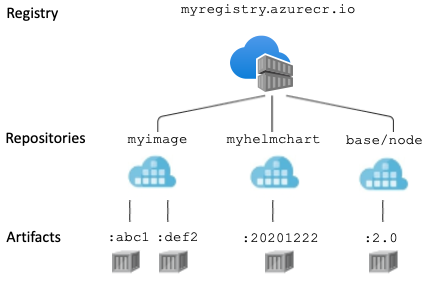

# Deploy and Manage Azure Compute Resources

## Upgrade aks cluster 

Your organization has an Azure subscription that contains an AKS cluster running an older version of Kubernetes.

You have been assigned to upgrade the cluster to the latest stable version of Kubernetes.

Periodic upgrades to the latest Kubernetes version are part of the AKS cluster lifecycle. It is critical that you apply the most recent security updates or upgrade to get the most recent features. In Azure, you can upgrade a cluster using Azure CLI, PowerShell or Portal.

AKS performs the following operations during the cluster upgrade process:

-Add a new buffer node to the cluster that runs the specified Kubernetes version (or as many nodes as configured in max surge).

-To minimize disruption to running applications, cordon and drain one of the old nodes. When you use max surge, it cordons and drains as many nodes as the number of buffer nodes you specify.

-When the old node is completely depleted, it is reimaged to receive the new version and serves as a buffer node for the next node to be upgraded.

-This process is repeated until all cluster nodes have been upgraded.

-At the end of the process, the last buffer node is deleted while the existing agent node is kept.

Hence, the correct answer is: Plan and execute the upgrade by reviewing release notes, determining a maintenance window, and upgrading the AKS cluster via Azure Portal.

The option that says: Run az aks get-upgrades in Azure CLI to upgrade the AKS cluster to the latest Kubernetes version is incorrect because this command won’t upgrade the cluster but it will just get the upgrade versions available for a managed Kubernetes cluster.

The option that says: Stop all workloads, scale down the cluster to zero nodes, delete the cluster, create a new AKS cluster, and redeploy the application workloads is incorrect because deleting the cluster and redeploying all the application workloads would result in unnecessary downtime and resource loss, as well as potential issues in recreating the cluster and redeploying the applications.

The option that says: Create a new AKS cluster with the desired Kubernetes version, migrate the application workloads from the old cluster to the new cluster, and then delete the old cluster is incorrect because this approach would involve unnecessary complexity and downtime for migrating the workloads between clusters, which can be avoided by upgrading the existing cluster directly.

## 

Your organization has an AKS cluster that hosts several microservices as Kubernetes deployments. 

During peak hours, one of the deployments experiences high traffic, resulting in longer response times and occasional failures.

You plan to implement horizontal pod autoscaling to scale the deployment based on traffic.

The horizontal pod autoscaler (HPA) is used by Kubernetes to monitor resource demand and automatically scale the number of pods. The HPA checks the Metrics API for any required changes in replica count every 15 seconds by default, and the Metrics API retrieves data from the Kubelet every 60 seconds. As a result, the HPA is updated every 60 seconds. When changes are made, the number of replicas is increased or decreased.

The following steps should be taken to configure horizontal pod autoscaling (HPA) for the deployment:

Install the Kubernetes Metrics Server to provide HPA with metrics.
In the Kubernetes manifest file, define a horizontal pod autoscaler object. This object specifies the scaled deployment, the minimum and maximum number of replicas, and the scaling metric.
Set the deployment’s minimum and maximum number of replicas. Based on the specified metric, these values determine the number of pods that the HPA feature can create or delete.
Hence, the correct answer is: Install Kubernetes Metrics Server, then define an HPA object in the manifest file and set the min and max number of replicas in a deployment.

The option that says: Install Kubernetes Dashboard, then define an HPA object in the manifest file and set the desired min and max number of replicas in a deployment is incorrect because the Kubernetes Dashboard does not provide HPA functionality. It is mainly used for deploying applications, creating and updating objects, and monitoring the health of the cluster.

The option that says: Install AKS cluster autoscaler, then define an HPA object in the manifest file and set the desired min and max number of replicas in a deployment is incorrect because the AKS cluster autoscaler scales the number of nodes in an AKS cluster rather than the number of replicas in a deployment.

The option that says: Install Azure Monitor for Containers agent, then define a VPA object in the manifest file and set the desired min and max number of replicas in a deployment is incorrect. Instead of scaling the number of replicas, vertical pod autoscaling (VPA) is used to adjust the resource allocation of individual pods based on their resource usage.

 

References:

https://learn.microsoft.com/en-us/azure/aks/tutorial-kubernetes-scale?tabs=azure-cli#autoscale-pods

https://learn.microsoft.com/en-us/azure/aks/intro-kubernetes

## Create Image and Deploy to the Cluster 

:question: 3-41 :

Your organization Azure subscription has the following resources:
- Azure Kubernetes Service  
- Azure Container Registry    
- Azure Blob Storage  

You need to create a container image and deploy it to the cluster.     

:a: : 

To deploy an application on your AKS cluster, you’ll need to build a container image first.   
- Then create a deployment manifest file to run the image in your cluster.

In this scenario, you need to identify what command should you use first, and if you take a look at the scenario again there is a statement you must create a container image. 

:o: the correct answer is: az acr build.
- The command `az acr build` allows you to queue a quick build, providing streaming logs for an Azure Container Registry. 

So after you push the image to the container registry, you should run `az acr build`.

:x: `az aks create` is incorrect 
- because there is already an existing AKS cluster in your Azure subscription.

:x: `az aks run` is incorrect 
- because in order to run a container image to your cluster, you need to build the image first and deploy it to the container.

:x: `az import-export create` is incorrect 
- because this is a command to create a new job or updates an existing job in the specified subscription.  

---

Azure Container Registry 
- is a managed registry service based on the open-source Docker Registry 2.0. 

Create and maintain Azure container registries to store and manage your container images and related artifacts. 

Use Azure container registries with your existing container development and deployment pipelines, or use Azure Container Registry Tasks to build container images in Azure. 

Build on demand, or fully automate builds with triggers such as source code commits and base image updates.

## Export ARM JSON form Resource

:question: **Q :**
A startup has an Azure subscription that contains the following resources:

- You have been tasked with replicating the current state of your resources in order to automate future deployments when a new feature needs to be added to the application.

:o: Use the resource group export template.

- You can export a service or a resource group. 
- In this scenario, you need to use ARM export templates to replicate the current state of our resources. 
This means that if you need to redeploy all your resources, you can just create a reusable template instead of going all over the manual creation of resources. 
- Based on the given requirements, we just need to capture all resources, then export resource group as template.

:x: Capture an image of a VM is incorrect 
- because this just creates a snapshot of the virtual machine configurations.
- Take note that you need to capture the current state of all resources. Therefore, export template will help us ease the creation of resources.

:x: `Redeploy` and `reapply` a VM is incorrect 
- **Redeploying the VM just migrates it to a new Azure host.** 
- **While reapply is used to resolve the issues of a stuck failed state of the VM.** 
- Both features does not help us capture the current state of our resources.

:x: Create a VM with preset configurations is incorrect 
- because this only helps you choose a VM based on your workload type and environment.

---

:mag: ARM Usage 
- ARM templates can be used to deploy and manage resources such as virtual machines, storage accounts, and virtual networks in a consistent and reliable manner.
- To deploy the template, you can use the Azure Portal, Azure CLI, or Azure PowerShell.

:link: [export-template-portal](https://learn.microsoft.com/en-us/azure/azure-resource-manager/templates/export-template-portal)  
:link: [templates/overview](https://learn.microsoft.com/en-us/azure/azure-resource-manager/templates/overview)   
 

## Web App to App Service plan x Location x Runtime Stack

**An App Service plan can only be associated with a web app located in the same region.**

:question: 3-20

:warning: **An App Service plan defines a set of computing resources** for a web app to run. 

:warning: **In Azure App Service, an app always runs in an App Service plan.** 
- **One or more apps can be configured to run on the same App Service plan**.   

:warning: **When you create an App Service plan in a certain region, the web app must be in that region too**  
- If the App Service Plan Region is East US, a set of computing resources is created for that plan in that region only.

:warning: When you create an App Service plan, you need to select an operating system.   
- The `Java 17` runtime stack can run on both `Linux` and `Windows` O.S.   
- While the `ASP .NET 4.8` runtime stack can only run on `Windows` O.S.  

https://docs.microsoft.com/en-us/azure/app-service/overview-hosting-plans

https://docs.microsoft.com/en-us/azure/app-service/app-service-plan-manage

https://docs.microsoft.com/en-us/azure/app-service/environment/intro

---

Your company has multiple App Service plans shown in the table below :  

You are instructed to create the following Web Apps.  

You need to determine which appropriate App Service plan can be used on a particular web app.

- TD-App1 ?
- TD-App2 ?

:a: :

– TD-ASP1 and TD-ASP2
– TD-ASP2

## Automation x Custom Script Extension x ARM script

:question: 3-19

You plan to automate the deployment of Windows Servers using a virtual machine scale set.

You need to make sure that the web components are installed in the virtual machines.

**ANS :**

:warning: The Custom Script Extension downloads and executes scripts on Azure virtual machines. 
- This extension is useful for 
    1. post-deployment configuration, 
    2. software installation, 
    3. or any other configuration 
    4. or management tasks.

:o: Hence, the correct answers are:
- Create a configuration script.
- Configure the `extensionProfile` section of the ARM template.

:x: Create an automation account is incorrect 
- because an automation account wouldn’t help you automatically install web components. 

:x: Create a policy is incorrect 
- because this option only evaluates resources in Azure. 
- Take note that you don’t need to create a policy to install web components.

:x: **Create a new scale set is incorrect** 
- because this wouldn’t install the required web components. 
- **Instead of creating a new scale set, you should use a custom script extension to install the web components in the VMs.**

https://docs.microsoft.com/en-us/azure/virtual-machine-scale-sets/virtual-machine-scale-sets-deploy-app

https://docs.microsoft.com/en-us/azure/virtual-machine-scale-sets/tutorial-install-apps-template#what-is-the-azure-custom-script-extension

https://docs.microsoft.com/en-us/azure/virtual-machine-scale-sets/virtual-machine-scale-sets-deploy-app#already-provisioned

## AKS cluster x Grant Permission to User With OAuth2.0 authorization x Namespace

OAuth2.0
- The OAuth 2.0 authorization code grant can be used in apps that are installed on a device to gain access to protected resources.  

Sign In
- As shown in the image above, the Azure AD client application will use `kubectl` to sign in users with OAuth 2.0 device authorization grant flow. 

How to 
1. Azure AD will provide an `access_token`, `id_token`, and a `refresh_token` 
2. then the user will request to `kubectl` using an `access_token` from `kubeconfig`. 
3. After validation, the API will perform an authorization decision based on the Kubernetes `Role/RoleBinding`.
4. Once authorized, the API server returns a response to `kubectl`.

https://docs.microsoft.com/en-us/azure/aks/concepts-identity

https://docs.microsoft.com/en-us/azure/aks/azure-ad-integration-cli

---

:question: 3-22
Your company has an Azure Subscription that contains an Azure Kubernetes Service (AKS) cluster and an Azure AD tenant named `tutorialsdojo.com`.  

You received a report that the system administrator is unable to grant access to Azure AD users who need to use the cluster.   

You need to grant the users in `tutorialsdojo.com` access to the cluster.   

**ANS :**

To grant the users in `tutorialsdojo.com` access to the cluster, you should create an OAuth authorization endpoint.

:o: Create an OAuth 2.0 authorization endpoint.

:x: Add a **namespace is incorrect** 
- because a namespace only divides cluster resources between multiple users. 
- **Remember that users can only interact with resources within their assigned namespaces.**

:x: `[GRANT GUEST]`Configure external collaboration settings is incorrect 
- because **external collaboration settings only let you turn guest invitations on or off for different types of users** in your organization. 
- This option wouldn’t help you grant the users in `tutorialsdojo.com` access to the cluster.

:x: Create a new AKS cluster is incorrect 
- because a cluster is just a set of nodes that run containerized applications.  
- Creating a new cluster is not necessary.  
You need to create an authorization endpoint to grant the users access to the domain name.
