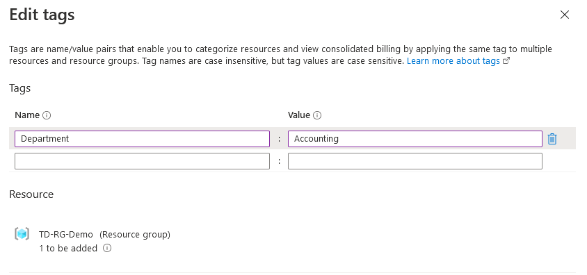
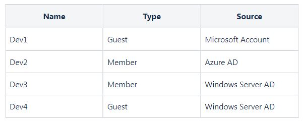

## Manage Azure Identities and Governance

## Azure Policy Exclusion

Policy evaluates resources in Azure by comparing the properties of resources to the business rules.   

:mag: policy definitions
- These business rules, described in JSON format, are known as policy definitions.  

:mag: policy initiative
- **To simplify management, several business rules can be grouped together to form a policy initiative.**

---

:question: 
Your company created a new Azure policy.

You need to interpret the permissions that are allowed or denied by the policy shown below:
  

:a: 
    
In the given policy, the resource group TD-RG is excluded in the effect of the policy. 

This means that you are allowed to create 
Virtual Networks in `TD-RG.`  

A policy exclusion allows you to assign a policy at a high level and then exclude scopes within it.   

For example, in an environment with applications and a central network, you want to have a policy for all the application resource groups but not the network resource group.

## :star2: Role to manage Azure Network Watcher Traffic Analytics


<font color="red">The users in the group can visualize the traffic distribution by assigning a Contributor role to the group.</font>  

:mag: Traffic Analytics 
Traffic analytics is a powerful feature within Azure Network Watcher that provides visibility into `user` and `application activity` in your cloud networks.


To enable traffic analytics, your account must have any of the following Azure roles at the subscription scope: 
- owner, 
- contributor,
- network contributor.

Before you use traffic analytics, ensure your environment meets the following requirements:
- `A Network Watcher enabled` Subscript.
- `NSG flow logs enabled` for the NSGs you want to monitor.
- `An Azure Storage account` to store raw flow logs.
- `An Azure Log Analytics workspace` with `read` and `write` access.

https://learn.microsoft.com/en-us/azure/network-watcher/traffic-analytics-faq#what-are-the-prerequisites-to-use-traffic-analytics-

https://learn.microsoft.com/en-us/azure/network-watcher/traffic-analytics

---

:question: : 3-46

You created a new Azure AD group for Network Administrators in your organization Azure Subscription.  

You need to make sure that the users in the group can enable Traffic Analytics and visualize traffic distribution.  


Which Solution is Correct ?
1. Assign a Reader role to the group.
2. Assign a Security Operator role to the group.
3. Assign a Contributor role to the group.

:a: : 

:x: Assign a Reader role to the group
- the users in the group can visualize the traffic distribution by assigning a Reader role to the group.

:x: a Security Operator can only create and manage security events. 
- By assigning this role, the users in the group won’t be able to enable traffic analytics

:o: Assign a Contributor role to the group.

## Azure RBAC

:question: : 
The subscription has a user named `ManilaUser01` which has the following roles:
```
Backup Reader
Storage Blob Data Contributor
DevTest Labs User
```

:a: : 

The four fundamental Azure roles are 
- `Owner`, `Contributor`, `Reader`, and `User Access Administrator`. 

To assign a Reader role to ALL the users in the Azure subscription, you must grant the user a `User Access Administrator role`. 

This role allows you to manage user access to the Azure resources.


:x: Assign the Virtual Machine Contributor role is incorrect 
- because this role just lets you manage virtual machines. 
- Take note that this role doesn't allow you to access virtual machines directly nor assign a Reader role to all the users in the subscription.

:x: Assign the Security Admin role is incorrect. 
- This role has the same permissions as the Security Reader role. 
- The only difference is that it can update the security policy and dismiss alerts and recommendations.

## Moving Web-App to Resource Group 

https://docs.microsoft.com/en-us/azure/app-service/app-service-plan-manage

https://docs.microsoft.com/en-us/azure/azure-resource-manager/management/move-resource-group-and-subscription

---

:question: 3-25


TD-RG3 contains a web app named TD-App3 which is located in North Europe.

You plan to move `TD-App3` to `TD-RG1`.

What is the effect of moving the web app to a different resource group?

:a: : 

:o: the correct answer is: 
The TD-App3 remains in the North Europe region and the policy applied to the resource will be Policy 1.

---

:mag: Region
**Take note that you cannot change an App Service plan’s region**. 
**Also, if you move a resource to a new resource group or subscription, the location of the resource would not change.** 


:mag: Policy 
**Remember that the assigned policy on the resource group will also be applied to the resources.** 
You can also assign multiple policies in one resource group.

:mag: app cloning
If you need to run your app in a different region, one alternative is app cloning. Cloning makes a copy of your app in a new or existing App Service plan in any region.

## User Access Administrator role

https://docs.microsoft.com/en-us/azure/role-based-access-control/rbac-and-directory-admin-roles

https://docs.microsoft.com/en-us/azure/role-based-access-control/built-in-roles#user-access-administrator

---

:question: 3-18

Your company has an Azure subscription named ManilaSubscription that contains multiple virtual machines.

The subscription has a user named ManilaUser01 which has the following roles:

Backup Reader
Storage Blob Data Contributor
DevTest Labs User

Which of the following actions should you do first?
Assign the Security Admin role.
Assign the Virtual Machine Contributor role.
Assign the Security Reader role.
Assign the User Access Administrator role.

:a: : 


:o: Assign the User Access Administrator role.
- The four fundamental Azure roles are Owner, Contributor, Reader, and User Access Administrator. 

To assign a Reader role to all the users in the Azure subscription, you must grant the user a User Access Administrator role. 
- This role allows you to manage user access to the Azure resources.


:x: Assign the Security Reader role is incorrect 
- because this role only allows the user to view permissions in the Security Center.

:x: Assign the Virtual Machine Contributor role is incorrect 
- because this role just lets you manage virtual machines. 
- **Take note that this role doesn’t allow you to access virtual machines directly nor assign a Reader role to all the users in the subscription.**

:x: Assign the Security Admin role is incorrect. 
- This role has the same permissions as the Security Reader role. 
- **The only difference is that it can update the security policy and dismiss alerts and recommendations.**

## Managed Identity of the VM


There are two types of managed identities:
- System-assigned : 
some Azure services allow you to enable a managed identity directly on a service instance.  
- When you enable a system-assigned managed identity, an identity is created in Microsoft Entra ID that is tied to the lifecycle of that service instance.  
So when the resource is deleted, Azure automatically deletes the identity for you.  
By design, only that Azure resource can use this identity to request tokens from Microsoft Entra ID.
- User-assigned:  
you may also create a managed identity as a standalone Azure resource.   
You can create a user-assigned managed identity and assign it to one or more instances of an Azure service.   
In the case of user-assigned managed identities, the identity is managed separately from the resources that use it.  


<font color="red">Take note that this identity is restricted to only one resource. 
- You can grant permissions to the managed identity by using Azure RBAC.   
- The managed identity is authenticated with Microsoft Entra ID, so you don’t have to store any credentials.   
</font>

https://learn.microsoft.com/en-us/entra/identity/managed-identities-azure-resources/qs-configure-portal-windows-vm

https://learn.microsoft.com/en-us/entra/identity/managed-identities-azure-resources/overview

---

:question: 3-26

You are managing an Azure subscription that contains a resource group named TD-RG1 which has a virtual machine named TD-VM1.

`TD-VM1` has services that will deploy new resources on `TD-RG1`.

You need to make sure that the services running on `TD-VM1` should be able to manage the resources in `TD-RG1` using its identity.

Which of the following actions should you do first?
- Configure the managed identity of TD-VM1.
- Configure the access control of TD-VM1.
- Configure the access control of TD-RG1.
- Configure the security settings of TD-RG1.

**ANS :**

In this scenario, you can use the system-assigned managed identity. 

Hence, the correct answer is: Configure the managed identity of TD-VM1.

:x: Configure the security settings of TD-RG1 is incorrect because it only provides security recommendations and security alerts for your resource group. As per the scenario, you need to ensure that the services running on TD-VM1 are able to manage the resources in TD-RG1 using its identity. Therefore, you need to configure the managed identity settings of TD-VM1.

:x: Configure the access control of TD-VM1 and Configure the access control of TD-RG1 are incorrect because these are only adding role assignments to an Azure resource. A role assignment is a process of attaching a role definition to a user, group, or service principal to provide access to a specific resource. Remember that access is granted by creating a role assignment, and access is revoked by removing a role assignment. You have to configure a managed identity instead.

## :star2::star2: Account reset Methods

https://learn.microsoft.com/en-us/entra/identity/authentication/tutorial-enable-sspr

https://learn.microsoft.com/en-us/entra/identity/authentication/concept-sspr-howitworks

https://learn.microsoft.com/en-us/entra/identity/authentication/howto-sspr-deployment

---

:question: 3-27

Your company has an Azure subscription with an Azure AD tenant named `tutorialsdojo.onmicrosoft.com` that contains the following users:
  

You are instructed to enable self-service password reset for `tutorialsdojo.onmicrosoft.com`  
  

You have configured the authentication methods for password reset as illustrated below.
  

- If TD-User3 has forgotten its password, a mobile phone app can be used to reset the password.  
- TD-User1 can add security questions for password reset.    
- The password can be reset immediately after TD-User2 answers the three security questions correctly.  

:a: : 


The Azure AD self-service password reset (SSPR) gives users the ability to change or reset their password with no administrator or help desk involvement.   

If a user's account is locked or they forget their password, they can follow prompts to unblock themselves. 

This ability reduces help desk calls and loss of productivity when a user can’t sign in to their device or an application.

Remember that users can only reset their password if they have registered an authentication method that the administrator has enabled. These are the authentication methods available for SSPR: 
Mobile app notification, Mobile app code, Mobile phone, Office phone, Email, and Security questions.

**You also need to use an account with Global Administrator privileges to allow users to unlock their account or reset passwords using Azure Active Directory self-service password reset since a user with a User Administrator role does not have permission to manage MFA.** 

:x: TD-User1 can add security questions for password reset is incorrect 
- because the role of TD-User1 is a **User Administrator**. 
- Take note that the `User Administrator role` does not have permission to modify security questions. 
- If TD-User1 needs to add security questions for a password reset, you should assign a `Global Administrator role`.

:x: The password can be reset immediately after TD-User2 answers the three security questions correctly is incorrect 
- because the number of methods required for password reset is set to two. 
- This means that you also need to use the second method (Mobile phone) to reset your password. :o: `3 + 1`

:x: If `TD-User3` has forgotten its password, a mobile phone app can be used to reset the password is incorrect 
- because TD-User3 is assigned to TD-Group2. Take note that the password reset is configured on TD-Group1. 
- Therefore, TD-User3 won’t be able to reset its password.

## Management Group x Azure Policy

https://docs.microsoft.com/en-us/azure/governance/management-groups/overview

https://docs.microsoft.com/en-us/azure/governance/management-groups/manage#moving-management-groups-and-subscriptions

https://docs.microsoft.com/en-us/azure/governance/policy/overview

---

:question: 3-28 : 

Your company has the following Azure management groups in its Azure account :
  

You have added the following Azure subscriptions to the management groups :


You created the following Azure policies:


:a: :

Based on the given scenario, there are two policies:  
1. Allowed resource types  
this policy enables you to specify the resource types that your organization can deploy. Only resource types that support ‘tags’ and ‘location’ will be affected by this policy. To restrict all resources, you have to duplicate this policy and change the ‘mode’ to ‘All’.

2. Not allowed resource types   
this policy enables you to specify the resource types that your organization cannot deploy.

**When you assign a policy to the tenant root group, the policy would also be applied to the subscription and management group.**  
- For example, if there is a Deny policy at the tenant root group, then the policy will be applied to the hierarchy of management groups and subscriptions. 

**Remember that a Deny policy always overrides an Allow policy.**
 
:x: You can create a virtual machine in TD-Subscription2 is incorrect 
- because the Tenant Root Group has a Deny policy that restricts it, as well as its related resource groups (e.g. TD-Management-Group11), from deploying virtual networks.**If you can’t create a virtual network, then you also can’t deploy a virtual machine.** 
- To allow the creation of a virtual machine, you need to remove the assigned policy.

:x: You can create a virtual network in TD-Subscription1 is incorrect 
- because deny overrides allow. Based on the given policies, you can’t create a virtual network since you have assigned a "Not allowed resource types" policy definition. 
- To create a virtual network, you should remove/delete this policy.

:o: You can move TD-Subscription3 to TD-Management-Group20 is correct 
- because you are allowed to move subscriptions between management groups. 
- **Take note that a subscription can only have one parent management group. Therefore, you can’t assign a subscription to multiple management groups.**

## Custom Role 

:question: 3-38 

If the Azure built-in roles don’t meet the specific needs of your organization, you can create your own custom roles. Just like built-in roles, you can assign custom roles to users, groups, and service principals at management group, subscription, and resource group scopes.

Take note that in this scenario, you need to create a custom role named `AdatumAdministrator` that is based on the built-in policy Contributor role. 

You need to retrieve the JSON format file of the Contributor role so that you can customize it to your needs.

To retrieve the JSON string of the Contributor role, you need to use the command:
`Get-AzRoleDefinition -Name <role_name> | ConvertTo-Json`

Hence, the correct answer is: 
`Get-AzRoleDefinition -Name Contributor | ConvertTo-Json`

:x: `Get-AzRoleDefinition -Name Contributor | ConvertFrom-Json` is incorrect 
- because the `ConvertFrom-Json` cmdlet just converts your JSON string to a PSCustomObject object that has a property for each field in the JSON string. 

:x: `Get-AzRoleAssignment` 
- it simply allows you to list Azure RBAC role assignments at the specified scope. 
- By default, it lists all role assignments in the selected Azure subscription. 
- You have to use the respective parameters to list assignments to a specific user, or to list assignments on a specific resource group or resource.


## Site-to-Site VPN gateway connection

:question: 
- Minimize administrative effort and cost whenever possible.
- Ensure that the information technology department receives an email whenever the CPU utilization `vm3.adatum.com` reaches 75%.
- Ensure that you create an Azure custom role named AdatumAdministrator that is based on the built-in Contributor role.
- Enable Multi-Factor Authentication (MFA) for the information technology department only.
- The servers in the Montreal office must be able to establish a connection over port `443` to `vm3.adatum.com.`
- Ensure that the London office can send encrypted traffic to Azure over the public Internet.
- Ensure that `AdatumWeb2` can automatically increase the number of instances based on CPU utilization.

:a: : 

Take note that in this scenario, you must ensure that the London office can send encrypted traffic to Azure over the public Internet, and deploying a site-to-site VPN gateway connection satisfies the requirement.
- **Therefore, you have to Deploy a virtual network gateway and a local network gateway on the Azure portal.**  
- **Conversely, you must Configure a VPN device for site-to-site VPN connection in the London office.**  


A Site-to-Site VPN gateway connection is used to send encrypted traffic between an Azure virtual network and an on-premises location over the public Internet.   
This type of connection requires a VPN device located on-premises that has an externally facing public IP address assigned to it.  


## Network watcher & IP Flow Verify


:a:

:o: IP flow verify.
`[檢查 Packet (connectivity) 在哪個 NSG的 Rule 被拒絕/接受]`
IP flow verify checks if a packet is allowed or denied to or from a virtual machine. 
- If the packet is denied by a security group, the name of the rule that denied the packet is returned. 

It is useful in confirming if a rule in a NSG is blocking ingress or egress traffic to or from a virtual machine.
- IP flow verify helps administrators quickly diagnose connectivity issues from or to the Internet and from or to the on-premises environment.

How it done
1. `[Look at NSG for NIC & Subnet]`IP flow verify first looks at the rules for all Network Security Groups (NSGs) applied to the network interface, such as a subnet or virtual machine NIC. 
2. `[Check Setting]`Traffic flow is then verified based on the configured settings to or from that network interface. 

:x: Next hop is incorrect 
- `[決定Traffic去向]`because this simply helps you determine if traffic is being directed to the intended destination, or whether the traffic is being sent nowhere. 
- Take note that in this scenario, you need to determine if the network security group is blocking the ingress or egress traffic.

:x: NSG Flow Logs is incorrect. 
- `[Log IP Traffic Flowing 去向]`It is only a feature of Azure Network Watcher that allows you to log information about IP traffic flowing through a network security group.

:x: Traffic Analytics is incorrect 
- `[視覺化Traffic分析且讓你查詢]`because this just allows you to process your NSG Flow Log data that enables you to visualize, query, analyze, and understand your network traffic.

## RBAC role : Contributor & Owner

https://learn.microsoft.com/en-us/azure/role-based-access-control/built-in-roles

https://learn.microsoft.com/en-us/azure/role-based-access-control/overview

:question: 3-42 : 

You must ensure that only one user is able to deploy virtual machines and manage virtual networks.  

Which of the following options should you use to satisfy the principle of least privilege?
- Virtual Machine Contributor
- Owner
- Contributor
- Network Contributor

:a: :

:o:  the correct answer is: Contributor.
> According to the `principle of least privilege`, workers should only have access to resources necessary for carrying out their job duties. 

- In this scenario, the roles that you can use to deploy VMs and manage VNets are through Owner and Contributor roles, but the requirement is to assign a role with the least privilege.

Difference btw Owner and Contributor 
- The Owner grants full access to manage all resources, including the ability to assign roles in Azure RBAC. 
**While the Contributor role grants full access to manage all resources but does not allow you to assign roles in Azure RBAC, manage assignments in Azure Blueprints, or share image galleries.**

:x: Virtual Machine Contributor is incorrect 
- because this role does not grant you management access to the virtual network.

:x: Network Contributor is incorrect 
- because **you can only use this role to manage the network but deploy virtual machines.**


## Condition Access

https://docs.microsoft.com/en-us/azure/active-directory/conditional-access/overview

https://docs.microsoft.com/en-us/azure/active-directory/conditional-access/howto-conditional-access-policy-all-users-mfa

https://docs.microsoft.com/en-us/azure/active-directory/conditional-access/concept-conditional-access-grant

--- 

:question: **Question 4-1:**
Your organization has an Azure AD subscription that is associated with the directory TD-Siargao.  

The policy must require the DevOps group to use multi-factor authentication and a hybrid Azure AD joined device when connecting to Azure AD from untrusted locations.

:a: : 


**With conditional access, you can implement automated access-control decisions for accessing your cloud apps based on conditions.** 

Conditional access policies are enforced after the first-factor authentication has been completed.   
It's not intended to be a first-line defense against denial-of-service (DoS) attacks, but it uses signals from these events to determine access.

There are two types of access controls in a conditional access policy:  
1. Grant (RESOURCE) - enforces `grant` or `block` access to resources.
2. Session (CLOUD APPLICATION) - enable limited experiences within specific cloud applications

In this scenario, the requirement is to enforce a policy to the members of the `DevOps` group to use `MFA` and a `hybrid Azure AD joined device` when connecting to Azure AD from untrusted locations.  

:o: The given solution is to enforce grant access control. If you check the image above, the grant control satisfies this requirement.


:x: Enforce session access control  
the session control doesn't have options to require the use of MFA and AD joined devices.   


:x: Go to the security option in Azure AD and configure MFA.

This given solution is to configure MFA in Azure AD security.  
If you check the question again, there is a line `You have been tasked to implement a conditional access policy.`   
This means that you must create a conditional access policy and enforce grant control. 
Also, **configuring MFA does not enable the option to require the use of an AD joined device.**

## :star: AZ Cost Management x AZ policy 

:m: `Azure Cost Management + Billing`   
- is a suite of tools provided by Microsoft that **helps you analyze, manage, and optimize the costs of your workloads** to ensure that your organization is taking advantage of the benefits provided by the cloud.

Features of Billing
- Conduct billing administrative tasks such as paying your bill
- Manage billing access to costs
- Download cost and usage data that was used to generate your monthly invoice
- Proactively apply data analysis to your costs
- Set spending thresholds
- Identify opportunities for workload changes that can optimize your spending

:m: **Azure Policy Tag Configuration**

- You apply tags to your `Azure resources`,` resource groups`, and `subscriptions` to logically organize them into a taxonomy. 
- Each tag consists of a name and a value pair. 
For example, you can apply the name Environment and the value Production to all the resources in production.

:m: **Download Usage report from Cost analysis**
To download the usage report of each department, you must first assign a tag for each resource. 

These tags would help you filter the view in cost analysis.  

Take note that if you assign a tag by resource group, you won’t be able to classify which department uses that resource since each department uses resources in different resource groups.

If you’ve already assigned tags to your resources, you can go to `Cost Manage + Billing` and open the scope in the Azure portal, and select `Cost analysis` in the menu. 

Add a filter and select filter by Tag. 

Then download it 
- by selecting Export and selecting Download data to CSV or Download data to Excel. 

The Excel download provides more context on the view you used to generate the download, like scope, query configuration, total, and date generated.

---

:question: **4-7**  
The subscription has multiple resource groups that are used by three departments in your organization.  
**You have been asked to send a usage report of each department to the accounting department.**   

**ANS:**
1. **Apply a tag to each Azure resource**
(NOT ASSIGN A TAG in RESOURCE GROUP)
2. Navigate to `cost analysis` and select a scope
3. Filter the items by tag
4. Download the usage data

## :star: User Account Type x Modify attributes in account x Hybrid Azure AD joined devices

:question: :
Your company plans to implement a hybrid Azure Active Directory that will include the following users :  
   

You have been assigned to modify the `Department` and `UsageLocation` attributes of the given users.

Which attributes can you modify from Azure AD?

**ANS :**
Based on the given scenario, you need to modify the Department and UsageLocation attributes from Azure Active Directory. 

Once you encounter this kind of scenario, the most important info to look at is the source of the user.

There are three sources:
- Microsoft account
- Windows Server AD
- Azure AD

**Keep in mind that you cannot modify the Job Info of a user using Azure AD if the source is from Windows Server AD.**  

To update the information of users from this source, you must do it in the Windows Server AD. 

Lastly, since the `UsageLocation` is an attribute of Azure Active Directory, you can modify it for all users.

- EmployeeID = Dev1 and Dev2 only
- UsageLocation = Dev1, Dev2, Dev3, and Dev4


---

Azure Active Directory (Azure AD) is a multi-tenant, cloud-based identity and access management service. 

:star2: hybris AZ AD benefits
By implementing hybrid Azure AD joined devices, organizations with existing Active Directory implementations can benefit from some of the functionality provided by Azure Active Directory.  
**These devices are joined to your on-premises Active Directory and registered with Azure Active Directory.**  

:star2: Authentication 
To achieve a hybrid identity with Azure AD, one of three authentication methods can be used, depending on your scenarios. The three methods are:
- Password hash synchronization (PHS)
- Pass-through authentication (PTA)
- Federation (AD FS)

These authentication methods also provide single-sign-on capabilities. 

:m: Single-sign on automatically signs your users in when they are on their corporate devices, connected to your corporate network.  


## Moving Web Application to Resource Group

:question: : 
The `TD-Subscription-01` contains the following resource groups :  


You deployed a web app named `TD-WebApp2` in `TD-RG2`.  

The `TD-Subscription-02` contains the following resource groups  
  

:a: : 

you can move web app to any resource as long as its lock type is not `Read-Only`

## Tags/Locks for Services

:question:  

You have been assigned to manage the following Azure resources:


These resources are used by the analytics, development, and operations teams.  

You need to track the resource consumption and prevent the deletion of resources.  

The analytics, developments, and operations teams are able to use the resources given from the table above. 

Which resources can you apply tags and locks?


:a: 
**The only resource that we cannot apply a tag and lock is the Management Group.**   
- **The Azure management groups are containers that helps you manage access, policy, and compliance across multiple subscriptions.**  

- Tags = tdvm, tdsa, and tdsub
- Locks = tdvm, tdsa, and tdsub


---

While locks are used to prevent other users in your organization from accidentally deleting or modifying critical resources. 

When you apply a lock at a parent scope, all resources within that scope inherit the same lock. 

Even resources you add later inherit the lock from the parent.

The lock level can be set in two ways:
- CanNotDelete   
means authorized users can still read and modify a resource, but they can’t delete the resource.
- ReadOnly  
means authorized users can read a resource, but they can't delete or update the resource.


## Administrative Unit

**Q 4-20**
Your company has **five branch offices** and a Microsoft Entra ID to centrally manage all identities and application access.  

You have been tasked with **granting permission to local administrators** to manage users and groups within their scope.  

**ANS :**


For more granular administrative control in Microsoft Entra ID, you can assign an Microsoft Entra ID role with a scope limited to one or more administrative units.

Administrative units limit a role’s permissions to any portion of your organization that you define. You could, for example, use administrative units to delegate the Helpdesk Administrator role to regional support specialists, allowing them to manage users only in the region for which they are responsible.

它可以包含 使用者、群組 或 設備

Hence, the correct answer is: Create an administrative unit.

:x: Assign an Microsoft Entra ID role is incorrect 
- **because if you assign an administrative role to a user that is not a member of an administrative unit, the scope of this role is within the directory.**

:x: Create a management group is incorrect 
- because this is just a container to organize your resources and subscriptions. 
- This option won’t help you grant permission to local administrators to manage users and groups.

:x: Assign an Azure Role is incorrect 
- because the requirement is to grant local administrators permission only in their respective offices. 
- If you use an Azure role, the user will be able to manage other Azure resources.   
Therefore, you need to use administrative units so the administrators can only manage users in the region that they support.  

https://learn.microsoft.com/en-us/entra/identity/role-based-access-control/admin-units-assign-roles

https://learn.microsoft.com/en-us/entra/identity/role-based-access-control/administrative-units


## Custom Domain Creation

**Q 4-23**
There is a requirement wherein the users must use the suffix of `@tutorialsdojo.com` instead of `tutorialsdojo.onmicrosoft.com` domain name.

Which four actions should you perform in sequence?  

:a: : 
1. Provision a Microsoft Entra Directory
2. Add Tutorialsdojo.com to Microsoft Entra ID
3. Add the Microsoft Entra ID DNS information to your domain provider
4. Verify Tutorialsdojo.com

---


Every new Microsoft Entra ID tenant comes with an initial domain name, `<domainname>.onmicrosoft.com`. 

You can’t change or delete the initial domain name, but you can add your organization’s names. 

Adding custom domain names helps you to create user names that are familiar to your users, such as `azure@tutorialsdojo.com`.

You can verify your custom domain name by using the following steps in order:

:one: Provision an Microsoft Entra Directory
- Sign in to the Azure portal for your directory, using an account with the Owner role for the subscription. The person who creates the tenant is automatically the Global administrator for that tenant. The Global administrator can add additional administrators to the tenant.

:two: Add Tutorialsdojo.com to Microsoft Entra ID.
- After you create your directory, you can add your custom domain name.  
Head over to your Microsoft Entra ID resource and look for custom domain names and click add custom domain and enter `tutorialsdojo.com` as the domain name

:three: Add the Microsoft Entra ID DNS information to your domain provider
- After you add your custom domain name to Microsoft Entra ID, you must return to your domain registrar and add the Microsoft Entra ID DNS information from your copied TXT file. 
- Creating this TXT record for your domain verifies ownership of your domain name.
- Go back to your domain registrar and create a new TXT record for your domain based on your copied DNS information. Set the time to live (TTL) to 3600 seconds (60 minutes), and then save the record.

:four: Verify `Tutorialsdojo.com`
- After you register your custom domain name, make sure it’s valid in Microsoft Entra ID.   
The propagation from your domain registrar to Microsoft Entra ID can be instantaneous or it can take a few days, depending on your domain registrar.
- Head over to your custom domain name and click verify.  
After you've verified your custom domain name, you can delete your verification `TXT` or `MX` file.

https://learn.microsoft.com/en-us/entra/fundamentals/add-custom-domain

https://learn.microsoft.com/en-us/entra/fundamentals/whatis


## conditional access policy


Your organization has an Azure AD subscription that is associated with the directory `TD-Siargao`.  

You have been tasked to implement a conditional access policy.

The policy must require the DevOps group to use multi-factor authentication and a hybrid Azure AD joined device when connecting to Azure AD from untrusted locations.

Solution: Create a conditional access policy and enforce grant control.

## Role Assignment Reader & Owner

**Q :**


:a: :

Based on the role assignment file given:  
- TD1 and TD2 has the Owner role which means it has full access to manage all resources, including the ability to assign roles in Azure RBAC.
- TD3 has the Reader role, which means it can only view all the resources but is not allowed to make any modifications.
- TD4 has the Storage File Data SMB Share Reader, which allows for read access on files/directories in Azure file shares.

---

Azure role-based access control (Azure RBAC) 
- is a system that provides fine-grained access management of Azure resources. Using Azure RBAC, you can segregate duties within your team and grant just the right access to users that they need to perform their jobs.

Role assignments enable you to **grant a principal (such as a user, a group, a managed identity, or a service principal) access to a specific Azure resource.**  

A role assignment has several components, including:  
- The `principal` or `who` is assigned the role.
- The `role` that they're assigned.
- The `scope` at which the role is assigned.
- The `name of the role assignment` and a `description` that helps you to explain why the role has been assigned.

Access to Azure resources is granted by creating a role assignment, and access is revoked by removing a role assignment.  