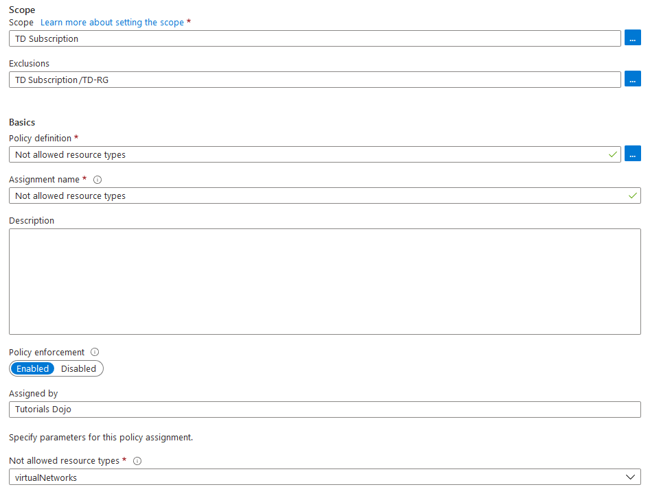

## Manage Azure Identities and Governance

### Azure Policy

Policy evaluates resources in Azure by comparing the properties of resources to the business rules. 

These business rules, described in JSON format, are known as policy definitions. 
**To simplify management, several business rules can be grouped together to form a policy initiative.**

---

Your company created a new Azure policy. You need to interpret the permissions that are allowed or denied by the policy shown below:

In the given policy, the resource group TD-RG is excluded in the effect of the policy. This means that you are allowed to create Virtual Networks in TD-RG. 

A policy exclusion allows you to assign a policy at a high level and then exclude scopes within it. 

For example, in an environment with applications and a central network, you want to have a policy for all the application resource groups but not the network resource group.

### Contributor role

the users in the group can visualize the traffic distribution by assigning a Contributor role to the group.   
**A Contributor role can manage all resources but does not allow you to assign roles in Azure RBAC, manage assignments in Azure Blueprints, or share image galleries.**

To enable traffic analytics, your account must have any of the following Azure roles at the subscription scope: owner, contributor, or network contributor.

But before you use traffic analytics, ensure your environment meets the following requirements:
- A Network Watcher enabled subscription.
- Network Security Group (NSG) flow logs enabled for the NSGs you want to monitor.
- An Azure Storage account to store raw flow logs.
- An Azure Log Analytics workspace with read and write access.

**Q :**
You created a new Azure AD group for Network Administrators in your organization Azure Subscription.    
You need to make sure that the users in the group can enable Traffic Analytics and visualize traffic distribution.  

**ANS :**
Assign a Contributor role to the group.

:x: a Security Operator can only create and manage security events. By assigning this role, the users in the group won’t be able to enable traffic analytics
:x: the users with  in the group can visualize the traffic distribution by assigning a Reader role to the group.

### Azure RBAC

**Q :**
The subscription has a user named ManilaUser01 which has the following roles:
Backup Reader
Storage Blob Data Contributor
DevTest Labs User
**ANS :**
The four fundamental **Azure role**s are Owner, Contributor, Reader, and User Access Administrator. 

To assign a Reader role to all the users in the Azure subscription, you must grant the user a User Access Administrator role. 
This role allows you to manage user access to the Azure resources.

:x:
Assign the Virtual Machine Contributor role is incorrect 
- because this role just lets you manage virtual machines. 
- Take note that this role doesn't allow you to access virtual machines directly nor assign a Reader role to all the users in the subscription.

Assign the Security Admin role is incorrect. 
- This role has the same permissions as the Security Reader role. 
- The only difference is that it can update the security policy and dismiss alerts and recommendations.

### Moving resource group containing web app

3-25

TD-RG3 contains a web app named TD-App3 which is located in North Europe.

You plan to move TD-App3 to TD-RG1.

What is the effect of moving the web app to a different resource group?

**ANS :**
In this scenario, the TD-App3 is located in the North Europe region. 

**Take note that you cannot change an App Service plan’s region**. 

**Also, if you move a resource to a new resource group or subscription, the location of the resource would not change.** 

- If you need to run your app in a different region, one alternative is app cloning. Cloning makes a copy of your app in a new or existing App Service plan in any region.

Since you plan to move TD-App3 to TD-RG1, the policy that will be applied to TD-App3 is the policy of TD-RG1 (Policy1). 

**Remember that the assigned policy on the resource group will also be applied to the resources.** 
You can also assign multiple policies in one resource group.

Hence, the correct answer is: 
**The TD-App3 remains in the North Europe region and the policy applied to the resource will be Policy 1.**

## Management 

You are managing an Azure subscription that contains a resource group named TD-RG1 which has a virtual machine named TD-VM1.

TD-VM1 has services that will deploy new resources on TD-RG1.

You need to make sure that the services running on TD-VM1 should be able to manage the resources in TD-RG1 using its identity.

Which of the following actions should you do first?

**ANS :**

There are two types of managed identities:

– System-assigned: some Azure services allow you to enable a managed identity directly on a service instance. When you enable a system-assigned managed identity, an identity is created in Microsoft Entra ID that is tied to the lifecycle of that service instance. So when the resource is deleted, Azure automatically deletes the identity for you. By design, only that Azure resource can use this identity to request tokens from Microsoft Entra ID.

– User-assigned: you may also create a managed identity as a standalone Azure resource. You can create a user-assigned managed identity and assign it to one or more instances of an Azure service. In the case of user-assigned managed identities, the identity is managed separately from the resources that use it.

In this scenario, you can use the system-assigned managed identity. Take note that this identity is restricted to only one resource. You can grant permissions to the managed identity by using Azure RBAC. The managed identity is authenticated with Microsoft Entra ID, so you don’t have to store any credentials.

Hence, the correct answer is: Configure the managed identity of TD-VM1.

The option that says: Configure the security settings of TD-RG1 is incorrect because it only provides security recommendations and security alerts for your resource group. As per the scenario, you need to ensure that the services running on TD-VM1 are able to manage the resources in TD-RG1 using its identity. Therefore, you need to configure the managed identity settings of TD-VM1.

The options that say: Configure the access control of TD-VM1 and Configure the access control of TD-RG1 are incorrect because these are only adding role assignments to an Azure resource. A role assignment is a process of attaching a role definition to a user, group, or service principal to provide access to a specific resource. Remember that access is granted by creating a role assignment, and access is revoked by removing a role assignment. You have to configure a managed identity instead.

### Account reset 3-27

注意 user account type
  
  
  

The Azure AD self-service password reset (SSPR) gives users the ability to change or reset their password with no administrator or help desk involvement. 

If a user’s account is locked or they forget their password, they can follow prompts to unblock themselves. 

This ability reduces help desk calls and loss of productivity when a user can’t sign in to their device or an application.

Remember that users can only reset their password if they have registered an authentication method that the administrator has enabled. These are the authentication methods available for SSPR: 
Mobile app notification, Mobile app code, Mobile phone, Office phone, Email, and Security questions.

**You also need to use an account with Global Administrator privileges to allow users to unlock their account or reset passwords using Azure Active Directory self-service password reset since a user with a User Administrator role does not have permission to manage MFA.** 

:x:
TD-User1 can add security questions for password reset is incorrect 
- because the role of TD-User1 is a **User Administrator**. 
- Take note that the User Administrator role does not have permission to modify security questions. If TD-User1 needs to add security questions for a password reset, you should assign a Global Administrator role.

The password can be reset immediately after TD-User2 answers the three security questions correctly is incorrect 
- because the number of methods required for password reset is set to two. 
- This means that you also need to use the second method (Mobile phone) to reset your password. :o: `3 + 1`

If TD-User3 has forgotten its password, a mobile phone app can be used to reset the password is incorrect 
- because TD-User3 is assigned to TD-Group2. Take note that the password reset is configured on TD-Group1. Therefore, TD-User3 won’t be able to reset its password.

## 3-28

Your company has the following Azure management groups in its Azure account:

You have added the following Azure subscriptions to the management groups:

You created the following Azure policies:

Based on the given scenario, there are two policies:

1. Allowed resource types  
this policy enables you to specify the resource types that your organization can deploy. Only resource types that support ‘tags’ and ‘location’ will be affected by this policy. To restrict all resources, you have to duplicate this policy and change the ‘mode’ to ‘All’.

2. Not allowed resource types   
this policy enables you to specify the resource types that your organization cannot deploy.

When you assign a policy to the tenant root group, the policy would also be applied to the subscription and management group. 

For example, if there is a Deny policy at the tenant root group, then the policy will be applied to the hierarchy of management groups and subscriptions. 

**Remember that a Deny policy always overrides an Allow policy.**

The statement that says: 

You can create a virtual machine in TD-Subscription2 is incorrect because the Tenant Root Group has a Deny policy that restricts it, as well as its related resource groups (e.g. TD-Management-Group11), from deploying virtual networks. If you can’t create a virtual network, then you also can’t deploy a virtual machine. To allow the creation of a virtual machine, you need to remove the assigned policy.

You can create a virtual network in TD-Subscription1 is incorrect because deny overrides allow. Based on the given policies, you can’t create a virtual network since you have assigned a "Not allowed resource types" policy definition. To create a virtual network, you should remove/delete this policy.

You can move TD-Subscription3 to TD-Management-Group20 is correct because you are allowed to move subscriptions between management groups. **Take note that a subscription can only have one parent management group.** Therefore, you can’t assign a subscription to multiple management groups.

## 3-32

The Azure Subscription has a resource group named Dev.

You need to assign a role in the Developers group to allow the users to create Azure Logic Apps in the resource group.

Solution: In the Dev resource group, assign a User Access Administrator role to the Developers group.

**ANS**

:x:
The associated permissions for the User Access Administrator role are only related to the specific access of each user to access different Azure resources. 
**This role cannot create or manage any type of Azure resources**.

The Logic App Operator role only lets you `read`, `enable`, and `disable` logic apps. You can’t edit, update, or create logic apps.

Since the requirement in the scenario is to allow the users to create Azure Logic Apps in the resource group, you have to assign a Contributor role to the users of the Developers group.

## 3-38 Custom Role 

If the Azure built-in roles don’t meet the specific needs of your organization, you can create your own custom roles. Just like built-in roles, you can assign custom roles to users, groups, and service principals at management group, subscription, and resource group scopes.

Take note that in this scenario, you need to create a custom role named AdatumAdministrator that is based on the built-in policy Contributor role. You need to retrieve the JSON format file of the Contributor role so that you can customize it to your needs.

To retrieve the JSON string of the Contributor role, you need to use the command:

– Get-AzRoleDefinition -Name <role_name> | ConvertTo-Json

Hence, the correct answer is: Get-AzRoleDefinition -Name Contributor | ConvertTo-Json

Get-AzRoleDefinition -Name Contributor | ConvertFrom-Json is incorrect because the ConvertFrom-Json cmdlet just converts your JSON string to a PSCustomObject object that has a property for each field in the JSON string. Take note that you need to retrieve the JSON role so that you can customize it to your needs.

The following options are incorrect because the Get-AzRoleAssignment simply allows you to list Azure RBAC role assignments at the specified scope. By default, it lists all role assignments in the selected Azure subscription. You have to use the respective parameters to list assignments to a specific user, or to list assignments on a specific resource group or resource.

## 

- Minimize administrative effort and cost whenever possible.
- Ensure that the information technology department receives an email whenever the CPU utilization vm3.adatum.com reaches 75%.
- Ensure that you create an Azure custom role named AdatumAdministrator that is based on the built-in Contributor role.
- Enable Multi-Factor Authentication (MFA) for the information technology department only.
- The servers in the Montreal office must be able to establish a connection over port 443 to vm3.adatum.com.
- Ensure that the London office can send encrypted traffic to Azure over the public Internet.
- Ensure that AdatumWeb2 can automatically increase the number of instances based on CPU utilization.

A Site-to-Site VPN gateway connection is used to send encrypted traffic between an Azure virtual network and an on-premises location over the public Internet. 

This type of connection requires a VPN device located on-premises that has an externally facing public IP address assigned to it.

Take note that in this scenario, you must ensure that the London office can send encrypted traffic to Azure over the public Internet, and deploying a site-to-site VPN gateway connection satisfies the requirement.

**Therefore, you have to Deploy a virtual network gateway and a local network gateway on the Azure portal.**

**Conversely, you must Configure a VPN device for site-to-site VPN connection in the London office.**

## Network watcher

IP flow verify checks if a packet is allowed or denied to or from a virtual machine. If the packet is denied by a security group, the name of the rule that denied the packet is returned. IP flow verify helps administrators quickly diagnose connectivity issues from or to the Internet and from or to the on-premises environment.

IP flow verify first looks at the rules for all Network Security Groups (NSGs) applied to the network interface, such as a subnet or virtual machine NIC. Traffic flow is then verified based on the configured settings to or from that network interface. It is useful in confirming if a rule in a Network Security Group is blocking ingress or egress traffic to or from a virtual machine.

Hence, the correct answer is: IP flow verify.

Next hop is incorrect because this simply helps you determine if traffic is being directed to the intended destination, or whether the traffic is being sent nowhere. Take note that in this scenario, you need to determine if the network security group is blocking the ingress or egress traffic.

NSG Flow Logs is incorrect. It is only a feature of Azure Network Watcher that allows you to log information about IP traffic flowing through a network security group.

Traffic Analytics is incorrect because this just allows you to process your NSG Flow Log data that enables you to visualize, query, analyze, and understand your network traffic.

## Blob Storage Data to AKS cluster 

Azure Kubernetes Service

Azure Container Registry

Azure Blob Storage

You need to create a container image and deploy it to the cluster.

To deploy an application on your AKS cluster, you’ll need to build a container image first. Then create a deployment manifest file to run the image in your cluster.

In this scenario, you need to identify what command should you use first, and if you take a look at the scenario again there is a statement you must create a container image. The command az acr build allows you to queue a quick build, providing streaming logs for an Azure Container Registry. So after you push the image to the container registry, you should run az acr build.

Hence, the correct answer is: az acr build.

The option that says: az aks create is incorrect because there is already an existing AKS cluster in your Azure subscription.

The option that says: az aks run is incorrect because in order to run a container image to your cluster, you need to build the image first and deploy it to the container.

The option that says: az import-export create is incorrect because this is a command to create a new job or updates an existing job in the specified subscription.

---

Azure Container Registry is a managed registry service based on the open-source Docker Registry 2.0. Create and maintain Azure container registries to store and manage your container images and related artifacts. Use Azure container registries with your existing container development and deployment pipelines, or use Azure Container Registry Tasks to build container images in Azure. Build on demand, or fully automate builds with triggers such as source code commits and base image updates.

## Contributor

You must ensure that only one user is able to deploy virtual machines and manage virtual networks.

Which of the following options should you use to satisfy the principle of least privilege?

According to the “principle of least privilege,” workers should only have access to resources necessary for carrying out their job duties. 

**In this scenario, the roles that you can use to deploy VMs and manage VNets are through Owner and Contributor roles, but the requirement is to assign a role with the least privilege.**

The Owner grants full access to manage all resources, including the ability to assign roles in Azure RBAC. 

**While the Contributor role grants full access to manage all resources but does not allow you to assign roles in Azure RBAC, manage assignments in Azure Blueprints, or share image galleries.**

Hence, the correct answer is: Contributor.

Virtual Machine Contributor is incorrect because this role does not grant you management access to the virtual network.

Network Contributor is incorrect 
- because **you can only use this role to manage the network but deploy virtual machines.**

## Delte Backup

The VMs are continuously backed up and stored in the Recovery Services vault named td-backup-labs.

You have been asked to delete td-backup-labs vault but it contains protected items.

To delete a Recovery Services vault, you need to stop the continuous backup first. Because if you try to delete the vault without stopping the backup, you would receive an error notification.

You can’t delete a Recovery Services vault with any of the following dependencies:

– You can’t delete a vault that contains protected data sources (for example, IaaS VMs, SQL databases, Azure file shares).

– You can’t delete a vault that contains backup data. Once backup data is deleted, it will go into the soft deleted state.

– You can’t delete a vault that contains backup data in the soft deleted state.

– You can’t delete a vault that has registered storage accounts.

If you try to delete the vault without removing the dependencies, you’ll encounter one of the following error messages:

– Vault cannot be deleted as there are existing resources within the vault.

– Recovery Services vault cannot be deleted as there are backup items in soft deleted state in the vault. The soft deleted items are permanently deleted after 14 days of delete operation.

Hence, the correct answer is: Stop the backup of each item.

The option that says: Modify the lock type of RSV is incorrect because there’s no lock type configured in scenario. Even if you modify the lock type, you still won’t be able to delete the vault.

The option that says: Delete the backup data is incorrect because you need to stop the backup first before you’re able to delete a backup data.

The option that says: Modify the backup policy is incorrect because you won’t still be able to delete the RSV even if you modify the backup policy. To delete a vault, stop the backup items.