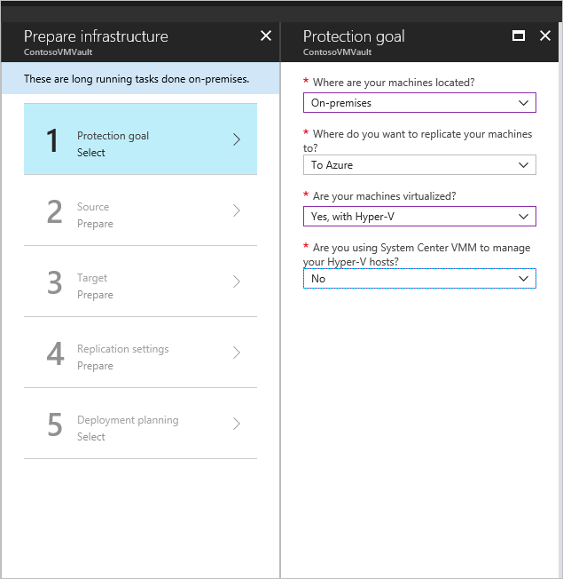

## Monitor and Maintain Azure Resources

### Alert Rule x action group

**Q :**
You created an alert rule and configured an action group with the notification type Email Azure Resource Manager Role, which sends an email to the Monitoring Reader role.

The Monitoring Reader role is assigned to the user, service principal and group.

**ANS :**

An action group is a collection of notification preferences set by the Azure subscription's owner. 

**Since an action group is a global service, it is not bound to a specific Azure region and can handle any client requests. **
- For example, if one region of the action group service is unavailable, traffic is routed and processed by other regions.
- A catastrophe recovery solution is provided by an action group as a global service.

When you use the Email Azure Resource Manager role type of notification, you can send email to members of a subscription's role. 
Emails are only sent to Azure AD user members who are members of the role.   
Azure AD groups and service principals are not emailed.   
Also, a notification email will only be sent to the primary email address.  

Hence, the correct answer is: TDU3.

All of the other options are incorrect because only TDU3 will able to receive the email notification since emails are only sent to Azure AD user members who are members of the role.

### backup policy in Recovery Services Vault Resource setup

To create a backup policy, you need to create a Recovery Services vault first. 

Take note that the services supported by Azure Backup are virtual machine, file share, SQL server, and SAP HANA. 

Based on the given policy, the retention period for monthly backup is 36 months. 

Since January 15 is not configured as a yearly backup point, this backup is considered a monthly backup.

- The created backup on January 15 will be retained for 36 months.
- The created backup on December 15 will be retained for 5 Years.

## Azure Network Watcher

3-24. QUESTION  

A web application is hosted on TD-VM1(within TDVNet1) and the data is retrieved and processed by TD-VM2 (within TDVNet2).  

Several users reported that the web application has a sluggish performance.  

You are instructed to track the average round-trip time (RTT) of the packets from TD-VM1 to TD-VM2.

**In this scenario, you can use Connection Monitor to track the average round-trip time (RTT) of the packets from TD-VM1 to TD-VM2.** 

In Azure Network Watcher, Connection Monitor provides unified end-to-end connection monitoring. 

**The Connection Monitor feature also supports hybrid and Azure cloud deployments.**

Benefits of using the Connection Monitor:

– Unified, intuitive experience for Azure and hybrid monitoring needs

– Cross-region, cross-workspace connectivity monitoring

– Higher probing frequencies and better visibility into network performance

– Faster alerting for your hybrid deployments

– Support for connectivity checks that are based on HTTP, TCP, and ICMP

– Metrics and Log Analytics support for both Azure and non-Azure test setups

Hence, the correct answer is Connection Monitor.

IP flow verify is incorrect because this feature only looks at the rules for all Network Security Groups (NSGs) applied to the network interface. It is stated in the scenario that you must track the packets from TD-VM1 to TD-VM2. IP flow verify is not capable of providing the average round-trip time of the packets from the source to the destination.

Connection Troubleshoot is incorrect because it simply checks connectivity between source and destination. Take note that you need to track the average round-trip time of the packets from VM1 to VM2. Therefore, you need to use Connection Monitor to analyze the end-to-end connection and not the Connection Troubleshoot operation.

NSG flow logs is incorrect because it only allows you to log information about IP traffic flowing (ingress and egress) through an NSG. Take note that you can’t use NSG flow logs to track the average RTT of the packets from TD-VM1 to TD-VM2. You need to use Connection Monitor to provide unified end-to-end connection monitoring.

## Change the Recovery Services vault of a virtual machine

You can use Recovery Services vaults to hold backup data for various Azure services such as `IaaS VMs (Linux or Windows)` and `Azure SQL databases`. 

Recovery Services vaults support `System Center DPM`

To change the Recovery Services vault of a virtual machine, you need to stop the backup first **since Azure VMs may only be assigned a single Recovery Services Vault (RSV) at a time. After the backup stops**, you can now assign a new vault to your VM. 

Reference :
https://learn.microsoft.com/en-us/azure/backup/backup-azure-arm-vms-prepare

https://learn.microsoft.com/en-us/azure/backup/backup-azure-recovery-services-vault-overview

---

**Q 3-49:**
You have been assigned to manage two Azure VMs and Recovery Services vaults.    
Both VMs currently store back up to a single vault.     

You must configure the other VM to backup in a different vault.  

**ANS :**
Stop the backup of one VM.

:x: Delete the backup data is incorrect 
- because you need to stop the backup before you can delete the backup data.

:x: Change the VM target vault is incorrect
- because you also need to stop the backup of one VM to change the RSV.

:warning: Stop the backup of both VM is incorrect 
- because you don't need to stop the backup of both VMs to change the vault of one VM.

## RSV for resources

Tips 
- location or region of the resource matching with RSV .

**Q 3-50:**
Your company Azure Subscription contains the following resources:  
  
You have created a file share named FS1 and a blob container named BC1.  

Which of the following resources can be backed up in the Recovery Services vaults?  
– Backups can be performed using `RSV1` ?  
– Backups can be performed using `RSV2` ?  

**ANS :**

In this scenario, you need to identify which resources can be backed up by RSV1 and RSV2. 

**The first thing that you need to take a look at is the location or region of the resource.**   
Since you can only backup using RSV if the resource and vault are in the same location.

You can only use Recovery Services vaults to hold backup data for various Azure services such as IaaS VMs (Linux or Windows) and SQL Server in Azure VMs. 

After knowing which resources can be backed up using RSV, the remaining resources would be VM and File Share.

## Azure Backup & How to Restore VM

Azure Backup takes a snapshot of the existing VM before replacing the disk, and stores it in the staging location you specify.  
The existing disks connected to the VM are replaced with the selected restore point.

The snapshot is copied to the vault (RSV保存庫), and retained in accordance with the retention policy.   
After the replace disk operation, the original disk is retained in the resource group.  
You can choose to manually delete the original disks if they aren’t needed.  

Azure Backup provides several ways to restore a VM:  
  
- Create a new VM
Quickly creates and gets a basic VM up and running from a restore point.  
- Restore disk 
Restores a VM disk, which can then be used to create a new VM.  
- Replace existing disk
Restore a disk, and use it to replace a disk on the existing VM.
- Cross-Region (secondary region)
Restore Azure VMs in the secondary region, which is an Azure paired region.

---

**Q 4-2**
Your company eCommerce website is deployed in an Azure virtual machine named `TD-BGC`.

You created a backup of the TD-BGC and implemented the following changes:
- Change the local admin password.
- Create and attach a new disk.
- Resize the virtual machine.
- Copy the log reports to the data disk.

You received an email that the admin restore the TD-BGC using the `replace existing` configuration.    
Which options should you perform to bring back the changes in TD-BGC?  

**ANS :**
**Since you restore the VM using the backup data, the new disk won't have a copy of the log reports.**   

To bring back the changes in the TD-BGC virtual machine, you will need to copy the log reports to the disk.  
Hence, the correct answer is: Copy the log reports to the data disk.

## A Recovery Services Configuration  

Your company created several Azure virtual machines and a file share in the subscription `TD-Boracay`.   

Condition
The VMs are all part of the same virtual network.  

Requirement : 
You have been assigned to manage the on-premises Hyper-V server replication to Azure.

To support the planned deployment, you will need to create additional resources in TD-Boracay.

**ANS :**
To set up disaster recovery of on-premises Hyper-V VMs to Azure, you should complete the following steps:

**1.** Select your replication source and target 
- To prepare the infrastructure, you will need to create a Recovery Services vault Resource. 

After you created the vault, you can now accomplish the protection goal, as shown in the image below :arrow_down:.

**2.** Set up the source replication environment, including on-premises Site Recovery components and the target replication environment 
- to set up the source environment, you need to create a Hyper-V site and add to that site the Hyper-V hosts containing the VMs that you want to replicate. 
- The target environment will be the subscription and the resource group in which the Azure VMs will be created after failover.

**3.** Create a replication policy

**4.** Enable replication for a VM

---

https://docs.microsoft.com/en-us/azure/site-recovery/tutorial-prepare-azure-for-hyperv

https://docs.microsoft.com/en-nz/azure/site-recovery/hyper-v-azure-tutorial

https://docs.microsoft.com/en-us/windows-server/virtualization/hyper-v/hyper-v-technology-overview

A Recovery Services vault is a management entity that stores recovery points created over time and provides an interface to perform backup-related operations.

A replication policy defines the settings for the retention history of recovery points. The policy also defines the frequency of app-consistent snapshots.

## The Linux Diagnostic Extension For METRIC & LOG

**Q 4-18**
You deployed an Ubuntu server using an Azure virtual machine.  
You need to monitor the system performance metrics and log events.  

**ANS :**
The Linux Diagnostic Extension will help you monitor the health of a Linux VM running on Microsoft Azure. 

With this extension, you can now monitor the system performance metrics and log events of the virtual machine.

It has the following capabilities:
- Collects system performance metrics from the VM and stores them in a specific table in a designated storage account.
- Retrieves log events from syslog and stores them in a specific table in the designated storage account.
- Enables users to customize the data metrics that are collected and uploaded.
- Enables users to customize the syslog facilities and severity levels of events that are collected and uploaded.
- Enables users to upload specified log files to a designated storage table.
- Supports sending metrics and log events to arbitrary EventHub endpoints and JSON-formatted blobs in the designated storage account.

Hence, the correct answer is: Linux Diagnostic Extension.

:x: Azure Performance Diagnostics VM Extension is incorrect
- because this extension only collects performance diagnostic data from Windows VMs.

:x: Boot diagnostics is incorrect 
- because this feature is **primarily used to diagnose VM boot failures** and not for monitoring the system performance metrics and log events.

:x: Connection monitor is incorrect 
- because this is simply used for end-to-end connection monitoring.

---

https://docs.microsoft.com/en-us/azure/virtual-machines/extensions/diagnostics-linux

https://docs.microsoft.com/en-us/azure/azure-monitor/platform/diagnostics-extension-overview

Azure Diagnostics extension is an agent in Azure Monitor that collects monitoring data from the guest operating system of Azure compute resources including virtual machines. It collects guest metrics into Azure Monitor Metrics and sends guest logs and metrics to Azure storage for archiving.

Azure Performance Diagnostics VM Extension helps collect performance diagnostic data from Windows VMs. The extension performs analysis and provides a report of findings and recommendations to identify and resolve performance issues on the virtual machine.

## Azure Monitor with VNet

**Q 4-19**
You have an Azure subscription that contains hundreds of network resources.

You need to recommend a solution that will allow you to monitor resources in one centralized console for network monitoring.

**ANS :**
the correct answer is: Azure Monitor Network Insights.

---

Azure Monitor Network Insights provides a **comprehensive view of health and metrics for all deployed network resources without requiring any configuration.**  

**It also provides access to network monitoring capabilities like Connection Monitor, flow logging for network security groups (NSGs), and Traffic Analytics.** And it provides other network diagnostic features. 

Key features of Network Insight:
- Single console for network monitoring
- No agent configuration required
- Access to health state, metrics, alerts, & data from traffic and connectivity monitoring tools in one place
- View network topology with functional dependencies for simpler troubleshooting
- Access resources metrics to debug issues without writing queries or authoring workbooks

:x: Azure Traffic Manager is incorrect because this is simply a DNS-based traffic load balancer that enables you to distribute traffic optimally to services across global Azure regions while providing high availability and responsiveness. However, you cannot use this to monitor your network resources.

:x: Azure advisor (錢+安全性) is incorrect because this service just helps you improve the cost-effectiveness, performance, reliability (formerly called high availability), and security of your Azure resources.

## Azure Application Insights Service

**28.** QUESTION   
Your organization has two web applications running in different environments:

You have been tasked to monitor the performance of the applications using Azure Application Insights.

The operation should have minimal changes to the code.

What should you do?

The main requirement in the scenario is to use Azure Application Insights to track the performance of the applications. 

But the condition is to implement it with minimal changes in the code. 

That is why the first approach satisfies the requirement since you only need to install the agent in the machine.

The option that says: Install the Application Insights SDK is incorrect because, in order to implement this method, you will need to do some changes in the application code. Take note that the requirement is to implement monitoring with minor changes in the code.

The option that says: Install the Windows Azure VM Agent is incorrect because this won’t help you track the performance of the application. The VM agent is commonly used when you need to create a backup of the virtual machine. Therefore, this option is incorrect and won’t satisfy the requirement in the scenario.

The option that says: Install the Azure Monitor Agent is incorrect because it is already indicated in the scenario that you need to use Azure Application Insights to track the performance of the application. Also, the Azure Application Insights is a feature of Azure Monitor. Hence, this method is incorrect and will not meet the given requirement in the scenario.

---

https://docs.microsoft.com/en-us/azure/azure-monitor/app/app-insights-overview

https://docs.microsoft.com/en-us/azure/azure-monitor/app/azure-web-apps

https://docs.microsoft.com/en-us/azure/azure-monitor/app/status-monitor-v2-overview

Application Insights is a feature of Azure Monitor that provides extensible application performance management (APM) and monitoring for live web apps. It also supports a wide variety of platforms, including .NET, Node.js, Java, Python and works for apps hosted on-premises, hybrid, or on any public cloud.

There are two ways to enable application monitoring for hosted applications:

1. Agent-based application monitoring (Application Insights Agent)

– This method is the easiest to enable, you only need to install the Application Insights Agent, and code changes or advanced configurations are not required.

2. Manually instrumenting the application through code (Application Insights SDK)

– The alternative approach is you need to install the Application Insights SDK. This means that you have to manage the updates to the latest version of the packages by yourself. The second method is recommended if you need to make custom API calls to track events/dependencies not captured by default with agent-based monitoring.

## Azure Monitor Log Analytics Workspace for Storage Backup

**Q :**
There is a requirement that requires you to configure Azure Backup reports using `TDBackup1` to determine which backup items consume the most storage.  

**ANS :**
the correct answer is: `TDAnalytics1`, `TDAnalytics2`, and `TDAnalytics3`.

--- 

:memo: What is Azure Backup Report
- Azure Backup Report provides a **reporting solution that uses Azure `Monitor logs` and Azure `workbooks`**.  
- These resources help you get rich insights on your backups across your entire backup estate.   
- **Backup Reports serve as a one-stop destination for tracking usage, auditing of backups and restores, and identifying key trends at different levels of granularity.**

:memo: region & subscription
- **When you create a Log Analytics workspace, it does not matter if the vault is located in a different region or subscription.**

:memo: A common requirement for backup admins is to obtain insights on backups **based on data that spans a long period of time.**   

:memo: Use cases for such a solution include :
- `Allocating` and `Forecasting` of cloud STORAGE consumed.
- `Auditing` of backups and restores.
- `Identifying Key Trends` at different levels of granularity.

:memo: Retention Of Log Analytics Data 
- **By default, the data in a Log Analytics workspace is retained for 30 days.**   
- To see data for a longer time horizon, change the retention period of the Log Analytics workspace.  