# Storage 

## Access Tiers & Replication Strategies

:mag: Access Tiers
Hot (讀)
- Optimized for storing data that is accessed frequently.  

Cool (不太讀)
- Optimized for storing data that is infrequently accessed and stored for **at least `30` days**.  

Archive (陳年)
- Optimized for storing data that is rarely accessed and stored for **at least `30*6` days** with flexible latency requirements on the order of hours.  

:mag: Storage Account Type for Copies Of Data
  
- Only 3 for LRS and GRS 
- 6 for GRS and GZRS.

https://docs.microsoft.com/en-us/azure/storage/common/storage-account-overview

https://docs.microsoft.com/en-us/azure/storage/common/storage-redundancy

https://docs.microsoft.com/en-us/azure/storage/blobs/storage-blob-storage-tiers

---

:question: 3-7 :

You created an Azure storage account named tutorialsdojostorage using the following parameters:


1. How many copies of your data will be maintained by the Azure storage account at the minimum? 
2. The files that you will host in `tutorialsdojostorage` are frequently accessed files. 
What setting should you modify?

:a: : 

:o: :arrow_down:
1. you will have a total of 6 copies maintained because its replication setting is Geo-redundant storage (GRS)
2. if you store frequently accessed files, you must modify the access tier to the `hot` tier from the `cool` tier.

:x: `Account Kind` is incorrect 
- because it simply offers several types of storage accounts, such as StorageV2, Storage, and BlobStorage. 
- Each type supports different features and has its own pricing model.

:x: `Versioning` is incorrect 
- Because this feature is for automatically maintaining the previous versions of an object. 
- **When `blob versioning` is enabled, you can restore an earlier version of a blob to recover your data if it is erroneously modified or deleted.**

:x: `Performance` is incorrect 
- because this tiering system is primarily used for determining the speed capability of your storage account. 
- There are two types of performance tiers:    
  1. `Standard` :arrow_right: optimized for high capacity/throughput, 
  2. `Premium`  :arrow_right: `optimized for high transaction rates and single-digit consistent storage latency`.

## Backup Policy for yearly, monthly backup point

To create a backup policy, you need to create a Recovery Services vault first. 

Take note that the services supported by Azure Backup are virtual machine, file share, SQL server, and SAP HANA. 

Azure Backup Policy has two components: 
- Schedule (when to take a backup) and Retention (how long to retain backup). 

You can define the policy based on the type of data that’s being backed up, RTO/RPO requirements, operational or regulatory compliance needs, and workload type.

https://docs.microsoft.com/en-us/azure/backup/guidance-best-practices

https://docs.microsoft.com/en-us/azure/backup/backup-azure-manage-vms

---

:question: 3-17

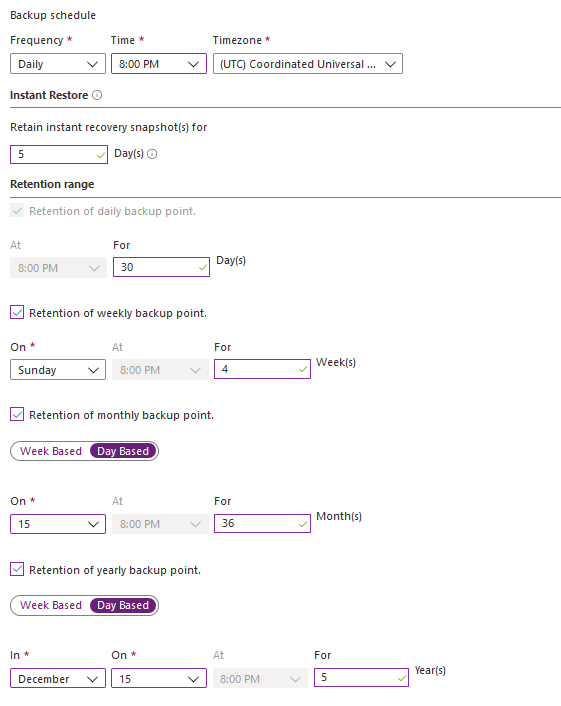

- The created backup on January 15 will be retained for ?
- The created backup on December 15 will be retained for?

:a: :

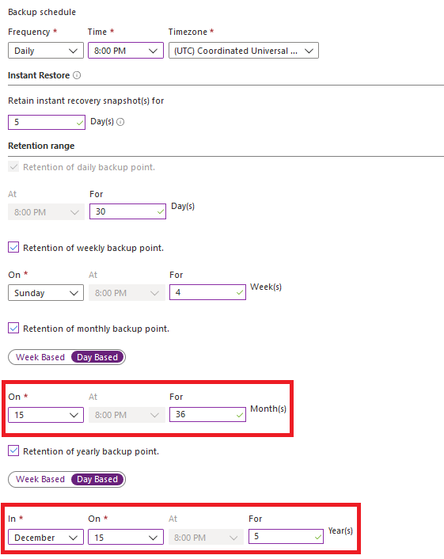
Based on the given policy, the retention period for monthly backup is 36 months. Since January 15 is not configured as a yearly backup point, this backup is considered a monthly backup.

## :star::star: RSV Backup Solution in Azure

:question: : 3-35
Tutorials Dojo is an online learning portal for technology-related topics that empowers its users to upgrade their skills and career. 

Tutorials Dojo has users worldwide, ranging from the United States, Europe, and Asia.

Existing Environment  
Tutorials Dojo uses a wide range of servers for its business operations, including the following:

- Domain Controller.
- File Servers.
- Microsoft SQL Servers.
- Active Directory forest named `tutorialsdojo.com`. 
The servers and workstations are joined to the Active Directory.

A public-facing application named TutorialsDojoPortal compromises the following three tiers.
> A public-facing application is an application that can be accessed by anyone on the internet, not just by users within a private network.

- A web tier.
- A business tier.
- A database tier.
The web tier and business tier each consists of 5 virtual machines, while the database tier only has two, a primary and secondary SQL database server.


Planned Changes
Tutorials Dojo plans to implement the following changes to the infrastructure:

- Migrate TutorialsDojoPortal to Azure.
- Migrate the media files to Azure Blob Storage.
- Utilize Content Delivery Network.


Technical Requirements
Tutorials Dojo must meet the following technical requirements:  
- Migrate the TutorialsDojoPortal virtual machines to Azure.
- Limit the number of ports between TutorialsDojoPortal tiers.
- Backup and disaster recovery scenario for TutorialsDojoPortal servers.
- Migrate the media files to Azure over the Internet.
- The media files must be stored in a Blob container and cached via Content Delivery Network.
- The virtual machines must be joined to the Active Directory.
- The SQL database server must run on virtual machines.
- Minimize administrative effort whenever possible.


User Requirements
- Create a new user named `TutorialsDojoAdmin1` as the service admin for the Azure Subscription.    
- Ensure that the `TutorialsDojoAdmin1` receive email alerts for budget alerts.  
- Ensure that only Administrators can create virtual machines.

Your company has already migrated the `TutorialsDojoPortal` to Azure.  

There is a requirement to implement a backup solution for `TutorialsDojoPortal`.  

What should you create first?
- Microsoft Azure Backup Server (MABS)
- Recovery Services Vault
- Backup policy
- Recovery Plan

:a: :
> RSV backup is including Azure VMs, SQL and SAP databases, and **Azure file shares (Not Blob Container)**.

When you back up data in Azure, you store that data in an Azure resource called a RSV. 
- The Recovery Services vault resource is available from the Settings menu of most Azure services. 
- The benefit of having the RSV integrated into the Settings menu of most Azure services is the ease of backing up data.

Here are the steps when you backup an Azure virtual machine:  
1. Create a Recovery Services vault  
2. Define a backup policy  
3. **Apply the backup policy to protect multiple virtual machines**  

Hence, the correct answer is: Recovery Services Vault.  

:x: Backup policy is incorrect 
- because you need to create a Recovery Services vault first. A backup policy is a schedule for how often and when recovery points are taken. 
- A policy also includes the retention range for the recovery points.

:x: Microsoft Azure Backup Server is incorrect. 
- Microsoft Azure Backup Server (MABS) is a server product that can be used **to back up on-premises physical servers, VMs, and apps running on them**. 
- **The prerequisite of deploying a Microsoft Azure Backup Server is to have a Recovery Services Vault**.

:x: Recovery Plan is incorrect. 
- **A recovery plan gathers machines into recovery groups for the purpose of failover.** 
- A recovery plan helps you to define a systematic recovery process, by creating small independent units that you can failover. 
- A unit typically represents an app in your environment. The requirement is to implement a backup solution not a disaster recovery solution.

## Migrate the media files to Azure.

:question: 3-36

There is a requirement to migrate the media files to Azure.

What should you do?
- Use file explorer to copy the files by mapping a drive using an Azure storage account access key for authorization.
- Use Azure Storage Explorer to copy the files.
- Use file explorer to copy the files by mapping a drive using a shared access signature (SAS) in the Azure storage account to grant temporary access.
- Use Azure Import/Export service to copy the files.

:a: :

:o: Use Azure Storage Explorer to copy the files.

Microsoft Azure Storage Explorer is a standalone app that is accessible, intuitive, feature-rich graphical user interface (GUI) for full management of cloud storage resources and makes it easy to work with Azure Storage data on Windows, macOS, and Linux. 

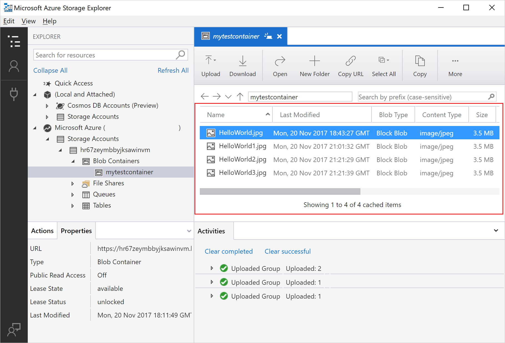

**You can upload, download, and manage Azure blobs, files, queues, and tables, as well as Azure Cosmos DB and Azure Data Lake Storage entities.**

The requirements to be considered for this scenario are:
1. Migrate the media files to **Azure over the Internet**.
2. The media files must be stored in a Blob container and cached via Content Delivery Network.

:x: Use Azure Import/Export service to copy the files is incorrect. 
- Azure Import/Export service is primarily used to securely import large amounts of data to Azure Blob storage and Azure Files by shipping disk drives to an Azure datacenter. 
- The requirement states that the transfer of the media files must be done over the Internet.

The following options :arrow_down: are incorrect 
- because **you cannot mount a Blob container using file explorer**. 

Take note that the requirement states that the media files must be stored in a Blob container.

- :x: Use file explorer to copy the files by mapping a drive using a shared access signature (SAS) in the Azure storage account to grant temporary access.
- :x: Use file explorer to copy the files by mapping a drive using an Azure storage account access key for authorization.

:link: https://azure.microsoft.com/en-us/features/storage-explorer/

:link: https://docs.microsoft.com/en-us/azure/vs-azure-tools-storage-manage-with-storage-explorer


## :star: AZ CDN to Identify the blob storage requirement for media files

:mag: What is Azure CDN
- **a distributed network of servers that is `used to cache and store content`.** 
These servers are in locations that are close to end-users to minimize latency.
- **You can use Azure CDN to cache content from a Blob container and configure the custom domain endpoint for your Blob container, provision custom TLS/SSL certificates, and configure custom rewrite rules.** 
- Azure CDN also provides TLS encryption with your own certificate.

:memo: POP with CDN
- The server locations are referred to as Point-of-presence (POP) locations.  
- CDNs store cached data on edge servers, or servers close to your users, in these POP locations.

https://docs.microsoft.com/en-us/azure/cdn/cdn-overview

https://docs.microsoft.com/en-us/azure/cdn/cdn-create-a-storage-account-with-cdn

---

:question: 3-39

You need to identify the storage requirements for `TutorialsDojoPortal` media files.

:a: :

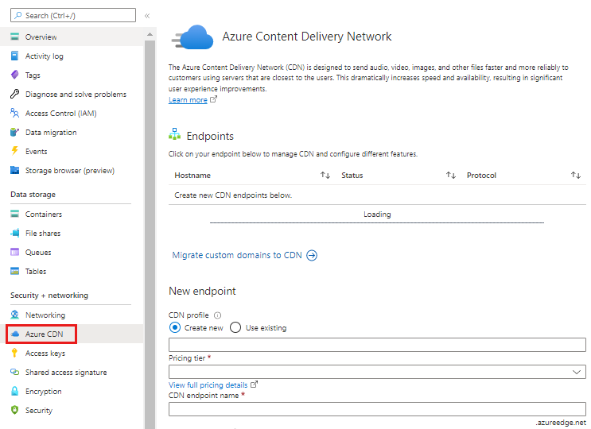

The requirement to be considered for this scenario is:
- The media files must be stored in a Blob container and cached via Content Delivery Network.

:o: Azure Blob storage meets the storage requirements TutorialsDojoPortal media files.

:x: Azure Table storage meets the storage requirements of TutorialsDojoPortal media files is incorrect 
- because Azure Table is ideal for storing structured, non-relational data. 
- You simply cannot integrate Azure Table with Azure CDN. 

:x: Azure Files storage meets the storage requirements of TutorialsDojoPortal media files is incorrect. 
- **Azure Files can be only accessed through SMB protocol and cannot be put directly behind an Azure CDN which only supports HTTP(80) and HTTPS(443) protocols.**

## Export Specific Role Definition 

You need to retrieve the JSON string of the Contributor role so you can customize it to create the `AdatumAdministrator` custom role.

Which command should you run?
```
Get-AzRoleDefinition -Name Contributor | ConvertTo-Json
Get-AzRoleAssignment -Name Contributor | ConvertFrom-Json
Get-AzRoleDefinition -Name Contributor | ConvertFrom-Json
Get-AzRoleAssignment -Name Contributor | ConvertTo-Json
```

:a: :

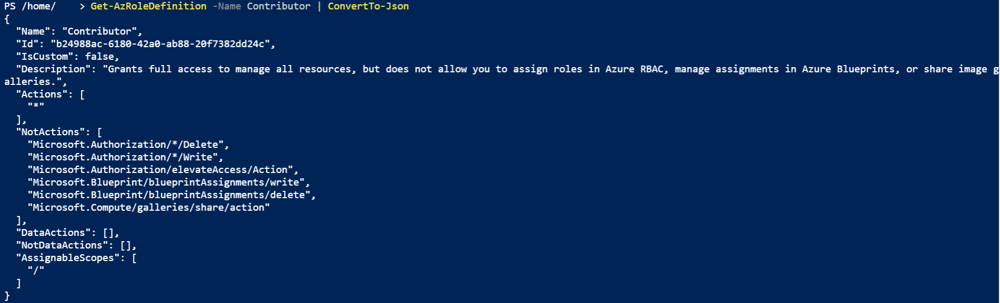


If the Azure built-in roles don’t meet the specific needs of your organization, you can create your own custom roles. 

Just like built-in roles, you can assign custom roles to `users`, `groups`, and `service principals at management group`, `subscription`, and `resource group scopes`.

Take note that in this scenario, you need to create a custom role named `AdatumAdministrator` that is based on the built-in policy Contributor role. 
- You need to retrieve the JSON format file of the Contributor role so that you can customize it to your needs.

To retrieve the JSON string of the Contributor role, you need to use the command:
`Get-AzRoleDefinition -Name <role_name> | ConvertTo-Json`

Hence, the correct answer is: Get-AzRoleDefinition -Name Contributor | ConvertTo-Json

:x: `Get-AzRoleDefinition -Name Contributor | ConvertFrom-Json` is incorrect 
- because the `ConvertFrom-Json` cmdlet just converts your JSON string to a `PSCustomObject` object that has a property for each field in the JSON string. 
- Take note that you need to retrieve the JSON role so that you can customize it to your needs.

The following options :arrow_down: are incorrect 

because the `Get-AzRoleAssignment` simply allows you to list Azure RBAC role assignments at the specified scope. 
- By default, it lists all role assignments in the selected Azure subscription. 
- You have to use the respective parameters to list assignments to a specific user, or to list assignments on a specific resource group or resource.
```
Get-AzRoleAssignment -Name Contributor | ConvertTo-Json
Get-AzRoleAssignment -Name Contributor | ConvertFrom-Json
```

https://docs.microsoft.com/en-us/azure/role-based-access-control/overview

https://docs.microsoft.com/en-us/azure/role-based-access-control/custom-roles-powershell

## :star2: Stop backup before deleting A RSV

:memo: To delete a Recovery Services vault, you need to stop the continuous backup first. 
- Because if you try to delete the vault without stopping the backup, you would receive an error notification.

:warning: If you try to delete the vault without removing the dependencies, you'll encounter one of the following error messages:
> Vault cannot be deleted as there are existing resources within the vault.


:red_circle: You can't delete a RSV with any of the following dependencies:
- a vault that contains protected data sources  
  - for example, IaaS VMs, SQL databases, Azure file shares.
- a vault that contains backup data. 
  - Once backup data is deleted, it will go into the soft deleted state.
- a vault that contains backup data in the soft deleted state.
- a vault that has registered storage accounts.

RSV cannot be deleted as there are backup items in soft deleted state in the vault. 
- The soft deleted items are permanently deleted after 14 days of delete operation.

https://learn.microsoft.com/en-us/azure/backup/backup-azure-delete-vault?tabs=portal#delete-protected-items-in-the-cloud

https://learn.microsoft.com/en-us/azure/backup/backup-azure-vms-first-look-arm

---

:question: 3-43
You are currently managing multiple Azure virtual machines that are used for lab experiments.

The VMs are continuously backed up and stored in the Recovery Services vault named td-backup-labs.

You have been asked to delete `td-backup-labs` vault but it contains protected items.

:a: : 


:o: the correct answer is: Stop the backup of each item.

:x: Modify the lock type of RSV is incorrect 
- because there's no lock type configured in scenario. 
- Even if you modify the lock type, you still won’t be able to delete the vault.

:x: **Delete the backup data is incorrect** 
- because you need to stop the backup first before you’re able to delete a backup data.

:x: Modify the backup policy is incorrect 
- because you won’t still be able to delete the RSV even if you modify the backup policy. 

## Replication Strategies & Regions

Locally redundant storage (LRS) 
1. copies your data synchronously three times within a single physical location in the primary region. 
2. LRS is the least expensive replication option but is not recommended for applications requiring high availability.

Zone-redundant storage (ZRS) 
1. copies your data synchronously across three Azure availability zones in the primary region. 
2. For applications requiring high availability.

Geo-redundant storage (GRS) 
1. copies your data `synchronously` three times within a single physical location in the primary region using LRS.   
2. It then copies your data `asynchronously` to a single physical location in a secondary region **that is hundreds of miles away from the primary region**.

Geo-zone-redundant storage (GZRS) 
1. copies your data `synchronously` across three Azure availability zones in the primary region using ZRS.   
2. It then copies your data `asynchronously` to a single physical location in the secondary region.

https://docs.microsoft.com/en-us/azure/storage/common/storage-account-overview

https://docs.microsoft.com/en-us/azure/storage/common/storage-redundancy

---

**Q 4-5**
Your company plans to store media assets in two Azure regions.

Requirements
- Media assets must be stored in multiple availability zones
- Media assets must be stored in multiple regions
- Media assets must be readable in the primary and secondary regions.

Which of the following data redundancy options should you recommend?
- Locally redundant storage
- Zone-redundant storage
- Read-access geo-redundant storage
- Geo-redundant storage

**ANS :**

:o: Read-access geo-redundant storage  

With Geo-redundant storage, your media assets are stored in multiple availability zones and multiple regions. 
- But read access will only be available in the secondary region if you or Microsoft initiates a failover from the primary region to the secondary region.

**In order to have read access in the primary and secondary region at all times without having the need to initiate a failover**, you need to recommend **Read-access geo-redundant storage**.

:x: Geo-redundant storage is incorrect 
- because the requirement states that you need read access to the primary and secondary regions. With GRS, the data in the secondary region isn’t available for read access. 
- You can only have read access in the secondary region if a failover from the primary region to the secondary region is initiated by you or Microsoft.

## :star::star: Rehydrate a blob data from archive tier

:warning: Rehydrate a blob data (offline to online): 
- To work with the data of in an archived blob, you must rehydrate it by moving it to an online tier (either the hot or cool tier).
- The process of restoring an archived blob to an online tier and **can take hours to complete**.

Offline Blob Data , Archive Tier : 
- data that is considered offline and cannot be read or modified

Online Blob Data , Hot/Cool Tier: 
- The blob metadata remains online and available, allowing you to list the blob and its properties.   
- Reading and modifying blob data is only available with online tiers such as hot or cool.  

:mag: Rehydration Options
- `Copy` an archived blob to an online tier 
You can rehydrate an archived blob by copying it to a new blob in the hot or cool tier using the Copy Blob operation.   
**This is the recommended option for most scenarios.**
- `Change` an archived blob's access tier:   
You can also rehydrate an archived blob by changing its access tier directly using the Set Blob Tier operation.


Rehydration Priority :arrow_up: :
1. :red_circle: High-priority rehydration 
Prioritized over standard requests, may complete in less than one hour for objects under 10 GB.
   1. costs more but is faster.   
   2. Reserve it for emergency data restoration situations.  
2. Standard priority: 
Processed in the order received, may take up to 15 hours for objects under 10 GB.

:mag: Billing
- :red_circle: A rehydration operation with Set Blob Tier is billed for data `read transactions` and data `retrieval size`. 
- :red_circle: High-priority rehydration shows up as a separate line item on your bill.

:link: https://azure.microsoft.com/en-us/services/storage/archive/

:link: https://docs.microsoft.com/en-us/azure/storage/blobs/storage-blob-rehydration

---

:question: 4-6

:a: The statement that says:   

:x: You can rehydrate a blob data in archive tier without costs. 
- You are billed for data read transactions and data retrieval size (per GB).
 
:x: You can rehydrate a blob data in archive tier instantly.  
- Rehydrating a blob from the Archive tier can take several hours to complete.

:x: You can access your blob data that is in archive tier  
- because blob data stored in the archive tier is considered to be offline and can’t be read or modified.

## :star::star::star: File Share Authentication for On-premise and Cloud access

https://docs.microsoft.com/en-us/azure/storage/files/storage-files-introduction

https://docs.microsoft.com/en-us/azure/storage/files/storage-files-identity-auth-active-directory-enable

Azure Files SMB file shares are accessible from Windows, Linux, and macOS clients. 
- Azure Files SMB file shares can be cached on Windows Servers with Azure File Sync for fast access near where the data is being used.

Azure Files NFS file shares are accessible from Linux or macOS clients.

--- 

:question: 4-10
You have an Azure subscription named `Davao-Subscription` that contains an Azure Files named `Baguio-Share`.

You have several Azure virtual machine that is domain joined to an on-premises Active Directory domain controller and a site-to-site VPN connection for cross-premises connectivity.

There is a requirement to replace your on-premises file server with Baguio-Share.   

Your domain-joined machines must be able to mount Baguio-Share using your active directory credentials.  

Which four actions should you perform in sequence?

:a: :

Enabling AD DS authentication for your Azure file shares allows you to authenticate to your Azure file shares with your on-premise AD DS credentials. 
- Further, it allows you to better manage your permissions to allow granular access control.  


To enable AD DS authentication, you must do the following in sequence:  

:one: `Sync` on-premises AD with Azure AD Connect  
:m: Identities used for access must be synced to Azure AD.
**Only hybrid users that exist in both on-premises AD DS and Azure AD can be authenticated and authorized for Azure file share access.**

:two: Enable AD DS authentication
- To enable AD DS authentication over SMB for Azure file shares, you need to register your storage account with AD DS and then set the required domain properties on the storage account.  
- You can think of **this process as if it were like creating an account representing an on-premises Windows file server in your AD DS.**

:three: Assign share and directory permissions
- After enabling AD DS authentication, you must configure share-level permissions in order to get access to your file shares. 
- The Azure RBAC share-level permissions act as a high-level gatekeeper that determines whether a user can access the share.
- With directory permissions, you can configure proper Windows ACLs at the root, directory, or file level, to take advantage of granular access control.

:four: Mount file share with AD credentials

## Delete Resource Group with RSV

https://docs.microsoft.com/en-us/azure/backup/backup-azure-delete-vault

https://docs.microsoft.com/en-us/azure/azure-resource-manager/management/lock-resources?tabs=json

---

:question: 4-11 

Your company has an Azure Subscription that contains a resource group named TD-Cebu.

TD-Cebu contains the following resources:

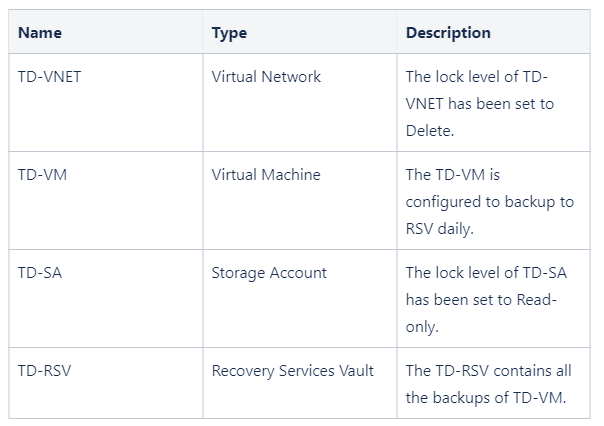

What should you do first to delete the TD-Cebu resource group?

:a: :

:o: Delete all the resource lock and backup data in RSV resource 

In order to delete the resource group, you must first delete/remove the following:

:one: Delete Resource Lock
- If the lock level is set to `Delete` or `Read-only`, the users in your organization are prevented from accidentally deleting or modifying critical resources. 
- The lock overrides any permissions the user might have.

:two: Delete Backup data in Recovery Services vault

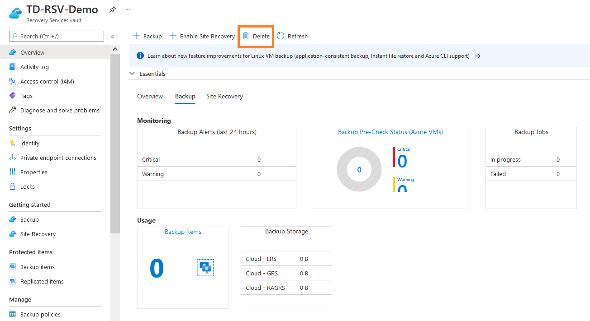


**If you try to delete a vault that contains backup data, you’ll encounter a message:**
> Vault cannot be deleted as there are existing resources within the vault. Please ensure there are no backup items, protected servers, or backup management servers associated with this vault.


After you deleted the lock and backup data, you can now delete the resource group.

:x: Stop TD-VM and delete the resource lock of TD-VNET is incorrect 
- because you must also delete the backup data of TD-RSV to delete the resource group. Take note that you can’t delete a vault that contains backup data.

## Storage Account Type 


There is a compliance requirement where in the data in `TD1` and `TD2` must be available if a single availability zone in a region fails. 

The solution must minimize costs and administrative effort.

:a: : 
Upgrade TD1 and TD2 to general-purpose v2


## :star: Azure Storage lifecycle management

:question: 4-39

Your organization has a standard general-purpose v2 storage account with an access tier of Hot. 

The files uploaded to the storage account are infrequently accessed by your colleagues.

You were tasked with modifying the storage account with the following requirements:
- Inactive data must automatically transition to the archive tier after 120 days.
- Data uploaded must be accessed instantly, provided that it has not been transitioned to the archive tier yet.
- Minimize costs.
- Minimize administrative effort.

Which two actions should you perform? Choose two.
- Set the default access tier of the storage account to the Archive tier.
- Set the default access tier of the storage account to the Cool tier.
- Manually copy the inactive data using the Copy Blob operation to the archive tier after 120 days of inactivity.
- Create a lifecycle management rule to move the inactive data to the Archive tier after 120 days of inactivity.
- Create an Azure Function to move the inactive data to the archive tier after 120 days of inactivity.
- Automatically archive data on upload.

:a: :

> Data sets have unique lifecycles. 

Early in the lifecycle, people access some data often.   
But the need for access often drops drastically as the data ages.   
Some data remains idle in the cloud and is rarely accessed once stored.  

Some data sets expire days or months after creation, while other data sets are actively read and modified throughout their lifetimes. 

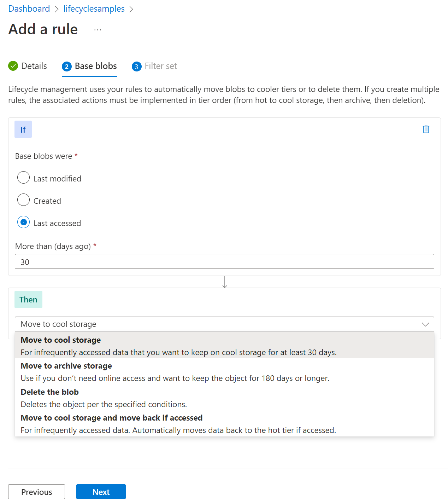  
Azure Storage lifecycle management offers a rule-based policy that you can use to transition blob data to the appropriate access tiers or to expire data at the end of the data lifecycle.  

Storage accounts have a default access tier setting that indicates in which online tier a new blob is created. 
- The default access tier setting can be either hot or cool only. 

The behavior of this setting is slightly different depending on the type of storage account:
- Since the scenario states that your colleagues infrequently access the data, this means that you do not need to store your data in the Hot tier.  
You can park the data in the Cool tier and automatically transition it to Archive using the data lifecycle.

Hence, the correct answers are:
- Create a lifecycle management rule to move the inactive data to the Archive tier after 120 days of inactivity.
- Set the default access tier of the storage account to the Cool tier.

:x: Create an Azure Function to move the inactive data to the archive tier after 120 days of inactivity is incorrect because you can achieve the same goal using lifecycle management. Remember that one of the requirements is minimizing administrative effort.

:x: Set the default access tier of the storage account to the Archive tier is incorrect 
- because the supported default access tiers for storage accounts are Hot and Cool tiers. What you can do is move the data to the cool tier if your data is infrequently accessed and then create a lifecycle policy to transition unmodified data to the Archive tier after a set amount of time.

:x: Manually copy the inactive data using the Copy Blob operation to the archive tier after 120 days of inactivity is incorrect 
- because manually copying the inactive data to the Archive tier is a tedious task if you have thousands of data. One of the requirements states that you must lessen the administrative effort. Use lifecycle management instead.

:x: Automatically archive data on upload is incorrect 
- one of the requirements states that you need your data that is not in the archive tier to be accessible instantly. Data in the Archive tier takes hours before you can access it.  

https://docs.microsoft.com/en-us/azure/storage/common/storage-account-overview

https://docs.microsoft.com/en-us/azure/storage/blobs/lifecycle-management-overview

## Storage Networking & Data Protection

:question: 4-40 

You need to ensure that you satisfy the following requirements:

Requirement 1: 
- Only allow access from the specific public internet IP address of Manila.

Requirement 2: 
- Data accidentally deleted must be recoverable 14 days after deletion.

Which two storage account features should you use to satisfy requirements?
- Requirement 1?  
- Requirement 2?  

:a: : 
Storage Account
  

:one: Under the `networking` tab, you can use IP network rules to allow access from specific public internet IP address ranges by creating IP network rules. 
- Each storage account supports up to 200 rules. 
- These rules grant access to specific internet-based services and on-premises networks and blocks general internet traffic.

:two: Under the `data protection` tab, `soft delete` protects your data from being accidentally or erroneously modified or deleted. 
- When container `soft delete` is **enabled** for a storage account, a container, and its contents may be recovered after it has been deleted within a retention period that you specify.

Therefore, the correct answers are:
- Requirement 1 = Networking
- Requirement 2 = Data protection

:x: Access Control is incorrect 
- because Manila user can already upload images to the tutorialsdojo storage account. 
- Access control or role-based access control (RBAC) helps you manage who has access to Azure resources, what they can do with those resources, and what areas they have access to.

:x: Redundancy is incorrect 
- because you only need to protect data that have been accidentally deleted. Redundancy copies your data so that it is protected from transient hardware failures, network or power outages, and natural disasters.

:x: Object replication is incorrect 
- because this simply copies blobs asynchronously from a source storage account to a destination account. 
- You only need to implement soft delete to satisfy the requirement.

:x: **Lifecycle management** is incorrect 
- because this just allows you to transition your data to the appropriate access tiers or expire at the end of the data’s lifecycle.

https://learn.microsoft.com/en-us/azure/storage/common/storage-network-security

https://learn.microsoft.com/en-us/azure/storage/blobs/soft-delete-container-enable

## :star: RBAC share-level permissions to access File Share

Refer to 4-10

:question: 4-41

You have an Azure subscription that contains an Azure File Share named `TDShare1` that contains sensitive data.

You want to ensure that only authorized users can access this data for compliance requirements, and users must only have access to specific files and folders.

You registered `TDShare1` to use AD DS authentication and Azure AD Connect sync for specific AD user access.

You need to give your active directory users access to `TDShare1`.

**ANS**
Once you've enabled an Active Directory (AD) source for your storage account, you must configure share-level permissions in order to get access to your file share. 


There are two ways you can assign share-level permissions. 
1. You can assign them to specific Azure AD users/groups, and you can assign them to all authenticated identities as a default share-level permission.

Since we are handling sensitive data, we want our users to be able to access files that they are only allowed to. Due to this, we need to assign specific Azure AD users or groups to access Azure file share resources.

In order for share-level permissions to work for specific Azure AD users or groups, you must:

Sync the users and the groups from your local AD to Azure AD using either the on-premises Azure AD Connect sync application or Azure AD Connect cloud sync.
Add AD synced groups to RBAC role so they can access your storage account.

Hence, the correct answer is: Configure role-based access control (RBAC).

:x: Enable anonymous access to the storage account is incorrect 
- as it allows anyone to access the storage account and its contents without authentication.

:x: Create a shared access signature (SAS) with a stored access policy is incorrect 
- because while SAS tokens can provide limited access to a storage account, they are not a suitable authentication mechanism for controlling access to sensitive data.

:x: Use the storage account access keys for authentication is incorrect 
- because storage account keys provide full control over the storage account, which means that anyone with the key can perform any operation on the storage account. 
- This makes them a less secure option, especially for sensitive data that requires fine-grained access control.


https://docs.microsoft.com/en-us/azure/storage/files/storage-files-introduction


[Share-level permissions for specific Microsoft Entra users or groups](https://learn.microsoft.com/en-us/azure/storage/files/storage-files-identity-ad-ds-assign-permissions?tabs=azure-portal#share-level-permissions-for-specific-microsoft-entra-users-or-groups)

[Share-level permissions for all authenticated identities](https://learn.microsoft.com/en-us/azure/storage/files/storage-files-identity-ad-ds-assign-permissions?tabs=azure-portal#share-level-permissions-for-all-authenticated-identities)

## :star: Azure CLI to create storage account

:question: 4-42

You are an Azure administrator responsible for managing storage accounts in your organization. You are asked to create a new Azure File Share with specific requirements using Azure CLI. Below are the requirements:
- Data must still be available if a single availability zone experiences an outage.
- It must provide consistent high performance and low latency.

The command that you intend to run: 
`az storage account create –name TDShare1 –resource-group TD1 –location southeastasia –sku XXXX –kind XXXX`

**ANS**


The requirements in the scenario are:
- Data must still be available if a single availability zone experiences an outage.
- It must provide consistent high performance and low latency.

:memo: Premium File  
Premium file shares are backed by solid-state drives (SSDs) and provide consistent high performance and low latency, within single-digit milliseconds for most IO operations, for IO-intensive workloads. 
- Premium file shares are suitable for a wide variety of workloads like databases, website hosting, and development environments. 
- Premium file shares can be used with both Server Message Block (SMB) and Network File System (NFS) protocols.

Zone redundant storage (ZRS) provides high availability by synchronously writing three replicas of your data across three different Azure Availability Zones, thereby protecting your data from the cluster, data center, or entire zone outage. Zonal redundancy enables you to read and write data even if one of the availability zones is unavailable.

Currently, the SKUs supported for premium file share are `premium_lrs` and `premium_zrs` only.

Therefore, your `–sku` flag should be `Premium_ZRS`, since you need your data to be available even if there is an availability zone outage.
Conversely, your `–kind` flag should be `FileStorage`, as this allows you to deploy premium file shares

https://docs.microsoft.com/en-us/azure/storage/files/storage-files-introduction

https://learn.microsoft.com/en-us/azure/storage/files/storage-files-planning


## :o SAS for external users 

https://learn.microsoft.com/en-us/azure/storage/common/storage-sas-overview

https://learn.microsoft.com/en-us/azure/cognitive-services/translator/document-translation/how-to-guides/create-sas-tokens

:question: 4-49
You have an Azure subscription with a storage account named TD1. 

An external auditor has requested access to TD1 for a duration of 2 weeks.

You need to deploy a solution without compromising the integrity and security of your primary data access methods.

A shared access signature is a token that is appended to the URI for an Azure Storage resource. 

The token that contains a special set of query parameters that indicate how the resources may be accessed by the client. 

One of the query parameters, the signature, is constructed from the SAS parameters and signed with the key that was used to create the SAS. 

This signature is used by Azure Storage to authorize access to the storage resource.

With shared access signature (SAS), you have granular control over how a client can access your data.  
This makes it the ideal solution for this scenario. For example:  
– What resources the client may access.
– What permissions do they have to those resources.
– How long the SAS is valid.

Hence, the correct answer is: Shared Access Signatures (SAS).

:x: Role-Based Access Control (RBAC) is incorrect 
- because this is a system that provides fine-grained access management to Azure resources. By using RBAC, you can assign specific permissions to users, groups, and applications at a certain scope.

:x: Service Endpoints is incorrect 
- because this feature simply provides secure and direct connectivity to Azure service resources from a virtual network. This feature ensures that Azure service traffic remains on the Azure backbone network.

:x: **Connection Strings is incorrect.**
- Connection strings are a way to provide necessary information for applications to connect to various services, including databases or storage accounts. 
- **They typically contain the access keys, which you wouldn’t want to share with an external auditor if you’re trying to avoid sharing the primary or secondary keys.**

---

A shared access signature (SAS) is a URI that grants restricted access rights to Azure Storage resources. 

You can provide a shared access signature to clients who shouldn’t be trusted with your storage account key but who need access to certain storage account resources.


## Storage Container : the maximum number :five: of named access policies

:question: 4-50

You are configuring a blob container’s access policy within an Azure storage account. You want to set multiple named access policies for fine-grained control and flexibility.

What is the maximum number of named access policies you can create for a blob container?


You can set a maximum of `five` access policies on a container, table, queue, or share at a time. 

Each `SignedIdentifier` field, with its unique Id field, corresponds to one access policy. 

**Trying to set more than five access policies at one time causes the service to return status code `400` (Bad Request).**

Hence, the correct answer is: 5.

---

A stored access policy provides an additional level of control over service-level shared access signatures (SASs) on the server side. 

Establishing a stored access policy serves to group shared access signatures and to provide additional restrictions for signatures that are bound by the policy.

With a container access policy, you can grant or revoke permissions for specific operations on blobs, such as `read`, `write`, `delete`, `list`, and more. 

**The key benefit of using a container access policy is that it offers a more targeted and controlled approach to managing access to individual blobs** within the container without the need to modify the storage account’s shared access signature (SAS) settings.

https://learn.microsoft.com/en-us/azure/storage/common/storage-account-overview

https://learn.microsoft.com/en-us/rest/api/storageservices/define-stored-access-policy


## :o Mount an Azure file share in Azure Container Instances 

:memo: Azure Container Instance
- By default, Azure Container Instances are stateless.   
If the container crashes or stops, all of its states are lost.   
- To persist state beyond the lifetime of the container, you must mount a volume from an external store.  

:memo: Azure File Share
- Azure Files offers fully managed file shares hosted in Azure Storage that are accessible via the industry standard Server Message Block (SMB) protocol.


:exclamation: <font color="red">Azure Container (Service) Instances can mount an Azure file share created with Azure Files.</font>
- Using an Azure file share with Azure Container Instances provides file-sharing features similar to using an Azure file share with Azure virtual machines.

:exclamation: Azure Disks or Files are commonly used to provide persistent volumes for 
- Azure Container Instances 
- Azure VMs.  

https://docs.microsoft.com/en-us/azure/container-instances/container-instances-overview

[Mount an Azure file share in Azure Container Instances](https://docs.microsoft.com/en-us/azure/container-instances/container-instances-volume-azure-files)

---

**:question: 3-2:**
Your company has an Azure Subscription that contains an Azure Container named TDContainer.

You are tasked with deploying a new Azure Container Instance that will **run a custom-developed `.NET` application requiring persistent STORAGE for operation.**

:mag: You need to create a Storage Service that will meet the requirements for Azure Container named `TDContainer`.  

**:bell: ANS :**


:o: Azure Files. (mount it in Web Container Instances)  

:x: Azure Queue Storage is incorrect 
- because this service is simply used for storing large numbers of messages to enable communication between components of a distributed application.

:x: Azure Table Storage and Azure Blob Storage are both incorrect
- because **Azure Container Services does not support direct integration of these services.**

## :star::star: AZ image x AzCopy `make` x UNC for blob 

https://docs.microsoft.com/en-us/azure/storage/common/storage-account-overview

https://docs.microsoft.com/en-us/azure/storage/common/storage-ref-azcopy-make


:mag: VHD File x AZ Images
<font color="red">VHD files can be used to create custom images that can be stored in an Azure Blob container</font>, which are used to provision virtual machines.

:mag: AzCopy With Data for Az Container Instance 
AzCopy is a command-line utility that you can use to copy blobs or files to or from a storage account. 
> The `azcopy make` command is commonly used to create a container or a file share.

---

**:question: 3-3**

Your company has an Azure subscription that contains an Azure Storage account named tutorialsdojoaccount.

There is a requirement to **copy a virtual machine image** to a container named `tdimage` from your on-premises datacenter. 

You need to provision an Azure Container instance to host the container image.

1. Which `AzCopy` command should you run?
2. UNC PATH
```bash 
azcopy make "https://[account-name].blob.core.windows.net/[top-level-resource-name]"
```   

**:bell: ANS :**  

Take note that it is mentioned in the scenario that container images and instances are used.
```bash
AzCopy = Make
```
```bash 
https://tutorialsdojoaccount.____.core.windows.net/tdimage = Blob
```


:x: `Copy` is incorrect  
- because it simply copies source data to a destination location.

:x:`Sync` is incorrect  
- because it only replicates the source location to the destination location.

:x: `File` is incorrect  
- because when you execute this command, it will create a file share.  

:x: `Table` is incorrect  
- because this is just a NoSQL data store that accepts authenticated calls from inside and outside the Azure cloud which allows you to store large amounts of **structured** data.

:x: `Queue` is incorrect  
- Because this simply **provides cloud messaging between application components that allows you to decouple your applications so that they can scale independently.**

---

:memo: `AzCopy`  
- `AzCopy` is a command-line utility that you can use to copy blobs or files to or from a storage account.

:memo: `AzCopy make`
- **The `AzCopy make` command is commonly used to `create` a container or a file share.**    


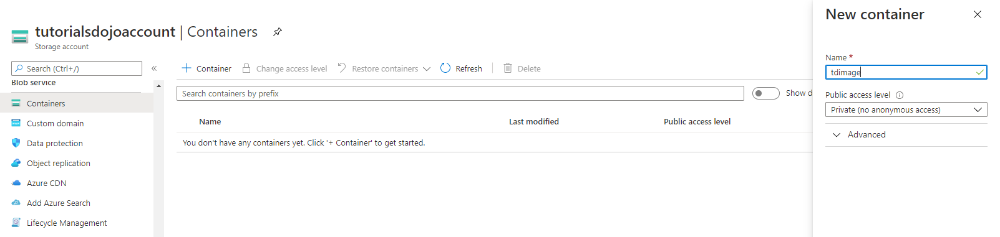

:memo: Storage Container   
- A container organizes a set of blobs, similar to a directory in a file system.     
- **A storage account can include an unlimited number of containers, and a container can store an unlimited number of blobs.**     

:memo: Blob Storage
- Blob storage is optimized **for storing massive amounts** of unstructured data.
- **Unstructured data** is data that doesn’t adhere to a particular data model or definition, such as text or binary data.   

:memo: Blob storage is designed for:  
- Serving 
`images or documents directly to a browser`.
- Storing 
`files for distributed access`.
- Storing data   
for `backup and restore` disaster recovery, and archiving.
- Storing data   
for `analysis` by an on-premises or Azure-hosted service.  
- Streaming Media 
`video and audio`.
- Writing   
to `log` files.

## UNC path for File Share

https://docs.microsoft.com/en-us/azure/storage/files/storage-files-introduction

https://docs.microsoft.com/en-us/azure/storage/files/storage-how-to-use-files-windows

:question: 3-1

Your company has an existing subscription in Azure.

You provisioned an Azure Storage account named `TutorialsDojoAccount` and then created a file share named `TDShare`.

You need to create a script that will allow you to connect to your file share.

What is the UNC path of the file share?  
```bash 
\\TutorialsDojoAccount.TDShare\file.core.windows.net
\\TutorialsDojoAccount.file.core.windows.net\TDShare
\\TDShare.file.core.windows.net\TutorialsDojoAccount
\\file.core.windows.net.TutorialsDojoAccount\TDShare
```

:a: :

In order to use an Azure file share outside of the Azure region it is hosted in, such as on-premises or in a different Azure region, the OS must support `SMB 3.0.` 

You can use Azure file shares on a Windows installation that is running either in an Azure VM or on-premises.

```bash 
\\<storageAccountName>.file.core.windows.net\<File Share Name>
```

:o: Hence, the correct answer is: `\\TutorialsDojoAccount.file.core.windows.net\TDShare`


## :star2: Usage Azure Import/Export

Azure Import/Export service is used to securely import large amounts of data to Azure Blob storage and Azure Files by shipping disk drives to an Azure datacenter. 

:memo: Target
This service can also be used to transfer data from Azure Blob storage to disk drives and ship to your on-premises sites. 

:memo: Source
Data from one or more disk drives can be imported either to Azure Blob storage or Azure Files.

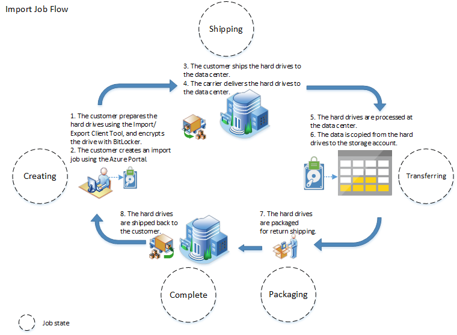

https://docs.microsoft.com/en-us/azure/storage/common/storage-import-export-service

https://docs.microsoft.com/en-us/azure/storage/common/storage-import-export-requirements

---

:question: 4-33

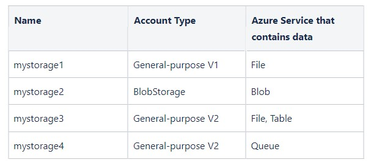

There is a requirement to export the data from your subscription using the Azure Import/Export service
Which Azure Storage account can you use to export the data?

- mystorage1
- mystorage2
- mystorage4
- mystorage3

:a: :

Azure Import/Export service allows data transfer into Azure Blobs and Azure Files by creating jobs. 

Use the Azure portal or Azure Resource Manager REST API to create jobs.

Each job is associated with a single storage account. 

This service only supports export of Azure Blobs. Export of Azure files is not supported.

The jobs can be import or export jobs. 
- An import job allows you to import data into Azure Blobs or Azure files, whereas the export job allows data to be exported from Azure Blobs. For an import job, you ship drives containing your data. 
- When you create an export job, you ship empty drives to an Azure datacenter. In each case, you can ship up to 10 disk drives per job.

Hence, the correct answer is: `mystorage2`.

:x: mystorage1 is incorrect 
- because an export job does not support Azure Files. 
- The Azure Import/Export service only supports export of Azure Blobs.

:x: mystorage3 and mystorage4 are incorrect 
- because the Queue and Table storage services are simply not supported by the Azure Import/Export service.

## Actions of AZ Import/Export Service


---

:question: 4-34

You have an on-premises data center that contains a file server named `TDFileServer1` which has 20 TB of data.

You created an Azure subscription and an Azure file share named `TDFile1`.

There is a requirement to transfer 20 TB of data to `TDFile1` using the Azure Import/Export service.

In which order should you perform the actions?
- You prepare the external disks by attaching it to FileServer1 and run the WAImportExport.exe tool.
- You create an import job in the Azure portal.
- You ship the external disks to the Azure Datacenter.
- You update the import job in the Azure portal.

:a: :

To import data, the service requires you to ship supported disk drives containing your data to an Azure datacenter.

:memo: `WAImportExport.exe`
Microsoft Azure WAImportExport.exe tool is the drive preparation and repair tool that you can use with the Microsoft Azure Import/Export Service. 

This tool can be used in several different ways:
- Before you create an Import job, you can use this tool to copy data to the hard drives you are going to ship to a Microsoft Azure data center.  
- After an import job has finished, you can use this tool to repair any blobs that were corrupted, missing, or conflicted with other blobs.  
- After you receive the drives from an export job, you can use this tool to repair any files that were corrupted or missing on the drives. 

The journal file stores basic information such as drive serial number, encryption key, and storage account details.

You can import the contents of FileServer1 using the following steps in order:

1. Prepare the drives and run the WAImportExport.exe tool.

– Attach the external disk to FileServer1 and run WAImportExport.exe. Each time you run the WAImportExport tool to copy files to the hard drive, the tool creates a copy session. The state of the copy session is written to the journal file.

2. You create an import job in the Azure portal.

– You must specify the following for an import job: name of the import job, type of job (import from azure or export from azure) subscription, resource group, journal file, the storage account for import destination, and the return shipping info.

3. You ship the external disks to the Azure Datacenter.

– FedEx, UPS, or DHL can be used to ship the package to Azure datacenter. You must ensure that you properly package your disks to avoid potential damage and delays in processing.

4. You update the import job in the Azure portal.

– You need to update job status and tracking info once drives are shipped and mark the checkbox against Mark as Shipped. You then provide the carrier and tracking number. If the tracking number is not updated within 2 weeks of creating the job, the job expires.

Hence, the correct order of deployment are:

1. You prepare the external disks by attaching it to FileServer1 and run the WAImportExport.exe tool.
2. You create an import job in the Azure portal.
3. You ship the external disks to the Azure Datacenter.
4. You update the import job in the Azure portal.

References: 

https://docs.microsoft.com/en-us/azure/import-export/storage-import-export-service

https://docs.microsoft.com/en-us/azure/import-export/storage-import-export-data-to-files

## :star::star: Configure Whitelist in Azure Storage firewalls 

:question: 4-35

Your company has an Azure subscription that contains a storage account named `tdstorageaccount1` and a virtual network named `TDVNET1` with an address space of `192.168.0.0/16`.

You have a user that needs to connect to the storage account from her workstation which has a public IP address of `131.107.1.23`.   

You need to ensure that the user is the only one who can access `tdstorageaccount1`.  

Which two actions should you perform ? 
- Add the `131.107.1.23` IP address under Firewalls and virtual networks blade of `tdstorageaccount1`.
- From the networking settings, select service endpoint under Firewalls and virtual networks.  
- From the networking settings, enable `TDVnet1` under Firewalls and virtual networks.  
- Set the Allow access from field to Selected networks under the Firewalls and virtual networks blade of `tdstorageaccount1`.
- From the networking settings, select "Allow trusted Microsoft services to access this storage account" under Firewalls and virtual networks.

:a: :

> You must know how to configure firewall and VNet for secure you storage account endpoint access.  

:mag: NSG secure rule 
To secure your storage account, you should first configure a rule to deny access to traffic from all networks (including Internet traffic) on the public endpoint, by default.   
Then, you should configure rules that grant access to traffic from specific VNets.  


:mag: Whitelist a public IP Address
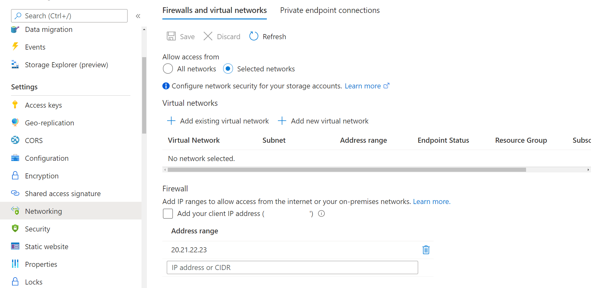  
You can also configure rules to grant access to traffic from selected public Internet IP address ranges, enabling connections from specific Internet or on-premises clients.  
:m: This configuration enables you to build a secure network boundary for your applications. To whitelist a public IP address, you must:
1. Go to the storage account you want to secure.
2. Select on the `settings` menu called `Networking`.
3. Under `Firewalls and virtual networks`, select `Selected networks`.
4. Under `firewall`, add the public IP address then save.  

Hence, the following statements are correct:
- Set the Allow access from field to `Selected networks under the Firewalls` and virtual networks blade of `tdstorageaccount1`.
- Add the `131.107.1.23` IP address under `Firewalls and virtual networks` blade of `tdstorageaccount1`.  

:x: From the networking settings, add TDVnet1 under Firewalls and virtual networks is incorrect 
- because adding TDVnet1 will not allow the user to connect to tdstorageaccount1. The requirement states that the workstation of the user must have access to tdstorageaccount1. 
- The TDVnet1 virtual network doesn’t share the same network setting with tdstorageaccount1.

:x: From the networking settings, select service endpoint under Firewalls and virtual networks is incorrect 
- because it only allows you to create network rules that allow traffic only from selected VNets and subnets, which creates a secure network boundary for their data. Service endpoints only extend your VNet private address space and identity to the Azure services, over a direct connection.

:x: From the networking settings, select `Allow trusted Microsoft services to access this storage account` under `Firewalls and virtual networks` is incorrect 
- because this simply grants a subset of trusted Azure services access to the storage account, while maintaining network rules for other apps. 
- These trusted services will then use strong authentication to securely connect to your storage account but won’t restrict access to a particular subnetwork or IP address.

References: 

https://docs.microsoft.com/en-us/azure/storage/blobs/storage-blobs-overview

https://docs.microsoft.com/en-us/azure/storage/common/storage-network-security

## :star2: How to use Azure Site Recovery for a VM

:exclamation: Azure Site Recovery service contributes to your business continuity and disaster recovery (BCDR) strategy by keeping your business applications online during planned and unplanned outages. 

:exclamation: **Site Recovery manages and orchestrates disaster recovery of on-premises machines and Azure virtual machines (VM)**, including `replication`, `failover`, and `recovery`.

:link: https://learn.microsoft.com/en-us/azure/site-recovery/site-recovery-overview

:link: https://learn.microsoft.com/en-us/azure/site-recovery/azure-to-azure-quickstart

---

:question: 4-45

Your company is currently running a mission-critical application in a primary Azure region.

You plan to implement a disaster recovery by configuring failover to a secondary region using Azure Site Recovery.  

What should you do ?
- Create an Azure Traffic Manager profile to load-balance traffic between the primary and secondary regions, install and configure the Azure Site Recovery agent on the VMs, and design a replication policy to replicate the data to the secondary region.
- Create an RSV in the primary region, install and configure the Azure Site Recovery agent on the VMs, and design a replication policy to replicate the data to the secondary region.
- Create an RSV in the secondary region, install and configure the Azure Site Recovery agent on the VMs, and design a recovery plan to orchestrate failover and failback operations.
- Create a virtual network and subnet in the secondary region, install and configure the Azure Site Recovery agent on the VMs, and design a recovery plan to orchestrate failover and failback operations.

:a: : 

Select `Virtual Machine#Resource | Operations | Disaster Recovery` :arrow_down:

Enabling replication for a virtual machine (VM) for disaster recovery purposes involves 
- `[Installing]` the **Site Recovery Mobility service extension** on the VM 
- `[Registering]` Site Recovery Mobility service extension with Azure Site Recovery. 
- `[Replicate]` During replication, any disk writes from the VM are first sent to a cache storage account in the source region.   
Subsequently, the data is transferred to the target region, where `recovery points` are generated from it.   
- `[Failover]` During a disaster recovery failover of the VM, a recovery point is used to restore the VM in the target region.  

:mag: Here's how to set up disaster recovery for a VM with Azure Site Recovery:
- `[REV Replication Setup]`First, you need to create a Recovery Services Vault (RSV) in the secondary region, which will serve as the target location for the VM during a failover.
- `[Select VM to Replicate (Configure a Agent on VM)]`Next, you need to install and **configure the Azure Site Recovery agent on the VMs** that you want to protect.  
The agent captures data changes on the VM disks and sends them to Azure Site Recovery for replication to the secondary region.
- `[Design Recovery Plan]`Once the replication is set up, you need to design a recovery plan that outlines the steps to orchestrate the `failover` and `failback` operations.  
This includes :arrow_down:
    1. defining the order in which VMs should be failed over, 
    2. any dependencies between VMs, 
    3. and the desired recovery point objective (RPO) 
    4. and recovery time objective (RTO) for each VM.


:memo: Replication
`[disk writes -> cache in source region -> target region -> generate recovery points]` During replication, VM disk writes are sent to a cache storage account in the source region, and from there to the target region, where recovery points are generated from the data. 

:memo: Apply a recovery point
`[What recovery points are used]` **In the event of a disaster or planned failover, a recovery point is used to restore the VM in the target region, allowing the business to continue operations without significant downtime or data loss**.

:o: Hence, the correct answer is: 
- Create an RSV in the secondary region, 
- install and configure the Azure Site Recovery agent on the VMs, and design a recovery plan to orchestrate `failover` and `failback` operations.

:x: Create an RSV in the primary region, install and configure the Azure Site Recovery agent on the VMs, and design a replication policy to replicate the data to the secondary region is incorrect 
- because although this will replicate the data to the secondary region, it does not include the necessary steps to perform failover. You still need to create a Recovery Services vault in the secondary region, not the primary region, to perform failover.

:x: Create a virtual network and subnet in the secondary region, install and configure the Azure Site Recovery agent on the VMs, and design a recovery plan to orchestrate failover and failback operations is incorrect 
- because, just like the other options, you will still need to create a Recovery Services vault in the secondary region, install and configure the Azure Site Recovery agent on the virtual machines, and create a recovery plan to orchestrate failover and failback operations.

:x: Create an Azure Traffic Manager profile to load-balance traffic between the primary and secondary regions, install and configure the Azure Site Recovery agent on the VMs, and design a replication policy to replicate the data to the secondary region is incorrect 
- because this will just load-balance traffic between the primary and secondary regions but won’t be able to perform failover. You will still need to create a Recovery Services vault in the secondary region to perform failover.
