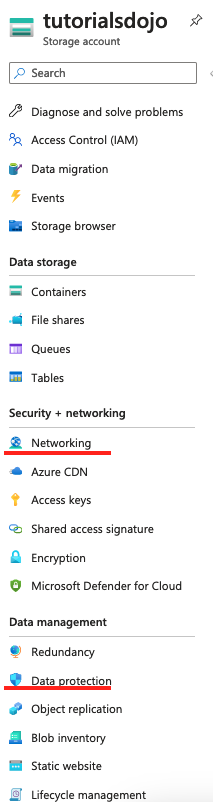

## Access Tiers & Replication Strategies

Two concept to know 
1. Access Tiers
2. Replication Strategies

Access Tiers
Hot
- Optimized for storing data that is accessed frequently.

Cool 
- Optimized for storing data that is infrequently accessed and stored for at least `30` days.

Archive
- Optimized for storing data that is rarely accessed and stored for at least `30*6` days with flexible latency requirements on the order of hours.

Storage Account Type for Copies Of Data

---

**Q 3-:**

:x: `Account Kind` is incorrect 
- because it simply offers several types of storage accounts, such as StorageV2, Storage, and BlobStorage. 
- Each type supports different features and has its own pricing model.

:x: `Versioning` is incorrect 
- Because this feature is for automatically maintaining the previous versions of an object. 
- **When `blob versioning` is enabled, you can restore an earlier version of a blob to recover your data if it is erroneously modified or deleted.**

:x: `Performance` is incorrect 
- because this tiering system is primarily used for determining the speed capability of your storage account. 
- There are two types of performance tiers:    
  1. `Standard` :arrow_right: optimized for high capacity/throughput, 
  2. `Premium`  :arrow_right: `optimized for high transaction rates and single-digit consistent storage latency`.

## Replication Strategies & Regions

https://docs.microsoft.com/en-us/azure/storage/common/storage-account-overview

Locally redundant storage (LRS) 
1. copies your data synchronously three times within a single physical location in the primary region. 
2. LRS is the least expensive replication option but is not recommended for applications requiring high availability.

Zone-redundant storage (ZRS) 
1. copies your data synchronously across three Azure availability zones in the primary region. 
2. For applications requiring high availability.

Geo-redundant storage (GRS) 
1. copies your data `synchronously` three times within a single physical location in the primary region using LRS.   
It then copies your data `asynchronously` to a single physical location in a secondary region **that is hundreds of miles away from the primary region**.

Geo-zone-redundant storage (GZRS) 
1. copies your data `synchronously` across three Azure availability zones in the primary region using ZRS.   
It then copies your data `asynchronously` to a single physical location in the secondary region.

---

**Q 4-5**
Your company plans to store media assets in two Azure regions.

Requirements
- Media assets must be stored in multiple availability zones
- Media assets must be stored in multiple regions
- Media assets must be readable in the primary and secondary regions.

**ANS :**

With Geo-redundant storage, your media assets are stored in multiple availability zones and multiple regions. 
**But read access will only be available in the secondary region if you or Microsoft initiates a failover from the primary region to the secondary region.**

In order to have read access in the primary and secondary region at all times without having the need to initiate a failover, you need to recommend **Read-access geo-redundant storage**.

## Rehydrate a blob data in archive tier

To work with the data of in an archived blob, you must rehydrate it by moving it to an online tier (either the hot or cool tier).

:bell: Rehydrate a blob data : the process of restoring an archived blob to an online tier and can take hours to complete.

Archive Tier:
- data that is considered offline and cannot be read or modified

The blob metadata remains online and available, allowing you to list the blob and its properties.   
Reading and modifying blob data is only available with online tiers such as hot or cool.  

Rehydration Options
1. Copy an archived blob to an online tier: You can rehydrate an archived blob by copying it to a new blob in the hot or cool tier using the Copy Blob operation.   
**This is the recommended option for most scenarios.**
2. Change an archived blob’s access tier:   
You can also rehydrate an archived blob by changing its access tier directly using the Set Blob Tier operation.

Rehydration Priority:
:red_circle: High-priority rehydration costs more but is faster. Reserve it for emergency data restoration situations.

- Standard priority: Processed in the order received, may take up to 15 hours for objects under 10 GB.
- High priority: Prioritized over standard requests, may complete in less than one hour for objects under 10 GB.

:red_circle: A rehydration operation with Set Blob Tier is billed for data read transactions and data retrieval size. 
:red_circle: High-priority rehydration shows up as a separate line item on your bill.

---

:a: The statement that says:   
You can rehydrate a blob data in archive tier without costs is :x:. 
- You are billed for data read transactions and data retrieval size (per GB).

:a: The statement that says:  
You can rehydrate a blob data in archive tier instantly is :x:  
- Rehydrating a blob from the Archive tier can take several hours to complete.

:a: The statement that says: 
You can access your blob data that is in archive tier is :x:  
- because blob data stored in the archive tier is considered to be offline and can’t be read or modified.

## File Share with On-premise and Cloud

https://docs.microsoft.com/en-us/azure/storage/files/storage-files-introduction

https://docs.microsoft.com/en-us/azure/storage/files/storage-files-identity-auth-active-directory-enable

Azure Files SMB file shares are accessible from Windows, Linux, and macOS clients. 

Azure Files NFS file shares are accessible from Linux or macOS clients.

Azure Files SMB file shares can be cached on Windows Servers with Azure File Sync for fast access near where the data is being used.

--- 

**Q 4-10**
You have an Azure subscription named `Davao-Subscription` that contains an Azure Files named `Baguio-Share`.

You have several Azure virtual machine that is domain joined to an on-premises Active Directory domain controller and a site-to-site VPN connection for cross-premises connectivity.

There is a requirement to replace your on-premises file server with Baguio-Share.   
Your domain-joined machines must be able to mount Baguio-Share using your active directory credentials.  

Which four actions should you perform in sequence?

Enabling AD DS authentication for your Azure file shares allows you to authenticate to your Azure file shares with your on-prem AD DS credentials. Further, it allows you to better manage your permissions to allow granular access control.

To enable AD DS authentication, you must do the following in sequence:

1. Sync on-premises AD with Azure AD Connect

– Identities used for access must be synced to Azure AD. Only hybrid users that exist in both on-premises AD DS and Azure AD can be authenticated and authorized for Azure file share access.

2. Enable AD DS authentication

– To enable AD DS authentication over SMB for Azure file shares, you need to register your storage account with AD DS and then set the required domain properties on the storage account.

– You can think of this process as if it were like creating an account representing an on-premises Windows file server in your AD DS.

3. Assign share and directory permissions

– After enabling AD DS authentication, you must configure share-level permissions in order to get access to your file shares. The Azure RBAC share-level permissions act as a high-level gatekeeper that determines whether a user can access the share.

– With directory permissions, you can configure proper Windows ACLs at the root, directory, or file level, to take advantage of granular access control.

4. Mount file share with AD credentials

## Delete Resource Group with RSV

In order to delete the resource group, you must first delete/remove the following:

1. Resource Lock
If the lock level is set to Delete or Read-only, the users in your organization are prevented from accidentally deleting or modifying critical resources. The lock overrides any permissions the user might have.

2. Backup data in Recovery Services vault
If you try to delete a vault that contains backup data, you’ll encounter a message: “Vault cannot be deleted as there are existing resources within the vault. Please ensure there are no backup items, protected servers, or backup management servers associated with this vault.”

After you deleted the lock and backup data, you can now delete the resource group.

Hence, the correct answer is: Delete all the resource lock and backup data in RSV resource.

:x: Stop TD-VM and delete the resource lock of TD-VNET is incorrect 
- because you must also delete the backup data of TD-RSV to delete the resource group. Take note that you can’t delete a vault that contains backup data.

## 

There is a compliance requirement where in the data in TD1 and TD2 must be available if a single availability zone in a region fails. 

The solution must minimize costs and administrative effort.

**ANS**
Upgrade TD1 and TD2 to general-purpose v2

## 

You need to ensure that you satisfy the following requirements:

Requirement 1: 
- Only allow access from the specific public internet IP address of Manila.

Requirement 2: 
- Data accidentally deleted must be recoverable 14 days after deletion.

Which two storage account features should you use to satisfy requirements?

**ANS**
Storage Account

Under the networking tab, you can use IP network rules to allow access from specific public internet IP address ranges by creating IP network rules. Each storage account supports up to 200 rules. These rules grant access to specific internet-based services and on-premises networks and blocks general internet traffic.

You can use IP network rules to allow access from specific public internet IP address ranges by creating IP network rules. Each storage account supports up to 200 rules. These rules grant access to specific internet-based services and on-premises networks and blocks general internet traffic.

Under the data protection tab, soft delete protects your data from being accidentally or erroneously modified or deleted. When container soft delete is enabled for a storage account, a container, and its contents may be recovered after it has been deleted within a retention period that you specify.

Therefore, the correct answers are:

– Requirement 1 = Networking

– Requirement 2 = Data protection

Access Control is incorrect because Manila user can already upload images to the tutorialsdojo storage account. Access control or role-based access control (RBAC) helps you manage who has access to Azure resources, what they can do with those resources, and what areas they have access to.

Redundancy is incorrect because you only need to protect data that have been accidentally deleted. Redundancy copies your data so that it is protected from transient hardware failures, network or power outages, and natural disasters.

Object replication is incorrect because this simply copies blobs asynchronously from a source storage account to a destination account. You only need to implement soft delete to satisfy the requirement.

Lifecycle management is incorrect because this just allows you to transition your data to the appropriate access tiers or expire at the end of the data’s lifecycle.

---

https://learn.microsoft.com/en-us/azure/storage/common/storage-network-security

https://learn.microsoft.com/en-us/azure/storage/blobs/soft-delete-container-enable

## RBAC with File Share

**Q 4-41**
You have an Azure subscription that contains an Azure File Share named `TDShare1` that contains sensitive data.

You want to ensure that only authorized users can access this data for compliance requirements, and users must only have access to specific files and folders.

You registered `TDShare1` to use AD DS authentication and Azure AD Connect sync for specific AD user access.

You need to give your active directory users access to `TDShare1`.

**ANS**
Once you’ve enabled an Active Directory (AD) source for your storage account, you must configure share-level permissions in order to get access to your file share. There are two ways you can assign share-level permissions. You can assign them to specific Azure AD users/groups, and you can assign them to all authenticated identities as a default share-level permission.

Since we are handling sensitive data, we want our users to be able to access files that they are only allowed to. Due to this, we need to assign specific Azure AD users or groups to access Azure file share resources.

In order for share-level permissions to work for specific Azure AD users or groups, you must:

Sync the users and the groups from your local AD to Azure AD using either the on-premises Azure AD Connect sync application or Azure AD Connect cloud sync.
Add AD synced groups to RBAC role so they can access your storage account.
Hence, the correct answer is: Configure role-based access control (RBAC).

The option that says: Enable anonymous access to the storage account is incorrect as it allows anyone to access the storage account and its contents without authentication.

The option that says: Create a shared access signature (SAS) with a stored access policy is incorrect because while SAS tokens can provide limited access to a storage account, they are not a suitable authentication mechanism for controlling access to sensitive data.

The option that says: Use the storage account access keys for authentication is incorrect because storage account keys provide full control over the storage account, which means that anyone with the key can perform any operation on the storage account. This makes them a less secure option, especially for sensitive data that requires fine-grained access control.

https://docs.microsoft.com/en-us/azure/storage/files/storage-files-introduction

https://learn.microsoft.com/en-us/azure/storage/files/storage-files-identity-ad-ds-assign-permissions

## 

You are an Azure administrator responsible for managing storage accounts in your organization. You are asked to create a new Azure File Share with specific requirements using Azure CLI. Below are the requirements:
- Data must still be available if a single availability zone experiences an outage.
- It must provide consistent high performance and low latency.

The command that you intend to run: 
`az storage account create –name TDShare1 –resource-group TD1 –location southeastasia –sku XXXX –kind XXXX`

**ANS**

The requirements in the scenario are:

– Data must still be available if a single availability zone experiences an outage.

– It must provide consistent high performance and low latency.

Premium file shares are backed by solid-state drives (SSDs) and provide consistent high performance and low latency, within single-digit milliseconds for most IO operations, for IO-intensive workloads. Premium file shares are suitable for a wide variety of workloads like databases, website hosting, and development environments. Premium file shares can be used with both Server Message Block (SMB) and Network File System (NFS) protocols.

Zone redundant storage (ZRS) provides high availability by synchronously writing three replicas of your data across three different Azure Availability Zones, thereby protecting your data from the cluster, data center, or entire zone outage. Zonal redundancy enables you to read and write data even if one of the availability zones is unavailable.

Currently, the SKUs supported for premium file share are premium_lrs and premium_zrs only.

Therefore, your –sku flag should be Premium_ZRS, since you need your data to be available even if there is an availability zone outage.

Conversely, your –kind flag should be FileStorage, as this allows you to deploy premium file shares

https://docs.microsoft.com/en-us/azure/storage/files/storage-files-introduction

https://learn.microsoft.com/en-us/azure/storage/files/storage-files-planning

## SAS for external users 

https://learn.microsoft.com/en-us/azure/storage/common/storage-sas-overview

https://learn.microsoft.com/en-us/azure/cognitive-services/translator/document-translation/how-to-guides/create-sas-tokens

**Q :**
You have an Azure subscription with a storage account named TD1. An external auditor has requested access to TD1 for a duration of 2 weeks.

You need to deploy a solution without compromising the integrity and security of your primary data access methods.

A shared access signature is a token that is appended to the URI for an Azure Storage resource. The token that contains a special set of query parameters that indicate how the resources may be accessed by the client. One of the query parameters, the signature, is constructed from the SAS parameters and signed with the key that was used to create the SAS. This signature is used by Azure Storage to authorize access to the storage resource.

With shared access signature (SAS), you have granular control over how a client can access your data. This makes it the ideal solution for this scenario. For example:
– What resources the client may access.
– What permissions do they have to those resources.
– How long the SAS is valid.

Hence, the correct answer is: Shared Access Signatures (SAS).

Role-Based Access Control (RBAC) is incorrect because this is a system that provides fine-grained access management to Azure resources. By using RBAC, you can assign specific permissions to users, groups, and applications at a certain scope.

Service Endpoints is incorrect because this feature simply provides secure and direct connectivity to Azure service resources from a virtual network. This feature ensures that Azure service traffic remains on the Azure backbone network.

Connection Strings is incorrect. Connection strings are a way to provide necessary information for applications to connect to various services, including databases or storage accounts. They typically contain the access keys, which you wouldn’t want to share with an external auditor if you’re trying to avoid sharing the primary or secondary keys.

---

A shared access signature (SAS) is a URI that grants restricted access rights to Azure Storage resources. You can provide a shared access signature to clients who shouldn’t be trusted with your storage account key but who need access to certain storage account resources.

## the maximum number of named access policies

You are configuring a blob container’s access policy within an Azure storage account. You want to set multiple named access policies for fine-grained control and flexibility.

What is the maximum number of named access policies you can create for a blob container?

You can set a maximum of five access policies on a container, table, queue, or share at a time. Each SignedIdentifier field, with its unique Id field, corresponds to one access policy. Trying to set more than five access policies at one time causes the service to return status code 400 (Bad Request).

Hence, the correct answer is: 5.

---

A stored access policy provides an additional level of control over service-level shared access signatures (SASs) on the server side. Establishing a stored access policy serves to group shared access signatures and to provide additional restrictions for signatures that are bound by the policy.

With a container access policy, you can grant or revoke permissions for specific operations on blobs, such as read, write, delete, list, and more. The key benefit of using a container access policy is that it offers a more targeted and controlled approach to managing access to individual blobs within the container without the need to modify the storage account’s shared access signature (SAS) settings.

https://learn.microsoft.com/en-us/azure/storage/common/storage-account-overview

https://learn.microsoft.com/en-us/rest/api/storageservices/define-stored-access-policy

## Persist data in container instance to Azure Storage 

**:question: Q 3-:**

You are tasked with deploying a new Azure Container Instance that will **run a custom-developed `.NET` application requiring persistent STORAGE for operation.**

:mag: You need to create a Storage Service that will meet the requirements for Azure Container named `TDContainer`.  

**:bell: ANS :**

:o: Azure Files. (mount an azure file share)  

:x: Azure Queue Storage is incorrect 
- because this service is simply used for storing large numbers of messages to enable communication between components of a distributed application.

:x: Azure Table Storage and Azure Blob Storage are both incorrect
- because **Azure Container Services does not support direct integration of these services.**

---

:memo: Azure Container Instance
- By default, Azure Container Instances are stateless.   
If the container crashes or stops, all of its states are lost.   
- To persist state beyond the lifetime of the container, you must mount a volume from an external store.  

:memo: Azure File Share
- Azure Files offers fully managed file shares hosted in Azure Storage that are accessible via the industry standard Server Message Block (SMB) protocol.

:exclamation: Azure Container (Service) Instances can mount an Azure file share created with Azure Files.
- Using an Azure file share with Azure Container Instances provides file-sharing features similar to using an Azure file share with Azure virtual machines.

:exclamation: Azure Disks or Files are commonly used to provide persistent volumes for 
- Azure Container Instances 
- Azure VMs.  

## AzCopy make & Container & File Share

**Q :**
There is a requirement to **copy a virtual machine image** to a container named tdimage from your on-premises datacenter. 

You need to provision an Azure Container instance to host the container image.
1. Which `AzCopy` command should you run?
2. Azure Blob storage is Microsoft’s object storage solution for the cloud. 

:m: Take note that it is mentioned in the scenario that container images and instances are used.

**:bell: ANS :**  

:o: `azcopy make "https://[account-name].blob.core.windows.net/[top-level-resource-name]"`   

:x: `Copy` is incorrect  
- because it simply copies source data to a destination location.

:x:`Sync` is incorrect  
- because it only replicates the source location to the destination location.

:x: `File` is incorrect  
- because when you execute this command, it will create a file share.  

:x: `Table` is incorrect  
- because this is just a NoSQL data store that accepts authenticated calls from inside and outside the Azure cloud which allows you to store large amounts of **structured** data.

:x: `Queue` is incorrect  
- because this simply **provides cloud messaging between application components that allows you to decouple your applications so that they can scale independently.**

---

:memo: `AzCopy`  
- `AzCopy` is a command-line utility that you can use to copy blobs or files to or from a storage account.

:memo: `AzCopy make`
- **The `AzCopy make` command is commonly used to create a container or a file share.**    

:memo: Storage Container   
- A container organizes a set of blobs, similar to a directory in a file system.     
- **A storage account can include an unlimited number of containers, and a container can store an unlimited number of blobs.**     

:memo: Blob Storage
- Blob storage is optimized **for storing massive amounts** of unstructured data.
- **Unstructured data** is data that doesn’t adhere to a particular data model or definition, such as text or binary data.   

:memo: Blob storage is designed for:  
- Serving 
`images or documents directly to a browser`.
- Storing 
`files for distributed access`.
- Storing data   
for `backup and restore` disaster recovery, and archiving.
- Storing data   
for `analysis` by an on-premises or Azure-hosted service.  
- Streaming Media 
`video and audio`.
- Writing   
to `log` files.

:memo: VHD Files for VMs
- **VHD files can be used to create custom IMAGE that can be stored in an Azure Blob container**, which are used to provision VMs.   

