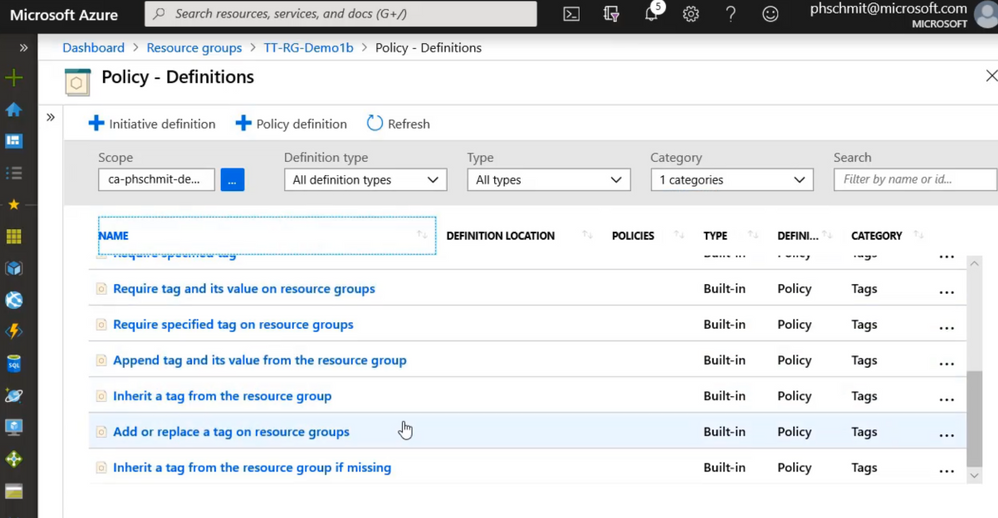

# VNet


:question: **Q 3-29:** 
Your company has 12 peered virtual networks in your Azure subscription.

You plan to deploy a network security group for each virtual network.

There is a compliance requirement that port 80 should be automatically blocked between virtual networks whenever a new network security group is created. 
- The solution must minimize administrative effort.

:bell: **ANS :**

It is stated in the scenario that **blocking port 80 should be done automatically whenever a new network security group is created.** 

By creating a rule manually, it becomes quite cumbersome to configure as you need to create a security rule for every network security group you create. 


It’s best practice to always automate your security processes to avoid administrative overhead. :arrow_down:
- **You should use a custom policy definition in order to automate the requirement.**  

 

:memo: Custom Policy Def
- Azure Policy has a list of built-in policy definitions, but if you need something more specific, you can create your own by creating a custom policy definition that will allow your organization to meet its compliance requirements.
- A custom policy definition allows customers to define their own rules for using Azure. 
- These rules often enforce:
  - Security practices
  - Cost management
  - Organization-specific rules (like naming or locations)


:x: Configure the network security group (NSG) flow log to automatically block port 80.
- <font color="red"> NSG flow logs are only used to monitor traffic that is allowed or denied by a network security group.</font>


- **Network security group (NSG) flow logs are a feature of Azure Network Watcher** that allows you to log the source and destination IP address, port, protocol, and whether traffic was allowed or denied by an NSG. 
- Flow data is sent to Azure Storage accounts from where you can access it as well as export it to any visualization tool, SIEM, or IDS of your choice.


## Associate a public IP address to a SKU of Standard Public Load Balancer

:link: https://docs.microsoft.com/en-us/azure/virtual-network/ip-services/public-ip-addresses

:link: https://docs.microsoft.com/en-us/azure/virtual-network/ip-services/configure-public-ip-load-balancer

A public IP associated with a load balancer serves as an Internet-facing frontend IP configuration.   
- The frontend is used to access resources in the backend pool. (Internet -> Resource)
- The frontend IP can be used for members of the backend pool to egress to the Internet. (Resource -> Internet)

Remember that 
1. The SKU of a load balancer and the SKU of a public IP address SKU must match
2. You can only create a standard public IP address with an assignment of static

:question: **Q 4-3:**


You need to associate a public IP address to a public Azure load balancer with an SKU of standard.


**ANS :**

:o: TD3.  

:x: TD1 and TD1 and TD2 are incorrect 
- because both public IP addresses have an SKU of basic. 
- You must provision a public IP address with a SKU of standard so you can associate it with a standard public load balancer.

:x: TD3 and TD4 is incorrect 
- **because you can only create a standard public IP address with an assignment of static**.

## Network Interface usage

:m: Learning : 
**A virtual machine, virtual network and network interface must be in the same region or location.**

**Q 4-9**
Tutorials Dojo has a subscription named `TDSub1` that contains the following resources:


`TDVM1` needs to connect to a newly created virtual network named `TDNET1` that is located in Japan West.

What should you do to connect `TDVM1` to `TDNET1`?

:x: Solution: You create a network interface in TD1 in the South East Asia region.

:o: Solution : Redeploy TDVM1 to the Japan West region and create and attach a network interface in the Japan West Region.

---

A network interface enables an Azure Virtual Machine to communicate with internet, Azure, and on-premises resources. 

When creating a virtual machine using the Azure portal, the portal creates one network interface with default settings for you.

:star2: what you may do with interface setup 
- **You may instead choose to create network interfaces with custom settings and add one or more network interfaces to a virtual machine when you create it.** 
- **You may also want to change default network interface settings for an existing network interface.**


:warning: :triangular_flag_on_post:	Remember these conditions and restrictions when it comes to network interfaces:  
1. A VM can have multiple network interfaces attached BUT a network interface can only be attached to a single VM.  
2. The network interface must be located in the same region and subscription as the VM that it will be attached to.
3. **When you delete a virtual machine, the network interface attached to it will not be deleted.**
4. In order to detach a network interface from a VM, you must shut down the virtual machine first.
5. **By default, the first network interface attached to a VM is the primary network interface.**  
All other network interfaces in the VM are secondary network interfaces.

:star2: **Take note that resources inside a resource group can be of different regions.**
- A resource group is only a logical grouping of resources so it does not matter if a resource group is located in a different region.

:warning: (VM與NIC) Each NIC attached to a VM must exist in the same location and subscription as the VM. 
:warning: (Subscript與NIC) Each NIC must be connected to a VNet that exists in the same Azure location and subscription as the NIC. 
:warning: You can’t change the virtual network.

## (Azure Network Watcher) Capture IP Traffic and Diagnose connectivity Issue


**Q 4-15**
You have an Azure subscription that contains a subscription named `TDSub1`.

There is a requirement to assess your network infrastructure using Azure Network Watcher. 

You plan to do the following activities:
1. Capture information about the IP traffic going to and from a network security group.
2. Diagnose connectivity issues to or from an Azure virtual machine

Which feature should you use for each activity?

**ANS**

Capture information about the IP traffic going to and from a network security group: `NSG flow logs`

Diagnose connectivity issues to an Azure virtual machine: `IP flow verify`


---

https://docs.microsoft.com/en-us/azure/network-watcher/network-watcher-monitoring-overview

https://docs.microsoft.com/en-us/azure/network-watcher/network-watcher-ip-flow-verify-overview

https://docs.microsoft.com/en-us/azure/network-watcher/network-watcher-nsg-flow-logging-overview

 
`Azure Network Watcher Resource | Network diagnostic tools`  
`Azure Network Watcher Resource | Logs`  
  

Network security group (NSG) flow logs is a feature of Azure Network Watcher that allows you to log information about IP traffic flowing through an NSG. 

Flow data is sent to Azure Storage accounts from where you can access it as well as export it to any visualization tool, SIEM, or IDS of your choice.

Flow logs are the source of truth for all network activity in your cloud environment. 

Whether you’re an upcoming startup trying to optimize resources or a large enterprise trying to detect intrusion, Flow logs are your best bet. You can use it for optimizing network flows, monitoring throughput, verifying compliance, detecting intrusions, and more.

IP flow verify checks if a packet is allowed or denied to or from a virtual machine. If the packet is denied by a security group, the name of the rule that denied the packet is returned.

IP flow verify looks at the rules for all Network Security Groups (NSGs) applied to the network interface, such as a subnet or virtual machine NIC. Traffic flow is then verified based on the configured settings to or from that network interface. IP flow verify is useful in confirming if a rule in a Network Security Group is blocking ingress or egress traffic to or from a virtual machine.

Therefore, you have to use the NSG flow logs to capture information about the IP traffic going to and from a network security group.

Conversely, to diagnose connectivity issues to or from an Azure virtual machine, you need to use IP flow verify.

Next hop is incorrect because this simply helps you determine if traffic is being directed to the intended destination, or whether the traffic is being sent nowhere.

Traffic analytics is incorrect because this just allows you to process your NSG Flow Log data that enables you to visualize, query, analyze, and understand your network traffic.

## SKU of load balancer for Health Probe

**Q 4-21**


You provisioned two groups of virtual machines containing 5 virtual machines each where the traffic must be load balanced to ensure the traffic are evenly distributed.

Which of the following health probes are not available for TD2?


Remember that although cheaper, load balancers with the basic SKU have limited features compared to a standard load balancer. **Basic load balancers are only useful for testing in development environments** but when it comes to production workloads, you need to upgrade your basic load balancer to standard load balancer to fully utilize the features of Azure Load Balancer.

Take note, the protocols supported by the health probes of a basic load balancer only support HTTP and TCP protocols.

Hence, the correct answer is: HTTPS.

---

https://docs.microsoft.com/en-us/azure/load-balancer/load-balancer-overview

https://docs.microsoft.com/en-us/azure/load-balancer/skus

Certainly! Let's talk about **Azure Load Balancer SKUs**. Azure Load Balancer provides different **Service Level Agreements (SLAs)** and features based on the SKU you choose. Here's a comparison between the **Standard** and **Basic** SKUs:

1. **Standard Load Balancer**:
    - **Scenario**: Designed for load-balancing network layer traffic when high performance and ultra-low latency are needed.
    - **Backend Type**: IP-based or NIC-based.
    - **Protocol**: Supports TCP and UDP.
    - **Backend Pool Endpoints**: Includes any virtual machines or virtual machine scale sets in a single virtual network.
    - **Health Probes**: Supports TCP, HTTP, and HTTPS.
    - **Health Probe Down Behavior**: TCP connections stay alive on an instance probe down and on all probes down.
    - **Availability Zones**: Zone-redundant and zonal frontends for inbound and outbound traffic.
    - **Diagnostics**: Azure Monitor multi-dimensional metrics.
    - **HA Ports**: Available for Internal Load Balancer.
    - **Security**: Closed to inbound flows by default unless allowed by a network security group.
    - **Outbound Rules**: Declarative outbound NAT configuration.
    - **Multiple Front Ends**: Supports both inbound and outbound.
    - **Management Operations**: Most operations complete in less than 30 seconds.
    - **SLA**: 99.99%.
    - **Global VNet Peering Support**: Available.
    - **NAT Gateway Support**: Supported.
    - **Private Link Support**: Supported.
    - **Global Tier**: Supports cross-region load balancing for Public Load Balancers.

2. **Basic Load Balancer**:
    - **Scenario**: Suitable for small-scale applications that don't need high availability or redundancy.
    - **Backend Type**: NIC-based.
    - **Protocol**: Supports TCP and UDP.
    - **Backend Pool Endpoints**: Limited to virtual machines in a single availability set or virtual machine scale set.
    - **Health Probes**: Supports TCP and HTTP.
    - **Health Probe Down Behavior**: TCP connections stay alive on an instance probe down. All TCP connections end when all probes are down.
    - **Availability Zones**: Not compatible with availability zones.
    - **Diagnostics**: Not supported.
    - **HA Ports**: Not available.
    - **Security**: Open by default.
    - **Outbound Rules**: Not available.
    - **Multiple Front Ends**: Inbound only.
    - **Management Operations**: Typically take 60-90+ seconds.
    - **SLA**: Not available.
    - **Global VNet Peering Support**: Not supported.
    - **NAT Gateway Support**: Not supported.
    - **Private Link Support**: Not supported.
    - **Global Tier**: Not supported.

Remember that Basic Load Balancer will be retired on September 30, 2025, so if you're currently using it, consider upgrading to Standard Load Balancer before that date .


## Packet Capture

Q-22


You plan to record all sessions to track traffic to and from your virtual machines for a period of 3600 seconds.

:x: Solution: Create a connection monitor in Azure Network Watcher.
> The solution provided is to set up a Connection Monitor in Azure Network Watcher. Connection Monitor’s primary use case is to track connectivity between your on-premises setups and the Azure VMs/virtual machine scale sets that host your cloud application. You cannot use this feature to capture packets to and from your virtual machines in a virtual network because it is not supported

:x: Solution: Use IP flow verify in Azure Network Watcher.
> The provided solution is to use IP flow verify in Azure Network Watcher. 
> The main use case of IP flow verify is to determine whether a packet to or from a virtual machine is allowed or denied based on 5-tuple information and not to capture packets from your virtual machines for a period of 3600 seconds or 1 hour.

:o: Solution: Configure a packet capture in Azure Network Watcher.


With Packet Capture, you can create packet capture sessions to track traffic to and from a virtual machine. It also helps diagnose network anomalies both reactively and proactively. But in order to use this feature, the virtual machine must have the Azure Network Watcher extension.

The packet capture output (.cap) file can be saved in a storage account and/or on the target virtual machine. You can also filter the protocol, IP addresses, and ports when adding a packet capture. Keep in mind that the maximum duration of capturing sessions is 5 hours.


## Create DNS Zone & Record

Q 4-29
Your organization has a domain named `tutorialsdojo.com`.

You want to host your records in Microsoft Azure.

Which three actions should you perform?


You can use Azure DNS to host your DNS domain and manage your DNS records. By hosting your domains in Azure, you can manage your DNS records by using the same credentials, APIs, tools, and billing as your other Azure services.

Since you own tutorialsdojo.com from a domain name registrar you can then create a zone with the name tutorialsdojo.com in Azure DNS. Since you’re the owner of the domain, your registrar allows you to configure the Nameserver (NS) records to your domain allowing internet users around the world are then directed to your domain in your Azure DNS zone whenever they try to resolve tutorialsdojo.com.

The steps in registering your Azure public DNS records are:

Create your Azure public DNS zone
Retrieve name servers – Azure DNS gives name servers from a pool each time a zone is created.
Delegate the domain – Once the DNS zone gets created and you have the name servers, you’ll need to update the parent domain with the Azure DNS name servers.
Hence, the correct answers are:

– Create an Azure public DNS zone

– Update the Azure NS records to your domain registrar

– Copy the Azure DNS NS records

The options that say: Copy the Azure DNS A records and Update the Azure A records to your domain registrar is incorrect because you need to copy the nameserver records instead of the A record. An A record is a type of DNS record that points a domain to an IP address.

The option that says: Create an Azure private DNS zone is incorrect because this simply manages and resolves domain names in the virtual network without the need to configure a custom DNS solution. The requirement states that the users must be able to access tutorialsdojo.com via the internet. You need to deploy an Azure public DNS zone instead.

https://docs.microsoft.com/en-us/azure/dns/dns-overview

https://docs.microsoft.com/en-us/azure/dns/dns-getstarted-portal


## Azure Network Watcher


TD1 is unable to connect to TD4 via port 443. You need to troubleshoot why the communication between the two virtual machines is failing.  

Connection troubleshoot helps reduce the amount of time to diagnose and troubleshoot network connectivity issues. The results returned can provide insights about the root cause of the connectivity problem and whether it’s due to a platform or user configuration issue.

Connection troubleshoot reduces the Mean Time To Resolution (MTTR) by providing a comprehensive method of performing all connection major checks to detect issues pertaining to network security groups, user-defined routes, and blocked ports.

IP flow verify checks if a packet is allowed or denied to or from a virtual machine. If the packet is denied by a security group, the name of the rule that denied the packet is returned.

IP flow verify looks at the rules for all Network Security Groups (NSGs) applied to the network interface, such as a subnet or virtual machine NIC. Traffic flow is then verified based on the configured settings to or from that network interface. IP flow verify is useful in confirming if a rule in a Network Security Group is blocking ingress or egress traffic to or from a virtual machine.

Therefore, the correct answers are:

– Connection troubleshoot

– IP flow verify

Effective security rules is incorrect because this simply allows you to see all inbound and outbound security rules that apply to a virtual machine’s network interface. This is also used for security compliance and auditing.

Azure Diagnostics is incorrect because it is an agent in Azure Monitor that collects monitoring data from the guest operating system of Azure compute resources, including virtual machines.

Log Analytics is incorrect because this is just a tool to edit and run log queries from data collected by Azure Monitor logs and interactively analyze their results.

VPN troubleshoot is incorrect because this only provides the capability to troubleshoot virtual network gateways and their connections. This is primarily used for diagnosing the traffic between your on-premises resources and Azure virtual networks.

## dynamic/static public IP address x routine maintenance

You have an Azure subscription containing an Azure virtual machine named `Siargao` with an assigned dynamic public IP address.

During routine maintenance, `Siargao` was deallocated and then started again.

The development team reports that their application hosted on `Siargao` has lost its connection with an external service. 

The external service whitelists the IP addresses allowed to access it. 

You suspect the public IP address has changed during the maintenance.

What should you do?


Public IP addresses allow Internet resources to communicate inbound to Azure resources. Public IP addresses enable Azure resources to communicate with the Internet and public-facing Azure services. The address is dedicated to the resource until it’s unassigned by you. A resource without a public IP assigned can communicate outbound.

IP addresses in Azure can be either dynamic or static. By default, Azure assigns a dynamic IP address to the VM. When the VM is started, Azure assigns it an IP address, and when the VM is stopped (deallocated), that IP address is returned to the pool and can be assigned to a different VM. This means that when you stop and start a VM, it can get a different public IP address, which can cause problems if you have systems or services that rely on the specific IP address of that VM, such as an external service that whitelists specific IP addresses.

A static IP address, unlike a dynamic IP address, does not change when the VM is deallocated. Once a static IP address is assigned to a VM, that IP is reserved for the VM and won’t be assigned to any other VM, even when the original VM is stopped. This means the VM would keep the same IP address throughout its lifecycle, regardless of its state.

In this case, to solve the issue, we need to modify Siargao to use a static public IP address instead of a dynamic public IP address.

Hence, the correct answer is: Modify Siargao to use a static public IP address.

The statement that says: Enable an Azure VPN gateway for Siargao is incorrect. Azure VPN Gateway is used to establish secure, cross-premises connectivity between your virtual network within Azure and your on-premises network, but it doesn’t provide static public IP functionality for individual VMs.

The statement that says: Attach multiple dynamic public IP addresses to Siargao is incorrect because assigning multiple dynamic public IP addresses would not solve the issue, as these dynamic IP addresses can still change when the VM is deallocated.

The statement that says: Provision an Azure NAT gateway to provide outbound internet connectivity is incorrect because Azure NAT Gateway is a service that provides outbound-only internet connectivity for the VMs in your virtual network. However, it doesn’t help in maintaining the same public IP address of a VM during its deallocation and reallocation.  

https://learn.microsoft.com/en-us/azure/virtual-network/ip-services/public-ip-addresses

https://learn.microsoft.com/en-us/azure/virtual-network/ip-services/default-outbound-access

## How to use Azure Site Recovery in a VM

:question: **Q :**
Your company is currently running a mission-critical application in a primary Azure region.

You plan to implement a disaster recovery by configuring failover to a secondary region using Azure Site Recovery.

What should you do?

Select `Virtual Machine Resource | Operations | Disaster Recovery` :arrow_down:

Enabling replication for a virtual machine (VM) for disaster recovery purposes involves 
- Installing the **Site Recovery Mobility service extension** on the VM 
- Registering Site Recovery Mobility service extension with Azure Site Recovery. 
- During replication, any disk writes from the VM are first sent to a cache storage account in the source region. 
- Subsequently, the data is transferred to the target region, where `recovery points` are generated from it. 
- During a disaster recovery failover of the VM, a recovery point is used to restore the VM in the target region.

:mag: Here's how to set up disaster recovery for a VM with Azure Site Recovery:
- `[Replication Setup]`First, you need to create a Recovery Services Vault (RSV) in the secondary region, which will serve as the target location for the VM during a failover.
- `[Select VM to Replicate]`Next, you need to install and configure the Azure Site Recovery agent on the VMs that you want to protect.  
The agent captures data changes on the VM disks and sends them to Azure Site Recovery for replication to the secondary region.
- `[Design Recovery Plan]`Once the replication is set up, you need to design a recovery plan that outlines the steps to orchestrate the `failover` and `failback` operations.  
This includes :arrow_down:
    1. defining the order in which VMs should be failed over, 
    2. any dependencies between VMs, 
    3. and the desired recovery point objective (RPO) 
    4. and recovery time objective (RTO) for each VM.
- `[disk writes -> cache in source region -> target region -> generate recovery points]` During replication, VM disk writes are sent to a cache storage account in the source region, and from there to the target region, where recovery points are generated from the data. 
- `[What recovery points are used]` **In the event of a disaster or planned failover, a recovery point is used to restore the VM in the target region, allowing the business to continue operations without significant downtime or data loss**.

:o: Hence, the correct answer is: 
- Create an RSV in the secondary region, 
- install and configure the Azure Site Recovery agent on the VMs, and design a recovery plan to orchestrate failover and failback operations.

:x: Create an RSV in the primary region, install and configure the Azure Site Recovery agent on the VMs, and design a replication policy to replicate the data to the secondary region is incorrect 
- because although this will replicate the data to the secondary region, it does not include the necessary steps to perform failover. You still need to create a Recovery Services vault in the secondary region, not the primary region, to perform failover.

:x: Create a virtual network and subnet in the secondary region, install and configure the Azure Site Recovery agent on the VMs, and design a recovery plan to orchestrate failover and failback operations is incorrect 
- because, just like the other options, you will still need to create a Recovery Services vault in the secondary region, install and configure the Azure Site Recovery agent on the virtual machines, and create a recovery plan to orchestrate failover and failback operations.

:x: Create an Azure Traffic Manager profile to load-balance traffic between the primary and secondary regions, install and configure the Azure Site Recovery agent on the VMs, and design a replication policy to replicate the data to the secondary region is incorrect 
- because this will just load-balance traffic between the primary and secondary regions but won’t be able to perform failover. You will still need to create a Recovery Services vault in the secondary region to perform failover.

---

:exclamation: Azure Site Recovery service contributes to your business continuity and disaster recovery (BCDR) strategy by keeping your business applications online during planned and unplanned outages. 

:exclamation: **Site Recovery manages and orchestrates disaster recovery of on-premises machines and Azure virtual machines (VM)**, including `replication`, `failover`, and `recovery`.

:link: https://learn.microsoft.com/en-us/azure/site-recovery/site-recovery-overview

:link: https://learn.microsoft.com/en-us/azure/site-recovery/azure-to-azure-quickstart

## Access x Enable Azure Container Apps ingress x Ingress Type

:memo: What is AZ Container Apps Service
- Azure Container Apps allows you to deploy containerized apps without managing complex infrastructure. 
- You have the freedom to write code in your preferred language or framework, and create microservices that are fully supported by the Distributed Application Runtime (Dapr). 
- The scaling of your application can be automatically adjusted based on either HTTP traffic or events, utilizing Kubernetes Event-Driven Autoscaling (KEDA).

`Container App Resource | Settings | Ingress`


:memo: Azure Container Apps ingress
- With Azure Container Apps ingress, you can make your container application accessible to the public internet, VNET, or other container apps within your environment. 
- **This eliminates the need to create an Azure Load Balancer, public IP address, or any other Azure resources to handle incoming HTTPS requests.** 
- Each container app can have unique ingress configurations. 
For instance, one container app can be publicly accessible while another can only be reached within the Container Apps environment.

 
:link: https://learn.microsoft.com/en-us/azure/container-apps/ingress?tabs=bash

:link: https://azure.microsoft.com/en-us/products/container-apps/

---

:question: **Q :**
A company deployed a Grafana image in Azure Container Apps with the following configurations:
```bash 
Resource Group: tdrg-grafana
Region: Canada Central
Zone Redundancy: Disabled
Virtual Network: Default
IP Restrictions: Allow
```

The container’s public IP address was provided to development teams in the `East US region` to allow users access to the dashboard. 

However, you received a report that users can’t access the application.  

What should you do?

:bell: **ANS :**

:o: Configure ingress to generate a new endpoint.
- The problem with the given scenario is that users are accessing the public IP address even though the ingress setting is not enabled during the creation of the container app. 
- When you configure the ingress and target port and then save it, the app will generate a new endpoint depending on the ingress traffic that you’ve selected. 
- Now when you try to access the application URL, you will be redirected to the target port of the container image.

:x: Move the container app to the `East US Region` is incorrect 
- because you can't move a container app to a different Region.

:x:  Disable IP Restrictions is incorrect 
- because this won’t still help users access the Grafana app. Instead of denying traffic from source IPs, you only need to enable ingress and target port.

:x: Add a custom domain and certificate is incorrect 
- because even though you added a custom domain name, you still won’t be able to access the application since additional configurations must be done to allow VNET-scope ingress.  
Therefore, the quickest way and least amount of configurations would be to enable ingress and get the application URL.

## NSG assignment with VNet (REGION)

Restriction : 
1. <font color="red"> You can only associate a NSG to a subnet or network interface within the same region as the NSG. </font> 
2. If your network security is in the Azure security groups, it can't be moved from one region to another. 

Export the security rules to Target VNet Region :  
- You can use an `Azure Resource Manager (ARM)` Template to export the existing configuration and security rules of an NSG.   
- **You can then stage the resource in another region by exporting the NSG to a template, modifying the parameters to match the destination region, and then deploying the template to the new region.**  

## P2S VPN gateway type

**Q :**
Your company has a virtual network named `TDVnet1` and a policy-based virtual network gateway named TD1 in your Azure subscription.

You have users that need to access TDVnet1 from a remote location.

What should you do?

**ANS :**

:o: If you create a policy-based VPN type as your gateway, you need to delete it and deploy a route-based VPN gateway instead. Hence, the correct answers are:
- Delete TD1
- Deploy a route-based VPN gateway

:x: Deploy a gateway subnet is incorrect.   
- A gateway subnet is a prerequisite when you create a point-to-site VPN connection and since there is already an existing point-to-site VPN connection in your Azure subscription, you don’t have to deploy one again.

:x: Reset `TD1` is incorrect.  
- Resetting TD1 will not work since it is a policy-based VPN type.   

:x: **Download and install the VPN client configuration file is incorrect.**   
- Even if you have downloaded and installed the VPN client configuration file, the users still won’t be able to connect to `TDVnet1` because `TD1` is a policy-based VPN type. 

---

  

1. **When you configure a P2S VPN connection, you must use a route-based VPN type for your gateway.**  
2. **Policy-based VPN type for point-to-site VPN connection is not supported by Azure.**    


## Linked VNet to Private DNS zone with auto registration enabled

**Q :**
You need to use a DNS service that will resolve domains for your two virtual networks.   

You created an Azure PRIVATE ZONE named `tutorialsdojo.com`.     
You link `TDVnet2` to `tutorialsdojo.com` with `auto registration` enabled.  

The parameters of your private zone are as follows:  


**ANS :**
:o: Take note that in this scenario, `TDVnet2` is linked to the `tutorialsdojo.com` zone with `auto registration` enabled. 
- This means that the DNS RECORDS of the VMs deployed in `TDVnet2` are automatically created in the `tutorialsdojo.com` zone
- Hence, this statement is correct:   
`td2.tutorialsdojo.com` is resolvable by `TD4`.  

:x: `td2.tutorialsdojo.com` is resolvable by `TD3` is incorrect 
- because TD3 is located in TDVnet1. Since TDVnet1 is not linked to the `tutorialsdojo.com` zone, TD3 will not have the capability to resolve it. You can link a virtual network to a private zone by heading over to virtual network links in your private zone.

:x: When you create a virtual machine in VNet : `TDVnet1`, it will automatically register the A record of the VM to `tutorialsdojo.com` zone is incorrect. 
- There are two conditions for the automatic registration of your VMs A records. 
1. First, you need to link the `tutorialsdojo.com` zone to `TDVnet1` and 
2. second, you must enable `auto registration`. 
- Since `TDVnet1` is not linked to `tutorialsdojo.com` zone, you will not be able to automatically register the `A records` of your VMs.

---


#### Link VNet to DNS Zone & auto registration enable
To resolve the records of a private DNS zone from your VNet, you must link the virtual network with the zone.  

**Linked VNets have full access and can resolve all DNS records published in the private zone.**  

Additionally, you can also enable auto `registration` on a virtual network link.  

#### What auto-registration enable benefits 

The Azure DNS private zones auto registration feature takes the pain out of DNS record management for virtual machines deployed in a virtual network.

- <font color="red">In addition to **forward look records (A records), reverse lookup records (PTR records) are also automatically created** for the virtual machines.</font>   

- If you add more virtual machines to the virtual network, **DNS records for these virtual machines are also automatically created** in the linked private DNS zone.  

- When you **delete a virtual machine, the DNS records for the virtual machine are automatically deleted** from the private DNS zone.  

## Application Security Group (ASG,NSG) & NIC

**Q :**


VM : `TD1` is associated with `TDSubnet1` which is connected to `TDVnet1`.  
For data security, the `TDNSG1` NSG is associated with `TD1`.

`TDASG1` must be integrated directly to `TD1`.   

**ANS :**
:arrow_down: Configure ASG in a VM resource
  

:warning: Take note of the following ASG constraints:
- You can **specify one application security group as the source and destination in a security rule.**  
- You cannot specify multiple application security groups in the source or destination.  
- **All network interfaces assigned to an ASG have to exist in the same virtual network** that the first network interface assigned to the ASG is in.   
- If you specify an ASG as the source and destination in a security rule, the network interfaces in both application security groups must exist in the same virtual network.  

:x: `Attach `ASG1` to `TDSubnet1`` is incorrect 
- because you can not attach an application security group to a subnet.  
- You can only attach an application security group to the network interface of a virtual machine.

---



ASGs enable you to configure network security as a natural extension of an application's structure, allowing you to group VMs and define network security policies based on those VM groups.  

- You can reuse your security policy at scale without manual maintenance of explicit IP addresses.  

## Assign Security Rules for subnets

**A Network Security Groups Resource can be attached to multiple subnets and/or network interfaces.**

NSGs can be attached to multiple subnets and/or network interfaces. 

Unless you have a specific reason to, it is recommended that you associate a NSG to a subnet or a network interface, but not both.


---

You have an Azure virtual network named `TDVnet1` that contains the following subnets shown below:  


Requirement :   
1. Virtual machines in `TDSub2` and `TDSub3` must have `HTTPS` traffic from the Internet.  
2. Remote Desktop connections from the public Internet must only access `TD1`.
3. All traffic between `TD1` and `TD2` must be allowed.
4. Restrict all other external network traffic from accessing TDVnet1.

What is the minimum number of network security groups that you should provision to satisfy the requirements above?

**ANS**

In the image above, the requirements of the scenario are fully satisfied.   
You only need to create one network security group with multiple rules and associate it with `TDSub1`, `TDSub2`, and `TDSub3`.  

:red_circle: Virtual machines in `TDSub2` and `TDSub3` must have HTTPS traffic from the Internet.  
- You can whitelist the address spaces of `TDSub2` and `TDSub3` in the destination IP addresses/CIDR ranges of an inbound security rule.   
- This will force HTTPS traffic to only those subnets without allowing HTTPS traffic to TDSub1. 
- See priority 100 in the image above.  

:red_circle: Remote Desktop connections from the Internet must access TD1.
- Since there are two virtual machines in `TDSub1` and the requirement states that only `TD1` must have Remote Desktop connection, you cannot whitelist the address space of TDSub1 in the destination IP addresses.
- An alternative to this is whitelisting the IP address of TD1 to the destination IP addresses when you create an inbound security rule. 
- See priority 110 in the image above.

:red_circle: All traffic between TD1 and TD2 must be allowed.
- When you create a network security group, the default rules of a network security group always allow traffic coming from WITHIN the virtual network. 
- No action is needed from your side.

:red_circle: Restrict all other external network traffic from accessing `TDVnet1`.
- The default rules of a network security group explicitly deny all incoming traffic. 
- No action is needed from your side.

Hence, the answer is: 1


## Resize VNet IP address space in a peering status & Sync the peering

**You can resize the address space of Azure virtual networks that are peered without incurring any downtime on the currently peered address space.** 

Resizing works for both `IPv4` and `IPv6` address spaces.

Addresses can be resized in the following ways:
[Resize Tutorial](https://learn.microsoft.com/en-us/azure/virtual-network/update-virtual-network-peering-address-space)
1. Modifying the address range prefix of an existing address range  
For example, changing `10.1.0.0/16` to `10.1.0.0/18`
1. Adding/Deleting address ranges to/from a virtual network.
2. Resizing of address space is supported cross-tenant.

After resizing the address space, all that is required is for peers to be synced with the new address space changes btw Virtual Networks(for example `TDVnet1` and `TDVnet2`). :arrow_down:  


This feature is useful when you need to resize the virtual network's address space after scaling your workloads. 


https://learn.microsoft.com/en-us/azure/virtual-network/virtual-network-peering-overview#resize-the-address-space-of-azure-virtual-networks-that-are-peered

## Host Scaling for Bastion Service Resource with SKU Standard 

**Q :**
You recently deployed an Azure bastion named `TD1` with an SKU of `Basic` and a subnet size of `/26`.

There is a requirement that more than 90 users will concurrently use TD1. 

What is the first thing you need to do? 

**ANS :**

:o: To accommodate additional concurrent client connections.
- First, you need to upgrade the SKU of `TD1` from `Basic` to `Standard`(after upgrading to Standard, you can not revert back to Basic SKU).   
After that, you can increase the instance count of TD1 to whatever number of servers are required to accommodate the `90` users.

:x: Increase the instance count of TD1  
- because you will only be able to increase the instance count if TD1 is already using an SKU of Standard. Take note that the question asks what you will do first.

:x: Increase the server size of TD1  
- **because there is no option to increase the server size of a bastion server**. 
- If you need more computing power, you can increase the instance count of the bastion server and you need to use an SKU of Standard before being able to use host scaling.

--- 

> **Remember that you can only use host scaling if your bastion server has an SKU of `Standard`**

For a Bastion Service Resource, `Setting | Configuration`

- Two instances are created when you configure Azure Bastion using the Basic SKU.  
- Using the Standard SKU, you can specify the number of instances. This is called host scaling.  

**Each instance can support `20` concurrent RDP connections and `40` concurrent SSH connections for medium workloads.**

When do you need to scale up instance :question:
The number of connections per instance depends on your actions when connected to the client VM.   
- For example, if you are doing something data-intensive, it creates a more significant load for the instance to process. 
Once the concurrent sessions are exceeded, an additional scale unit (instance) is required.  

### NSG x AZ Network Watcher 


Connection Troubleshoot enables one-time connectivity and latency check between a VM and another network resource.

The destination of the inbound security rules of TDNSG1 all points to 10.0.2.0/24 (where TD2 is connected to), which indicates that the purpose of `TDNSG1` is to filter network traffic for `TD2`. 

Remember that if `TDNSG1` is attached to TD1, the inbound security rules will be passed on to the default security rules of `TDNSG1` because it will not match the two inbound security rules since the destination is `10.0.2.0/24`.

When you create a network security group, the default rules of a network security group always allow traffic coming from within the virtual network. Since TD1 can ping TD2 without an additional inbound security rule, this means that the virtual machines are located in the same virtual network. Also, the priority 310 deny rule only denies TCP protocols and not ICMP protocols.

Hence, the following statements are correct:
- TDNSG1 is associated with the network interface of TD2
- TD1 and TD2 are in the same virtual network.

## Create Child Domain in DNS zone using AZ Portal

You can use the Azure portal to delegate a DNS subdomain.   

For example, if you own the `tutorialsdojo.com` domain, you can delegate a subdomain called portal to another, separate zone that you can administer separately from the `tutorialsdojo.com` zone (DNS zone).

To delegate an Azure DNS subdomain, 
1. you must first delegate your Public Domain to Azure DNS.   
2. Once your Public Domain is delegated to your Azure DNS zone, you can delegate your subdomain.    

You can delegate a subdomain by doing the following :
1. `[CREATION]` Create a new Azure DNS zone named `portal.tutorialsdojo.com`.  
Copy down the four nameservers as you will need them for step 2.
2. `[LINK]` Navigate to the `tutorialsdojo.com` DNS zone and add an NS record named portal.  
Under records, enter the four nameservers from `portal.tutorialsdojo.com` and click ok.
3. `[VERIFICATION]` To verify your work, open a PowerShell window and type `nslookup portal.tutorialsdojo.com`

:x: `PTR`, `CNAME`, and `TXT` records are not used to delegate an Azure DNS subdomain

### App Service & VNet Integration

**:question: Q :**
Your company has a virtual network that contains a MySQL database hosted on a virtual machine.

You created a web app named `tutorialsdojo-webapp` using the Azure App service.

You need to make sure that `tutorialsdojo-webapp` can fetch the data from the MySQL database.  

**:bell: Ans :**
The only requirement is to ensure that `tutorialsdojo-webapp` can access the data from the MySQL database hosted on a virtual machine. :arrow_down:

  

:memo: With Azure Virtual Network, you can place many of your Azure resources in a non-internet-routable network. 

:memo: The VNet Integration feature 
- enables your apps to access resources in or through a VNet.
- VNet Integration doesn't enable your apps to be accessed privately. 

:memo: Azure App Service has two variations on the VNet Integration feature:
- The multi-tenant systems support the full range of pricing plans except for Isolated.
- The App Service Environment, which deploys into your VNet and supports Isolated pricing plan apps.

:x: Create an internal/private load balancer is incorrect 
- This option only distributes the traffic. 
- An internal load balancer is **mainly used to load balance traffic inside a virtual network**.

:x: Create an Azure Application Gateway is incorrect 
- Same as above answer
- An Azure Application Gateway is just **a web traffic load balancer that enables you to manage traffic to your web applications.** 


## S2S VM & File Share SMB protocol connection

:x: Create an Azure virtual network peering is incorrect 
- this only enables you to seamlessly connect two or more Virtual Networks in Azure.

:x: Create an `Azure AD Connect sync` is incorrect because 
- this service is simply the main component of Azure AD Connect. 
This service synchronizes information held in the on-premises Active Directory to Azure AD.  
- For example, if you provision or deprovision groups and users on-premises, these changes propagate to Azure AD. 
- **You can not use this to synchronize `FileServer1` to `TD1` since the file server is not an Active Directory.**

:x: Create an Azure Application Gateway is incorrect 
- because this service is **just a web traffic load balancer** that enables you to manage traffic to your web applications.

---


An Azure `Virtual Network Gateway` or `VPN Gateway` is a specific type of virtual network gateway that is used to send encrypted traffic between an Azure virtual network and an on-premises location over the public Internet.  
- :warning: **Each VNet can have only one VPN gateway.**  
However, you can create multiple connections to the same VPN gateway.   
- :warning: When you create multiple connections to the same VPN gateway, **all VPN tunnels share the available gateway bandwidth.**

Azure Application Gateway   

- **is a Layer 7 (application layer) load balancer** that is optimized for web applications and HTTP(S) traffic. 
- It provides features like 
  - SSL offload, 
  - path-based routing, 
  - web application firewall, 
  - and session affinity. 
- **It is ideal for scenarios where you need to handle HTTPS traffic and perform SSL decryption before forwarding requests to backend servers.**

Azure VPN Gateway 

- **is a service** that uses a specific type of virtual network gateway to **send encrypted traffic between an Azure virtual network and on-premises locations over the public Internet.** 
- You can also use VPN Gateway to send encrypted traffic between Azure virtual networks over the Microsoft network. 
- It is used for secure communication over the internet and provides confidentiality, integrity, and authentication for IP packets.

## Peering different VNets x VNet IP address x VNet Subnet


:warning: **The virtual networks you peer with must have non-overlapping IP address spaces.**  
- e.g. VNetA peer with VNetB then both should have different IP address space (:x: `10.1.1.1/10` peering `10.1.1.1/20`) 

The virtual networks appear as one for connectivity purposes. 
Via the Microsoft backbone infrastructure. 
- Make connection just like traffic between virtual machines in the same network, `[Azure VNet存在意義]`**traffic is routed through Microsoft’s private network only**.  

Azure supports the following types of peering:
- Virtual network peering: 
  - Connect virtual networks within the same Azure region.   
- Global virtual network peering: 
  - Connecting virtual networks across Azure regions.  

You can always change the address space of a virtual network, but you need to make sure that the subnets within it must be contained to the new address space of your virtual network.