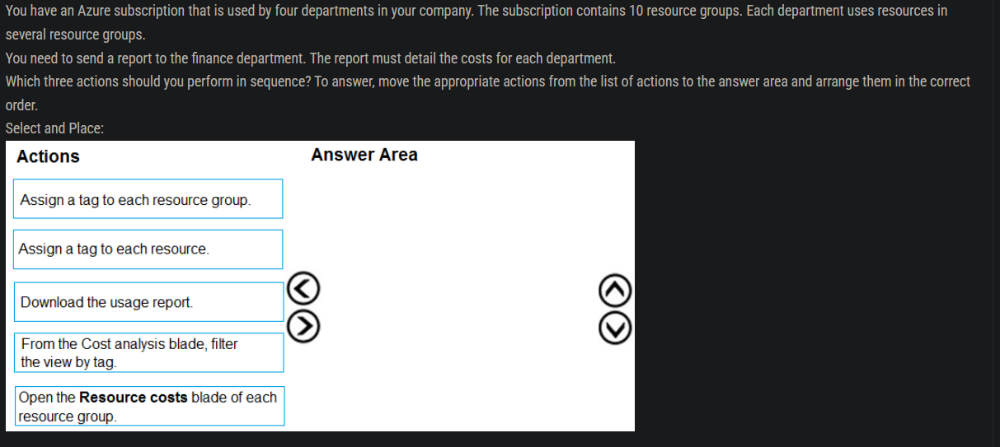
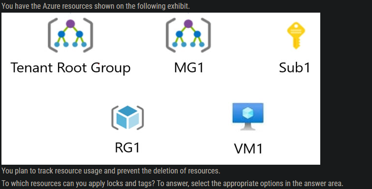
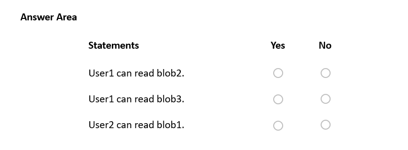
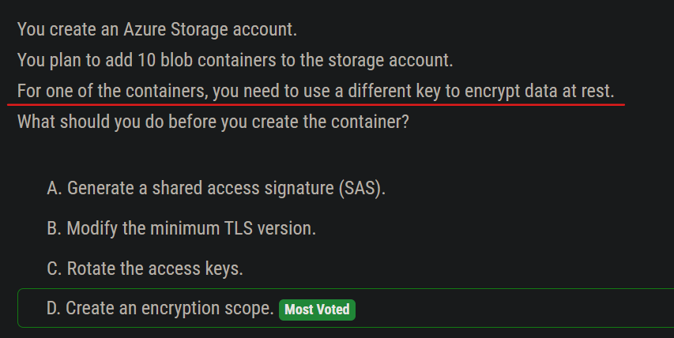
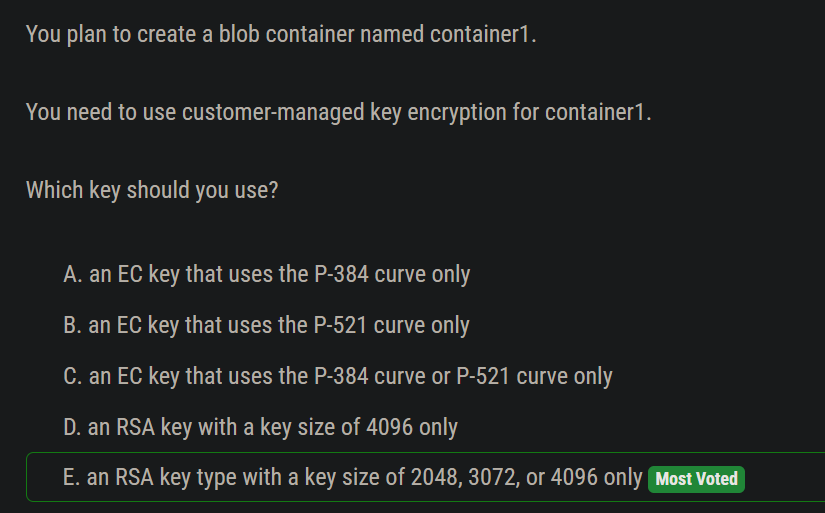
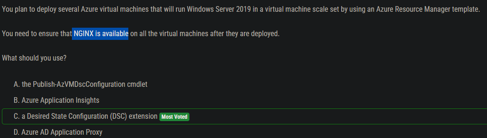
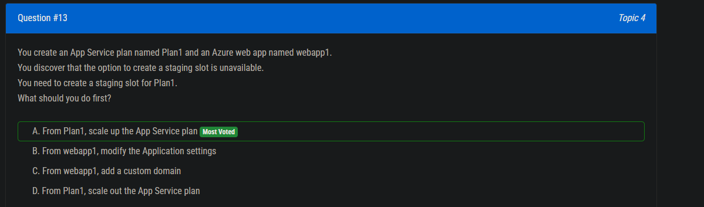
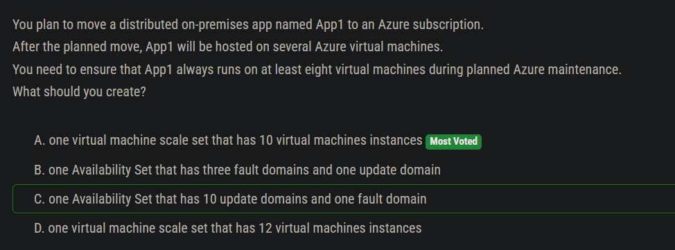
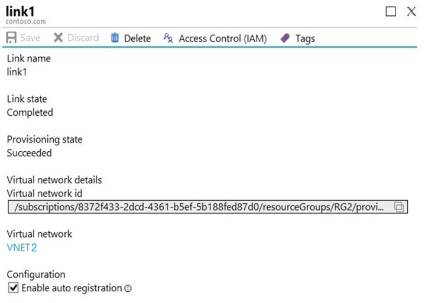
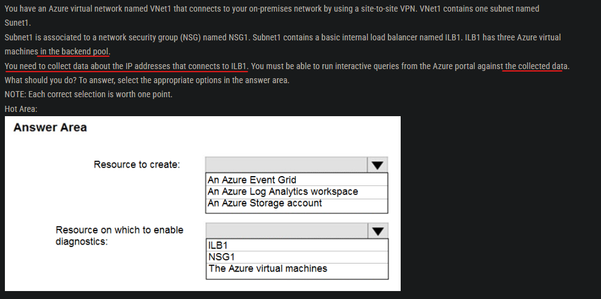

Answer is B ( No )
Initial will perform a full sync and add the user account created but it will take time,
Delta, will kick off a delta sync and bring only the last change, so it will be "immediately" and will fulfill the requirements.


- On a server with Azure AD Connect installed, navigate to the Start menu and select AD Connect, then `Synchronization` Service.
- You run the Start-ADSyncSyncCycle -PolicyType Initial PowerShell cmdlet.

:x: Solution: You restart the NetLogon service on a domain controller.


  
  
:o: Solution: You access the Resource Group blade.
:x: Solution: You access the Container blade.
---


---


- You can simply (hot) detach a data disk from one VM and attach it to the other VM without stopping either of the VMs.

---


- The number of fault domains for managed availability sets varies by region - either two or three per region.

---


- 'Each virtual machine in your availability set is assigned an update domain and a fault domain by the underlying Azure platform. 
- **Each availability set can be configured with up to `three` fault domains and `twenty` update domains.'**

---


---


---


:x: Solution: You choose the Allow gateway transit setting on VirtualNetworkB.
:o: You download and re-install the VPN client configuration package on the Windows 10 workstation.

---


No, creating an HTTP health probe on port 1433 does not meet the goal of configuring an Azure internal load balancer as a listener for the SQL Server Always On availability group.

In order to configure an Azure internal load balancer as a listener for the availability group, you need to create a TCP health probe on port 1433. SQL Server uses TCP to communicate on port 1433, so a TCP health probe is the appropriate choice to ensure the availability and health of the SQL Server instances in the availability group.

---


Session Persistence -> Same request to same client


- Yes, enabling Floating IP on the Azure internal load balancer as a listener for the availability group can meet the goal. By enabling Floating IP, the load balancer will use a floating IP address as the source IP address for outbound flows from the backend pool. This will ensure that the IP address used by the backend pool remains the same even if a VM is restarted or replaced, which is important for maintaining the listener for the availability group.


- The answer is now C and E. You can use the Portal or Powershell to make this change.

--- 


5 VM so 5 NIC Cards .we have public and private ip address set to them .however they needs same inbound and outbound rule so create NSG and attach to NIC and this req can be fulfilled 5 NIC hence 5 is right ans

---


- all identical security groups so you will only require 1 security group as all the settings are the same

---

Your company's Azure subscription includes Azure virtual machines (VMs) that run Windows Server 2016.
One of the VMs is backed up every day using Azure Backup Instant Restore.
When the VM becomes infected with data encrypting ransomware, you decide to recover the VM's files.
Which of the following is TRUE in this scenario?  
A. You can only recover the files to the infected VM.
B. You can recover the files to any VM within the company's subscription.
C. You can only recover the files to a new VM.
D. You will not be able to recover the files.

Correct Answer: B

Since all VMs in the subscription are running Win Server 2016, as per below statement, they can be used as target for Instant Restore.

"Backups can't be restored to a target machine that's running an earlier version of the operating system. For example, a backup taken from a Windows 7 computer can be restored on a Windows 7 (or later) computer. A backup taken from a Windows 10 computer can't be restored to a Windows 7 computer."

---

Your company's Azure subscription includes Azure virtual machines (VMs) that run Windows Server 2016.
One of the VMs is backed up every day using Azure Backup Instant Restore.
When the VM becomes infected with data encrypting ransomware, you are required to restore the VM.
Which of the following actions should you take?
A. You should restore the VM after deleting the infected VM.
B. You should restore the VM to any VM within the company's subscription.
C. You should restore the VM to a new Azure VM.
D. You should restore the VM to an on-premise Windows device.

Answer A doesn't say to restore *to* the infected VM. 
It says `"You should restore the VM *after deleting*` the infected VM"

--- 


---


---

You have an Azure Active Directory (Azure AD) tenant named contoso.com.
You have a CSV file that contains the names and email addresses of 500 external users.
You need to create a guest user account in contoso.com for each of the 500 external users.

:x: Solution: You create a PowerShell script that runs the New-AzureADUser cmdlet for each user.

:x: Solution: From Azure AD in the Azure portal, you use the Bulk create user operation.
- "Bulk Create" is for new Azure AD Users.

For Guests:
- Use "Bulk invite users" to prepare a comma-separated value (.csv) file with the user information and invitation preferences
- Upload the .csv file to Azure AD
- Verify the users were added to the directory

:o: 
Solution: You create a PowerShell script that runs the New-AzureADMSInvitation cmdlet for each external user.

---


---


---


resources created before policy creation will not inherit the policy rules. so, VNET1 will only have Department: D1 tag, VNET 2 will have Label : Value1

---


---


```
Set-AzMarketplaceTerms -Publisher <String> -Product <String> -Name <String> [-Accept] [-Terms <PSAgreementTerms>] [-DefaultProfile <IAzureContextContainer>] [-WhatIf] [-Confirm] [<CommonParameters>]
```

---


https://docs.microsoft.com/en-us/azure/active-directory/fundamentals/active-directory-users-assign-role-azure-portal

---


---


---


Correct; Answer is:
User1 can add Device2 to Group1: No (because User1 is Cloud Device Admin and cannot change the group membership for Group1)

User2 can add Device1 to Group1: Yes (because User2 is Group Owner which has the requisite authority for changing group membership. furthermore, Group1 has Assigned membership type)

User2 can add Device2 to Group2: No (because though User2 is Group Owner with requisite rights but Group2 has Dynamic Device membership type)

---


Option B is the correct answer.

**The User Access Administrator role allows users to manage user access to Azure resources, but it does not provide the ability to assign roles to other users.**

The Network Contributor role grants users the ability to manage networks, but it also does not provide the ability to assign roles to other users.

The Security Admin and Security Reader roles are not relevant to the task at hand.

Therefore, the correct option is to assign User1 the User Access Administrator role for VNet1, which will allow them to assign the Reader role to other users for that specific virtual network.

---


---




---

You have an Azure subscription that contains a virtual network named VNET1 in the East US 2 region. A network interface named VM1-NI is connected to
VNET1.
You successfully deploy the following Azure Resource Manager template.


YES
YES
NO

NIC should be in the same region with the VNet to work properly. 

As you read on the template, VM1 and VM2 are in the same region. 
Then, VM1-NI and VM2-IN could be connected to `VNET1`

---

You have an Azure subscription named Subscription1 that has a subscription ID of c276fc76-9cd4-44c9-99a7-4fd71546436e.
You need to create a custom RBAC role named CR1 that meets the following requirements:
✑ Can be assigned only to the resource groups in Subscription1
✑ Prevents the management of the access permissions for the resource groups
✑ Allows the viewing, creating, modifying, and deleting of resources within the resource groups
What should you specify in the assignable scopes and the permission elements of the definition of CR1? To answer, select the appropriate options in the answer area.


First part should be `"/Subscription/subcription_id"` only. There is nothing called "resourceGroups" only or "resourceGroups/*" . 

You can specify either a subscription, specific resource group, management group or specific resource. 
for example it should `"/subcription/subcription_id/resourceGroups/resource_group_name"`
Check https://github.com/MicrosoftDocs/azure-docs/blob/master/articles/role-based-access-control/role-definitions.md#role-definition-structure

For second box. It is correct but missing "*". It should be "Microsoft.Authorization/*" . if you try this on az cli without "*". you will get an error

---

You have an Azure Active Directory (Azure AD) tenant.
You need to create a conditional access policy that requires all users to use multi-factor authentication when they access the Azure portal.
Which three settings should you configure? To answer, select the appropriate settings in the answer area.
NOTE: Each correct selection is worth one point.


---

Users access the resources in the subscription from either home or from customer sites. From home, users must establish a point-to-site VPN to access the Azure resources. The users on the customer sites access the Azure resources by using site-to-site VPNs.

You have a line-of-business-app named App1 that runs on several Azure virtual machine. The virtual machines run Windows Server 2016.
You need to ensure that the connections to App1 are spread across all the virtual machines.

What are two possible Azure services that you can use? Each correct answer presents a complete solution.
NOTE: Each correct selection is worth one point.
A. an internal load balancer Most Voted
B. a public load balancer
C. an Azure Content Delivery Network (CDN)
D. Traffic Manager
E. an Azure Application Gateway Most Voted

Correct Answer: A and E

A: The customer sites are connected through VPNs, so an internal load balancer is enough.

B: The customer sites are connected through VPNs, so there's no need for a public load balancer, an internal load balancer is enough.

C: A CDN does not provide load balancing for applications, so it not relevant for this situation.

D: Traffic manager is a DNS based solution to direct users' requests to the nearest (typically) instance and does not provide load balancing for this situation.

E: Azure Application Gateway is a valid option, as it provides load balancing in addition to routing and security functions

---

  
- Select Users & Groups : Where you have to choose all users.  
- Select Cloud apps or actions: to specify the Azure portal  
- Grant: to grant the MFA.  

---

You have an Azure subscription linked to an Azure Active Directory tenant. The tenant includes a user account named User1.
You need to ensure that User1 can assign a policy to the tenant root management group.
What should you do?
A. Assign the Owner role for the Azure Subscription to User1, and then modify the default conditional access policies.  
B. Assign the Owner role for the Azure subscription to User1, and then instruct User1 to configure access management for Azure resources.  
**C. Assign the Global administrator role to User1, and then instruct User1 to configure access management for Azure resources.** 
D. Create a new management group and delegate User1 as the owner of the new management group.   


---


360license 不影響

---


> Only Admin3, the owner, can assign ownership.

You have an Azure Active Directory (Azure AD) tenant that contains three global administrators named Admin1, Admin2, and Admin3.
The tenant is associated to an Azure subscription. Access control for the subscription is configured as shown in the Access control exhibit. (Click the Access
Control tab.)


You sign in to the Azure portal as Admin1 and configure the tenant as shown in the Tenant exhibit. (Click the Tenant tab.)  


Correct Answer:

Azure (RBAC) and Azure AD roles are independent. 

AD roles do not grant access to resources and Azure roles do not grant access to Azure AD. 

However, a Global Administrator in AD can elevate access to all subscriptions and will be User Access Administrator in Azure root scope.

All 3 users are GA (AD) and Admin3 is owner of the subscription (RBAC).
Admin1 has elevated access, so he is also User Access Admin (RBAC).
To assign a user the owner role at the Subscription scope, you require permissions, such as User Access Admin or Owner.

Box 1: Yes
Admin1 has elevated access, so he is User Access Admin. This is valid.

Box 2: Yes
Admi3 is Owner of the Subscription. This is valid.

Box 3: No
Admin2 is just a GA in Azure AD scope. He doesn’t have permission in the Subscription.


---


---


--


1) Add a subnet to VNET1 = "User1 and User3 only"
2) Assign a user the Reader role to VNEt1 = "User1 only"

Explanation:
User1 - The Owner Role lets you manage everything, including access to resources.
User3 - The Network Contributor role lets you manage networks, including creating subnets.
User2 - The Security Admin role can view security policies, view security states, edit security policies, view alerts and recommendations, dismiss alerts and recommendations.

---




Answer is correct, both Tags and Locks are available to Subscriptions, Resource Groups, and Resources

---


---


N, N, N


--- 


---


---


---


B. Owner correct

Owner = Grants full access to manage all resources, including the ability to assign roles in Azure RBAC.

Contributor = Grants full access to manage all resources, but does NOT allow you to assign roles in Azure RBAC. (you cannot add users or changes their rights)

User Access Administrator = Lets you manage user access to Azure resources.

Reader = View all resources, but does not allow you to make any changes.

Security Admin = View and update permissions for Security Center. Same permissions as the Security Reader role and can also update the security policy and dismiss alerts and recommendations.

Network Contributor = Lets you manage networks, but not access to them. (so you can add VNET, subnet, etc)

---


the answer is wrong. you are not defining a policy but a custom role.
You need to provide either of the following in DataActions:
```bash 
Microsoft.Compute/virtualMachines/login/action
Microsoft.Compute/virtualMachines/loginAsAdmin/action
```

> https://docs.microsoft.com/en-us/azure/role-based-access-control/built-in-roles?source=recommendations#virtual-machine-administrator-login


correct answer is `dataActions` and `assignableScopes`

---


---


:x: You instruct User4 to create the user accounts.
- when you create a new tenant, the creator is the only global admin and owner, he must first give access to others to allow anything.

:x: You instruct User3 to create the user accounts.

---

You have two Azure subscriptions named Sub1 and Sub2.

An administrator creates a custom role that has an assignable scope to a resource group named RG1 in Sub1.

You need to ensure that you can apply the custom role to any resource group in Sub1 and Sub2. The solution must minimize administrative effort.

---


---


---


The Answer supplied is correct, it is No.
Reason:
The question states "You have a CSV file that contains the names and email addresses of 500 external users."
This implies that the required fields (Email and Redirection URL)are missing from the .csv file.
Here are the csv field pre-requisites that are needed for bulk upload of external users:
https://learn.microsoft.com/en-us/azure/active-directory/external-identities/tutorial-bulk-invite#prerequisites

---


Role3: Role1 and built-in Azure subscription roles only
Role4: Role2 only

Explanation: Built-in AD roles can't be cloned, but built-in subscription roles can be. Custom roles of either type can be cloned.

---

Can be used as:
```json
"AssignableScopes": [
"/subscriptions/{Sub1}",
"/subscriptions/{Sub2}",
```
Note: Custom role example:
The following shows what a custom role looks like as displayed using Azure PowerShell in JSON format. This custom role can be used for monitoring and restarting virtual machines.
```json
{
    "Name": "Virtual Machine Operator",
    "Id": "88888888-8888-8888-8888-888888888888",
    "IsCustom": true,
    "Description": "Can monitor and restart virtual machines.",
    "Actions": [
    "Microsoft.Storage/*/read",
    "Microsoft.Network/*/read",
    "Microsoft.Compute/*/read",
    "Microsoft.Compute/virtualMachines/start/action",
    "Microsoft.Compute/virtualMachines/restart/action",
    "Microsoft.Authorization/*/read",
    "Microsoft.ResourceHealth/availabilityStatuses/read",
    "Microsoft.Resources/subscriptions/resourceGroups/read",
    "Microsoft.Insights/alertRules/*",
    "Microsoft.Insights/diagnosticSettings/*",
    "Microsoft.Support/*"
],
    "NotActions": [],
    "DataActions": [],
    "NotDataActions": [],
    "AssignableScopes": [
    "/subscriptions/{subscriptionId1}",
    "/subscriptions/{subscriptionId2}",
    "/providers/Microsoft.Management/managementGroups/{groupId1}"
]
}
```

To ensure that you can apply the custom role to any resource group in Sub1 and Sub2 while minimizing administrative effort, you should select the custom role and add both Sub1 and Sub2 to the assignable scopes.
In the Azure portal, navigate to the custom role that has been created and click on it.
By adding both Sub1 and Sub2 to the assignable scopes of the custom role, you can ensure that the role can be applied to any resource group in both subscriptions. This minimizes administrative effort by eliminating the need to create separate custom roles for each subscription.
Option B is not recommended as it would require creating a separate custom role for each subscription, which would increase administrative effort.
Option C is not recommended as it would only allow the custom role to be applied to resource groups in Sub1 and not Sub2.
Option D is not recommended as it would require creating a separate custom role for Sub2, which would increase administrative effort.


---

• User1 must view the data in any storage account.
• User2 must assign users the Contributor role for storage accounts


"Reader and Data Access":
"Lets you view everything but will not let you delete or create a storage account or contained resource. It will also allow read/write access to all data contained in a storage account via access to storage account keys."

"Owner" is needed to manage permissions, as "User Access Administrator" is not offered as an option.

---


---

## :star::star:

2-70

You have an Azure AD tenant named contoso.com.

You have two external partner organizations named fabrikam.com and litwareinc.com. Fabrikam.com is configured as a connected organization.

You create an access package as shown in the Access package exhibit.


N - Because not Connected
Y - Because when it expires it is removed from the group. Proof to follow
Y - Because..math
https://learn.microsoft.com/en-us/azure/active-directory/governance/entitlement-management-access-package-resources
When a user's access package assignment expires, they are removed from the group or team, unless they currently have an assignment to another access package that includes 

---

## Private Link


## :o Roles

You have an Azure subscription that contains a user named User1 and the resources shown in the following table.


NSG1 is associated to networkinterface1.

User1 has role assignments for NSG1 as shown in the following table.


Correct Answers. YES, No, Yes
(YES)User1 can create a storage account in RG1, since User1 has Storage Account Contribute Role inherited from Resource Group.
(NO) User1 can modify the DNS settings of networkinterface1, since it requires Network Contribute role referring to the following link.
https://learn.microsoft.com/en-us/azure/virtual-network/virtual-network-network-interface?tabs=network-interface-portal#permissions
(YES) User1 can create an inbound security rule to filter inbound traffic to networkinterface1, since User1 has Contributor role for NSG1

## :star: 360 & Security Group Assignment


You have a resource group named RG1   
1. No
2. No
3. Yes

---


B is correct, You need to have the Owner Role or Access Administrator role to assign roles but Access Administrator role is preferred as it is least privilege.


## User who has User Access Ad and Reader Role


1) GROUP1 Reader access, provides access to view all items, except secrets
https://learn.microsoft.com/en-us/azure/role-based-access-control/built-in-roles#reader
1) To Assign OWNER role, you need to either Owner role or User Administrator Access Role
https://learn.microsoft.com/en-us/azure/role-based-access-control/role-assignments-portal-subscription-admin#prerequisites
1) Neither User Access Admin Role nor the Reader Role allows to create new resources.
https://learn.microsoft.com/en-us/azure/role-based-access-control/role-assignments-steps


## Assign user SMB Share Contributor for file share


It should be A,
I just created a storage account,
then created a file share,
went to IAM,
and it says : To give individual accounts access to the file share (Kerberos), enable identity-based authentication for the storage account.

## Assign License to Group


1) Y, You can assign users MS Defender for Cloud Apps on a per user basis.
2) N, You cannot remove the P2 license as User1 is in Group1.
3) N, nested group assignments don't work


## Users syncing from an On Prem AD to AAD


JobTitle: User1 (Member and AzureAD Source) and User3 (Guest and Microsoft Account) only

UsageLocation: all users (User1, User2 and User3)

Users syncing from an On Prem AD to AAD cannot have the job title altered in AAD. it would need to be done in local AD , as AADC by default synchronizes the jobTitle property. Usage location is set only on the cloud side for all users, and Guest users can have their job titles set as well as cloud native (AAD) users.

## Bulk User


:x: Solution: You create a PowerShell script that runs the New-MgUser cmdlet for each external user.
:o: You create a PowerShell script that runs the New-MgInvitation cmdlet for each external user.

## authenticate guest by using email 


## Storage Blob Data Contributor Read, write, and delete Azure Storage containers and blobs.


## Assign a licensee to securityEnabled


Answer is B:
"The feature can only be used with security groups, and Microsoft 365 groups that have securityEnabled=TRUE."

## 

You have an Azure AD tenant.

You need to modify the Default user role permissions settings for the tenant. 

The solution must meet the following requirements:

• Standard users must be prevented from creating new service principals.
• Standard users must only be able to use PowerShell or Microsoft Graph to manage their own Azure resources.


## Custom Role




The conditions are difficult to read, but they mean (according to reference 1):
a. If the user performs a reading operation, then he may only read from “cont1”
b. If the user performs a writing operation, then he may only write to blobs like “*2*”
Given that, then:
1- User 1 can read Blob2 - No, because he is reading, then the condition a. applies, and he is not reading cont1
2- User 1 can read Blob3 - No, because he is reading, then the condition a. applies, and he is not reading cont1
3- User 2 can read blob1 - Yes. He is not writing, so the condition b. does not apply. He has permissions granted by the role on the scope he is reading - Storage Blob Data Owner on storage1, which contains blob1

## co-administrators role


Co-administrators can only be assigned at the subscription scope. You cannot assign co-administrators to resource groups, management groups, or virtual machines.

## Delete User and Group with/without a license

  

Users = User1, User2, User3, User4 (can delete all users whether a license is assigned directly or via inheritance from a group membership)
Groups = Group 2 and Group 4 (Groups with active license assignments cannot be deleted. You get an error)

## Service Endpoint & Private Endpoint x  Microsoft backbone network.


## :star::star: ARM


Run `New-AzDeployment –Location westus –TemplateFile “deploy.json”`


1- It's N, because it creates 4 Resource Groups and not 3 Resource Groups (RGS0, RGS1, RGroup4 and ResGrp8);
1.1: The Resource Group named with "[concat('RGS', copyIndex())]", creates RGS0 and RGS1;
1.2: The Resource Group named with "[concat('ResGrp', '8')]", creates ResGrp8;
1.3: The Resource Group named with "[concat('RGroup', length(parameters('obj1')))]", creates RGroup4 (As we can see, obj1 parameter has a length of 4 'propA', 'propB', 'propC' and 'propD');
2 - It's N, because it doesn't create a resourcer group named RGroup5;
3 - It's Y, because all resource groups were created in the East US Azure Region.


## File Export/Import


Correct Answer: D

Azure Import/Export service supports the following of storage accounts:
✑ Standard General Purpose v2 storage accounts (recommended for most scenarios)
✑ Blob Storage accounts
✑ General Purpose v1 storage accounts (both Classic or Azure Resource Manager deployments),

Azure Import/Export service supports the following storage types:
✑ Import supports Azure Blob storage and Azure File storage
✑ Export supports Azure Blob storage. Azure Files not supported.

Only storage4 can be exported.

## 


Box 1: Access Control (IAM)
Since the App1 uses Managed Identity, App1 can access the Storage Account via IAM. As per requirement, we need to minimize the number of secrets used, so Access keys is not ideal.

Box 2: Shared access signatures (SAS)
We need temp access for App2, so we need to use SAS.

## 


Box 1: StorageV2

Box 2: Standard_GRS

## :star::star:


The status of VM1 is Running.

You assign an Azure policy 


Parameter
Microsoft.ClassicNetwork/virtualNetworks
Microsoft.Network/virtualNetworks
Microsoft.Compute/virtualMachines

 
N-N-N  
Policy will identify the VM as not compliant but will not put VM in deallocate  


## File export/import

Step 1: Prepare the drives (Attach an external disk to Server1 and then run waimportexport.exe)
Step 2: Create an import job (From the Azure portal, create an import job)
Step 3: Ship the drives to the Azure datacenter (Detach the external disks from Server1 and ship the disks to an Azure data center)
Step 4: Update the job with tracking information (From the Azure portal, update the import job)


## 


Correct Answer:

File1: Endpoint1 only
It is a cloud endpoint, and it is scanned by the detection job every 24 hours.

File2: Endpoint1, Endpoint2 and Endpoint3
With the on-premises servers the file is scanned and synced automatically after it's being added.

Note: They changed the question in Exam from "within 24 hours" to "after 24 hours".
So, the answer is:
File1: Endpoint1, Endpoint2 and Endpoint3
File2: Endpoint1, Endpoint2 and Endpoint3


## 


## Access Storage Account for RSV service & VM


1. The 10.2.9.0/24 subnet is not whitelisted.

2. Must enable Allow trusted Microsoft services to access this storage account 


## File Share Sync 


- Create a Storage Sync Service
The deployment of Azure File Sync starts with placing a Storage Sync Service resource into a resource group of your selected subscription.

- Install the Azure File Sync agent on Server1
The Azure File Sync agent is a downloadable package that enables Windows Server to be synced with an Azure file share

- Register Server1.
Register Windows Server with Storage Sync Service
Registering your Windows Server with a Storage Sync Service establishes a trust relationship between your server (or cluster) and the Storage Sync Service.

- Add a server endpoint -
Create a sync group and a cloud endpoint.
A sync group defines the sync topology for a set of files. Endpoints within a sync group are kept in sync with each other. A sync group must contain one cloud endpoint, which represents an Azure file share and one or more server endpoints. A server endpoint represents a path on registered server.

1. Prepare Windows Server to use with Azure File Sync
2. Deploy the Storage Sync Service
3. Install the Azure File Sync agent
4. Register Windows Server with Storage Sync Service
5. Create a sync group and a cloud endpoint
6. Create a server endpoint
7. Configure firewall and virtual network settings


## How File Sync works


## Stop backup before Deleting RSV


## Add Service to RSV


Box 1: VM1 only
VM1 is in the same region as Vault1. File1 is not in the same region as Vautl1. SQL is not in the same region as Vault1. Blobs cannot be backup up to service vaults.
Note: To create a Vault to protect VMs, the Vault must be in the same Region as the VMs.

Box 2: Share1 only
Storage1 is in the same region as Vault2. Share1 is in Storage1.
Note: Only VM and Fileshare is allowed to Backup.

## Dest of AZ import/export 


Azure Import/Export service is used to securely import large amounts of data to Azure Blob storage and Azure Files by shipping disk drives to an Azure datacenter. 

This service can also be used to transfer data from Azure Blob storage to disk drives and ship to your on-premises sites. 

**Data from one or more disk drives can be imported either to Azure Blob storage or Azure Files.** 
- The maximum size of an Azure Files Resource of a file share is 5 TB.

Note: There are several versions of this question in the exam. 

The question has two correct answers:
1. Azure File Storage
2. Azure Blob Storage

The question can have other incorrect answer options, including the following:
✑ Azure Data Lake Store
✑ Azure SQL Database
✑ Azure Data Factory


## AZ for blob and file only


## Authentication with Blob & File for AzCopy

You need to use AzCopy to copy data to the blob storage and file storage in storage1.
Which authentication method should you use for each type of storage?

You can provide authorization credentials by using Azure Active Directory (AD), or by using a Shared Access Signature (SAS) token.

Blob Storage : 
- Both Azure Active Directory (AD) and Shared Access Signature (SAS) token are supported for Blob storage.

File Storage : 
- Only Shared Access Signature (SAS) token is supported for File storage.

## Update Domain for Planned Maintenance

You have an app named App1 that runs on two Azure virtual machines named VM1 and VM2.
You plan to implement an Azure Availability Set for App1. The solution must ensure that App1 is available during planned maintenance of the hardware hosting
VM1 and VM2.

:a: 
When you create an Availability Set, the hardware in a location is divided into multiple update domains and fault domains.

An update domain is a group of VMs and underlying physical hardware that can be rebooted at the same time.

VMs in the same fault domain share common storage as well as a common power source and network switch.

- During scheduled maintenance, only one update domain is updated at any given time. 
- Update domains aren't necessarily updated sequentially. So, we need two update domains.

## 


- NO - only one cloud endpoint can be added to sync1
- YES - Server2 has been registered to Sync1 but data2 is not added to server endpoint. So we can add data2 as additional server endpoint for Sync1
- NO - We have to register Server3 first


## Add Storage and Log Analytics workspace to RSV


You plan to configure Azure Backup reports for Vault1.
You are configuring the Diagnostics settings for the AzureBackupReports log.
Which storage accounts and which Log Analytics workspaces can you use for the Azure Backup reports of Vault1?

storage 3
analytics 1,2 & 3
this is correct as analytics are independent of locations!

## :star::star: Storage Account type & Access Tier


Box 1: `contoso104 only`
Premium file shares are hosted in a special purpose storage account kind, called a FileStorage account.

Box 2: contoso101 and contos103 only
Object storage data tiering between hot, cool, and archive is supported in Blob Storage and General Purpose v2 (GPv2) accounts. 

General Purpose v1 (GPv1) accounts don't support tiering.

The archive tier supports only LRS, GRS, and RA-GRS.


## SAS configuration

  
  

It should be no access for both cases.
- for first case, cause the IP is not matching the SAS requirements
- for second case, since it is using "net use" where it uses SMB. The SMB (Server Message Broker) protocol does not support SAS. it still asks for username/password. Accordingly, it will give error wrong username/pass and will not provide access.

## Switch to OTher RSV

You have two Azure virtual machines named VM1 and VM2. You have two Recovery Services vaults named RSV1 and RSV2.
VM2 is backed up to RSV1.
You need to back up VM2 to RSV2.

A. From the RSV1 blade, click Backup items and stop the VM2 backup Most Voted  
B. From the RSV2 blade, click Backup. From the Backup blade, select the backup for the virtual machine, and then click Backup  
C. From the VM2 blade, click Disaster recovery, click Replication settings, and then select RSV2 as the Recovery Services vault  
D. From the RSV1 blade, click Backup Jobs and export the VM2 job  

If you want to change the recovery service vault you need to disassociate the previous RSV and delete the backup data. To delete backup data, you need to stop the backup first.
So:
1. Stop the backup in RSV1 (D)
2. Remove the backup data.
3. Disassociate the VM in RSV1.
4. Associate the VM in RSV2.

## Lifecycle for which storage

Lifecycle management policies are supported for block blobs and append blobs in   
- general-purpose v2, 
- premium block blob, 
- and Blob Storage accounts. 

Lifecycle management doesn't affect system containers such as the $logs or $web containers

Storage account types offered now without switching to legacy are simply standard (gpv2) and premium. 

Even in legacy, there isn't any such storage account type as "`filestorage`", so storage4 as listed is not valid, period.


## :star: 


  

Box 1- Yes. VirtualNetworkRules & IpRules are blank, with the default action Allow.
Box 2- Yes. Individual blobs can be set to the archive tier - ref.https://docs.microsoft.com/en-us/azure/storage/blobs/access-tiers-overview
Bob 3. No. To access blob data in the Azure portal with Azure AD credentials, a user must have the following role assignments:
- A data access role, such as Storage Blob Data Contributor The Azure Resource Manager Reader role

## Platform can use azCopy


## Access Policy to prevent content changing


## lifecycle management rules 


1. No.
You can not read Dept1File.docx , YOu can not read file in archive tier
2. Yes.
Because file is modified on 5 Oct, after 2 days it moved to cool storage and on 10th oct its still in cool storage. You can read file in cool storage.
3. Yes.
Same as File 2 its still in cool storage, because its modified on 2nd oct it still has one day to move to archive tier.


## Role 


Assigning the Storage Account Contributor and Storage Blob Data Reader rolls to the group and having the user (which is a part of that group) sign in to the portal, the storage account isn't even listed under storage accounts.

After removing the Storage Blob Data Reader and assigning the Reader roll to the group, the storage account is listed and the users of the group can creat blobs/fileshares etc.

ANSWER: BC

The Reader role is an Azure Resource Managerrole that permits users to view storage account resources, but not modify them. 

It does not provide read permissions to data in Azure Storage, but only to account management resources. 

The Reader role is necessary so that users can navigate to blob containers in the Azure portal. 

For example, if you assign the Storage Blob Data Contributor role to user Mary at the level of a container named sample-container, then Mary is granted read, write, and delete access to all of the blobs in that container. However, if Mary wants to view a blob in the Azure portal, then the Storage Blob Data Contributor role by itself will not provide sufficient permissions to navigate through the portal to the blob in order to view it. The additional permissions are required to navigate through the portal and view the other resources that are visible there." - https://docs.microsoft.com/en-us/azure/storage/blobs/assign-azure-role-data-access?tabs=portal


## 


Correct Answer: C

A: URL of the Storage Account.

B: The azcopy sync command replicates the source location to the destination location. However, the file is skipped if the last modified time in the destination is more recent.

C: The azcopy copy command copies a directory (and all the files in that directory) to a blob container. The result is a directory in the container by the same name.

D: The az storage blob copy start-batch command copies multiple blobs to a blob container.

## Change the Account type


Select Standard performance for general-purpose v2 storage accounts (default). This type of account is recommended by Microsoft for most scenarios. For more information, see Types of storage accounts.  

Select Premium for scenarios requiring low latency. After selecting Premium, select the type of premium storage account to create. The following types of premium storage accounts are available:  
```
Block blobs
File shares
Page blobs
```

## Copy Files


You plan to use `AzCopy` to copy a blob from `container1` directly to `share1`.  

You need to identify which authentication method to use when you use AzCopy.
What should you identify for each account? To answer, drag the appropriate authentication methods to the correct accounts. Each method may be used once, more than once, or not at all. You may need to drag the split bar between panes or scroll to view content.


To storage1, you could authenticate with Access Key, SAS and AAD, but Storage1 has disabled public access, so you can't access it with AzCopy even authenticated. 

However in SAS toiken you can specify authorized IP range from which you can use your access. Access Key and AAD don;t have that option, hence the only possible authorization method for storage1 is SAS.

## Container with encrypted Scope



D) Create an encryption scope

Why?

In Azure Storage, encryption of data at rest is done using Azure Storage Service Encryption (SSE). Azure Storage SSE uses Microsoft-managed encryption keys to encrypt the data in the storage account.

In the scenario described, you need to use a different key to encrypt data at rest for one of the containers. To do this, you need to create an encryption scope, which is a named configuration that defines the default encryption settings for a container. By creating an encryption scope, you can use a customer-managed key, stored in Azure Key Vault, to encrypt the data in that specific container.

Therefore, option D (Create an encryption scope) is the correct answer as it allows you to use a different key for data encryption for the specific container.

## Rule policy to blobs 


N-N-N

On June 6, File1 will be in archive because File1 is in container 1, and rule 1 applies 3 days after june 1.

On June 1, File2 will still be in Hot tier because File2 is in container2, Rule3 and Rule4 havent hit yet.

On June 16, File2 will be deleted because Rule3 applies 10 days after June 1.

## ARM for Storage Account and Service

You plan to deploy a storage account named storage1 by using the following Azure Resource Manager (ARM) template.


N-N-Y
`deleteRetentionPolicy` is 7 days, so can not be restored after 7 days. Means, backup is deleted after 7 days.

`allowBlobPublicAccess` is true, so anyone can access the blob, not just on Azure.

`kind` is `Standard_LRS`, so 3 local copies are stored.

## AZ Explorer

  

Azure Storage Explorer does not have the ability to create a new storage account directly. Instead, you can use Azure Storage Explorer to connect to and manage existing storage accounts in Azure.

## RSV for VM availability


## AZ copy


## ARM lifecycle management

tierToArchive and prefixMatch
- tierToArchive because it's the lowest cost tier, and doesnt say anyhting about needing to read data after 90 days.   
However, rehydration costs will occur if they did need to read it.  
- prefixMatch because we only want the blob in the container1.  

## Storage Account Blades Configuration


IT'S NOW `IAM` AND `REDUDANCY` ( `REPLICATION CHANGED` TO THIS NAME )

## Customer-managed key encryption for storage container



## Access Policy for Storage Container


Max stored access policies: `3`
- because max total of stored access policy is `5` and we already have `2`, so additional 3 available.

Max immutable blob storage: `1`
- because max total of immutable blob storage policy is 2
- one Legal hold policy and one Time-based retention policy. 

We already have one, so additional 1 available.

## Connection String key and SAS


For storage1, you create a shared access signature (SAS) named SAS1 that has the settings shown in the following exhibit  


To which resources can User1 write by using SAS1 and key1?


key1: folder1, container1, table1

SAS1: table1

I think that `key1` is the key of storage account which is created when creating storage account.   
Thus, it should be able to access all in storage account.  

SAS1 allows table only which is shown in the exhibit.  

## Lifecycle policy Action Order


If you define more than one action on the same blob, **lifecycle management applies the least expensive action to the blob**. 

For example, action `delete` is cheaper than action `tierToArchive`. Action `tierToArchive` is cheaper than action `tierToCool`.

`delete -> tierToArchive -> tierToCool`

##


You need to identify which storage accounts support lifecycle management, and which storage accounts support moving data to the Archive access tier.

Which storage accounts should you use? 

1. storage1, storage2, storage3 (see Kind)
Lifecycle management policies are supported for block blobs and append blobs **in general-purpose v2, premium block blob, and Blob Storage accounts.**

2.  storage2 (SEE Redundancy)
Only storage accounts that are configured for `LRS`, `GRS`, or `RA-GRS` support moving blobs to the archive tier.  
The archive tier isn't supported for ZRS, GZRS, or RA-GZRS accounts.  

> https://learn.microsoft.com/en-us/azure/storage/blobs/lifecycle-management-overview
https://learn.microsoft.com/en-us/azure/storage/blobs/access-tiers-overview

## ARM for Storage tierToCool and blobTypes

You create a blob lifecycle rule named rule1.

You need to configure rule1 to automatically move blobs that were NOT updated for 45 days from contained to the Cool access tier.


Tiering is not yet supported in a premium block blob storage account. **For all other accounts, tiering is allowed only on block blobs and not for append and page blobs.**

tierToCool
- Supported for blockBlob


## SMB Multichannel

You need to ensure that share1 can support SMB Multichannel. 

The solution must minimize costs.

- According to documentation only Premium file shares (FileStorage), LRS/ZRS are supported for SMB.

##  use conditions when 指派 RBAC to storage account


## K8s & CNI -> VNet

  
  
Agree with the answer NYY.
1. subnet is not in the same location as cluster > **If you want to select an existing virtual network, make sure it's in the same location and Azure subscription as your Kubernetes cluster.**
https://learn.microsoft.com/en-us/azure/aks/configure-azure-cni
2. azure cni network in same location as cluster and within the total pod no. limit
3. Bring your own subnet and route table with k8s. 
With k8s, a route table must exist on your cluster subnet(s). 
AKS supports bringing your own existing subnet and route table.
https://learn.microsoft.com/en-us/azure/aks/configure-kubenet#prerequisites

## Azure Custom Script Extension PostDeployment :x: ARM templates  

  

## Storage minimize network cost & managed key


**to minimize network cost** default routing tier
https://learn.microsoft.com/en-us/azure/storage/common/network-routing-preference

**what can be changed after creation** customer-managed key
"You can switch between customer-managed keys and Microsoft-managed keys at any time"
https://learn.microsoft.com/en-us/azure/storage/common/customer-managed-keys-overview


## 

You need to configure encryption for the account. The solution must meet the following requirements:

• Use a customer-managed key stored in a key vault.
• Use the maximum supported bit length.


## SAS or RBAC

  

A :
An Azure role assignment condition is an optional check that you can add to your role assignment to provide more fine-grained access control. For example, you can add a condition that requires an object to have a specific tag to read the object.
https://learn.microsoft.com/en-us/azure/role-based-access-control/conditions-role-assignments-portal


## ARM for Network and Storage Account

You plan to create a role definition to meet the following requirements:

• Users must be able to view the configuration data of a storage account.
• Users must be able to perform all actions on a virtual network.
• The solution must use the principle of least privilege.


## Host Caching & Storage Type

To VM1, you plan to add a 1-TB data disk that meets the following requirements:

• Provides data resiliency in the event of a datacenter outage.
• Provides the lowest latency and the highest performance.
• Ensures that no data loss occurs if a host fails.


1. **Provides data resiliency in the event of a datacenter outage.**
- Zone-redundant storage (ZRS) provides this capability by replicating data across multiple availability zones, ensuring that if one datacenter fails, the data is still available in other zones.

2. **Provides the lowest latency and the highest performance.**
- Premium SSDs offer better performance and lower latency compared to Standard SSDs.

3. **Ensures that no data loss occurs if a host fails.**
- Write caching can pose a risk of data loss in the event of a host failure. Thus, we need to be careful when enabling write caching.

Given the options:

Storage:
- Premium SSD that uses zone-redundant storage (ZRS) is the right choice as it provides high performance and ensures data resiliency across datacenter outages.

Host caching:
To avoid data loss during a host failure, we should avoid using write caching.
- Read-Only would be the appropriate choice to enhance performance without risking data loss due to host failure.

## VM KEK with RSV


To prepare Vault1 for Azure Disk Encryption with a key encryption key (KEK):

1. **You need to have a key in the Key Vault.** This will be the KEK. Azure Disk Encryption uses BitLocker for Windows VMs, which requires a key for encrypting the data disk. If you're using a KEK, the BEK (BitLocker Encryption Key) will be wrapped by this KEK.

So, you should:
B. Create a new key.

2. **The key vault itself should be configured for Azure Disk Encryption.** 
This ensures the vault is set up to work with Azure VMs and their disks.

Therefore:
E. Select Azure Disk Encryption for volume encryption.

So, the correct actions are B and E.

## usage of Azure Disk Encryption


"You can protect your managed disks by using Azure Disk Encryption for Linux VMs, which uses DM-Crypt, or Azure Disk Encryption for Windows VMs, which uses Windows BitLocker, to protect both operating system disks and data disks with full volume encryption.

Encryption keys and secrets are safeguarded in your Azure Key Vault subscription. By using the Azure Backup service, you can back up and restore encrypted virtual machines (VMs) that use Key Encryption Key (KEK) configuration."
https://learn.microsoft.com/en-us/azure/security/fundamentals/encryption-overview


##


You need to configure a shared access signature (SAS) to ensure that users can only download blobs securely by name.


Allowed services: Blob (since you want to access blobs).

Allowed resource types: Service (if you want users to access all blobs within a container) or **Object (if you want users to access a specific blob by name)**.

Allowed permissions: Set to "Read" to allow downloading.

Specify the start and expiry date for the token.
If you're using a shared access policy, you can select it here. Otherwise, configure the SAS token directly.

## SAS Accessing


##


You need to create an Azure Storage account named storage1

It requires

• Support Azure Data Lake Storage.
• Minimize costs for infrequently accessed data.
• Automatically replicate data to a secondary Azure region.

Which three options should you configure for `storage1`

B. The Cool access tier: 
- The Cool access tier is suitable for infrequently accessed data and offers lower storage costs compared to the Hot access tier.

C. Geo-redundant storage (GRS): 
- Geo-redundant storage replicates data to a secondary Azure region, providing data redundancy and disaster recovery capabilities.

E. Hierarchical namespace: 
- T**he hierarchical namespace is required for Azure Data Lake Storage,** as it enables the storage account to support the data lake's file system structure.

So, the correct options are B, C, and E.

## Lifecycle Policy

You have an Azure Storage account named storage1 that contains two containers named container1 and container2

You periodically take blob snapshots of critical blobs.


Correct, YNN.

Y - See section tierToCool

N - rule1 only applies to container1, not container2, see section prefixMatch

N - This one is a bit complicated. Rehydrated files (that were in the archive tier first and then returned to hot or cool) wouldn't necessarily be archived after 30 days - as there's a condition that the last tier change must be at least 7 days ago. (I'll leave it open how these files became archived in the first place, before 30 days after creation...)


## ARM storage rule

You have an Azure Storage account named storage1 that contains a container named container1. 

The container1 container stores thousands of image files.

You plan to use an Azure Resource Manager (ARM) template to create a blob inventory rule named rule1.

**You need to ensure that only blobs whose names start with the word `finance` are stored daily as a CSV file in container1.**

How should you complete `rule1`  

  

## 

• Ensure that the SAS can only be used to enumerate and download blobs stored in container1.
• Use the principle of least privilege.


## Roles and Storage Account Permission


1. Yes: Public Access is enabled for blob
2. No: Azure Storage Account Contributor role can't access the file share
3. No: Access Key is disabled on the storage account

ANSWERS = N-N-N

- Storage Account Contributor: DataActions => none
- Reader: DataActions => none
- Storage account access keys: disabled

"These keys can be used to authorize access to data in your storage account via Shared Key authorization, or via SAS tokens that are signed with the shared key."

You can use the access key to authorize requests to Azure Storage using Shared Key authorization or SAS tokens

## aks deployment

You deploy an Azure Kubernetes Service (AKS) cluster named AKS1.

:x: Solution: From Azure CLI, you run az aks.
:o: Solution: From Azure CLI, you run the kubectl client.
:x: From Azure CLI, you run azcopy.

## Azure Log Analytics workspace & Monitoring Agent on VM & Alert in AZ Monitor 

You have an Azure virtual machine named VM1 that runs Windows Server 2016.
You need to create an alert in Azure when more than two error events are logged to the System event log on VM1 within an hour.

:x: **You create an Azure storage account and configure shared access signatures (SASs)**.   
You install the Microsoft Monitoring Agent on VM1. You create an alert in Azure Monitor and **specify the storage account as the source**.  

:x: You create an Azure Log Analytics workspace and configure the data settings. 
**You add the Microsoft Monitoring Agent VM extension to VM1.** 
You create an alert in Azure Monitor and specify the Log Analytics workspace as the source.


> You want to create an Alert which means you need Log analytics and Azure monitor.

```
You add the Microsoft Monitoring Agent VM extension to VM1 > This is WRONG

You Install the Microsoft Monitoring Agent VM agent to VM1 > This is Correct
```

1. Log analytics agent
Install in VM.
1. Log analytics workspace 
collect the log files from Log Analytics Agent.
1. Azure Monitor
Create alert based on logs read from Log Analytics Workspace.

## Move app from vnet to another


We cannot just move a virtual machine between networks. 

What we need to do is identify the disk used by the VM, delete the VM itself while retaining the disk, and recreate the VM in the target virtual network and then attach the original disk to it.

## Scale in/out


## web app plan


Box 1: ASP1 and ASP3 only
ASP.NET Core apps can be hosted both on Windows or Linux.
The region in which your app runs is the region of the App Service Plan is in.
ASP2 is in Central US, not the same as WebApp1. Different locations.

Box 2: ASP1 only
ASP.NET apps can be hosted on Windows only. Only ASP1 is in the same Location as the WebApp2 (West US).

## post deployment


Correct Answer: A and D

The Custom Script Extension downloads and executes scripts on Azure VMs. 

This extension is useful for post deployment configuration, software installation, or any other configuration / management task. 

Scripts can be downloaded from Azure storage or GitHub, or provided to the Azure portal at extension run-time.

The Custom Script extension integrates with Azure Resource Manager templates, and can also be used with the Azure CLI, Azure PowerShell, Azure portal, or the REST API
The following Custom Script Extension definition downloads a sample script from GitHub, installs the required packages, then writes the VM instance hostname to a basic HTML page.

Reference:
https://docs.microsoft.com/en-us/azure/virtual-machine-scale-sets/tutorial-install-apps-template


## Scale in/out web service plan



Correct Answer: A

The app must be running in the Standard, Premium, or Isolated tier in order for you to enable multiple deployment slots. 

If the app isn't already in the Standard, Premium, or Isolated tier, you receive a message that indicates the supported tiers for enabling staged publishing. 
At this point, you have the option to select `Upgrade` and go to the Scale tab of your app before continuing.

- Scale up: Get more CPU, memory, disk space, and extra features like dedicated virtual machines (VMs), custom domains and certificates, staging slots, autoscaling, and more.
- Scale out: Increase the number of VM instances that run your app. 
ou can scale out to as many as 30 instances

## Modify variable in resources section


## Scale Set or Update Domain



Correct Answer: A

VM Scale Set consists of a set of identically configured VMs.

Availability Set consists of a set of discrete VMs.

No more than 20% of the Scale Set upgrading at any time, then 2 machines out of 10 will have maintenance, the 8 remaining VMs will be up.

**Virtual machine scale sets are created with five fault domains by default in Azure regions with no zones.**   

For the regions that support zonal deployment of virtual machine scale sets and this option is selected, the default value of the fault domain count is `1` for each of the zones.   
- `FD=1` in this case implies that the VM instances belonging to the scale set will be spread across many racks on a best effort basis.  


Reference:  
- https://docs.microsoft.com/en-us/azure/virtual-machines/manage-availability
- https://docs.microsoft.com/en-us/learn/modules/build-app-with-scale-sets/2-features-benefits-virtual-machine-scale-sets
- https://docs.microsoft.com/en-us/azure/virtual-machine-scale-sets/virtual-machine-scale-sets-automatic-upgrade

## Create Log Analytics for error events on VM

You have an Azure virtual machine named VM1 that runs Windows Server 2016.

You need to create an alert in Azure when more than two error events are logged to the System event log on VM1 within an hour.

Solution: You create an event subscription on VM1. You create an alert in Azure Monitor and specify VM1 as the source
Does this meet the goal?

:x: 
You need to specify Log Analytics as the source for this alert, and not the VM as source for the alert.

1. You create an Azure Log Analytics workspace and configure the data settings.
2. You install the Microsoft Monitoring Agent on VM1.
3. You create an alert in Azure Monitor and specify the Log Analytics workspace as the source.


## Redeployment

You have an Azure virtual machine named VM1.  

VM1 was deployed by using a custom Azure Resource Manager template named `ARM1.json`.    

You receive a notification that VM1 will be affected by maintenance.  

You need to move VM1 to a different host immediately.

:o: From the Redeploy blade, you click Redeploy.
:x: From the Overview blade, you move the virtual machine to a different subscription.
:x: From the Update management blade, you click Enable.

## Custom DNS record


## :star::star: delete VM when change it to different RG and add Network


:o: You delete VM1. You recreate VM1, and then you create a new network interface for VM1 and connect it to VNET2

Instead, you should delete `VM1`. Then recreate VM1 and add the network interface for VM1.

> To migrate a VM from a VNET to another VNET.   
> The only option is to delete the VM and redeploy it using a new NIC and NIC connected to VNET2.  

- When you create an Azure Virtual Machine (VM), you must create a Virtual Network (VNet) or use an existing VNet. 
- You can change the subnet a VM is connected to after it's created, but you cannot change the VNet. You can also change the size of a VM.
- Changing VNET is not an easy task once VM is deployed and running.  

## VCpu

  

  

`Total regional vCPUs = 20`

`2 vCPUs (VM1) + 16 vCPUs (VM20) = 18` 
vCPUs, which means that only 2 vCPUs left to exceed usage limit.

Box 1: Yes
We can add 1 vCPU. 2 vCPUs (VM1) + 16 vCPUs (VM20) + 1 vCPU (VM3) = 19 vCPUs

Box 2: No
We cannot add 4 vCPUs. 2 vCPUs (VM1) + 16 vCPUs (VM20) + 4 vCPU (VM4) = 22 vCPUs

Box 3: No
We cannot add 16 vCPU. 2 vCPUs (VM1) + 16 vCPUs (VM20) + 16 vCPU (VM5) = 34 vCPUs

## Load Balancer & K8s Cluster 

  

## Update Domain & Fail Domain 計算方式 :star::star:
  

You add 14 virtual machines to WEBPROD-AS-USE2.


Correct Answer:

Box 1: 2
There are 10 update domains. 

The 14 VMs are shared across the 10 update domains, so 4 update domains will have 2 VMs and 6 update domains will have 1 VM. 

Only one update domain is rebooted at a time.

D1 D2 D3 D4 D5 D6 D7 D8 D9 D10
vm1 vm2 vm3 vm4 vm5 vm6 vm7 vm8 vm9 vm10
vm11 vm12 vm13 vm14

Maximum Down = 2
Minimum Down = 1
Box 2: 7
There are 2 fault domains. The 14 VMs are shared across the 2 fault domains, so 7 VMs in each fault domain. A rack failure will affect one fault domain so 7 VMs will be offline.
14 VM in 2 Fault Domain

```bash 
Rack 1 Rack 2
vm1    vm8
vm2    vm9
vm3    vm10
vm4    vm11
vm5    vm12
vm6    vm13
vm7    vm14
```

Maximum Down = 7
Minimum Down = 7

## ARM storage Configuration

You plan to deploy an Azure container instance by using the following Azure Resource Manager template.


1) Internet users "can connect to the container from any device"
2) If Internet Information Services (IIS) in the container fails, "the container will restart automatically".

Explanation:
No Access restrictions are specified.
The "restartPolicy" is set as "OnFailure".

## Downtime for VM1 while resizing


While resizing, the VM must be in a stopped state, therefore there will be a downtime.

## swapping slots

  
1. Deploy the App to “webapp1-test” which is staging environment and test it there.
2. Once the test is success swap the slots, so the new changes will be available under production.  

## Using Network Watcher to Check flow log

You have an Azure subscription named `Subscription1` that has the following providers registered:
- Authorization
- Automation
- Resources
- Compute
- KeyVault
- Network
- Storage
- Billing
- Web

Subscription1 contains an Azure virtual machine named VM1 that has the following configurations:
```
Private IP address: 10.0.0.4 (dynamic)
Network security group (NSG): NSG1
Public IP address: None
Availability set: AVSet
Subnet: 10.0.0.0/24
Managed disks: No
Location: East US
```

You need to record all the successful and failed connection attempts to VM1. 

Which three actions should you perform? Each correct answer presents part of the solution.  
A. Enable Azure Network Watcher in the East US Azure region.  
B. Add an Azure Network Watcher connection monitor.  
C. Register the MicrosoftLogAnalytics provider.  
D. :o: `Create an Azure Storage account. ` 
E. :o: `Register the Microsoft.Insights resource provider. ` 
F. :o: `Enable Azure Network Watcher flow logs.`  


https://docs.microsoft.com/en-us/azure/network-watcher/network-watcher-monitoring-overview

https://docs.microsoft.com/en-us/azure/network-watcher/network-watcher-nsg-flow-logging-portal


:a: 
**When you create or update a virtual network in your subscription, Network Watcher will be enabled automatically in your Virtual Network's region.** 
- There is no impact to your resources or associated charge for automatically enabling Network Watcher. 


1. Create a VM with a NSG
2. Enable Network Watcher (done by default with the vnet/subnet creation)
3. register the Microsoft.Insights provider 
4. Enable a traffic flow log for an NSG, using Network Watcher's NSG flow log capability

> NSG flow log data is written to an Azure Storage account.
> Complete the following steps to create a storage account for the log data.

5. you need to create a storage account before enable the NSG flow
6. Download logged data
7. View logged data

## Fast Way to Deploy VM Scale Set


Answer is correct (D).
the main idea is to create 5 VMs ASAP. 

To do this you should let Azure do it for you with the least steps. either by using ARM template which is not mentioned here or VM scale set. 

That leaves us with 2 options C or D. 
- C : `VM (virtual machines) orchestration mode` is like `unmanaged Scale set` where you add the VMs manually to the scale set as a unmanaged group. 
- while D : `ScaleSetVM orchestration mode` is managed scale set by Azure where it is based on configuration set during the setup of the VM Scale set

## How many web app service plans you need 


**Since web server app plane can only have one OS** 

The correct answer is still B, but probably this question will soon require some update.
- current LTS versioon of .NET Core is called .NET 6 (goes both in windows and Linux)
- .NET 4.7 is not available (.NET 4.8 is) - this goes in windows only
- PHP is available in versions 8.0, 8.1, 8.2 --> this goes in liinux only
- Ruby support has ended in April 2023.


## Budget

You have a pay-as-you-go Azure subscription that contains the virtual machines shown in the following table.


The AG1 action group contains a user named admin@contoso.com only.

Correct Answer:

Box 1: VM1 and VM2 continue to run
The Budget’s scope is RG1, so only VM1 will be handled.
When the budget thresholds you've created are exceeded, only notifications are triggered.
To stop resources, you need to setup additional things, none of which are mentioned in the question.


Box 2: one email notification will be sent each month.

Budget alerts have scope in Resource Group RG1, which includes VM1, but not VM2.
VM1 consumes 20 Euro/day, so 20 euros * 30 days = 600 euros.
The 50%, 500 Euro limit, will be reached in 25 days (25*20 = 500), so an email will be sent.
The 70% and 100% alert conditions will not be reached within a month, and they don't trigger email actions anyway, because AG1 action group contains a user.

Credit alerts: Credit alerts are generated automatically at 90% and at 100% of your Azure credit balance. Whenever an alert is generated, it's reflected in cost alerts and in the email sent to the account owners. 90% and 100% will not be reached though.


## Tag for RG

You have an Azure subscription named Subscription1 that contains the following resource group:  
``` 
Name: RG1
Region: West US
Tag: `tag1`: `value1`
```

You assign an Azure policy named `Policy1` to Subscription1 by using the following configurations:  
```
Exclusions: None
Policy definition: Append a tag and its value to resources
Assignment name: Policy1
Parameters:
Tag name: tag2
Tag value: value2
```

After Policy1 is assigned, you create a storage account that has the following configuration:
```
Name: storage1
Location: West US
Resource group: RG1
Tags: tag3 : value3
```

You need to identify which tags are assigned to each resource.
What should you identify?


Assigning a policy goes through all the items that might be affected. 

meaning this new policy would go through resources and check if they fit the filters to take action on. 

in this case, RG1 doesn't get anything assigned to it because resource groups are not considered resources. 

if the first part was not a resource group but lets say a VM, then the policy would have added (appended) another tag to already existing one and it would have 1 and 2. 

in case of the storage account, that is considered a resource so it keeps its own tag 3 and the policy adds tag 2 alongside it  

## AKS & Kubectrl Creation


:a: :
We need to configure autoscaler for the AKS cluster. We do not want to scale Kubernetes pods, so kubectl command is not needed.

A: kubectl command is used for configuring Kubernetes and not AKS cluster.
B: The az aks command is used for the AKS cluster configuration.
C: Set-AzVm cmdlet is used for VMs.
D: Azure portal, under node pools, press scale, then choose auto scale.
E: Set-AzAks, creates or updates an AKS cluster, the correct cmdlet is Set-AzAksCluster.

AKS clusters can scale in one of two ways:
- The cluster autoscaler watches for pods that can't be scheduled on nodes because of resource constraints. The cluster then automatically increases the number of nodes.
- The horizontal pod autoscaler uses the Metrics Server in a Kubernetes cluster to monitor the resource demand of pods. If an application needs more resources, the number of pods is automatically increased to meet the demand.

## Roles for Local Administrator :star::star:  

  
First the only user who can join Azure AD devices is `User 1`. 
- Since User1 is admin on machine. So, the machine can be added.

Local Administrators Group on Microsoft Azure-joined Devices
By default, the ones are local admins :  
1. global administrator
2. device owners (device administrators). 
3. are managed under :arrow_down:

Since this is not mentioned, so we can assume default.

---

Local Administrators Group on Microsoft Azure-joined Devices:

- To manage a Windows device, you need to be a member of the local administrators group on that device.

:one: Microsoft Azure Global Administrator role: 
- This role has broad administrative privileges across the entire Azure environment.

:two: Microsoft Azure Joined Device Local Administrator role: 
- This role is specific to the joined device and provides local administrative rights.

:three: The user 
- performing the Azure join is also added to the local administrators group.

:arrow_up:
By adding these roles, you can update the users who can manage a device anytime in Microsoft Azure ID without modifying anything on the device.


The Joined Device Local Administrator role 
- follows the principle of least privilege (PoLP) by granting only necessary rights to manage the device.

## Action Group Configuration for Alert Rule

You have an Azure subscription named Subscription1.
In Subscription1, you create an alert rule named Alert1.
The Alert1 action group is configured as shown in the following exhibit.

- Alert1 alert criteria triggered every minute.


Box 1: `60`
One alert per minute will trigger one email per minute.


Box 2: `12` or `0`
- If it's a typo and it means Alert1, then Answer = 12 (60/5 = 12)
- If it is actually Alert2 then Answer = 0

Since the rage limiting `No more than 1 SMS every 5 minutes` can be send, which equals 12 per hour (60/5 = 12).

Note: Rate limiting is a suspension of notifications that occurs when too many are sent to a particular phone number, email address or device. 

Rate limiting ensures that alerts are manageable and actionable.

The rate limit thresholds are:
- SMS: No more than a SMS every 5 minutes.
- Voice: No more than a Voice call every 5 minutes.
- Email: No more than 100 emails in an hour.
- Other actions are not rate limited.

Reference:
https://docs.microsoft.com/en-us/azure/azure-monitor/platform/alerts-rate-limiting

## az acr build command


## Web Server & DNS server


Box 1:
- Rule2 blocks ports 50-60, which includes port `53`, the DNS port. 
- Internet users can reach to the Web server, since it uses port 80.

Box 2:
- If Rule2 is removed internet users can reach the DNS server as well.

Note: Rules are processed in priority order, with lower numbers processed before higher numbers, because lower numbers have higher priority.   
Once traffic matches a rule, processing stops. As a result, any rules that exist with lower priorities (higher numbers) that have the same attributes as rules with higher priorities are not processed.

## Configure VM from an ARM


## 

  

Correct Answer: B

Here we need to modify the size of the VM to increase the number of vCPU's assigned to the VM. 
- This can be included as a task in the runbook. 
- The VM size property can be modified by a runbook that is triggered by metrics, but you can schedule it monthly.

C: Scheduled vertical scaling could be a solution, **but then you don't need a scheduled runbook** and it states that it does not support multiple active instances. Scale Set is not a n option.

E: DSC is only useful to `keep` the resources on a VM (OS, File shares, etc.) in a consistent state, not to change VM properties.
For example : You need to ensure that NGINX is available on all the virtual machines after they are deployed.


## DSC & Azure Custom Script Extension


There are several versions of this question in the exam. The question has two correct answers:
1. a Desired State Configuration (DSC) extension
2. Azure Custom Script Extension

The question can have other incorrect answer options, including the following:
✑ the Publish-AzVMDscConfiguration cmdlet
✑ Azure Application Insights

## Auto-Scale of App Service Plan 

You have the App Service plan shown in the following exhibit.


The scale-in settings for the App Service plan are configured as shown in the following exhibit.


The scale out rule is configured with the same duration and cool down tile as the scale in rule.


Box 1: 2
- 70% for 1h, and then 90% for 5 minutes. 
So, from the default of `1` it will scale out out `1` more. 
So, `2` in total.

Box 2: 4
- 90% for 1h and then 25% for 9 minutes. 
So, from the default of 1 it will it scale in to the max 5 (60/5 = 12, which means 6 times scale out, because we have 5 minutes period of cool down).   
Then when it drops to 25% for 9 minutes and it will scale in once after 5 mins (since the average of the last 5 minutes is under 30% ), so it will decrease by 1, so 4 in total. Then it will have a cooldown of 5 minutes before scaling in again, but since only 4 minutes left from 9 minutes (9-5 = 4), it won't scale in again. So, 4 in total.

## 

You have an Azure subscription.
You have an on-premises virtual machine named VM1. The settings for VM1 are shown in the exhibit  


You need to ensure that you can use the disks attached to VM1 as a template for Azure virtual machines.
What should you modify on VM1?
A. the memory
B. the network adapters
C. the hard drive
D. the processor
E. Integration Services

##  



## Scale Set while VM resizing OR O.S Updating

You have an Azure subscription that contains a virtual machine 
scale set.

The scale set contains four instances that have the following configurations  
```bash 
Operating system: Windows Server 2016
Size: Standard_D1_v2
```

    
  
Box 1: 4
**If you resize the Scale Set all the VMs get resized at once**, thus 4 is the correct answer.

Box 2: 1
**Automatic OS updates update 20% of the VMs at once, with a minimum of 1 VM instance at a time. Also 20% of 4 = 0.8.**

## ransomware

You have an Azure subscription named `Subscription1`. 

Subscription1 contains two Azure virtual machines VM1 and VM2. VM1 and VM2 run Windows Server 2016.
**VM1 is backed up daily by Azure Backup without using the Azure Backup agent.**

VM1 is affected by ransomware that encrypts data.

You need to restore the latest backup of VM1.

To which location can you restore the backup?


Box 1:   
Any Windows computer that has Internet connectivity  
For files recovery, you download and run a windows executable to map a network drive.

It can only run when the OS meets the requirements.   

Any computer running Windows Server 2016 or Windows 10 is suitable. 

File recovery can be done from any machine on the Internet.  

Note: There might be compatibility issues with any Windows computer, so consider VM1 and VM2 only as an answer.

Box 2:
VM1 or a new Azure virtual machine only For restoring a VM, you can choose 'Create new' or 'Replace existing'.

Reference:
- https://docs.microsoft.com/en-us/azure/backup/backup-azure-restore-files-from-vm
- https://github.com/MicrosoftDocs/azure-docs/blob/master/articles/backup/backup-azure-

## Backup Pre-Check 


## 

You have an Azure virtual machine named VM1. VM1 was deployed by using a custom Azure Resource Manager template named ARM1.json.
You receive a notification that VM1 will be affected by maintenance.
You need to move VM1 to a different host immediately.

Solution: From the Overview blade, you move the virtual machine to a different resource group.

## ARM configuration update/fault domain

You have an Azure subscription.

You plan to use Azure Resource Manager templates to deploy `50` Azure virtual machines that will be part of the same availability set.

You need to ensure that as many virtual machines as possible are available if the fabric fails or during servicing.

How should you configure the template? To answer, select the appropriate options in the answer area.


:a: 

box 1  
Use two fault domains.
2 or 3 is max, depending on which region you are in.

box 2  
Use 20 for platformUpdateDomainCount
Increasing the update domain (platformUpdateDomainCount) helps with capacity and availability planning when the platform reboots nodes. A higher number for the pool (20 is max) means that fewer of their nodes in any given availability set would be rebooted at once.


## Error Event Logged

You have an Azure virtual machine named VM1 that runs Windows Server 2016.
You need to create an alert in Azure when more than two error events are logged to the System event log on VM1 within an hour.

Solution: You create an Azure Log Analytics workspace and configure the Agent configuration settings. You install the Microsoft Monitoring Agent on VM1. You create an alert in Azure Monitor and specify the Log Analytics workspace as the source.

## Scale Set Scale-in/out


You deploy a virtual machine scale set that is configured  
  


box-1: 3
box-2: 1

## SKU of App Service Plan (Region Limits)


What an absolutely useless question. 

Anyways, you can have `10` Free, and `100` Standard or `100` Premium ASP per Region.

## ARM VM creation commands 

  
Box 1: `New-AzResourceGroupDeployment`. 

This cmdlet allows you to use a custom ARM template file to deploy resources to a resource group. For example:
```bash 
New-AzResourceGroup `
-Name $resourceGroupName `
-Location "$location"
New-AzResourceGroupDeployment `
-ResourceGroupName $resourceGroupName `
-TemplateUri "https://raw.githubusercontent.com/Azure/azure-quickstart-templates/master/quickstarts/microsoft.compute/vm-simple-windows/azuredeploy.json" `
-adminUsername $adminUsername `
-adminPassword $adminPassword `
-dnsLabelPrefix $dnsLabelPrefix
```

Box 2: `-ResourceGroupName RG1`. 

It’s one of parameters of New-AzResourceGroupDeployment to specify to which resource group you want to deploy resources.

You could use New-AzVm to create a VM, but it doesn’t use a template. You would need to provide all parameters in the command line.


## deploy a YAML file to AKS1

You deploy an Azure Kubernetes Service (AKS) cluster named AKS1.
You need to deploy a YAML file to AKS1.
Solution: From Azure Cloud Shell, you run az aks.

```bash 
kubectl apply -f <file_name>.yaml
```

## Daily Backup for web app

You have an Azure App Service app named `WebApp1` that contains two folders named Folder1 and Folder2.

You need to configure a daily backup of WebApp1. 

The solution must ensure that Folder2 is excluded from the backup.

What should you create first, and what should you use to exclude Folder2? 


:a: 

- You need a `Recovery service vault` if you want to backup VMs, File Shares, SAP HANA in a VM or SQL Server in a VM.
- You need a `Backup vault` if you want to backup Azure Disks, Azure Blobs or Azure Database for PostgreSQL Server.

The question asks about an App Service, this one backs up to a storage account.


## `New-AzResourceGroupDeployment`

You develop the following Azure Resource Manager (ARM) template to create a resource group and deploy an Azure Storage account to the resource group.


D is correct here.

We are creating RG and storage acc. in this RG.
By using New-AzResourceGroupDeployment command -> "Adds an Azure deployment to a resource group."

## 


Microsoft Azure Recovery Services Agent also known as MARS or Azure Backup Agent can be used to restore data for entire volume or just individual folders and files.

## create a virtual machine that will have multiple data disks

You need to use an Azure Resource Manager (ARM) template to create a virtual machine that will have multiple data disks.
How should you complete the template? To answer, select the appropriate options in the answer area.


## NIC in VNET


Multiple NICs allow a VM to connect to different subnets.

VM must have at least one NIC. 
- **A virtual machine can have more than one NIC**, depending on the size of the VM you create.

**Each NIC attached to a VM must exist in the same location and subscription as the VM**.

Each NIC must be connected to a VNet that exists in the same Azure location and subscription as the NIC.

## In which services can you run the images for win or linux


Container Apps not supports to win

## Assign a managed identity to the App.


I'm also in for answer B, since answer A needs a service principal. The only way to get one for a service is a managed identity (system or user generated).

## ARM DependsON


Therefore, the most direct and crucial dependency for VM1 among the listed resources is NIC1 (Option B). The NIC acts as the bridge between the VM and the other network resources like the virtual network, public IP, and network security group. Hence, it's essential to ensure that NIC1 is deployed before VM1.


## deploy ARM New-AzSubscriptionDeployment 


A is correct because RG is already mentioned in the template.

How could be C ?
You need to deploy a resource group to the subscription scope. The New-AzReesourceGroupDeployment deploy a resource inside the resource groupe scope.

## -dependsON: resoureceID & -storageProfile: ImageReference


## Which pricing plan should you choose, and which type of record should you use to verify the domain

You need to configure a new Azure App Service app named WebApp1. The solution must meet the following requirements:

• WebApp1 must be able to verify a custom domain name of app.contoso.com.
• WebApp1 must be able to automatically scale up to eight instances.
• Costs and administrative effort must be minimized.

Which pricing plan should you choose, and which type of record should you use to verify the domain? 


WebApp1 must be able to verify a custom domain name of app.contoso.com. All paid tiers (Basic, Standard, Premium, Isolated) allow for custom domains.
WebApp1 must be able to automatically scale up to eight instances. Auto-scaling is a feature that is available in the Standard, Premium, and Isolated tiers. It is not available in the Basic tier, which allows you to manually scale up to 3 instances.
Costs and administrative effort must be minimized.
Pricing Plan: Given these requirements, the best option is the "Standard" tier. It offers both auto-scaling and custom domains, while being less expensive than the Premium or Isolated tiers. The Basic tier does not support auto-scaling, and the Free and Shared tiers do not support custom domains or auto-scaling.

For verifying a custom domain, Azure uses a MX or TXT record. 
The A record cannot be used for domain verification

Pricing Plan: Standard
Record Type: TXT


## num of web service plan depends on OS


Can run only on Windows: .NET, ASP.NET
Can run only on Linux: Python
Can run on either Windows/Linux: PHP

From Azure documentation:
ASP.NET Core (on Windows or Linux)
ASP.NET (on Windows)
PHP (on Windows or Linux)
Ruby (on Linux)
Node.js (on Windows or Linux)
Java (on Windows or Linux)
Python (on Linux)
HTML
Custom container (Windows or Linux)

## web app autoscale rule

You have an Azure App Service app named App1 that contains two running instances.


For the Instance limits scale condition setting, you set Maximum to 5.

During a 30-minute period, App1 uses 80 percent of the available memory.

What is the maximum number of instances for App1 during the 30-minute period?

:a: 
Start at 2 instances, after 15 min, > 70%, then +1 instance
Cooling 5 mins, still >70%, then +1 instance (30-5)  
Cooling 5 mins, still > 70%, then +1 instance (25-5)  
Cooling 5 mins, still >70% (20-5), since max 5 instances, keep 5 instances only

## OS disk of VM can be used as a source for a version of image


You create an Azure Compute Gallery named ComputeGallery1


In ComputeGallery1, you create a virtual machine image definition named Image1


Neither the region, vCPU count, nor the VM generation had any impact on my ability to select a particular VM OS disk as a source for an image version.

## 


1. Yes. `RG0` will be created with location from template file.  
For subscription level deployments, you must provide a location for the deployment.    
The location of the deployment is separate from the location of the resources you deploy.  
**The deployment location specifies where to store deployment data**.
2. No. Only `RG0` and `RG3` will be created, `RG1` and `RG2` already exist and can't be created.
3. No. `RG3` will be created in east region.

## ARM Join Devices `type` & `ProtectedSettings`

  

https://docs.microsoft.com/en-us/azure/active-directory-domain-services/join-windows-vm-template  

uses the `Microsoft.Compute/virtualMachines/extensions` resource type to install the Active Directory domain join extension.  

Parameters are used that you specify at deployment time.   

When the extension is deployed, the VM is joined to the specified managed domain.  

## K8s Modify the Network configuration setting & AKS-Managed Azure Active Directory

      
 
  

1) Modify the Network configuration setting
"To run an AKS cluster that supports node pools for Windows Server containers,**your cluster needs to use a network policy that uses Azure CNI (advanced) network plugin.**"

If the Network configuration is Kubenet, you will not be able to add a windows node pool, you have to change it from Kubenet to Azure CNI first.  
Next step, you need to add a new node pool  
All AKS clusters are created with a default first node pool, which is Linux-based. This node pool contains system services that are needed for the cluster to function. ...The first Linux-based node pool can't be deleted unless the AKS cluster itself is deleted.  


> Ref: https://learn.microsoft.com/en-us/azure/aks/learn/quick-windows-container-deploy-cli

1) AKS-Managed Azure Active Directory
> Ref: https://learn.microsoft.com/en-us/azure/aks/cluster-container-registry-integration?tabs=azure-cli

## Edit existing Node

• Deploy two new nodes to perform the upgrade.
• Minimize costs.


We want to edit an existing node pool, so we cannot use "add":
"Add a node pool to the managed Kubernetes cluster."

We want to update the properties of the node pool, so we need to use:
az aks nodepool update
"Update a node pool properties."

We want to set it up to use more nodes during an update, so this one is right:
--max-surge
"Extra nodes used to speed upgrade. When specified, it represents the number or percent used, eg. 5 or 33%."


## New-AzResourceGroup & New-AzResourceGroupDeployment

You create the following file named Deploy.json.
  

And Deploy it


  

Y: The 4 resources created are the RG1 resource group + the 3 storage accounts

N: the location of the storage accounts is defined by the parameter "location" in the "resources" item that has the value of the Resource Group (stated by the "resourceGroup().location" function that returns the location of the resource group RG1 which is in Central US)

Y: the names of the storages account have the prefix given by the copyIndex() function in `"name": "[concat(copyIndex(),'storage',uniqueString(resourceGroup().id))]"`, which starts at the position 0


## New-AzResourceGroupDeployment 

• Deploy new resources to RG1.
• Remove all the existing resources from RG1 before deploying the new resources.


## Multi-container groups currently support only Linux containers  

  

Answer is D.  
https://learn.microsoft.com/en-us/azure/container-instances/container-instances-container-groups

Multi-container groups currently support only Linux containers. For Windows containers, Azure Container Instances only supports deployment of a single container instance.  

While we are working to bring all features to Windows containers, you can find current platform differences in the service

## Deploy an instance of AZ firewall Premium with IP address


B should be the correct answer instead.

https://learn.microsoft.com/en-us/azure/virtual-network/ip-services/public-ip-addresses#at-a-glance

https://learn.microsoft.com/en-us/azure/virtual-network/ip-services/configure-public-ip-firewall

Azure Firewall
- Dynamic IPv4: No
- Static IPv4: Yes
- Dynamic IPv6: No
- Static IPv6: No

Azure Firewall is a cloud-based network security service that protects your Azure Virtual Network resources. Azure Firewall requires at least one public static IP address to be configured. 

This IP or set of IPs are used as the external connection point to the firewall. 

Azure Firewall supports standard SKU public IP addresses. 

Basic SKU public IP address and public IP prefixes aren't supported.  

## 


## use scope to target the resource group for storage account.

  
- The answer is scope. We would use scope to target the resource group for storage account.  


https://ochzhen.com/blog/create-resource-group-azure-bicep

## New-AzDeployment -Location westus -TemplateFile "deploy.json"


  

YNY
- The deployment creates 3 RGs called `RG0`, `RG1`, `RG2` as the index is `0`-based.
- You can deploy to RG1 as the lock is delete.
- You can't deploy to RG2 as the lock is read-only, hence it can't be modified.

## :star: Web App with VNet 


YNN
Point 1: Yes: Using virtual network integration enables your app to access:
Resources in the virtual network you're integrated with.
Resources in virtual networks peered to the virtual network your app is integrated with including global peering connections.
Point 2: NO: Virtual network integration is used only to make outbound calls from your app into your virtual network
Point 3: NO: There are some limitations with using virtual network integration: The feature isn't available for Isolated plan apps in an App Service Environment

Reference: https://learn.microsoft.com/en-us/azure/app-service/overview-vnet-integration

## connect to two different machines on the same port


Key is port 3389 from the internet for both VMs. If we want to connect to two different machines on the same port we need to have two different frontend IPs for the port forwarding.

## Minium num of NIC & minimum num of NSGs

You plan to deploy five virtual machines to a virtual network subnet.
Each virtual machine will have a public IP address and a private IP address.
Each virtual machine requires the same inbound and outbound security rules.

  

Box 1: 5 -
A public and a private IP address can be assigned to a single network interface.

Box 2: 1 -
You can associate `zero`, or `one`, network security group to each virtual network subnet and network interface in a virtual machine. 

The same network security group can be associated to as many subnets and network interfaces as you choose.

## Azure container registry


## A Record and Private IP Addr

The virtual machines are registered (added) to the private zone as A records pointing to their private IP addresses.

Since both VM1 & VM2 are in same Vnet1 and the Vnet1 is liked under adatum.com domain (Private DNS Zone->Setting->virtual network links).

##



Box 1: An Azure Log Analytics workspace
In the Azure portal you can set up a Log Analytics workspace, which is a unique Log Analytics environment with its own data repository, data sources, and solutions.

Box 2: NSG1
NSG flow logs allow viewing information about ingress and egress IP traffic through a Network security group. 

Through this, the IP addresses that connect to the ILB can be monitored when the diagnostics are enabled on a Network Security Group.

We cannot enable diagnostics on an internal load balancer to check for the IP addresses.

As for Internal LB, it is basic one. 
Basic can only connect to storage account. 
Also, Basic LB has only activity logs, which doesn't include the connectivity workflow. 
So, we need to use NSG to meet the mentioned requirements.

##


B - HA ports need are not supported by a basic loadbalancer
C - You need a floating ip for the active-active configuration to switch over quickly
F - You need 2 backend pools for the 2 different services

## Auto registration


- You create a public Azure DNS zone named adatum.com and a private Azure DNS zone named contoso.com.


All three VMs are in VNET2. 

Auto registration is enabled for private Azure DNS zone named `contoso.com`, which is linked to VNET2. 

So, VM1, VM2 and VM3 will auto-register their host records to contoso.com.

None of the VM will auto-register to the public Azure DNS zone named adatum.com. You cannot register private IPs on the internet (adatum.com)

Box 1: Yes
Auto registration is enabled for private Azure DNS zone named contoso.com.

Box 2: Yes
Auto registration is enabled for private Azure DNS zone named contoso.com.

Box 3: No
None of the VM will auto-register to the public Azure DNS zone named adatum.com

## Add new space to peering VNet


## 


1. YES. I was able to move the storage from RG1 to RG2, however it stayed in the West US region.

2. YES. I was able to move NIC1 from RG1 to RG2 which was associated with VM1 and VNET1 subnet1, however it stayed in the West US region.

3. NO. The location of IP2 did not change. However I was able to move LP2 from RG2 to RG1 as it isn't associated with any other resource, however it stayed in the East US region.

All resources moved to the new resource groups, but the region did not change

##


##


You create an Azure VM named VM1 that runs Windows Server 2019.
VM1 is configured as shown
  

You need to enable Desired State Configuration for VM1.  
A. Connect to VM1.   
B. Start VM1.  
C. Capture a snapshot of VM1.  
D. Configure a DNS name for VM1.  

Correct Answer: B

Status is Stopped (Deallocated). The DSC extension for Windows requires that the target Virtual Machine is able to communicate with Azure. First you start the VM, because you need VM online to deploy DSC Extension.