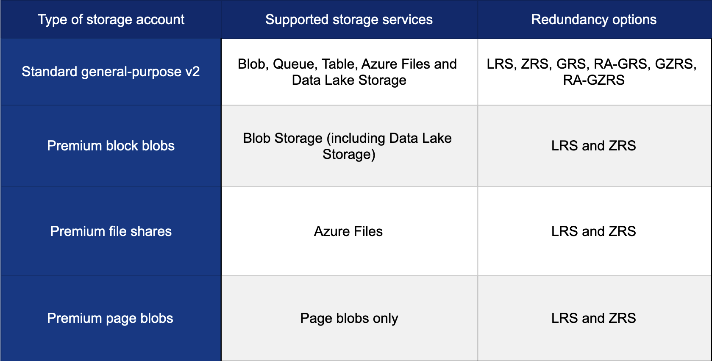

**The only resource that we cannot apply a tag and lock is the Management Group.**   
- **The Azure management groups are containers that helps you manage access, policy, and compliance across multiple subscriptions.** 

P2S & Configuration 
Whenever there is a change in the topology of your network, you will always need to download and re-install the VPN configuration file.

**Transit gateway is a `peering property` that lets one `virtual network use the VPN gateway in the peered virtual network` for cross-premises or VNet-to-VNet connectivity.**  

Account Type
   

:mag: AZ VNet 
- Azure VNet is the **fundamental building block for your private network** in Azure.  
- VNet enables many types of Azure resources, such as Azure VMs, to securely communicate with each other, the Internet, and on-premises networks. **(VNet to VNet, VNet to On-premises, Vnet to Internet)**  
- It's **with benefits of Azure’s infrastructure such as scale, availability, and isolation.**  
- In the context of virtual networking, hosts typically refer to the physical machine on which the virtualization environment is running.  
These hosts can run multiple virtual machines (VMs), each with its own operating system and applications, just like a physical computer.  

Azure App Service is an HTTP-based service for hosting web applications, REST APIs, and mobile back ends

app slot swap operation the following settings are swapped:
- General settings, such as framework version, 32/64-bit, web sockets
- App settings (can be configured to stick to a slot)
- **Connection strings (can be configured to stick to a slot)**
- Handler mappings
- **Public certificates**
- **WebJobs content**

## S2S Connection

Create it by deploying the following in order  

1. `Deploy a virtual network`  

2. `Deploy a gateway subnet`  
You need to create a gateway subnet for your VNet in order to configure a virtual network gateway. 
All gateway subnets must be named `GatewaySubnet` to work properly.  
Don't name your gateway subnet something else. 
It is recommended that you create a gateway subnet that uses a `/27` or `/28`.  

3. `Deploy a VPN gateway`  
A VPN gateway is a specific type of virtual network gateway that is used to send encrypted traffic between an Azure virtual network and an on-premises location over the public Internet.

4. `Deploy a local network gateway`
The local network gateway is a specific object that represents your on-premises location (the site) for routing purposes.

5. `Deploy a VPN connection` (tunnel)
A VPN connection creates the link for the VPN gateway and local network gateway.  
**It also gives you the status of your site-to-site connection.**  

## File Sync

1. Prepare Windows Server to use with Azure File Sync
You need to disable Internet Explorer Enhanced Security Configuration in your server.
This is required only for initial server registration.
You can re-enable it after the server has been registered.

2. Deploy the Storage Sync Service
Allows you to create sync groups that contain Azure file shares across multiple storage accounts and multiple registered Windows Servers.

3. Deploy the Azure File Sync agent to TDFileServer1
The Azure File Sync agent is a downloadable package that enables Windows Server to be synced with an Azure file share.

4. Register FileShareServer with Storage Sync Service
This establishes a trust relationship between your server (or cluster) and the Storage Sync Service.
A server can only be registered to one Storage Sync Service and can sync with other servers and Azure file shares associated with the same Storage Sync Service.

5. Create a sync group and a cloud endpoint
A sync group defines the sync topology for a set of files.
Endpoints within a sync group are kept in sync with each other.

6. Create a server endpoint
A server endpoint represents a specific location on a registered server, such as a folder on a server volume.

Backup disk of VMs with Difference O.S
只要Region跟RSV一樣不管VMs是stopped/deallocated state, VM的DIsk都會被Back up

SetUp backup policy

## Storage

### Live migration 

Live migration is supported only for storage accounts that use `LRS` or `GRS` replication.

To request a live migration to `ZRS`, `GZRS`, or `RA-GZRS`, you need to migrate your storage account from `LRS` to `ZRS` in the primary region with no application downtime. 

- Only General-purpose V2, FileStorage, and BlockBlobStorage support ZRS.

### VNet P2S

- **It's established by starting it from the client's computer**
- Is useful for telecommuters who want to connect to Azure VNets from a remote location, such as from home or a conference. 
- P2S VPN is also a helpful solution to utilize instead of S2S VPN when you have only a few clients that need to connect to a VNet.

Configuration Files
- Client需要從VNet方下載
- 每次網路拓樸有變更Client方都要重新下載跟Re-Install

### VNet Restarting VPN Gateway

restarting the VPN gateway is only done when you lose cross-premises VPN connectivity on one or more Site-to-Site VPN tunnels

## VNet Gate Transit

Gateway transit simplifies network architecture and enhances connectivity across VNets and on-premises networks in Azure

A transit gateway is a network transit `hub` that facilitates the interconnection of virtual private clouds (VPCs) and on-premises networks

In Azure, a transit gateway plays a crucial role in connecting virtual networks (VNets) and facilitating cross-premises communication.  
1. VNet Peering  
2. Gateway Transit (VNet to VNet or Cross-Prmises Connectivity)  
3. Hub-And-Spoke Network  
4. Route Control  
5. Deployment Models  

## Application Gateway

   

Azure Application Gateway (application tier) is a web traffic load balancer that enables you to **manage traffic to your WEB APPLICATION**. 

For example, you can route traffic based on the incoming URL.  
- if `/images` are in the incoming URL, you can route traffic to a specific set of servers (known as a pool) configured for images.  
- If `/video` is in the URL, that traffic is routed to another pool that’s optimized for videos.  

Web Application Firewall (WAF) within Azure Application Gateway
It protects against the following web vulnerabilities:   
- SQL injection attacks   
- Cross-site scripting attacks  
- Other common attacks, such as command injection, HTTP request smuggling, HTTP response splitting, and remote file inclusion  
- HTTP protocol violations    
- HTTP protocol anomalies, such as missing host user-agent and accept headers  
- Bots, crawlers, and scanners  
- Common application misconfigurations, such as Apache and IIS

## VNet Peering & Transit Gateway Hub-Spoke

To re-establish a peering connection, you will need to delete the disconnected peer and recreate it.

## LB sku

In the image above, it states that only VMs within a single availability set or virtual machine scale set can be used as backend pool endpoints for load balancers that use `Basic` as its SKU.

## Backed Pool

Backend Pool  
- The backend pool is a critical component of the load balancer.  
The backend pool defines the group of resources that will serve traffic for a given load-balancing rule.  

## Traffic Manager

## VNet to VNet Connection & Communication

Communication
- Different Subscription
- Different Tenant

1. VNet Peering
2. VPN Gateways
not latency-sensitive
two Vnet IP no overlap

## Storage Account Type

   

## RSV & VM & BackUp Policy

  

You can only backup `data sources` or `VMs` that are in the same region as the Recovery Services vault.
So You can back up virtual machines that `have different resource groups or operating systems as long as they are in the same region` as the vault.

## AZ Zone File  

Using a zone file is a quick, reliable, and convenient way to transfer a DNS zone into or out of Azure DNS.

**A DNS zone file is a `.txt` file that contains details of every Domain Name System (DNS) record in the zone.** 
It follows a standard format, making it suitable for transferring DNS records between DNS systems. :arrow_down:

## Vm for Public/Private IP Addr  

:mag: Public IP Address of VM
- allow Internet resources to communicate inbound to Azure resources.  
- enable Azure resources to communicate to the Internet and public-facing Azure services.     
- The address is dedicated to the resource until it’s unassigned by you. 
- A resource without a public IP assigned can communicate outbound.
- Azure dynamically assigns an available IP address that isn’t dedicated to the resource.

:mag: Assignment Method of Public IP
There are two types of public IP address assignment methods: static and dynamic.  

Static addresses are assigned when a public IP address is created.  
- Static addresses are not released until a public IP address resource is deleted.  
- :red_circle: If the address is not associated to a resource, you can change the assignment method after the address is created.  
- :red_circle: If the address is associated to a resource, you may not be able to change the assignment method.  

Dynamic addresses are **assigned only after a public IP address is associated to an Azure resource, and the resource is started for the first time.**   
- Dynamic addresses can change if they're assigned to a resource, such as a virtual machine, and the virtual machine is stopped (deallocated) and then started.

:mag: When Address might be changed?
The address remains the same if a virtual machine is rebooted or stopped (but not deallocated).  

Dynamic addresses are released when a public IP address resource is dissociated from a resource it is associated with.  

virtual machine is stopped (deallocated) and then started.
Then it apply a ip with dynamically method.  

